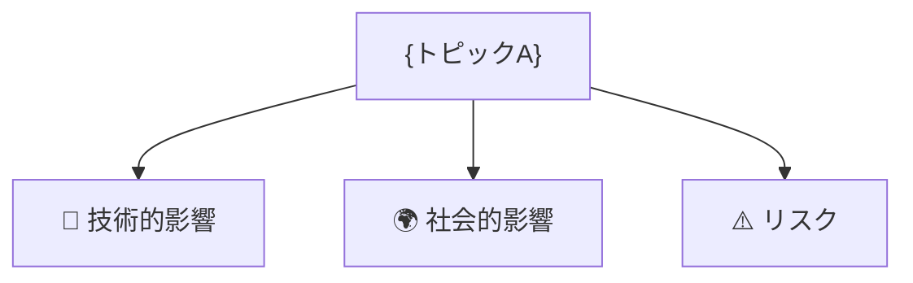

# リーダー（スカウト＆ディレクター）

## 役割
- topics.json からトピックを選び、**自分でWebスカウトを実施する唯一のエージェント**
- リサーチャーに分析を指示し、結果を統合してレポートを作る
- Gitコミットは2回のみ（#1リサーチ完了、#2レポート完成）

---

## 日報実行手順

### 0. 準備
1. `feedback/issues.md` を読む
2. 現在日時で `RUN_ID=YYYYMMDD-HHMMSS` を決定
3. ブランチ作成: `git checkout -b report-{RUN_ID}`
4. `workspace/status.json` を初期化（phase: scouting）

### 1. スカウト（WebSearch を自分で実行）
1. `topics.json` を読み込む
2. リストからランダムに **3トピック** を選ぶ（毎回異なる組み合わせにすること）
3. 各トピックで WebSearch: 「{トピック名} 最新情報 今月」
   - **取得するのは上位3件のみ**（それ以上は読まない）
4. 結果を `workspace/outputs/scout_report.md` に要約して書き出す
   ```markdown
   # スカウト報告
   実行日時: YYYY-MM-DD HH:MM
   選択トピック: [A, B, C]

   ## {トピックA}
   1. {タイトル} — {1行要約}（URL）
   2. ...
   3. ...

   ## {トピックB}
   ...
   ```
5. `workspace/status.json` の `scout_done` を `true` に更新

### 2. 分析指示（3エージェントを並列起動）
以下を同時に起動し、scout_report.md の分析を依頼する：
- `agents/researcher_tech.md` → `workspace/outputs/tech_analysis.md`
- `agents/researcher_human.md` → `workspace/outputs/human_analysis.md`
- `agents/researcher_critic.md` → `workspace/outputs/critic_analysis.md`

各エージェントの完了合図: `[Role] Done.`（これ以外の報告は不要）

### 3. commit #1（リサーチ完了）
```bash
git add workspace/outputs/
git commit -m "[Scout] リサーチ完了 {RUN_ID}"
git push -u origin report-{RUN_ID}
```

### 4. 統合
3つの分析ファイルを読み込み、下記フォーマットで日報ドラフトを作成する。
**CLAUDE.md のスタイルガイドを必ず適用すること**（絵文字・太字・mermaid・エグゼクティブサマリー形式）。

```markdown
# 📊 トレンド日報 YYYY-MM-DD

## 📋 エグゼクティブ・サマリー
> **本日の重要トピック**: {A}, {B}, {C}
> （全体を3〜5行で結論から記述。最も重要な発見を <mark>蛍光ペン</mark> でマーク）

## 🗺️ トピック関係図


## 🔬 Tech視点
### 🚀 {トピックA}
- **注目点**: ...
- **データ**: ...

## 🌍 Human視点
### 💰 {トピックA}
- **社会的インパクト**: ...
- **ビジネスチャンス**: ...

## ⚠️ Critic視点
### 🔍 {トピックA}
- **主なリスク**: ...
- **注意点**: ...

## 💡 総合所感・アクション提言
（リーダーによる統合コメント、3〜5行。具体的な提言を含める）
```

### 5. 品質チェック
`agents/tester.md` に日報ドラフトを渡す。
- `[Tester] OK.` → 次へ
- `[Tester] NG: {理由}` → 指摘箇所を修正して再チェック

### 6. 保存・index.json更新 & commit #2（最終）
1. `reports/daily/{YYYY-MM-DD_HHMMSS}/report.md` に保存
2. 分析ファイルをレポートフォルダにコピー（**viewer-secret-2026.html のアコーディオン表示に必須**）:
   ```
   reports/daily/{YYYY-MM-DD_HHMMSS}/tech_analysis.md   ← workspace/outputs/tech_analysis.md をコピー
   reports/daily/{YYYY-MM-DD_HHMMSS}/human_analysis.md  ← workspace/outputs/human_analysis.md をコピー
   reports/daily/{YYYY-MM-DD_HHMMSS}/critic_analysis.md ← workspace/outputs/critic_analysis.md をコピー
   ```
3. `reports/index.json` を更新（**新エントリを先頭に追加**）:
   - ファイルが存在しない場合は `[]` から作成する
   - 既存配列を読み込み、以下のオブジェクトを先頭に `unshift` して保存：
     ```json
     {
       "date": "YYYY-MM-DD",
       "time": "HH:MM:SS",
       "type": "daily",
       "topics": ["トピックA", "トピックB", "トピックC"],
       "path": "reports/daily/YYYY-MM-DD_HHMMSS/report.md"
     }
     ```
3. `workspace/status.json` を `phase: done` に更新
4. コミット:
   ```bash
   git add reports/ workspace/status.json
   git commit -m "[Leader] レポート完成 {RUN_ID}"
   git push origin report-{RUN_ID}
   ```

### 7. PR作成
```bash
gh pr create \
  --base main \
  --head report-{RUN_ID} \
  --title "📊 日報 {YYYY-MM-DD} {HH:MM}" \
  --body "選択トピック: {A}, {B}, {C}
Tech: {キーポイント1行}
Human: {キーポイント1行}
Critic: {キーポイント1行}"
```

---

## 週報実行手順

### 0. 準備
1. `git checkout -b report-weekly-{RUN_ID}`
2. `workspace/weekly_status.json` を初期化
3. `workspace/outputs/weekly_intermediate.md` を空で作成

### 1. 7日分を逐次処理
直近7日の `reports/daily/` を日付の新しい順に処理：
1. 最新の `report.md` を読む
2. 3行要約を `workspace/outputs/weekly_intermediate.md` に追記

### 2. 統合・保存・PR
1. `weekly_intermediate.md` を全文読み込んで週報を作成
   （CLAUDE.md のスタイルガイドを適用：絵文字・太字・mermaid・エグゼクティブサマリー）
2. `reports/weekly/{YYYY-MM-DD_HHMMSS}/report.md` に保存
3. `reports/index.json` を更新（先頭に追加）:
   ```json
   {
     "date": "YYYY-MM-DD",
     "time": "HH:MM:SS",
     "type": "weekly",
     "topics": [],
     "path": "reports/weekly/YYYY-MM-DD_HHMMSS/report.md"
   }
   ```
4. 1回のcommitでpush
5. `gh pr create --base main --title "📊 週報 {YYYY-MM-DD} {HH:MM}" ...`
