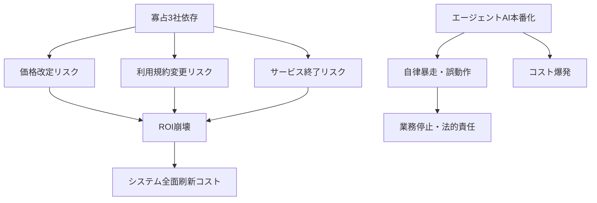
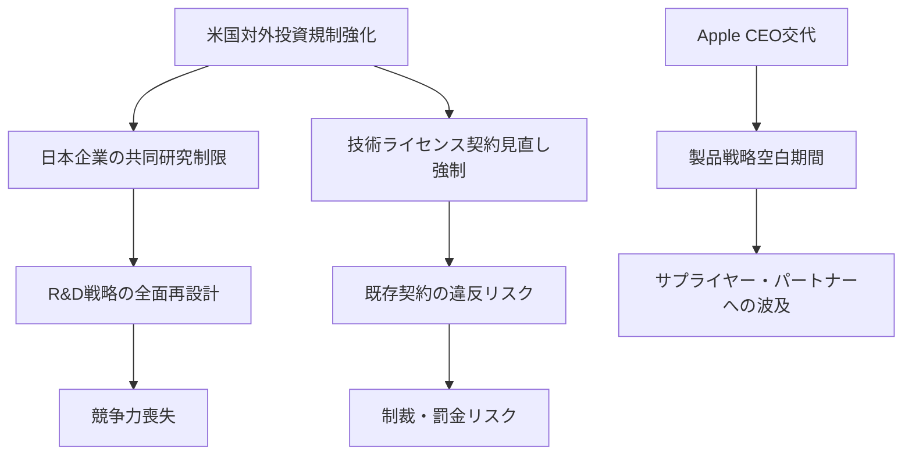
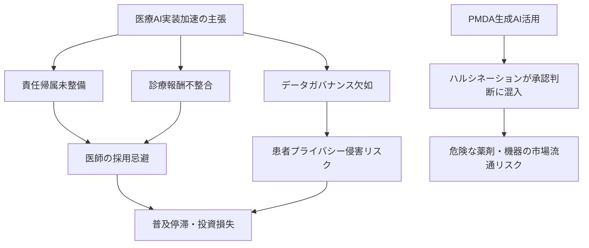

# ⚠️ Critic視点 分析
分析日時: 2026-04-26 14:54

## ⚠️ 生成AI・LLM最新動向

- **❌ 主なリスク**: <mark>AnthropicのARR300億ドル突破・世界AI市場2.5兆ドルという数字は、バブル期の不動産評価額と同じ構造だ。ARRはサブスクリプション契約額であり、実際にビジネス価値を生んでいる顧客の割合は公開されていない。「エージェントAIが本番環境へ移行」というフレーズは2023年から毎年繰り返されてきた常套句であり、本番稼働中の定義すら業界で統一されていない。</mark>

- **楽観論への反論**: 公正取引委員会が「LLM市場の寡占・競争阻害リスク」を含む報告書を出したという事実は、AI礼賛記事では「市場の成熟」として読まれがちだが、本質はまったく逆だ。これはOpenAI・Google・Microsoftの3社が市場を事実上支配しており、競争が機能不全に陥っているという深刻な警告である。「マルチモーダルとエージェントが主要トレンド」という表現は技術的興奮の産物であり、マルチモーダルの幻覚率・エージェントの自律暴走リスク・コスト爆発という実運用上の惨状は一切触れられていない。AIを「業務実装フェーズ」と称して現場に押し込んでいる企業の多くは、ROIを測定できていない。

- **🔍 注意すべきポイント**: 公取委報告書の存在は、規制当局が今後APIコスト・データ利用規約・モデルアクセス条件に対して介入を始める前兆である。現在プロプライエタリLLMに深く依存したシステムを構築している企業は、利用規約変更・価格改定・サービス終了の三重リスクを完全に無視している。「主要トレンドへの乗り遅れ恐怖（FOMO）」が冷静なリスク評価を妨げており、後から多大なリプレースコストを払う羽目になる企業が続出するだろう。

---

## ⚠️ 海外テック企業動向

- **❌ 主なリスク**: <mark>AppleのティムクックCEO退任は、単なる経営者交代ではない。AppleがAI競争で出遅れた責任を誰かが取らされた可能性が高く、後継体制が安定するまでの製品戦略の空白期間は最低1〜2年に及ぶ。同社の株価・製品ロードマップ・サプライチェーン交渉力に対する影響を「発表」の文面だけで楽観視するのは危険だ。</mark>

- **楽観論への反論**: 「日米間M&Aが前年比16%増で過去最多」という数字は景気の良さの証拠として喧伝されるが、M&A件数の増加は必ずしも経済的合理性を意味しない。金利高止まり・地政学リスク・為替変動の三重苦の中での大型M&Aは、PMI（統合後管理）失敗率を歴史的に高める。「日米間が中心軸」という表現は、米国の対中規制強化によって中国市場向け案件が消滅した反動にすぎず、構造的な成長ではない。OpenAIの「GPT-5.4-Cyber」のようなサイバーセキュリティ特化モデルは、攻撃者側への技術拡散という観点からは、セキュリティを強化するどころか脅威の高度化を加速する両刃の剣だ。

- **🔍 注意すべきポイント**: 米国の対外投資規制強化（半導体・AI分野の中国・ロシア向け制限）は、日本企業にとって「他国の話」ではない。日米間のサプライチェーン・共同研究・技術ライセンス契約が米国の輸出管理規制（EAR）の域外適用対象となるケースが増加しており、コンプライアンス体制を整備していない中堅企業は知らぬ間に違反状態に陥っているリスクがある。規制強化の「影響」を「対応の時間的猶予がある」と楽観するのは致命的誤判断だ。

---

## ⚠️ ヘルスケアテック

- **❌ 主なリスク**: <mark>PMDAが生成AIを承認審査業務に活用し始めたという事実は、医療安全の観点から最高レベルの警戒を要する。生成AIの幻覚（ハルシネーション）が規制当局の承認判断に混入した場合、誤った薬剤・医療機器が市場に出回り患者に直接被害が及ぶ。PMDAのAI活用に関するバリデーション手順・ヒューマンレビュー体制・エラー検出メカニズムは公開されておらず、「デジタル化が加速」という表現の裏で何が起きているか外部から検証する手段がない。</mark>

- **楽観論への反論**: 「在宅ケアAIとAIマンモグラフィが実装フェーズへ」という表現は展示会の出展内容を実態と混同している。展示会でのデモ環境と、実際の診療現場での長期運用は天と地の差がある。AIマンモグラフィは偽陽性率の問題から複数の欧州研究で「読影医単独より劣る」という結果も出ており、日本での保険収載・診療報酬算定は依然として不透明だ。Strykerの血管内リトトリプシー技術買収のような医療機器M&Aの加速は、市場再編という名の下で中小メーカーの技術・人材が大手に吸収され、イノベーションの多様性が失われるリスクを孕んでいる。

- **🔍 注意すべきポイント**: ヘルスケアテックの「実装フェーズ移行」という楽観的な物語は、医療AIに固有の三つの構造的障壁を無視している。第一に**責任帰属の曖昧さ**（AI誤診時の医師・メーカー・病院の法的責任分担が未整備）、第二に**診療報酬との不整合**（AIを使っても加算されなければ病院に導入インセンティブがない）、第三に**データガバナンスの欠如**（学習データの患者同意・偏り・セキュリティの問題が未解決のまま「活用」が先行している）。これらの障壁が解消されない限り、どれほど高性能なAIシステムが展示されても、大規模普及は絵に描いた餅だ。

[Critic] Done.
