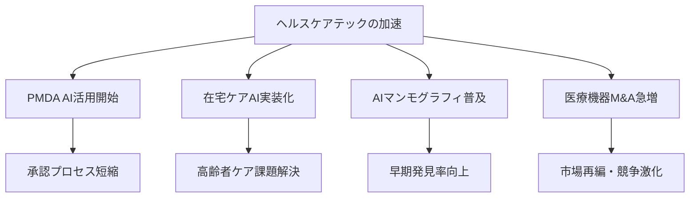

# 🌍 Human視点 分析
分析日時: 2026-04-26 14:54

## 🌍 生成AI・LLM最新動向
- **社会的インパクト**: <mark>AnthropicがARR300億ドルでOpenAIを上回ったことは、AI覇権の勢力図が急速に塗り替えられていることを示す歴史的転換点。</mark> 公正取引委員会がLLM市場の寡占リスクを指摘したことで、AIガバナンス・独禁規制の議論が日本でも本格化する。市場が特定プレイヤーに集中する構造は、中小企業・スタートアップの参入障壁を高め、社会全体のイノベーション機会の偏在につながる懸念がある。
- **💰 ビジネスチャンス**: 世界AI市場は**2.5兆ドル規模**に拡大。エージェントAIの本番環境移行により、業務自動化・プロセス変革の実装需要が急増。SI・コンサル・BPO各社にとって「AIによる業務変革支援」は今後2〜3年で最大の収益機会となりうる。マルチモーダル対応ソリューションの業種別展開（製造・医療・金融）でも大きな余地がある。
- **🔥 話題性・熱量**: エージェントAIの「本番移行」という言葉が示すように、PoC段階から実用段階への移行で企業の緊張感は急上昇。「使わなければ遅れる」という焦りが意思決定を加速させており、導入競争の熱量は2025年比で格段に高い。

---

## 🌍 海外テック企業動向
- **社会的インパクト**: <mark>Appleのティム・クック退任は、約15年にわたるiPhone時代の象徴的な終焉であり、テック業界のリーダーシップ刷新と戦略転換の予兆として広く注目される。</mark> 米国の対外投資規制強化（中国・ロシア向け半導体・AI分野）は、グローバルサプライチェーンの分断をさらに加速させ、日本企業も調達・投資戦略の全面的な見直しを迫られる局面となっている。
- **💰 ビジネスチャンス**: 上場企業による海外M&Aが**前年比16%増・過去最多の71件**（2026年Q1）。日米間案件が中心で、M&Aアドバイザリー・法務・PMI支援の需要が急拡大している。規制強化により中国向け投資が閉じる分、東南アジア・インド・中東へのシフトが加速し、新興市場進出支援にも商機がある。OpenAIのサイバーセキュリティ特化モデル登場で、セキュリティ領域でのAI活用ビジネスも新たな市場として立ち上がる。
- **🔥 話題性・熱量**: クックCEO交代ニュースはSNS・メディアで最大級の反響。「Apple次の10年は何か」という問いが世界的な関心を集めており、新体制の戦略発表に対する期待と不安が交錯している。

---

## 🌍 ヘルスケアテック
- **社会的インパクト**: <mark>PMDAが生成AIを承認審査・市販後実務に正式活用開始したことは、「規制当局自身がAIを採用した」という象徴的な出来事であり、医療規制のデジタル化において世界的にも先進事例となりうる。</mark> これにより、医薬品・医療機器の承認プロセスが迅速化・効率化される可能性があり、患者が新治療へアクセスできるまでの時間軸が短縮される社会的インパクトは大きい。在宅ケアAIの実装フェーズ移行は、少子高齢化が深刻な日本において、介護・医療リソース不足を補う切り札として社会的期待が特に高い。AIマンモグラフィの普及は乳がん早期発見率の向上に直結し、女性の健康格差縮小にも貢献しうる。

- **💰 ビジネスチャンス**: 医療AI市場は複数のレイヤーで同時成長中。
  - **規制対応・PMDA連携ビジネス**: AI活用の審査効率化に伴い、申請データの整備・AI監査ツール・コンサル需要が急増。
  - **在宅ケアAI**: 高齢者人口増加と施設不足を背景に、在宅モニタリング・服薬管理・転倒検知などのAIソリューションは数千億円規模の市場ポテンシャルを持つ。
  - **AIマンモグラフィ・画像診断**: エルピクセル・シーメンス・フィリップスが競合する画像診断AI市場は、病院DX予算の優先配分先として全国的に拡大中。
  - **M&A・医療機器業界再編**: StrykerによるAmplitude Vascular Systems買収に代表される大型M&Aの相次ぐ発生は、医療機器分野でのクロスボーダーM&A仲介・統合支援の需要を押し上げる。特に血管内治療領域は技術革新と市場集約が同時進行しており、今後も買収案件の増加が見込まれる。

- **🔥 話題性・熱量**: HEALTHCARE IT 2026・ITEM2026という大型展示会での新型AIシステム発表が重なり、医療現場での関心と期待は過去最高水準。PMDA自身の活用開始が「お墨付き」として機能し、保守的だった医療機関の導入検討を後押しする効果も大きい。「在宅ケアAI×超高齢社会」という文脈は国内メディアで継続的に取り上げられており、社会的議論の熱量も高い。

---

