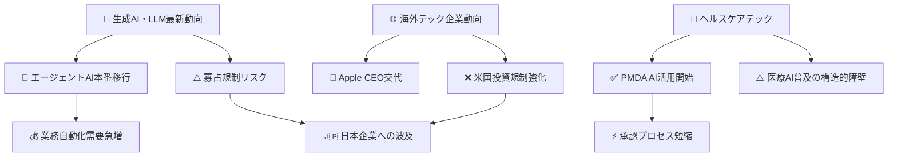
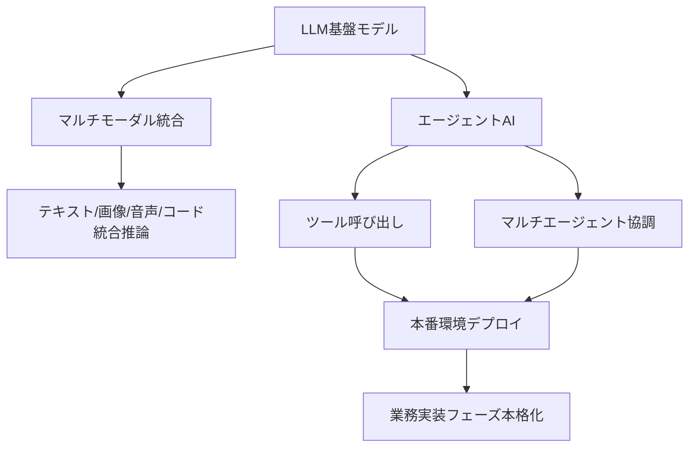
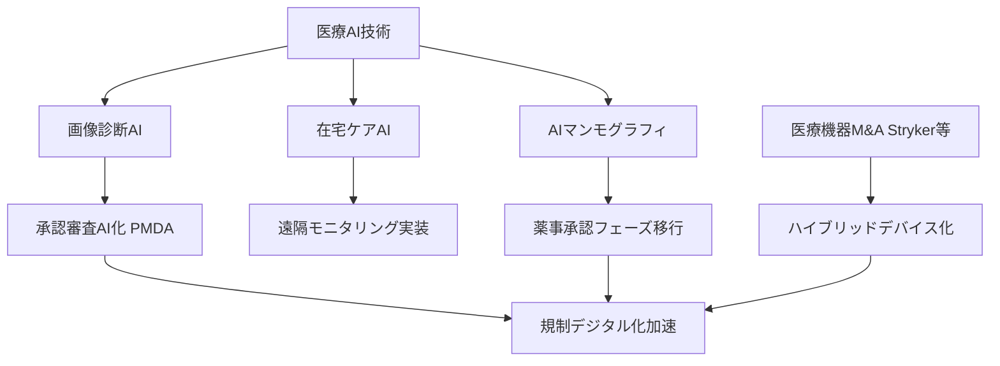
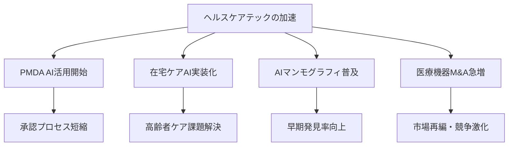
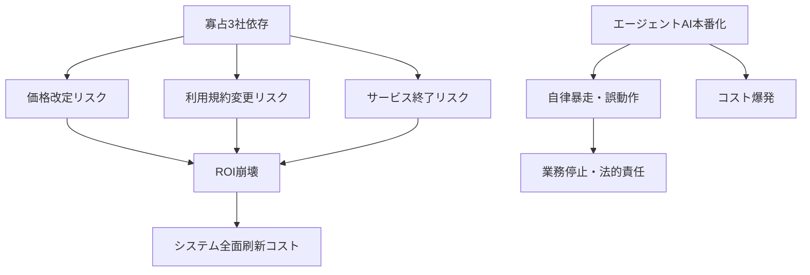
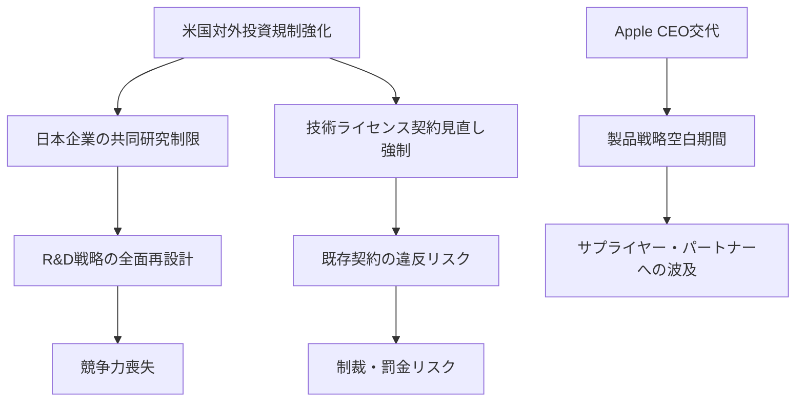
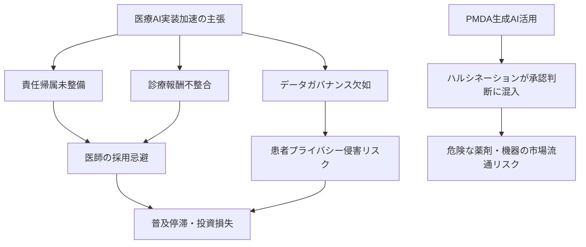

# 📊 トレンド日報 2026-04-26

## 📋 エグゼクティブ・サマリー

> **本日の重要トピック**: 生成AI・LLM最新動向 / 海外テック企業動向 / ヘルスケアテック

<mark>2026年4月は「AI業界の権力構造の転換」と「医療規制のデジタル化」が同時進行した歴史的な節目となった。</mark> AnthropicがARR300億ドルでOpenAIを追い抜き、エージェントAIが本番環境へ移行。AppleはCEO交代という経営刷新を迎え、PMDAは生成AIを承認審査業務に正式活用開始した。一方で、公正取引委員会がLLM市場の寡占リスクを指摘し、米国の対外投資規制強化が日本企業にも直撃。**楽観的な「業務実装フェーズ」の語りに隠れた構造的リスクへの注意が不可欠な局面**に入った。

---

## 🗺️ トピック関係図

---

## 🔬 Tech視点

### 🚀 生成AI・LLM最新動向

- **技術的注目点**: <mark>エージェントAIが本番環境へ移行する転換点に達した</mark>。マルチモーダル統合と組み合わせ、テキスト・画像・音声・コードを横断する統合推論基盤が実用段階へ。
- **📊 データ・数字**: AnthropicのARRが**300億ドル超**でOpenAIを上回り首位浮上。世界AI市場規模は**2.5兆ドル**。
- **技術的意義**: 競争軸が「モデル性能」から「エージェント実行能力・ツール統合・本番安定性」へと移行。推論コスト・レイテンシ・ハルシネーション率といった実運用指標が評価の中心に。
- **展望**: エージェントOSとも呼べる基盤争いが激化。LLMベンダーがオーケストレーション層まで垂直統合する動きが加速。

### 🚀 海外テック企業動向

- **技術的注目点**: OpenAIが**サイバーセキュリティ特化モデル「GPT-5.4-Cyber」**を提供開始。<mark>汎用LLMからドメイン特化型モデルへの分化が加速し、テック大手の経営刷新と戦略転換が同時進行している。</mark>
- **📊 データ・数字**: 上場企業の海外M&Aは2026年Q1で**71件・前年比16%増・過去最多**。米国の対外投資規制強化は**2026年4月**施行、対象は**半導体・AI分野**。
- **技術的意義**: セキュリティ特化LLMの登場は、脅威インテリジェンス・脆弱性解析・インシデント対応領域へのAI本格侵食を示す。地政学的技術デカップリングが加速。
- **展望**: ドメイン特化LLMの競争が金融・法律・医療・セキュリティ各分野で勃発。「アクハイア型AI戦略」が主流化する。

### 🚀 ヘルスケアテック

- **技術的注目点**: <mark>PMDAが生成AIを承認審査・市販後実務に正式導入したことは、規制機関自身がAIを業務基盤とする世界初クラスの事例であり、医療規制デジタル化の歴史的転換点。</mark>
- **📊 データ・数字**: PMDAのAI活用開始は**2026年4月15日**。Strykerによる血管内リトトリプシー技術の買収完了は**2026年4月13日**。ITEM2026で**複数社が新型AIシステムを展示**。
- **技術的意義**: 医療AIの進化軸が「画像診断精度向上」から「在宅ケア・遠隔モニタリング統合」へと拡張。ハイブリッドデバイス化（ハードウェア＋AI）の潮流が定着。
- **展望**: PMDA自身がAIユーザーになることで、承認申請の評価基準がAI前提で再設計される可能性。中期的に医療AIの参入障壁が低下方向へ。

---

## 🌍 Human視点

### 🌍 生成AI・LLM最新動向

- **社会的インパクト**: <mark>AnthropicがARR300億ドルでOpenAIを上回ったことは、AI覇権の勢力図が急速に塗り替えられていることを示す歴史的転換点。</mark>公正取引委員会がLLM市場の寡占リスクを指摘し、中小企業・スタートアップの参入障壁増大と社会的イノベーション機会の偏在が懸念される。
- **💰 ビジネスチャンス**: 世界AI市場は**2.5兆ドル規模**。エージェントAI本番移行により業務自動化・プロセス変革の実装需要が急増。SI・コンサル・BPO各社にとって「AIによる業務変革支援」は今後2〜3年で最大の収益機会となりうる。
- **🔥 話題性・熱量**: PoCから実用段階への移行で企業の緊張感は急上昇。「使わなければ遅れる」という焦りが意思決定を加速させており、導入競争の熱量は2025年比で格段に高い。

### 🌍 海外テック企業動向

- **社会的インパクト**: <mark>Appleのティム・クック退任は、約15年にわたるiPhone時代の象徴的な終焉であり、テック業界のリーダーシップ刷新と戦略転換の予兆として広く注目される。</mark>米国の対外投資規制強化は、グローバルサプライチェーンの分断をさらに加速させ、日本企業も調達・投資戦略の全面的な見直しを迫られる局面。
- **💰 ビジネスチャンス**: 上場企業による海外M&Aが**前年比16%増・過去最多の71件**（2026年Q1）。M&Aアドバイザリー・法務・PMI支援の需要が急拡大。規制強化で中国向けが閉じる分、東南アジア・インド・中東へのシフトも加速。
- **🔥 話題性・熱量**: クックCEO交代ニュースはSNS・メディアで最大級の反響。「Apple次の10年は何か」という問いが世界的な関心を集めている。

### 🌍 ヘルスケアテック

- **社会的インパクト**: <mark>PMDAが生成AIを承認審査業務に正式活用開始したことは、医療規制のデジタル化において世界的にも先進事例となりうる象徴的な出来事。</mark>患者が新治療へアクセスできるまでの時間軸短縮が期待され、在宅ケアAIの実装フェーズ移行は超高齢社会日本での介護・医療リソース不足を補う切り札として注目される。AIマンモグラフィの普及は乳がん早期発見率の向上と女性の健康格差縮小に貢献しうる。
- **💰 ビジネスチャンス**: 医療AI市場は複数レイヤーで同時成長。**規制対応・PMDA連携**（AI監査ツール・コンサル需要急増）、**在宅ケアAI**（数千億円規模のポテンシャル）、**AIマンモグラフィ・画像診断**（病院DX予算の優先配分先）、**医療機器M&A支援**（Stryker型大型買収の増加）と幅広い。
- **🔥 話題性・熱量**: HEALTHCARE IT 2026・ITEM2026が重なり、医療現場での関心と期待は過去最高水準。PMDAの活用開始が「お墨付き」として機能し、保守的だった医療機関の導入検討を後押しする効果も大きい。

---

## ⚠️ Critic視点

### ⚠️ 生成AI・LLM最新動向

- **❌ 主なリスク**: <mark>AnthropicのARR300億ドル突破・世界AI市場2.5兆ドルという数字はバブル期の不動産評価額と同じ構造だ。ARRはサブスクリプション契約額であり、実際にビジネス価値を生んでいる顧客の割合は公開されていない。「エージェントAIが本番環境へ移行」というフレーズは2023年から毎年繰り返されてきた常套句であり、本番稼働の定義すら業界で統一されていない。</mark>
- **楽観論への反論**: 公正取引委員会の報告書は「市場の成熟」ではなく、OpenAI・Google・Microsoftの3社が市場を事実上支配している深刻な警告だ。マルチモーダルの幻覚率・エージェントの自律暴走リスク・コスト爆発という実運用上の惨状は一切触れられていない。「業務実装フェーズ」と称して現場に押し込んでいる企業の多くは、ROIを測定できていない。
- **🔍 注意すべきポイント**: 公取委報告書の存在は、今後APIコスト・データ利用規約・モデルアクセス条件への規制介入の前兆。プロプライエタリLLMに深く依存したシステムを構築している企業は、利用規約変更・価格改定・サービス終了の三重リスクを抱えている。

### ⚠️ 海外テック企業動向

- **❌ 主なリスク**: <mark>AppleのCEO退任は単なる経営者交代ではない。AI競争での出遅れ責任の帰結であり、後継体制が安定するまでの製品戦略の空白期間は最低1〜2年に及ぶ。株価・製品ロードマップ・サプライチェーン交渉力への影響を「発表」文面だけで楽観視するのは危険だ。</mark>
- **楽観論への反論**: 「日米間M&A前年比16%増」は景気の良さではなく、対中規制強化で中国案件が消滅した反動にすぎない。金利高止まり・地政学リスク・為替変動の三重苦の中での大型M&AはPMI失敗率を高める。OpenAIの「GPT-5.4-Cyber」は攻撃者側への技術拡散という観点からは、セキュリティを強化するどころか脅威を高度化する両刃の剣だ。
- **🔍 注意すべきポイント**: 米国の対外投資規制強化は「他国の話」ではない。日米間のサプライチェーン・共同研究・技術ライセンス契約が米国EAR（輸出管理規制）の域外適用対象となるケースが増加しており、コンプライアンス体制を整備していない中堅企業は知らぬ間に違反状態に陥っているリスクがある。

### ⚠️ ヘルスケアテック

- **❌ 主なリスク**: <mark>PMDAが生成AIを承認審査業務に活用し始めたという事実は、医療安全の観点から最高レベルの警戒を要する。生成AIの幻覚（ハルシネーション）が規制当局の承認判断に混入した場合、誤った薬剤・医療機器が市場に出回り患者に直接被害が及ぶ。PMDAのAI活用に関するバリデーション手順・ヒューマンレビュー体制・エラー検出メカニズムは公開されておらず、外部から検証する手段がない。</mark>
- **楽観論への反論**: 「在宅ケアAIとAIマンモグラフィが実装フェーズへ」という表現は展示会のデモ環境と実際の診療現場を混同している。AIマンモグラフィは偽陽性率の問題から複数の欧州研究で「読影医単独より劣る」という結果も出ており、日本での保険収載・診療報酬算定は依然不透明。医療機器M&Aの加速は中小メーカーの技術・人材を大手に吸収し、イノベーションの多様性を失わせるリスクを孕んでいる。
- **🔍 注意すべきポイント**: 医療AIの「実装フェーズ移行」という楽観的物語は三つの構造的障壁を無視している。**①責任帰属の曖昧さ**（AI誤診時の医師・メーカー・病院の法的責任分担が未整備）、**②診療報酬との不整合**（AIを使っても加算されなければ病院に導入インセンティブがない）、**③データガバナンスの欠如**（学習データの患者同意・偏り・セキュリティが未解決のまま「活用」が先行）。これらが解消されない限り、大規模普及は絵に描いた餅だ。

---

## 💡 総合所感・アクション提言

2026年4月は「AIの社会実装」が単なるトレンドではなく現実の問題として企業・規制機関・社会システムに跳ね返ってくる転換点となった。**楽観的な「業務実装フェーズ」の物語に乗り遅れることへの恐怖（FOMO）と、冷静なリスク評価のバランスをどう保つかが、この時代の経営の核心となっている。**

具体的な提言として：
1. **🔍 LLM依存リスクの棚卸し**：プロプライエタリLLMへの深い依存度を即座に評価し、プロバイダー乗り換えコスト・ロックインリスクを定量化すること
2. **⚠️ 米国輸出管理規制（EAR）のコンプライアンス緊急点検**：技術ライセンス契約・共同研究契約が域外適用対象でないか法務部門が即刻確認すべき局面
3. **🏥 ヘルスケアテック投資家・参入検討者へ**：PMDAのAI活用は長期的には参入障壁低下に働くが、責任帰属・診療報酬・データガバナンスの3障壁解消のタイムラインを見極めてから投資判断すること
4. **💰 M&Aアドバイザリー・法務・PMI支援**：日米間M&A過去最多という追い風を受けつつ、「中国案件消滅の反動」という構造を理解した上での厳格なデューデリジェンスが不可欠
