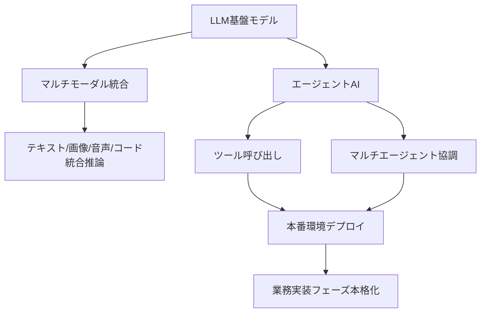
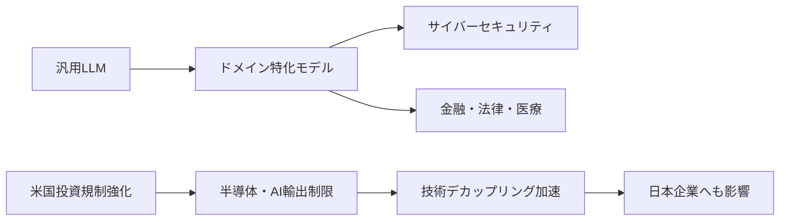
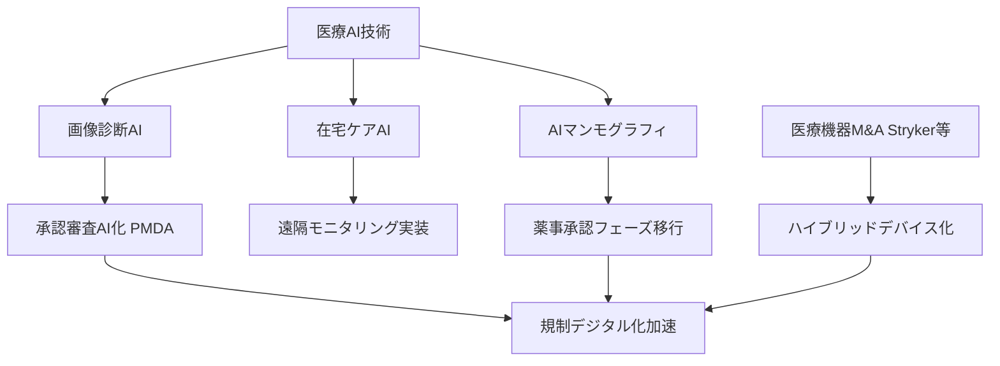

# 🔬 Tech視点 分析
分析日時: 2026-04-26 14:54

## 🚀 生成AI・LLM最新動向

- **技術的注目点**: <mark>エージェントAIが本番環境へ移行する転換点に達した</mark>。単なるテキスト生成から、自律的にタスクを実行するエージェント型アーキテクチャへのシフトが業界全体で進行中。マルチモーダル統合と組み合わせることで、テキスト・画像・音声・コードを横断する統合推論基盤が実用段階に入りつつある。
- **📊 データ・数字**: AnthropicのARRが**300億ドル超**でOpenAIを上回り首位浮上。世界AI市場規模は**2.5兆ドル**に到達。公正取引委員会の報告書では、LLM基盤市場における**寡占リスク**が定量的に指摘されている。
- **技術的意義**: 大規模言語モデルの競争軸が「モデル性能」から「エージェント実行能力・ツール統合・本番安定性」へと移行しつつある。業務実装フェーズ移行は、推論コスト・レイテンシ・ハルシネーション率といった実運用指標が評価の中心になることを意味する。
- **展望**: エージェントOSとも呼べる基盤争いが激化する。LLMベンダーがオーケストレーション層（メモリ管理・ツール呼び出し・マルチエージェント協調）まで垂直統合する動きが加速するとみられる。

---

## 🚀 海外テック企業動向

- **技術的注目点**: OpenAIが**サイバーセキュリティ特化モデル「GPT-5.4-Cyber」**を提供開始。汎用LLMからドメイン特化型・ファインチューニング済みモデルの分化が加速している。<mark>テック大手のAI戦略転換と経営刷新が同時進行していることは、産業構造の転換点を示す重要なシグナルである</mark>。
- **📊 データ・数字**: 上場企業の海外M&Aは2026年第1四半期で**71件・前年比16%増・過去最多**。米国の対外投資規制は**2026年4月**に強化、対象は**半導体・AI分野**。Apple CEO交代は**4月20日**発表。
- **技術的意義**: セキュリティ特化モデルの登場は、LLMが脅威インテリジェンス・脆弱性解析・インシデント対応といった高度セキュリティ領域へ本格侵食していることを示す。一方、米国の投資規制強化は、AI半導体・先端プロセスの技術移転を制度的に遮断し、地政学的な技術デカップリングを加速させる。
- **展望**: ドメイン特化LLMの競争が金融・法律・医療・セキュリティ各分野で勃発する。M&A増加は技術スタックの買収による能力補完戦略の定着を示し、自社開発よりも買収でAI能力を積み上げる「アクハイア型AI戦略」が主流化する。

---

## 🚀 ヘルスケアテック

- **技術的注目点**: <mark>PMDAが生成AIを承認審査・市販後実務に正式導入したことは、規制機関自身がAIを業務基盤とする世界初クラスの事例であり、医療規制のデジタル化における歴史的転換点である</mark>。エルピクセル・シーメンス・フィリップスのAIシステム展示では、AIマンモグラフィや在宅ケアAIが実装フェーズへ移行していることが確認された。
- **📊 データ・数字**: PMDAのAI活用開始は**2026年4月15日**。Strykerによる血管内リトトリプシー技術の買収完了は**2026年4月13日**。ITEM2026・HEALTHCARE IT 2026（第11回）で**複数社が新型AIシステムを展示**。
- **技術的意義**: 医療AIの技術進化は「画像診断精度向上」から「在宅ケア・遠隔モニタリングへの統合」へ拡張している。AIマンモグラフィは感度・特異度の定量的エビデンス蓄積が進み、薬事承認ハードルを越えつつある。Strykerの血管内リトトリプシー技術の取込みは、ハードウェア医療機器にAIを組み込むハイブリッドデバイス化の流れを示す。
- **展望**: PMDA自身がAIユーザーになることで、承認申請の評価基準・ガイドラインがAI前提で再設計される可能性がある。これは医療機器メーカーにとって承認プロセスの高速化と評価透明性向上をもたらし、AIヘルステック参入障壁が中期的に低下する方向に働く。

