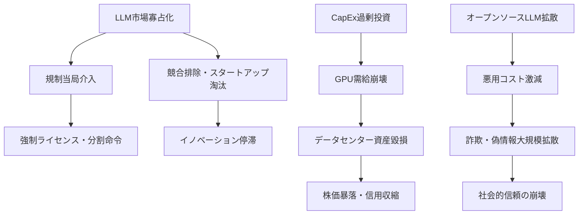
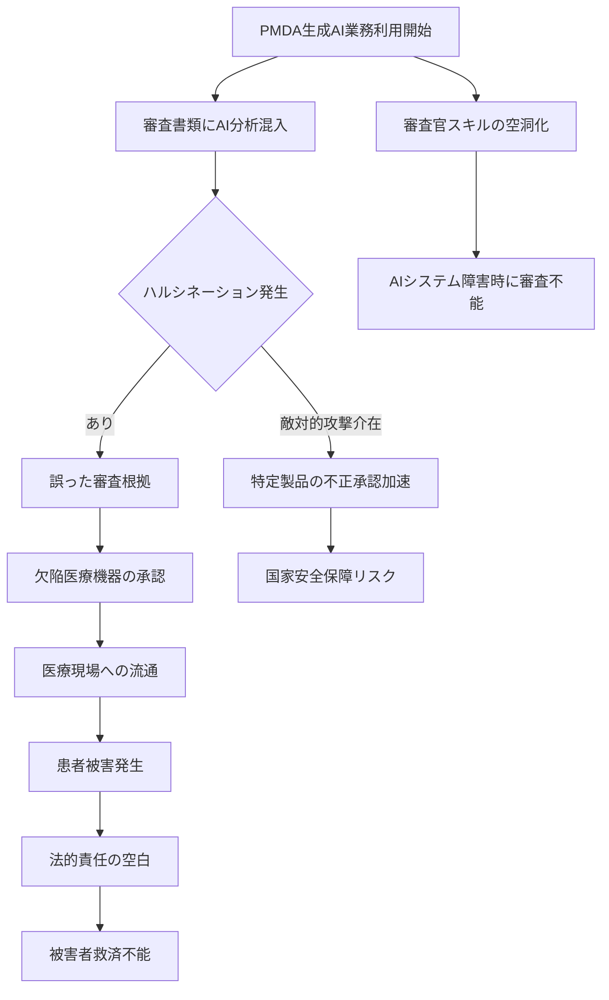
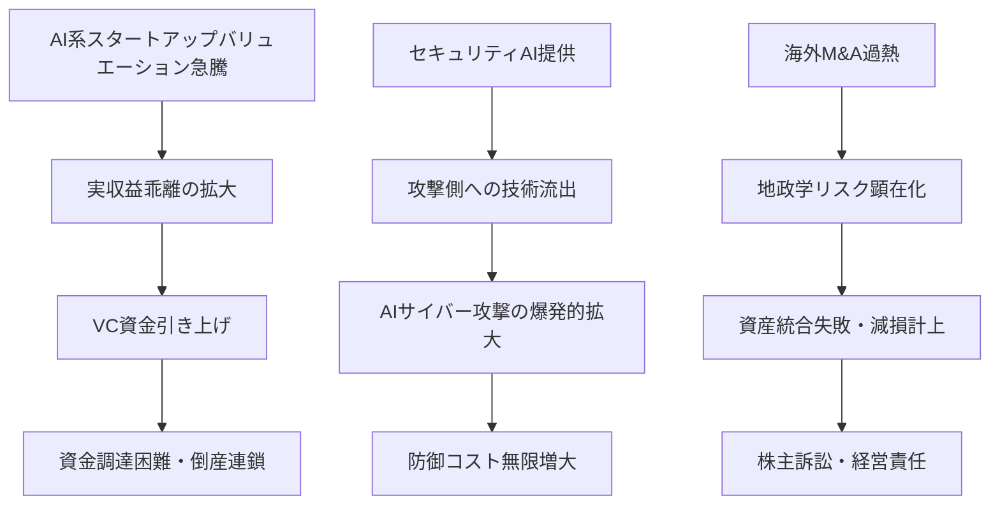

# ⚠️ Critic視点 分析
分析日時: 2026-04-26 21:35

## ⚠️ 生成AI・LLM最新動向

- **❌ 主なリスク**: <mark>MCP「80倍成長」は典型的なバブル指標であり、ダウンロード数は実際の利用・収益と全く別物である。npmパッケージでも同様のダウンロード数爆増→実用ゼロという事例は枚挙にいとまがない。「構築フェーズ→信頼フェーズ」という業界の自己申告を鵜呑みにすることは危険であり、実際には大規模エージェント障害・誤動作インシデントが頻発しており「信頼」は幻想に過ぎない。</mark>

- **楽観論への反論**:
  - Gartner予測「80%以上の企業がGenAI APIを本格展開」は過去のGartner予測の的中率（30〜40%）を考慮すると信頼性に乏しい。ハイプサイクルの頂点付近で出る数字は常に過大であり、2024〜2025年においても「本格展開」と称した失敗導入の後退事例が相次いでいる。
  - AnthropicのARR「300億ドル超でOpenAIを上回り首位」という数字は、ARRが実収益ではなく年率換算であることを意図的に隠蔽したマーケティング指標にすぎない。投資家向けに水増しされた数値が市場認識を歪めるリスクは高い。
  - MetaのCapEx $115B〜$135Bは、GPUデータセンター過剰投資バブルの最終段階を示すシグナルである。過去のITバブル（2000年）・光ファイバーバブル（1999〜2001年）と構造的に同一であり、需要が供給に追いつかない場合の資産毀損は数十兆円規模に達しうる。
  - 公正取引委員会がLLM市場の「寡占・競争阻害リスク」を明示したことは、規制当局が本格介入を準備していることを示す。EU AI Actはすでに施行済みであり、日本でも独占禁止法適用・強制ライセンス義務化のシナリオが現実化する可能性がある。

- **🔍 注意すべきポイント**:
  - オープンソースLLMが「商用モデルと同等性能を達成」という主張は、特定ベンチマーク（主にコーディング）に限定した話であり、安全性・ハルシネーション率・長文整合性では依然として深刻な格差が存在する。オープンソース化による悪意ある利用（ディープフェイク生成・フィッシング高度化）のリスクは商用モデル以上に制御不能である。
  - AIエージェントの「信頼フェーズ移行」は、責任の所在が不明確なまま実運用に突入することを意味する。障害発生時の損害賠償・法的責任が誰にも帰属しないグレーゾーンが拡大する。

---

## ⚠️ ヘルスケアテック

- **❌ 主なリスク（最重大）**: <mark>PMDAが生成AIを「業務利用」として正式採用したことは、規制当局の判断品質そのものをAIに依存させるという前代未聞のリスクを内包する。医療機器の承認審査にAIが介在した場合、誤承認→市場流通→患者被害という連鎖が発生するが、PMDAはその責任を「AIの判断」に転嫁できない法的立場にありながら、実質的な審査能力の空洞化が進む。これは単なる業務効率化ではなく、公衆衛生上の時限爆弾である。</mark>

- **楽観論への反論（PMDA AI活用リスクの徹底論駁）**:
  - **誤審査リスクの構造的不可避性**: PMDAが使用する生成AIは、最新の医療機器技術・臨床データに対して学習データのカットオフが存在する。2026年に提出された最新技術の審査に、2024年以前のデータで学習したモデルを使えば、技術的妥当性の判断が根本的に誤る可能性がある。生成AIは「知らないことを知らない」ため、審査官が誤った前提のまま承認を下す最悪シナリオが現実的に存在する。
  - **ハルシネーションによる審査書類の汚染リスク**: PMDAの審査プロセスでAIが要約・翻訳・分析を担う場合、ハルシネーション（事実に基づかない情報生成）が審査書類に混入するリスクがある。医薬品・医療機器の添付文書にAI生成の誤記載が入り込んだ場合、医療現場での誤投与・誤使用に直結する。
  - **透明性・説明責任の喪失**: 医療機器承認の根拠が「AIの分析」となった場合、被害を受けた患者が承認プロセスの瑕疵を立証することが極めて困難になる。現行の行政不服申し立て制度はAIによる意思決定を想定しておらず、法的救済の空白が生じる。
  - **サイバー攻撃によるPMDA審査系統の汚染**: AIシステムは従来の審査プロセスより攻撃対象として魅力的である。競合国・製薬企業による審査AIへの敵対的攻撃（Adversarial Attack）で、特定製品の承認を不正に加速・阻害できる。国家安全保障上のリスクである。

- **M&A・市場拡大への反論**:
  - Stryker、American Industrial Partners、Stereotaxisによる買収ラッシュは、ヘルスケアテック市場の「本当の成長」ではなく「割安資産の買い漁り」である可能性が高い。AIマンモグラフィ・在宅ケアAIの「実装フェーズ移行」は、臨床試験での有効性が未確立のまま商業展開を急いでいる事例が多く含まれる。FDA・PMDAの本格規制が追いつく前に市場を確立しようとする行為は、将来の強制リコール・集団訴訟リスクを内包する。
  - 「2030年に向けて市場急拡大」という予測は、保険償還制度がAI医療機器に対応していないという根本的な障壁を無視している。日本では診療報酬改定でAI医療機器の償還が認められなければ病院導入は進まない。現実の普及速度は予測の10分の1以下になる可能性がある。

- **🔍 注意すべきポイント**:
  - AIマンモグラフィの偽陰性（見逃し）率は、既存の評価指標では十分に測定されていない。AIが「正常」と判断した症例でのがん見逃しが、数年後に集団訴訟の原因となるシナリオを誰も真剣に議論していない。
  - 医療機器のAI化は、医師・技師の診断スキル劣化を加速させる。AIが使えない状況（停電・システム障害・サイバー攻撃）での診療継続能力が組織的に失われるリスクは、BCP（事業継続計画）上の致命的弱点となる。

---

## ⚠️ 海外テック企業動向

- **❌ 主なリスク**: <mark>OmniがSeries Cで$120M調達・バリュエーション$1.5Bという数字は、1年で2.3倍という異常な上昇速度を示しており、これはVC主導による価値吊り上げ（マーケットメイキング）の典型パターンである。実収益・ユニットエコノミクスが開示されていない段階でのバリュエーション信仰は、2021年のSPACバブル崩壊と同じ構造をたどる可能性が高い。</mark>

- **楽観論への反論**:
  - Appleのティム・クック退任は「新時代への移行」として好意的に語られているが、創業者的カリスマを失った後のAppleが過去にたどった低迷期（1985〜1997年のジョブズ不在期）を想起させる。AI戦略での出遅れが明白なAppleにとって、経営交代は救世主交代ではなく混乱の引き金になりうる。
  - 海外M&A「前年比16%増・過去最多71件」は、資金余剰・低金利環境を前提とした数字である。2026年以降の金利動向・地政学リスク（台湾有事・米中デカップリング）が顕在化した場合、クロスボーダーM&Aは急速に凍結され、買収済み資産の統合失敗による減損が連鎖する。
  - 量子コンピューティングの「100兆円超産業」試算は、現時点での技術成熟度（エラー率・量子ビット数）を完全に無視した机上の空論である。実用的な量子優位性（Quantum Advantage）が達成された事例はいまだ極めて限定的であり、10年以内の商業化シナリオは投資家向けの煙幕に近い。
  - OpenAIの「GPT-5.4-Cyber」サイバーセキュリティ特化モデルは、防御側への提供と同時に攻撃側への流出リスクを内包する。AIによるサイバー攻撃の自動化・高度化は、提供企業の倫理審査能力を遥かに超えた速度で進む。セキュリティAIは攻撃AIの最良の教師となる逆説を誰も直視していない。

- **🔍 注意すべきポイント**:
  - 「AIによる人間能力の拡張」という投資テーマは、雇用破壊の婉曲表現である。能力拡張の恩恵を受けるのはスキルを持つ一握りの人間であり、大多数の労働者は代替・賃金圧下の対象となる。社会的分断の深化は、AI企業への規制強化・課税強化という形で必ずブーメランとして返ってくる。
  - 越境EC世界市場$2,028億規模は、関税・貿易摩擦・データローカライゼーション規制により2026年後半には大幅縮小するリスクがある。特に米中間の越境取引規制は「市場拡大」シナリオを根底から覆す。

---

## 💡 総括：最悪ケースシナリオ

2026年後半〜2027年にかけて、以下の複合崩壊シナリオが現実的に存在する：

1. **AI投資バブル崩壊**: CapEx過剰投資→需要未達→GPU価格暴落→データセンター大量償却→AI関連株の連鎖下落
2. **医療AI事故の顕在化**: PMDAの審査精度低下→欠陥医療機器承認→患者被害→規制の極端な揺り戻し→ヘルスケアテック市場の信頼崩壊
3. **AIセキュリティの破綻**: セキュリティAIの逆利用→大規模インフラへのAI攻撃→重要インフラの麻痺

<mark>楽観的な成長予測は、これらのリスクを「テールリスク」として矮小化しているが、複数のリスクが同時に顕在化する相関崩壊の可能性を真剣に織り込んでいない点が最大の問題である。</mark>
