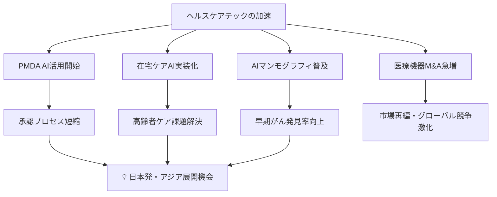
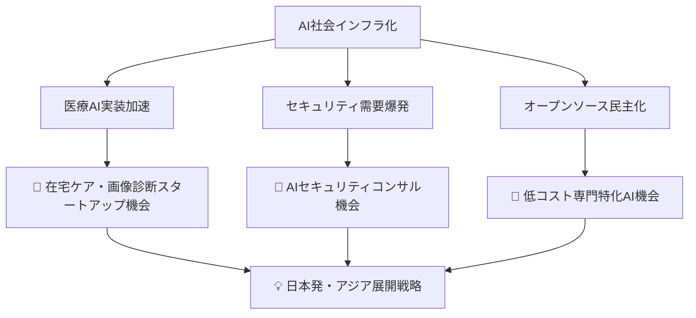

# 🌍 Human視点 分析
分析日時: 2026-04-26 21:35

## 📋 エグゼクティブ・サマリー

3トピック横断で見えてくるのは「AIが人間の能力・判断・健康を根本から再定義し始めている」という大転換点だ。生成AIは既に企業インフラの中核に入り込み、ヘルスケアでは規制当局自身がAIを採用する段階に達した。海外では資金調達・M&Aが加速し、日本企業が乗り遅れるリスクが現実味を帯びている。<mark>今後2〜3年が、AI恩恵を享受できる側になるか否かを分ける分岐点</mark>と言えるだろう。

---

## 🌍 生成AI・LLM最新動向

- **社会的インパクト**: MCP（Model Context Protocol）のダウンロード数が1年間で10万→800万（**80倍**）に急増した事実は、AIが「試す段階」から「インフラとして使われる段階」へ完全移行したことを示す。<mark>Gartner予測「2026年までに世界企業の80%以上がGenAI APIを本格展開」が実現すれば、AIを使えない労働者・企業は競争から脱落するという厳しい社会現実が到来する。</mark>

- **💰 ビジネスチャンス**: AI市場全体は**世界2.5兆ドル規模**にまで拡大。AnthropicのARR（年間経常収益）が300億ドルを超えOpenAIを上回ったことは「一強時代の終焉」を意味し、複数プレイヤーが競い合う健全な市場構造が生まれつつある。オープンソースLLMが商用モデルと同等性能を達成したことで、**スタートアップが大資本なしでAIサービスを構築できる環境**が整い、参入障壁が劇的に低下した。

- **🔥 話題性・熱量**: MetaがCapEx $115B〜$135B（約17〜20兆円）を投資する姿勢は「AIは次の産業革命」という確信を示す。一方で公正取引委員会がLLM市場の寡占リスクを報告書で指摘したことは、規制当局が本格的にAIガバナンスに乗り出したことを意味し、今後の法規制動向が企業戦略の重要変数になる。

- **🚀 新規事業・起業の可能性**: AIエージェントが「信頼フェーズ」へ移行中というのは、人間の承認なしに自律動作するシステムへの社会的受容が進んでいることを示す。**AIエージェント活用型の業務受託・コンサル・SaaSは今が最大の参入機会**。オープンソースLLMを活用した低コスト専門特化型AI（法律・医療・教育分野）の事業化も有力。

---

## 🌍 ヘルスケアテック

- **社会的インパクト**: <mark>PMDAが2026年4月15日に生成AI業務利用を正式開始したことは、「規制当局自身がAIを採用した」という歴史的転換点であり、医療AI審査プロセスの加速を意味する。</mark>これにより日本の医療AI承認速度が上がり、患者が新技術の恩恵を受けるまでの期間が短縮される可能性がある。AIマンモグラフィが実装フェーズへ移行した事実は、早期がん発見の精度向上という形で**数万人規模の命に直結する**インパクトを持つ。

- **🏥 医療現場・患者へのインパクト（詳細）**:
  - **在宅ケアAI**の実装フェーズ移行は、高齢化社会の日本にとって特に重要。施設不足・介護人材不足という構造的問題をテクノロジーで補う現実解として機能しうる。
  - Strykerによる血管内リトトリプシー技術企業（Amplitude Vascular Systems）の買収は、心臓・血管疾患治療の低侵襲化トレンドを加速させ、**術後回復期間の短縮・入院コスト削減**という患者・医療機関双方へのメリットをもたらす。
  - Stereotaxisによるフランスの血管内ロボット企業Robocath買収（最大$45M・約67億円）は、ロボット支援手術の普及を後押しし、地方病院・中小病院でも高度手術が可能になる未来を示唆する。
  - Avanos Medicalの非公開化（約$1,272M・約1,900億円）は、上場企業として四半期利益を追うより、長期的なR&D投資に専念するという戦略シフトを意味し、**革新的医療機器開発のスピード向上**が期待できる。

- **💰 ビジネスチャンス**: ヘルステック市場は**2030年に向けて急拡大が予測**されており、国内だけでも数兆円規模に到達すると見込まれる。特に以下の領域が有望：
  - **AIマンモグラフィ・画像診断AI**: 放射線科医不足を補う即効性の高いソリューション
  - **在宅ケアAI・遠隔モニタリング**: 独居高齢者の増加に伴い需要急増
  - **医療機器サイバーセキュリティ**: コネクテッド医療機器の普及で必須インフラ化
  - **PMDAへのAI申請サポートコンサル**: 規制AI活用開始に伴うコンプライアンス需要

- **🔥 話題性・熱量**: エルピクセル（国内AI医療スタートアップ）がシーメンス・フィリップスというグローバル大手と同一展示会に並んだことは、**日本発ヘルスケアAIの国際競争力が現実のものになりつつある**ことを示す。国内スタートアップにとってグローバル展開への機運が高まっている。

- **⚠️ リスク・課題**: 医療AIの誤診リスク・データプライバシー・責任主体の曖昧さは依然として解決されていない社会課題。PMDAのAI審査ガイドライン整備が追いつかなければ、有望技術の承認が滞るボトルネックとなりうる。また在宅ケアAIの普及は、介護人材の雇用問題とのトレードオフとして議論が必要。

- **🚀 新規事業・起業の可能性**: 日本は高齢化率世界最高水準という「課題先進国」の立場から、ヘルスケアテックの実証フィールドとして世界から注目される。**国内で実績を作り、同様の人口構造を持つ韓国・中国・欧州への横展開**という戦略が有効。医療×オープンソースLLMを組み合わせた特化型診断支援ツールの開発余地も大きい。

---

## 🌍 海外テック企業動向

- **社会的インパクト**: AppleのティムCook CEO退任（4/20発表）は、スマートフォン時代を作った経営者の交代として象徴的な出来事。新CEO体制下でAppleがどのようなAI戦略を取るかは、**世界20億人以上のAppleユーザーの日常体験**に直結する。AIによる人間能力の拡張という共通テーマが海外スタートアップ投資を牽引しており、「AIネイティブな次世代ワーカー」育成という社会課題も浮かび上がる。<mark>越境EC世界市場が約$2,028億規模に到達し、国境を超えたビジネス展開が個人レベルでも現実となった。</mark>

- **💰 ビジネスチャンス**: 上場企業の海外M&Aが2026年Q1で**71件・前年比16%増・過去最多**という事実は、グローバル展開を狙う国内企業にとって「買われる前に動く」必要性を示す。AI企業OmniがSeries Cで$120M調達・バリュエーション$1.5B（1年で2.3倍）到達という急成長は、AIによる能力拡張領域の投資家期待の高さを物語る。量子コンピューティングは**将来100兆円超産業**と試算されており、今から参入する価値がある先行投資領域。

- **🔥 話題性・熱量**: サイバーセキュリティ特化モデル「GPT-5.4-Cyber」の登場は、AIが防衛インフラになりつつある現実を示し、「AIセキュリティ」という新市場の爆発的成長を予感させる。AIエージェント時代のIDセキュリティ・データセキュリティ需要は、企業の「デジタル生命線」として最優先投資分野になっている。

- **🚀 新規事業・起業の可能性**: DSPMやCNAPPといった新興セキュリティ技術分野は国内でまだ成熟していないため、**海外製品の代理店・導入コンサル・国内特化版開発**という参入経路が有効。量子×AI×セキュリティを組み合わせた次世代暗号化ソリューションは、政府・金融機関向けに高い受注可能性がある。

---

## 💡 総合所感・アクション提言

**今すぐ動くべきアクション**:

1. ✅ **ヘルスケアAI分野**: PMDA規制環境が整備される今こそ、医療AI承認取得を目指すスタートアップへの投資・共同開発を検討する
2. ✅ **オープンソースLLM活用**: 商用モデルと同等性能を持つOSSを活用し、専門特化AIサービスを低コストで構築する
3. ✅ **海外M&A・提携**: 越境EC・量子コンピューティング分野で海外スタートアップとの提携を今から進める
4. 🔍 **要注目**: AIガバナンス規制強化の動向を追い、コンプライアンスを先回りで整備することが競争優位になる
5. ⚠️ **リスク管理**: AIエージェントの自律化に伴うセキュリティ・責任リスクへの対策投資を怠らない
