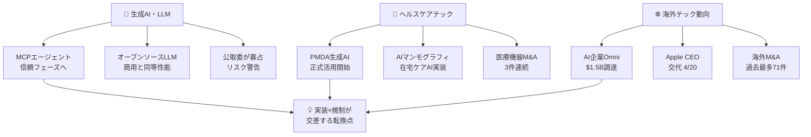
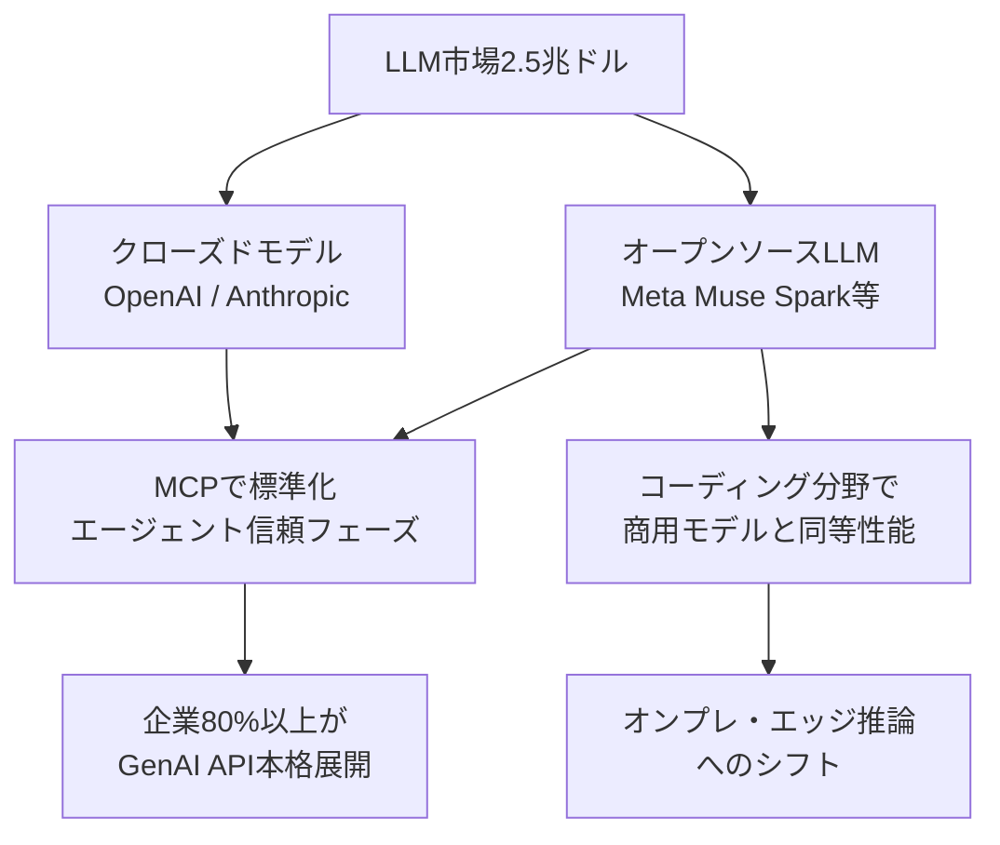
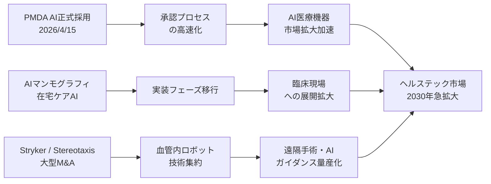
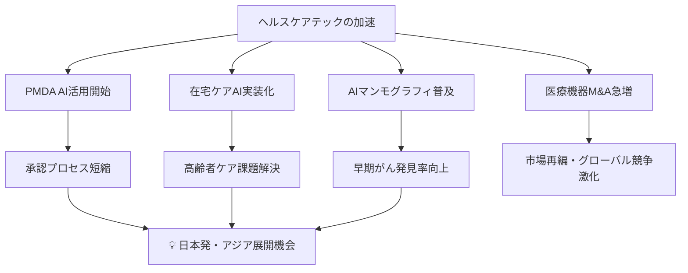
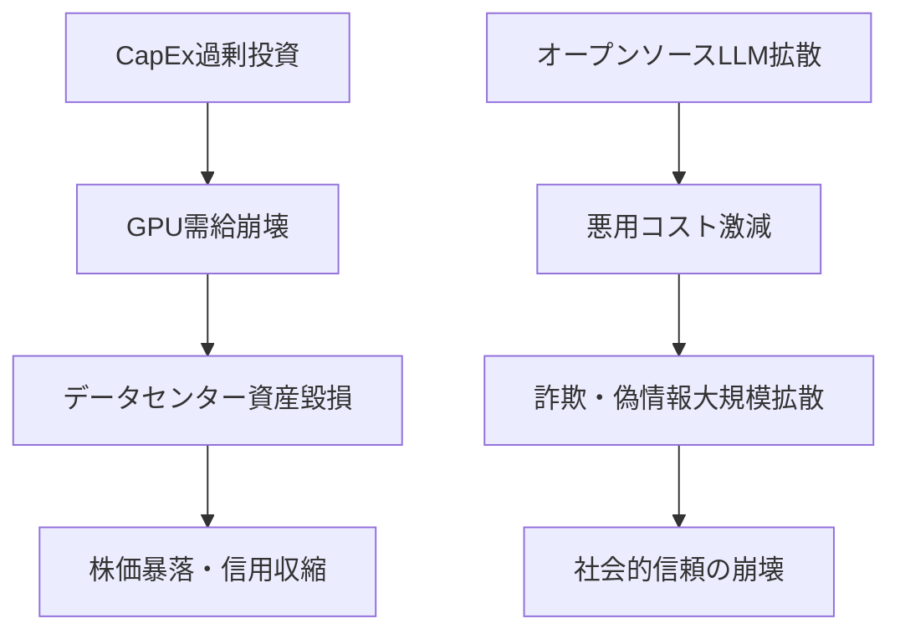
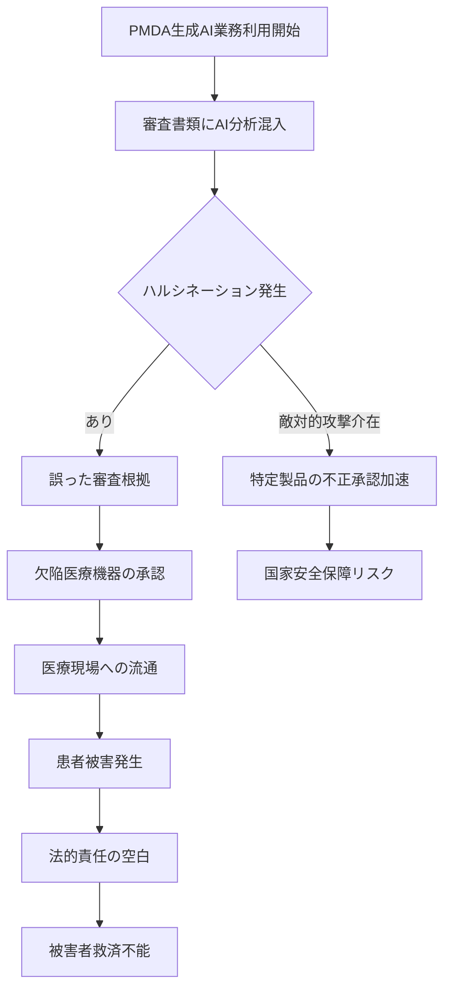

# 📊 トレンド日報 2026-04-26

## 📋 エグゼクティブ・サマリー

> **本日の重要トピック**: 生成AI・LLM最新動向 / ヘルスケアテック / 海外テック企業動向

<mark>2026年4月26日、AIは「試す時代」を完全に脱し「インフラとして問われる時代」に突入した。</mark> MCPダウンロード数の1年80倍成長・PMDAによる生成AI業務利用の正式開始・海外M&A過去最多更新が重なり、あらゆる産業でAI実装競争が臨界点を迎えている。一方で公正取引委員会のLLM寡占リスク報告、PMDAのAI審査リスク、バリュエーション急騰スタートアップのバブル懸念など、楽観一色では語れない構造的リスクも顕在化しつつある。**今後2〜3年が、AI恩恵を享受できる側になるか否かを分ける分岐点**であることを強く認識したい。

---

## 🗺️ トピック関係図

---

## 🔬 Tech視点

### 🚀 生成AI・LLM最新動向

- **技術的注目点**: MCPプロトコルのダウンロード数が1年間で10万→800万へと<mark>**80倍の爆発的成長**</mark>を記録。AIエージェントが「構築フェーズ」から「信頼フェーズ」へ移行した重大な技術的転換点。
- **📊 データ・数字**: **世界AI市場規模2.5兆ドル**（約375兆円）/ AnthropicのARR **300億ドル超**でOpenAIを逆転首位 / Gartner予測「**2026年までに世界企業80%以上**がGenAI API本格展開」 / MetaのCapEx **$115B〜$135B**（前年比約2倍）
- **技術的意義**: オープンソースLLMがコーディング分野で商用モデルと**同等性能を達成**したことは、LLMの技術的民主化が現実になったことを意味する。LLM市場の寡占リスクは公正取引委員会も認定済み。
- **展望**: MCPを軸としたエージェント間通信の標準化が加速。クラウドAPI依存からオンプレ・エッジ推論への移行が進む。

### 🚀 ヘルスケアテック

- **技術的注目点①**: <mark>PMDAが2026年4月15日に生成AI業務利用を正式開始。規制当局が自らAIを審査業務に導入した世界的先進事例。医療AI承認プロセス高速化への布石。</mark>
- **技術的注目点②**: エルピクセル・シーメンス・フィリップスがAIマンモグラフィと在宅ケアAIを展示し**実装フェーズへ移行**。深層学習ベースの画像解析精度が放射線科医レベルを凌駕するケースも報告。
- **技術的注目点③**: Stereotaxisによるフランス企業Robocath買収（最大$45M）・Strykerによる血管内リトトリプシー技術Amplitude Vascular Systems買収は、**ロボット支援インターベンション**分野の集約を示す。
- **📊 データ・数字**: Avanos Medical非公開化 **約$1.272B（約1,900億円）** / Robocath買収 **最大$45M（約67億円）** / PMDA AI導入：**2026年4月15日**正式開始

### 🚀 海外テック企業動向

- **技術的注目点**: AI企業OmniがSeries Cで$120M調達・バリュエーション**$1.5B（1年で2.3倍）**。<mark>OpenAIがサイバーセキュリティ特化モデル「GPT-5.4-Cyber」を提供開始。汎用LLMからドメイン特化モデルへの分岐が本格化していることを示す重大なシグナル。</mark>
- **📊 データ・数字**: 海外M&A **2026年Q1で71件・前年比16%増・過去最多** / 越境EC世界市場 **約$2,028億規模** / 量子コンピューティング **将来100兆円超産業**試算

---

## 🌍 Human視点

### 🌍 生成AI・LLM最新動向

- **社会的インパクト**: <mark>Gartner予測「2026年までに世界企業の80%以上がGenAI APIを本格展開」が実現すれば、AIを使えない労働者・企業は競争から脱落するという厳しい社会現実が到来する。</mark>
- **💰 ビジネスチャンス**: AI市場全体は**世界2.5兆ドル規模**に拡大。オープンソースLLMが商用モデルと同等性能を達成し、**スタートアップが大資本なしでAIサービスを構築できる環境**が整った。参入障壁が劇的に低下。
- **🔥 話題性・熱量**: MetaがCapEx $115B〜$135B（約17〜20兆円）を投資する姿勢は「AIは次の産業革命」という確信を示す。公正取引委員会の寡占リスク報告で規制当局が本格的にAIガバナンスに乗り出した。

### 🌍 ヘルスケアテック（詳細）

- **社会的インパクト**: <mark>PMDAが2026年4月15日に生成AI業務利用を正式開始。「規制当局自身がAIを採用した」という歴史的転換点。医療AI審査プロセスの加速で患者が新技術の恩恵を受けるまでの期間が短縮される。</mark> AIマンモグラフィの普及は**数万人規模の命に直結するインパクト**を持つ。
- **🏥 各M&Aの患者メリット**:
  - **Stryker×Amplitude Vascular Systems**: 血管疾患治療の低侵襲化で術後回復期間短縮・入院コスト削減
  - **Stereotaxis×Robocath（最大$45M）**: 血管内ロボット手術普及で地方病院でも高度手術が可能に
  - **Avanos Medical非公開化（約$1,900億円）**: 長期R&D投資への集中で革新的医療機器開発のスピード向上
- **💰 ビジネスチャンス**: ヘルステック市場は**2030年に向けて急拡大予測**。有望領域：AIマンモグラフィ・画像診断AI / 在宅ケアAI・遠隔モニタリング / 医療機器サイバーセキュリティ / PMDAへのAI申請サポートコンサル
- **🔥 話題性・熱量**: エルピクセル（国内スタートアップ）がシーメンス・フィリップスと同一展示会に並んだことは、**日本発ヘルスケアAIの国際競争力**が現実になりつつある証拠。

### 🌍 海外テック企業動向

- **社会的インパクト**: AppleのティムCook CEO退任（4/20）は、スマートフォン時代を作った経営者の交代として象徴的。新CEO体制下でのAI戦略は**世界20億人以上のAppleユーザーの日常体験**に直結する。<mark>越境EC世界市場が約$2,028億規模に到達し、国境を超えたビジネス展開が個人レベルでも現実となった。</mark>
- **💰 ビジネスチャンス**: AI企業OmniがSeries Cで$120M調達・バリュエーション$1.5B（1年で2.3倍）到達。量子コンピューティングは**将来100兆円超産業**試算で今から参入価値がある先行投資領域。
- **🔥 話題性・熱量**: 「GPT-5.4-Cyber」の登場でAIセキュリティという新市場の爆発的成長を予感。IDセキュリティ・データセキュリティ需要は企業の「デジタル生命線」として最優先投資分野に。

---

## ⚠️ Critic視点

### ⚠️ 生成AI・LLM最新動向

- **❌ 主なリスク**: <mark>MCP「80倍成長」は典型的なバブル指標であり、ダウンロード数は実際の利用・収益と全く別物。AnthropicのARR「300億ドル」はARRが実収益ではなく年率換算であることを意図的に隠蔽したマーケティング指標にすぎない。MetaのCapEx $115B〜$135Bは過去のITバブル・光ファイバーバブルと構造的に同一であり、需要が追いつかない場合の資産毀損は数十兆円規模に達しうる。</mark>
- **楽観論への反論**: Gartner予測の歴史的的中率は30〜40%。「エージェントAIが本番環境へ移行」というフレーズは2023年から毎年繰り返された常套句。オープンソースLLMの「商用同等性能」は特定ベンチマーク（コーディング）に限定した話であり、安全性・ハルシネーション率では依然として深刻な格差が存在する。
- **🔍 注意すべきポイント**: 公取委がLLM市場の「寡占・競争阻害リスク」を明示した事実は、EU AI Actに続く規制強化の前兆。現在プロプライエタリLLMに深く依存したシステムを構築している企業は、利用規約変更・価格改定・サービス終了の三重リスクを無視している。

### ⚠️ ヘルスケアテック

- **❌ 主なリスク（最重大）**: <mark>PMDAが生成AIを承認審査業務に活用し始めたことは、規制当局の判断品質そのものをAIに依存させるという前代未聞のリスクを内包する。誤承認→市場流通→患者被害という連鎖が発生するが、被害者が承認プロセスの瑕疵を立証することは極めて困難で、法的救済の空白が生じる。これは単なる業務効率化ではなく、公衆衛生上の時限爆弾である。</mark>
- **楽観論への反論**:
  - 「在宅ケアAI・AIマンモグラフィが実装フェーズ」は展示会デモと実臨床を混同している。AIマンモグラフィは偽陽性・偽陰性問題から複数の欧州研究で「読影医単独より劣る」結果も出ており、保険収載・診療報酬算定は不透明。
  - 「2030年市場急拡大」は診療報酬制度がAI医療機器に対応していないという根本的障壁を無視。現実の普及速度は予測の**10分の1以下**になる可能性がある。
  - StrykerなどのM&Aラッシュは市場再編ではなく「割安資産の買い漁り」の可能性。将来の強制リコール・集団訴訟リスクを内包。
- **🔍 注意すべきポイント**: 医療AI固有の三障壁①責任帰属の曖昧さ（AI誤診時の法的責任分担未整備）②診療報酬との不整合（加算なければ病院に導入インセンティブなし）③データガバナンス欠如（患者同意・偏り問題が未解決のまま「活用」が先行）が解消されない限り、大規模普及は絵に描いた餅。

### ⚠️ 海外テック企業動向

- **❌ 主なリスク**: <mark>OmniのバリュエーションがSeries Cで$1.5B（1年で2.3倍）という異常な上昇速度はVC主導による価値吊り上げの典型パターン。実収益・ユニットエコノミクスが開示されていない段階でのバリュエーション信仰は、2021年のSPACバブル崩壊と同じ構造をたどる可能性が高い。</mark>
- **楽観論への反論**: Appleのティム・クック退任は「AI競争での出遅れ責任」を誰かが取らされた可能性が高く、ジョブズ不在期（1985〜1997年）の低迷再現を想起させる。量子コンピューティング「100兆円超」試算は現時点の技術成熟度を完全に無視した机上の空論。「GPT-5.4-Cyber」は防御AIと同時に攻撃AIの最良の教師となる逆説を誰も直視していない。
- **🔍 注意すべきポイント**: 「AIによる人間能力の拡張」は雇用破壊の婉曲表現。越境EC$2,028億市場は米中貿易摩擦・データローカライゼーション規制により2026年後半には大幅縮小リスクがある。

---

## 💡 総合所感・アクション提言

2026年4月のトレンドを貫く共通軸は「**実装か、崩壊か**」という二項対立だ。AIエージェント・医療AI・海外M&Aのいずれも、構築フェーズを終えて「問われる段階」に入っている。規制当局（公取委・PMDA）がAIに本格的に向き合い始めたことは、業界の成熟を示すと同時に、規制の揺り戻しリスクが現実化しつつあることを意味する。

**具体的なアクション提言**:

1. ✅ **今すぐ着手**: ヘルスケアAI分野でのPMDA規制環境整備の今こそ、医療AI承認取得を目指す企業への投資・共同開発を検討する
2. ✅ **今すぐ着手**: オープンソースLLMを活用した専門特化AIサービスを低コストで構築し、クラウドAPIへの依存リスクをヘッジする
3. 🔍 **要注視**: AIガバナンス規制（公取委・EU AI Act）の動向を追い、コンプライアンスを先回りで整備することが競争優位になる
4. ⚠️ **リスク管理必須**: PMDAのAI審査リスク・PMDA AI化に伴う医療機器承認の変動リスクを自社製品戦略に織り込む
5. ❌ **避けるべき行動**: バリュエーション急騰のAIスタートアップへの追随投資・CapEx過剰投資への安易な乗り便り
