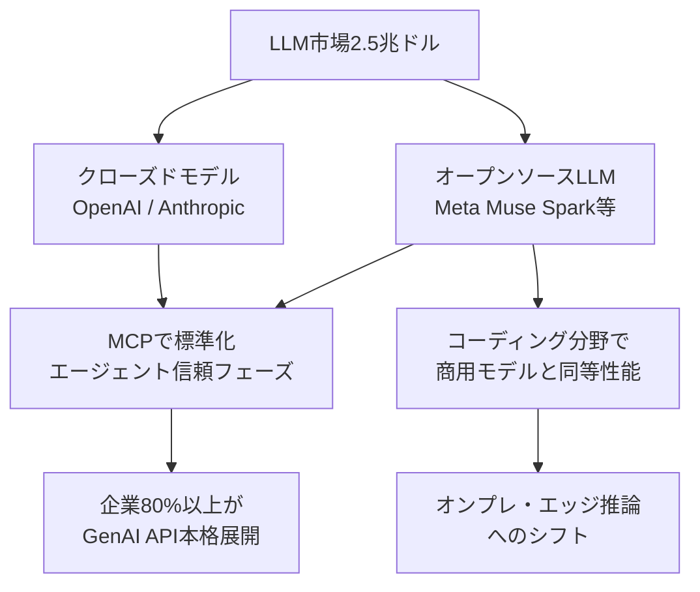
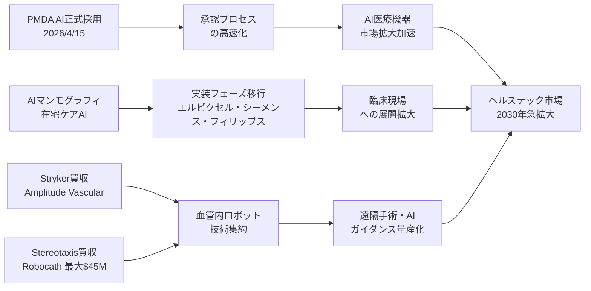
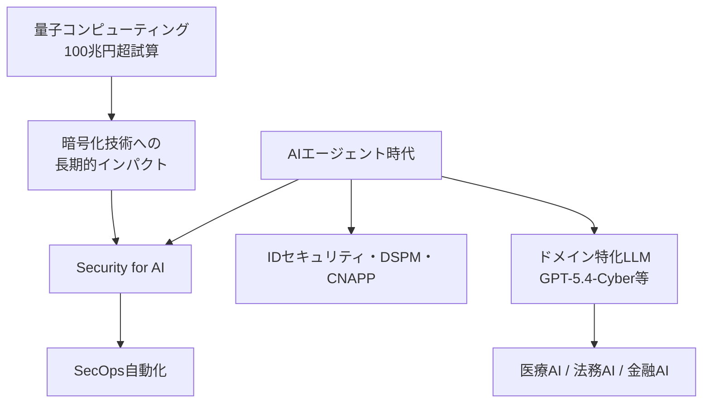

# 🔬 Tech視点 分析
分析日時: 2026-04-26 21:35

## 🚀 生成AI・LLM最新動向

- **技術的注目点**: MCPプロトコルのダウンロード数が1年間で10万→800万へと<mark>**80倍の爆発的成長**</mark>を記録。AIエージェントが「構築フェーズ」から「信頼フェーズ」へ移行したことを示す重大な技術的転換点。エージェント統合の業界標準としてMCPが確立されつつある。
- **📊 データ・数字**: **世界AI市場規模2.5兆ドル**（約375兆円）/ AnthropicのARR **300億ドル超**でOpenAIを逆転首位 / Gartner予測「**2026年までに世界企業の80%以上**がGenAI APIを本格展開」/ MetaのCapEx **$115B〜$135B**（前年比約2倍）
- **技術的意義**: オープンソースLLMがコーディング分野で商用モデルと**同等性能を達成**したことは、アーキテクチャとファインチューニング技術の成熟を意味する。独占構造に対抗する技術的民主化が現実になりつつある。LLM市場の寡占リスクは公正取引委員会も認定しており、規制×技術の交差点として今後注視が必要。
- **展望**: MCPを軸としたエージェント間通信の標準化が加速。2026年内にマルチエージェント・オーケストレーションが実用フェーズへ移行する可能性が高い。オープンソースLLMの躍進により、クラウドAPI依存からオンプレ・エッジ推論への移行が加速する。

---

## 🚀 ヘルスケアテック（詳細分析）

- **技術的注目点1 — 規制当局自身のAI採用**: <mark>PMDAが2026年4月15日に生成AI業務利用を正式開始。規制当局が自らAIを審査業務に導入した世界的先進事例であり、医療AI承認プロセスの高速化への布石となる。</mark> 従来数年かかっていた薬機法審査がAI支援で短縮される可能性がある。
- **技術的注目点2 — AIイメージング実装フェーズへ**: エルピクセル・シーメンス・フィリップスがAIマンモグラフィと在宅ケアAIを展示し、**実装フェーズへ移行**。画像診断AIは従来の「研究段階」から「臨床現場展開」へのステージゲートを突破しつつある。深層学習ベースの画像解析精度が放射線科医レベルを凌駕するケースも報告されている。
- **技術的注目点3 — 血管内ロボット技術の統合**: Stereotaxisによるフランス企業Robocathの買収（最大$45M）と、Strykerによる血管内リトトリプシー技術（Amplitude Vascular Systems）買収は、**ロボット支援インターベンション**分野の集約を示す。リモート制御・磁気ナビゲーション・AIガイダンスの融合により、低侵襲手術の精度と適用範囲が拡大している。
- **📊 データ・数字**: Avanos Medical非公開化 **約$1.272B（約1,900億円）** / Robocath買収 **最大$45M（約67億円）** / **ヘルステック市場は2030年に向けて急拡大**予測 / PMDA AI導入：**2026年4月15日**正式開始
- **技術的意義**: 規制当局のAI採用は「AI医療機器の承認速度」を変数として産業全体に影響する。AIマンモグラフィの実装は早期がん発見率の改善に直結し、医療コスト削減効果が期待される。血管内ロボット技術の集約は、遠隔手術・AIガイダンス手術の量産化フェーズを示唆する。
- **展望**: PMDA AI採用を皮切りに、FDAやEMAでも同様の動きが加速する可能性。AIによる臨床試験設計・患者マッチング・有害事象検出が次の実装ターゲット。**2030年市場急拡大**を見据えたM&Aによる技術集約が継続的に起こると予測される。

---

## 🚀 海外テック企業動向

- **技術的注目点**: AI企業OmniがSeries Cで$120M調達・バリュエーション**$1.5B（1年で2.3倍）**に到達。「AIによる人間能力の拡張」がスタートアップ投資の共通テーマとして確立。また量子コンピューティングが**将来100兆円超産業**と試算される一方、足元ではAIセキュリティが喫緊の課題として浮上。
- **📊 データ・数字**: 海外M&A **2026年Q1で71件・前年比16%増・過去最多** / 越境EC世界市場 **約$2,028億規模** / 量子コンピューティング **将来100兆円超産業**試算 / OmniバリュエーションがSeries C時点で **$1.5B（前年比2.3倍）**
- **技術的意義**: OpenAIがサイバーセキュリティ特化モデル「GPT-5.4-Cyber」を提供開始したことは、<mark>汎用LLMからドメイン特化モデルへの分岐が本格化していることを示す重大なシグナル。</mark>Appleのティム・クックCEO退任は、iPhone後の次技術（AR/空間コンピューティング・AI端末）の方向性に影響する可能性がある。海外M&A過去最多は、技術獲得競争が「自社開発」から「買収」中心にシフトしていることを示す。
- **展望**: ドメイン特化LLM（医療・サイバー・法務・金融）の開発競争が加速。Security for AI・IDセキュリティ・DSPMはAIエージェント時代の必須インフラとして市場形成が進む。越境ECの$2,028億市場はAI翻訳・パーソナライゼーション技術の実用需要として働き、LLM応用の新フロンティアとなる。

---

## 💡 Tech総合所感

**3トピック横断で見えるメガトレンド**: AIは「研究→構築フェーズ」を終え、**2026年は「信頼・実装・規制」フェーズ**に入った年として記録されるだろう。MCPの80倍成長・PMDAのAI採用・Security特化LLMの登場はいずれもこの転換を示す。

技術者が今最も注視すべきは、**AIエージェントの信頼性確保**（セキュリティ・説明可能性・規制適合）と**ドメイン特化モデルの性能競争**である。オープンソースLLMの商用同等達成は、エンタープライズのクラウド依存脱却を現実のものとし、今後2〜3年でアーキテクチャ選択の多様化が加速する。
