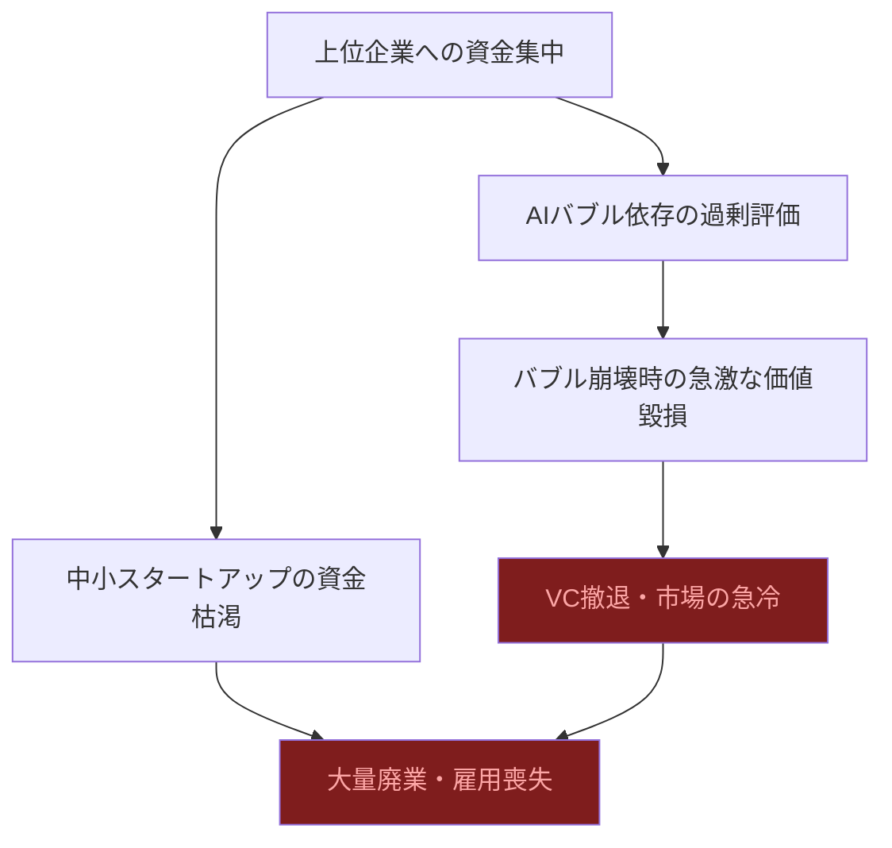
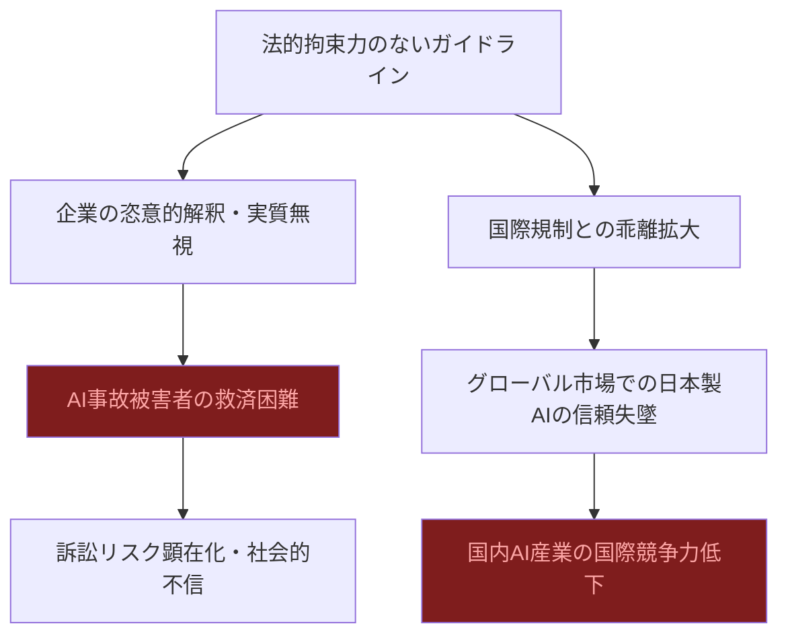
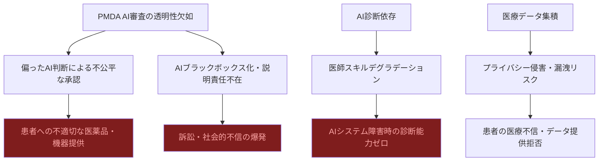

# ⚠️ Critic視点 分析
分析日時: 2026-04-27 21:37

## ⚠️ 日本のスタートアップ・資金調達

- **❌ 主なリスク**: <mark>「過去最高の調達総額」という見出しの裏に、深刻な二極化が隠れている。上位数社に資金が集中し、多くのスタートアップは「資金難」のまま淘汰される構造的問題が放置されている。</mark>
- **楽観論への反論**: ミツモア30億円・ECOММIT15億円は確かに目立つが、週21件という件数のうち多くは数千万円規模の小粒案件。「活況」という表現はミスリーディングで、実態は一握りの勝者とその他大勢の格差拡大だ。
- **🔍 注意すべきポイント**: 地方スタートアップへの資金流入は歓迎だが、鹿児島・鳥取という事例はまだ例外的。「地方創生」の看板を掲げた政策資金が混入している可能性を精査すべき。AI機能強化を名目にした調達ブームは、AIバブル崩壊時に多くの企業の価値を毀損するリスクがある。

### リスク連鎖図（必須）

### リスクマトリクス（必須）
| リスク項目 | 発生確率 | 影響度 | 総合評価 | 対策 |
|-----------|--------|--------|---------|------|
| 調達二極化による中小廃業 | 高 | 高 | 🔴 | 政策的な分散投資・補助金制度の強化 |
| AI機能追加を名目にした過大評価 | 高 | 高 | 🔴 | 実績ベースの評価基準確立 |
| 地方スタートアップ支援の形骸化 | 中 | 中 | 🟡 | KPI設定と第三者評価の義務化 |
| 市場過熱後の急激な冷却 | 中 | 高 | 🔴 | 持続的な経営体力・黒字化の前倒し |
| 海外VCの撤退リスク | 中 | 高 | 🔴 | 国内投資家育成と国内市場深化 |

---

## ⚠️ 規制・政策動向

- **❌ 主なリスク**: <mark>経産省のAI民事責任手引きは「手引き」に過ぎず、法的拘束力がない。企業は都合の悪い部分を無視できる「自主規制幻想」に陥り、実際に被害を受けた一般市民が救済されない事態が続くだろう。</mark>
- **楽観論への反論**: 公取委の生成AI実態調査は「懸念の指摘」に留まり、具体的な規制措置は不透明。米国のNSTM-4も「敵対的蒸留」という新語を作っただけで、実効的な法執行の仕組みが未整備。規制の遅れがビッグテックのやりたい放題を許す構造は変わっていない。
- **🔍 注意すべきポイント**: EU AI Actが2026年8月に一部施行される一方、日本のAI法は「イノベーション優先」の名の下に骨抜きにされるリスクが高い。国際的な規制格差が日本企業を「規制の抜け穴」として利用させる懸念も拭えない。

### リスク連鎖図（必須）

### リスクマトリクス（必須）
| リスク項目 | 発生確率 | 影響度 | 総合評価 | 対策 |
|-----------|--------|--------|---------|------|
| ガイドラインの形骸化 | 高 | 高 | 🔴 | 法制化と第三者監査の義務付け |
| 国際規制との乖離 | 高 | 高 | 🔴 | EU AI Act等との整合性確保 |
| AI事故被害者の救済不全 | 中 | 高 | 🔴 | 明確な賠償責任規定の立法化 |
| 規制競争の激化による産業逃避 | 中 | 中 | 🟡 | 競争力を損なわない比例的規制設計 |
| 米中対立の巻き添えリスク | 中 | 高 | 🔴 | 技術デカップリングへの事前対応 |

---

## ⚠️ ヘルスケアテック

- **❌ 主なリスク**: <mark>PMDAによる生成AI業務利用の「正式開始」は聞こえがいいが、規制当局自身がAIを使って審査する際の公正性・透明性・説明責任はほぼ議論されていない。AIが下した判断で薬が承認・不承認になった場合、誰がどう責任を負うのか。</mark>
- **楽観論への反論**: キヤノンのフォトンカウンティングCT「Ultimion」は技術的には評価できるが、高額な医療機器が全病院に普及するには数年〜10年単位の時間がかかる。「国産初」という言葉が独り歩きし、現場の患者が恩恵を受けるまでのギャップが無視されている。グローバルQ1調達40億ドルは確かに高水準だが、過去のデジタルヘルスバブル崩壊（2022〜2023年）を忘れてはならない。
- **🔍 注意すべきポイント**: AI診断システムは「95%以上の判定精度」を誇っても、残り5%の誤診が命に関わる医療現場ではリスクが著しく大きい。AIへの過度な依存が医師の診断能力低下を招く「スキルデグラデーション」も深刻な長期リスク。個人医療データの活用に際するプライバシー侵害・データ漏洩リスクも依然として未解決だ。
- **💊 規制・安全性リスク**: PMDAがAI審査を導入すると同時に、AI医療機器のバグ・偏りが患者に与えるリスクの監視体制が不十分。「承認の効率化」が「承認の質の低下」と表裏一体になるリスクを直視すべき。

### リスク連鎖図（必須）

### リスクマトリクス（必須）
| リスク項目 | 発生確率 | 影響度 | 総合評価 | 対策 |
|-----------|--------|--------|---------|------|
| AI審査の公正性・透明性欠如 | 高 | 高 | 🔴 | XAI導入・審査ログの第三者監査義務化 |
| AI誤診による患者被害 | 中 | 高 | 🔴 | 必ず医師がファイナル判断する制度設計 |
| 医師スキルデグラデーション | 高 | 高 | 🔴 | AI非依存トレーニングの義務化 |
| 医療データ漏洩 | 中 | 高 | 🔴 | 匿名化・差分プライバシー技術の義務適用 |
| デジタルヘルスバブル再崩壊 | 中 | 高 | 🔴 | 収益モデルの持続可能性審査強化 |
| 医療格差（富裕層のみ恩恵） | 高 | 中 | 🟡 | 国民皆保険制度内での適用推進 |
