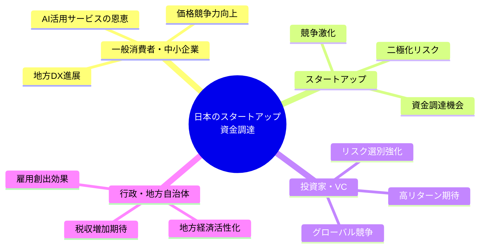
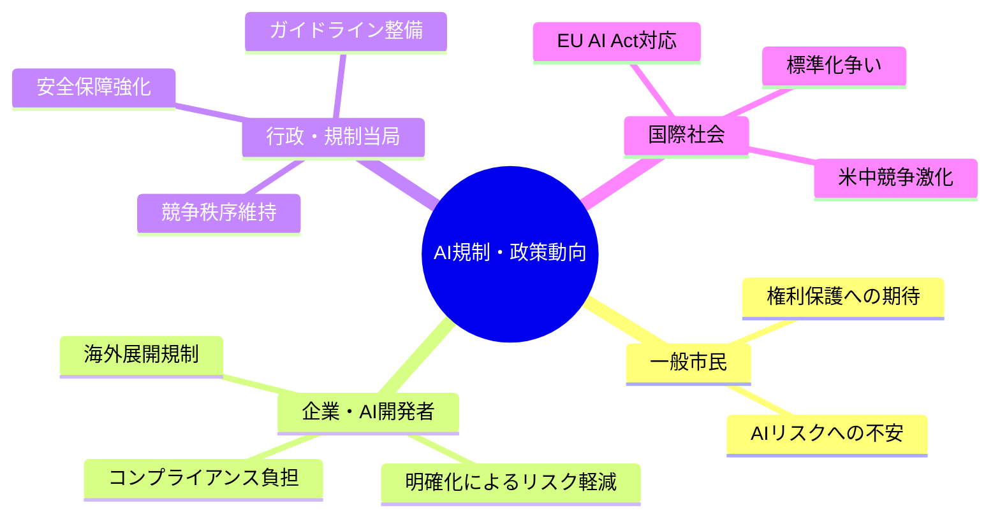
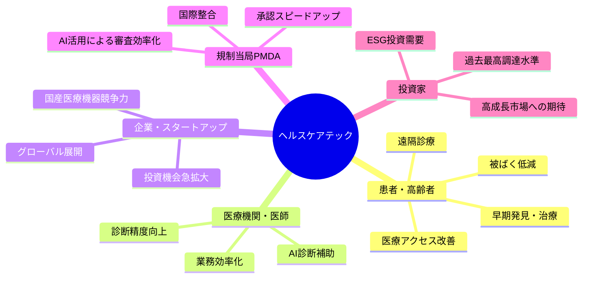

# 🌍 Human視点 分析
分析日時: 2026-04-27 21:37

## 🌍 日本のスタートアップ・資金調達

- **社会的インパクト**: 2026年Q1の国内スタートアップ資金調達総額が過去最高を記録。<mark>上位企業への集中が顕著で、調達格差・二極化が社会的課題として浮上しつつある。</mark>地方スタートアップ（鹿児島ECOММIT、鳥取ONESTRUCTION）への資金流入は地方創生の可能性を示す。
- **💰 ビジネスチャンス**: ミツモア約30億円調達でAI機能強化 → 工事事業者向けサービスの自動化・効率化市場が急拡大。リユース・循環経済領域もメルカリ等の大手が出資する成長市場に。
- **🔥 話題性・熱量**: AI×中小企業DX、地方発スタートアップの躍進がメディア注目度高。若い起業家層の熱量高く、VC資金が集まりやすい環境が継続。

### ステークホルダーマップ（必須）

### 影響度マトリクス（必須）
| ステークホルダー | 影響度 | 時間軸 | 主なインパクト |
|----------------|--------|--------|--------------|
| 一般消費者 | 中 | 短〜中期 | AI化されたサービスで利便性・価格が改善 |
| 中小企業 | 高 | 短期 | DXツール活用で競争力強化のチャンス |
| スタートアップ | 高 | 短期 | 大型調達の増加で採用・事業拡大が加速 |
| VC・投資家 | 高 | 短期 | 過去最高の調達総額で回収機会拡大 |
| 地方自治体 | 中 | 中期 | 地方発スタートアップの台頭で雇用・経済波及 |
| 行政（国） | 中 | 中〜長期 | スタートアップ5か年計画の成果として活用 |

---

## 🌍 規制・政策動向

- **社会的インパクト**: <mark>経産省がAI民事責任の手引きを公表したことで、AIを利用した場合の事故・損害賠償の責任所在が一般市民にも明確化されつつある。</mark>公取委の生成AI市場調査は独占・寡占による消費者不利益の懸念を示す。
- **💰 ビジネスチャンス**: コンプライアンス対応ニーズが急拡大 → LegalTech・RegulatoryTech市場が新たな高成長分野に。AI責任保険・監査サービスも有望。
- **🔥 話題性・熱量**: AIをめぐる規制議論はSNS・メディアでも活発で、企業の対応姿勢が評判・ブランドに直結する時代に。

### ステークホルダーマップ（必須）

### 影響度マトリクス（必須）
| ステークホルダー | 影響度 | 時間軸 | 主なインパクト |
|----------------|--------|--------|--------------|
| 一般市民 | 中 | 中期 | AI事故時の救済ルート明確化、権利保護強化 |
| AI利用企業 | 高 | 短期 | 民事責任の明確化でリスク管理コスト増加 |
| AI開発・提供企業 | 高 | 短期 | ガイドライン準拠が事業継続の必須要件に |
| LegalTech/RegTech企業 | 高 | 短期 | コンプライアンス需要急増で市場急拡大 |
| 行政 | 高 | 中期 | 国際規制調和への対応が外交課題に |
| スタートアップ | 中 | 中期 | 規制対応コスト増で小規模企業の参入障壁上昇 |

---

## 🌍 ヘルスケアテック

- **社会的インパクト**: キヤノンのフォトンカウンティングCT「Ultimion」の国内販売開始は、<mark>日本の高齢化社会における早期発見・被ばく低減という社会課題に対し、国産技術で応える歴史的な一歩だ。</mark>PMDAへの生成AI導入は承認プロセスの効率化を通じて新薬・新医療機器の市場投入を加速し、患者にとっての恩恵が大きい。
- **💰 ビジネスチャンス**: グローバルデジタルヘルスが2026年Q1に40億ドル（約6,200億円）を110件で調達、平均ディールサイズ3,670万ドルは2021年Q4以来最高。AI診断補助・在宅ケアDX・規制当局向けAIツールが有望な投資領域。
- **🔥 話題性・熱量**: 「医療×AI」は政府・産業界・メディアがともに最注目のテーマ。PMDA自身がAIを業務導入したことで規制当局の変化が業界に与えるインパクトが大きく、社会的関心は急上昇中。
- **🏥 生活への影響**: 早期診断精度の向上、審査スピードアップによる新薬・新機器へのアクセス改善、遠隔医療の拡大が患者・高齢者の生活質（QoL）を直接向上させる。

### ステークホルダーマップ（必須）

### 影響度マトリクス（必須）
| ステークホルダー | 影響度 | 時間軸 | 主なインパクト |
|----------------|--------|--------|--------------|
| 患者・高齢者 | 高 | 短〜中期 | 診断精度向上・被ばく低減・QoL改善 |
| 医療機関 | 高 | 短期 | AI診断・業務効率化ツール導入加速 |
| 医療機器メーカー | 高 | 短期 | 国産フォトンCT参入でグローバル競争激化 |
| ヘルスケアスタートアップ | 高 | 短期 | Q1調達最高水準で資金調達環境良好 |
| PMDA・行政 | 高 | 中期 | AI活用で承認効率化・国際競争力強化 |
| 保険会社 | 中 | 中長期 | 予防医療促進によるリスクプール変化 |
