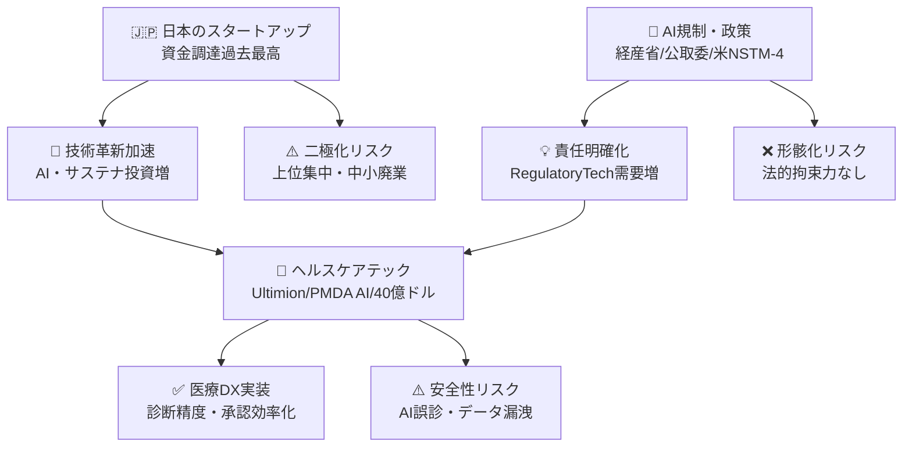
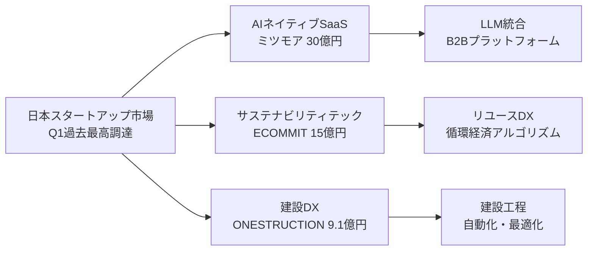
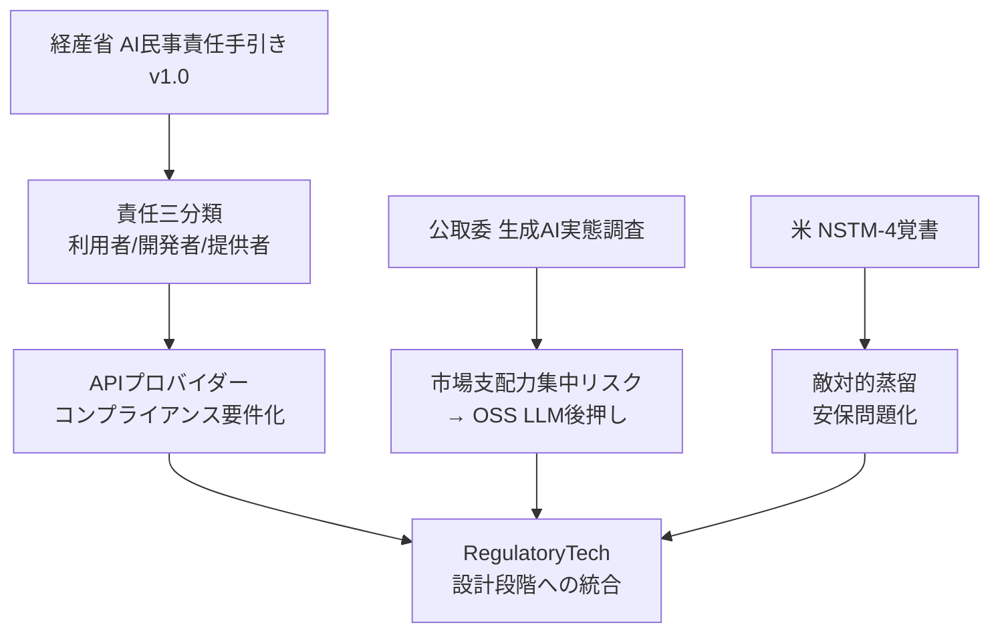
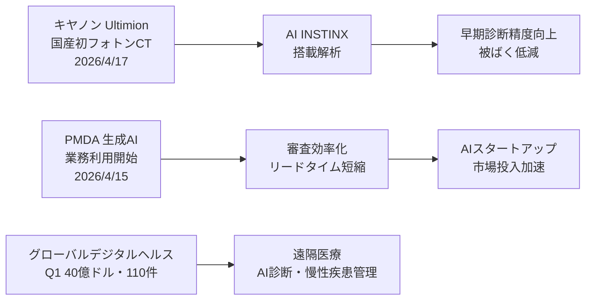
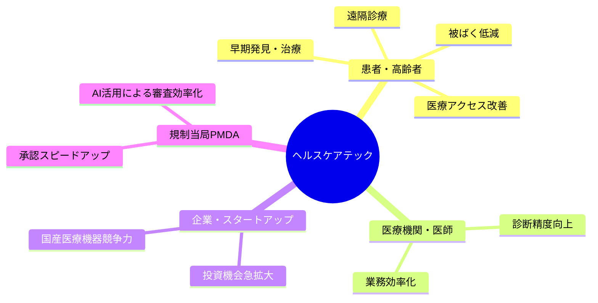
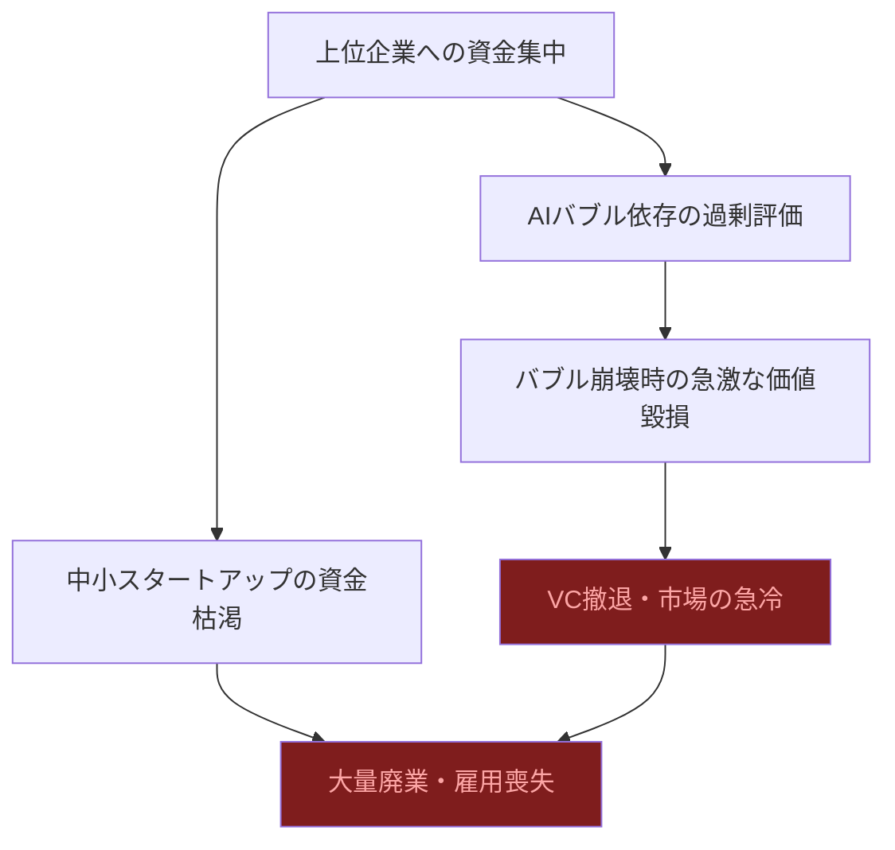
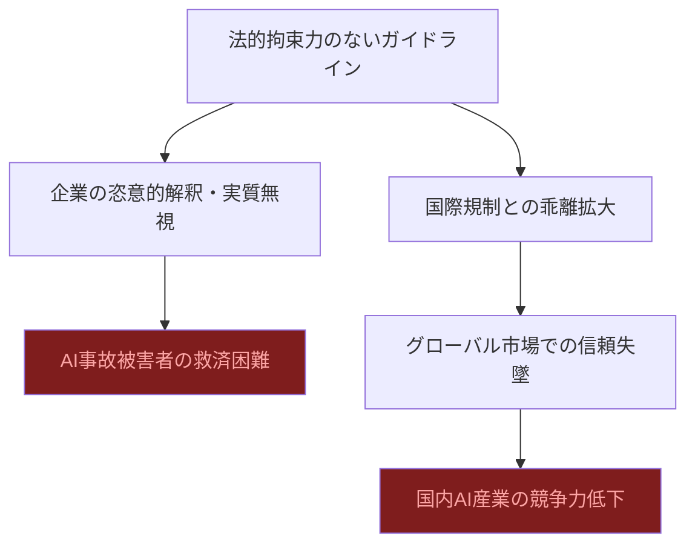
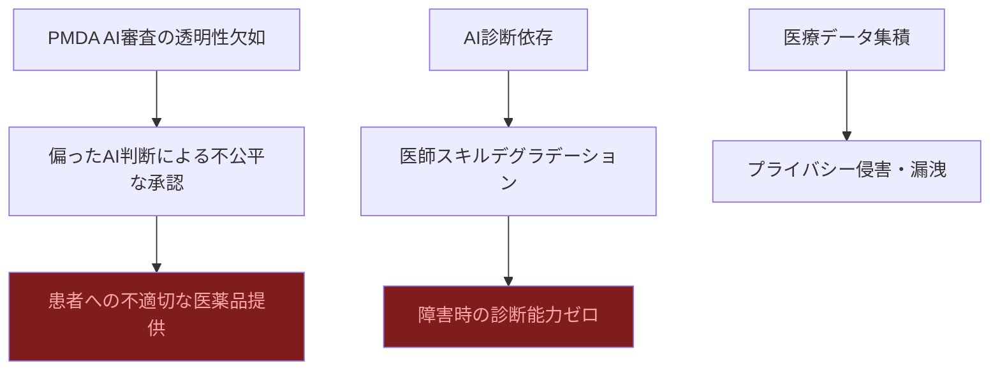

# 📊 トレンド日報 2026-04-27

## 📋 エグゼクティブ・サマリー

> **本日の重要トピック**: 日本のスタートアップ・資金調達, 規制・政策動向, ヘルスケアテック

<mark>2026年Q1の国内スタートアップ調達は過去最高を更新したが、資金の上位集中という「光と影」の二面性が鮮明になった。</mark>経産省・公取委・ホワイトハウスが同週に相次いでAI規制・政策文書を公表し、「規制の制度化元年」と呼ぶべきタイミングに達した。ヘルスケアテック分野では**キヤノンの国産初フォトンカウンティングCT「Ultimion」販売開始**と**PMDAの生成AI業務利用正式開始**という2大ニュースが重なり、日本の医療DXが実装フェーズへと転換した。グローバルのデジタルヘルス市場もQ1に**40億ドル**（約6,200億円）を調達し、2021年Q4以来最高水準を記録。楽観一辺倒ではなく、二極化・規制形骸化・AI診断リスクという構造的課題が並走していることにも目を向ける必要がある。

---

## 🗺️ トピック関係図

---

## 🔬 Tech視点

### 🚀 日本のスタートアップ・資金調達

- **技術的注目点**: <mark>2026年Q1調達総額が**過去最高**を更新。AIネイティブSaaSと循環経済テックが主要ドライバーで、技術成熟度と市場実証度の差が二極化を加速させている。</mark>
- **📊 データ**: ミツモア **約30億円**（AI機能強化）、ECOММIT **約15億円**（循環経済DX）、ONESTRUCTION **9.1億円**（建設DX）。4月第4週だけで **21件** の調達ニュース。
- **技術的意義**: ミツモアのLLM統合はSMB向けB2Bプラットフォームに「AIネイティブ化」の波が到来したことを示す。ECOMMITの物流アルゴリズム・品質判定AIはリユース産業のDX化が投資対象になった転換点。
- **展望**: AIネイティブSaaSとサステナビリティテック（GHG計測・ESG開示）が今後2〜3年の主要調達セクターに定着。

### 🚀 規制・政策動向

- **技術的注目点**: <mark>日米が同時期にAI規制を整備——経産省がAI民事責任を三分類化、公取委が生成AI市場寡占リスクを警告、米国が「敵対的蒸留」を安保問題に認定した。</mark>
- **📊 データ**: 経産省「AI民事責任手引き v1.0」（2026年4月）、公取委「生成AI実態調査」（2026年4月16日）、米NSTM-4覚書（2026年4月23日）。
- **技術的意義**: APIプロバイダーへのコンプライアンス要件が現実化。RegulatoryTech対応（説明可能性・ログ保全・不具合対応フロー）が開発標準スキルとなる時代へ。

### 🚀 ヘルスケアテック（詳細）

- **技術的注目点1**: <mark>**キヤノンが国産初フォトンカウンティングCT「Ultimion」を2026年4月17日に販売開始**。AI「INSTINX」搭載で高精度撮像と被ばく低減を同時実現した日本医療機器産業の重要マイルストーン。</mark>
- **技術的注目点2**: PMDAが2026年4月15日に生成AI業務利用を正式開始。承認リードタイム短縮の制度的触媒として機能しうる。
- **📊 データ**: グローバルデジタルヘルスQ1調達 **40億ドル（約6,200億円）・110件**、平均ディールサイズ **3,670万ドル**（2021年Q4以来最高）。

| 指標 | 現状値 | 成長傾向 | 備考 |
|------|--------|----------|------|
| グローバルデジタルヘルスQ1調達 | 40億ドル | 回復・拡大 | 2021年Q4以来最高水準 |
| Q1調達件数 | 110件 | 安定 | 大型ディール主導 |
| 平均ディールサイズ | 3,670万ドル | 上昇 | 過去最高水準 |
| キヤノン Ultimion 販売開始 | 2026年4月17日 | — | 国産初フォトンカウンティングCT |
| PMDA AI業務利用開始 | 2026年4月15日 | — | 生成AI正式導入 |

---

## 🌍 Human視点

### 💰 日本のスタートアップ・資金調達

- **社会的インパクト**: <mark>過去最高の調達総額の裏で、上位企業への集中が社会的課題として浮上。</mark>鹿児島・鳥取など地方スタートアップへの資金流入は地方創生の新たな可能性を示す。
- **💰 ビジネスチャンス**: 工事事業者向けAI自動化・リユース市場・建設DXが大手資本を巻き込んだ成長市場へ。
- **🔥 話題性**: AI×中小企業DX、地方発スタートアップ躍進がメディア注目度高く、若い起業家層の熱量が続いている。

| ステークホルダー | 影響度 | 時間軸 | 主なインパクト |
|----------------|--------|--------|--------------|
| 中小企業 | 高 | 短期 | DXツール活用で競争力強化のチャンス |
| スタートアップ | 高 | 短期 | 大型調達増加で採用・事業拡大が加速 |
| VC・投資家 | 高 | 短期 | 過去最高調達総額で回収機会拡大 |
| 地方自治体 | 中 | 中期 | 地方発スタートアップ台頭で雇用・経済波及 |

### 💰 規制・政策動向

- **社会的インパクト**: <mark>AI民事責任の明確化により、AIを利用した事故・損害賠償の責任所在が一般市民にも届く議論になりつつある。</mark>
- **💰 ビジネスチャンス**: LegalTech・RegulatoryTech・AI責任保険・監査サービスが高成長分野へ。
- **🔥 話題性**: AIをめぐる規制議論がSNSで活発化し、企業の対応姿勢がブランドに直結する時代に。

### 💰 ヘルスケアテック

- **社会的インパクト**: <mark>高齢化社会の早期発見・被ばく低減という課題に国産技術で応える「Ultimion」の登場は社会的意義が大きく、国民の医療への信頼を高める。</mark>PMDA AI導入は新薬・新機器の患者へのアクセス改善につながる。
- **💰 ビジネスチャンス**: グローバルQ1調達40億ドル・平均3,670万ドルで投資環境が本格回復。AI診断補助・在宅ケアDX・規制当局向けAIツールが有望。
- **🔥 話題性**: 「医療×AI」が政府・産業界・メディア最注目テーマ。社会的関心が急上昇中。
- **🏥 生活への影響**: 早期診断精度向上、新薬へのアクセス改善、遠隔医療拡大が高齢者・患者のQoLを直接向上させる。

---

## ⚠️ Critic視点（辛口）

### 🔍 日本のスタートアップ・資金調達

- **❌ 主なリスク**: <mark>「過去最高の調達総額」という見出しの裏に、深刻な二極化が隠れている。上位数社に資金が集中し、多くのスタートアップは資金難のまま淘汰される構造的問題が放置されている。</mark>
- **楽観論への反論**: ミツモア30億円・ECOММIT15億円は確かに目立つが、週21件のうち多くは数千万円規模の小粒案件。「活況」という表現はミスリーディングで、実態は一握りの勝者と格差拡大だ。
- **🔍 注意点**: 「地方創生」の看板を掲げた政策資金の混入可能性を精査すべき。AI機能強化名目の調達ブームはAIバブル崩壊時に価値を毀損するリスク大。

| リスク項目 | 発生確率 | 影響度 | 総合評価 |
|-----------|--------|--------|---------|
| 調達二極化による中小廃業 | 高 | 高 | 🔴 |
| AI名目の過大評価 | 高 | 高 | 🔴 |
| 地方支援の形骸化 | 中 | 中 | 🟡 |
| 市場過熱後の急冷 | 中 | 高 | 🔴 |

### 🔍 規制・政策動向

- **❌ 主なリスク**: <mark>経産省のAI民事責任手引きは「手引き」に過ぎず法的拘束力がない。企業は都合の悪い部分を無視でき、被害を受けた一般市民が救済されない事態が続くだろう。</mark>
- **楽観論への反論**: 公取委の調査は「懸念の指摘」に留まり具体的措置は不透明。NSTM-4も「敵対的蒸留」という新語を作っただけで実効的な法執行の仕組みが未整備。規制の遅れがビッグテックのやりたい放題を許す構造は変わっていない。
- **🔍 注意点**: EU AI Actが2026年8月に一部施行される一方、日本のAI法は「イノベーション優先」の名の下で骨抜きにされるリスクが高い。

### 🔍 ヘルスケアテック（辛口評価）

- **❌ 主なリスク**: <mark>PMDAが生成AIで審査する際の公正性・透明性・説明責任はほぼ議論されていない。AIが下した判断で薬が承認・不承認になった場合、誰がどう責任を負うのか——この問いへの答えがないまま「効率化」が先行している。</mark>
- **楽観論への反論**: 「Ultimion」は技術的に評価できるが、高額機器が全病院に普及するには数年〜10年かかる。「国産初」という言葉が独り歩きし、現場の患者が恩恵を受けるまでのギャップが無視されている。グローバル40億ドルは高水準だが、2022〜2023年のデジタルヘルスバブル崩壊を忘れてはならない。
- **🔍 注意点**: AI診断の「95%精度」でも残り5%の誤診が命に関わる。医師のスキルデグラデーション、個人医療データのプライバシー侵害リスクも未解決だ。

| リスク項目 | 発生確率 | 影響度 | 総合評価 |
|-----------|--------|--------|---------|
| AI審査の透明性欠如 | 高 | 高 | 🔴 |
| AI誤診による患者被害 | 中 | 高 | 🔴 |
| 医師スキルデグラデーション | 高 | 高 | 🔴 |
| 医療データ漏洩 | 中 | 高 | 🔴 |
| デジタルヘルスバブル再崩壊 | 中 | 高 | 🔴 |
| 医療格差（富裕層のみ恩恵） | 高 | 中 | 🟡 |

---

## 💡 総合所感・アクション提言

**2026年4月27日は「日本の医療AI実装元年」と「規制制度化の転換点」が重なった重要な一日**として記録されるだろう。

**提言①【スタートアップ支援の質的転換】** 調達件数・金額の「量」の追求を止め、採算性・技術的実績ベースの質的評価へシフトせよ。AIバブルに乗っかった過剰評価は2〜3年後に確実にツケが回る。

**提言②【AI規制は「手引き」から「法律」へ】** 法的拘束力のないガイドラインでは企業の自主規制は機能しない。EU AI Actの2026年8月施行を前に、日本も民事責任の法制化・第三者監査の義務化を急ぐべきだ。

**提言③【ヘルスケアAIは「人間のファイナル判断」を守れ】** PMDA AI審査もAI診断補助も、最終判断は必ず人間が行う制度設計を徹底すること。効率化の名の下でこの原則を崩せば、取り返しのつかない患者被害につながる。

**提言④【今が医療AIへの投資タイミング】** グローバル調達最高水準・国産CT上市・規制当局AI導入が揃った今は、ヘルスケアテック分野への参入適期。ただしデータプライバシー・医師スキル維持・持続的収益モデルの3点を必ずセットで設計すること。
