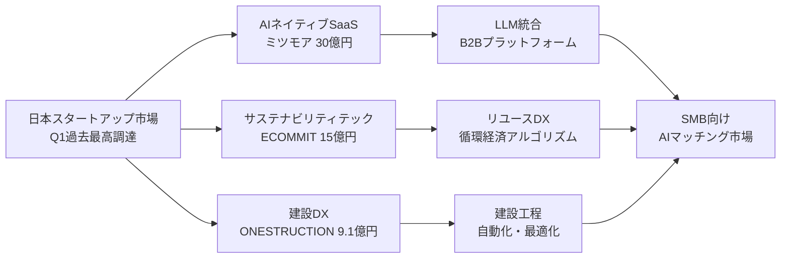
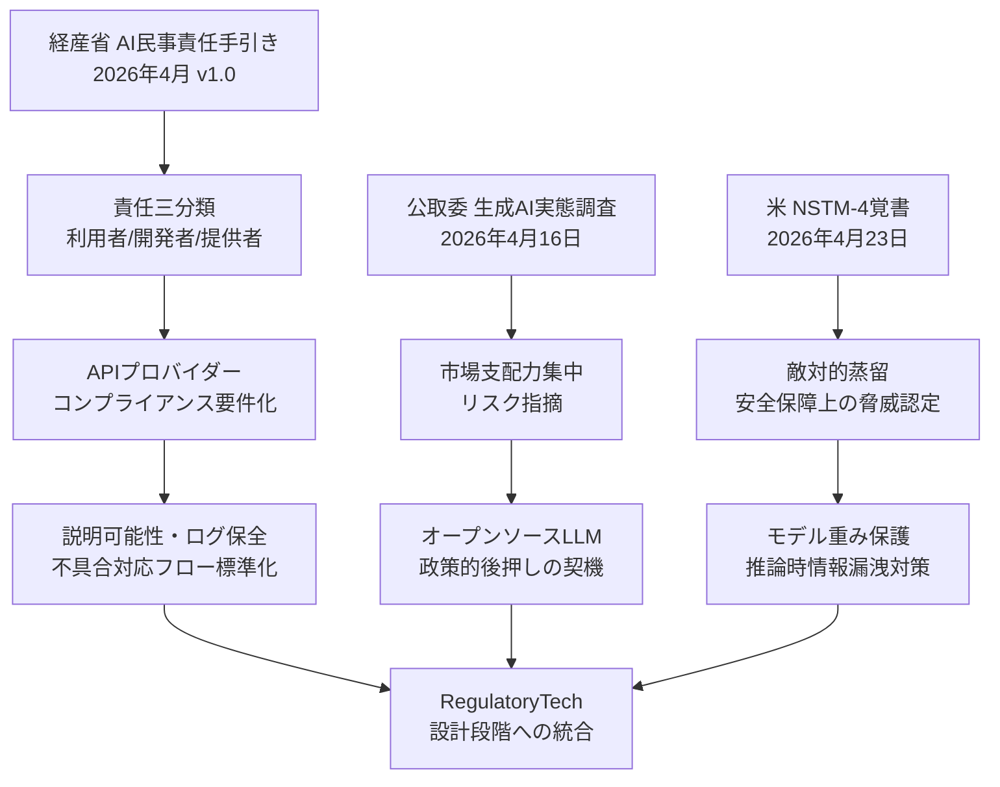
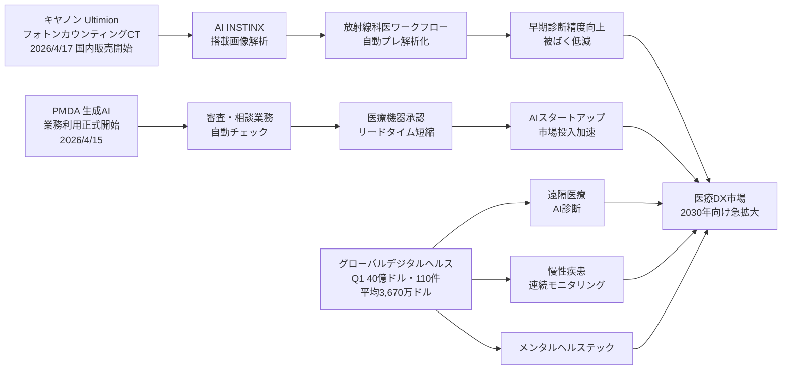

# 🔬 Tech視点 分析
分析日時: 2026-04-27 21:37

## 🚀 日本のスタートアップ・資金調達

- **技術的注目点**: <mark>2026年Q1の国内スタートアップ調達総額が**過去最高**を記録したが、資金は上位勢に集中し二極化が鮮明化。</mark>AIと脱炭素・サステナビリティ技術へのディープテック投資が主要ドライバーとなっている。
- **📊 データ・数字**:
  - ミツモア（AIサービス比較プラットフォーム）：**約30億円**調達（AI機能強化目的）
  - ECOММIT（サーキュラーエコノミー）：**約15億円**調達（メルカリ等から）
  - ONESTRUCTION（建設スタートアップ）：**9.1億円**調達
  - 2026年Q1国内調達総額：**過去最高を更新**（件数・金額ともに）
  - 4月第4週のみで**21件**の調達ニュース確認
- **技術的意義**: ミツモアのAI機能強化は、SMB向けサービスマッチング領域にLLMを統合する動きであり、日本市場における「AIネイティブなB2Bプラットフォーム」の実用化が加速していることを示す。ECOMMITの調達は、リユース・リサイクルのDX化（物流アルゴリズム・品質判定AI）が資金を集める段階に達したことを意味する。二極化は技術成熟度と市場実証度の差を反映しており、シード～アーリー企業と後期企業の間の「死の谷」リスクが拡大している。
- **展望**: AIネイティブなSaaSとサステナビリティテック（循環経済・GHG計測・ESG情報開示）が今後2〜3年の国内主要調達セクターとして定着する見込み。建設・製造などのレガシー産業へのデジタル実装（ONESTRUCTIONの建設DX）も継続的な投資対象となる。

### 技術関係図（必須）

### 主要指標（必須）

| 指標 | 現状値 | 成長傾向 | 備考 |
|------|--------|----------|------|
| Q1調達総額 | 過去最高 | 上昇 | 上位集中が顕著 |
| 週次調達件数（4月第4週） | 21件 | 安定水準 | ヘルスケア・ディープテック・サステナビリティが上位 |
| ミツモア調達額 | 約30億円 | — | AI機能強化目的 |
| ECOММIT調達額 | 約15億円 | — | メルカリ等参加 |
| ONESTRUCTION調達額 | 9.1億円 | — | 建設スタートアップ |

---

## 🚀 規制・政策動向

- **技術的注目点**: <mark>日米両国が同時期にAI規制の枠組みを整備：経産省はAI民事責任を明確化、公取委は生成AI市場の寡占リスクを警告、ホワイトハウスは「敵対的蒸留」を国家安全保障上の脅威に位置づけた。</mark>規制と技術の交差点が急速に拡大しており、開発者・利用企業双方にコンプライアンス対応の実務負担が発生し始めている。
- **📊 データ・数字**:
  - 経産省「AI民事責任手引き」：**2026年4月 第1.0版**公表（AI利用者・開発者・提供者の責任範囲を三分類）
  - 公取委「生成AI実態調査報告書」：**2026年4月16日**公表
  - 米NSTM-4覚書：**2026年4月23日**（ホワイトハウスOSTP）
- **技術的意義**: 経産省手引きによる責任三分類（利用者／開発者／提供者）は、AIサービスのアーキテクチャ設計に直接影響する。特に「提供者責任」の明確化はAPIプロバイダーへのコンプライアンス要件を現実化し、AIサービス設計における説明可能性・ログ保全・不具合対応フローの標準化が急務となる。NSTM-4が示す「敵対的蒸留」への懸念は、フロンティアモデル（大規模LLM）の重み保護・推論時の情報漏洩対策という新たな技術課題を生む。公取委の市場支配力集中指摘は、オープンソースLLMへの政策的後押しの布石となりうる。
- **展望**: 日本では薬機法・個人情報保護法に続き「AI事業者向け業界標準」の策定が2026年後半に具体化する可能性。米国のフロンティアAI保護強化はモデルウォーターマーキング・差分プライバシー技術への投資加速を促す。開発企業には「規制適合性を設計段階に組み込む」RegulatoryTech対応が標準スキルとして求められる時代に入った。

### 技術関係図（必須）

### 主要指標（必須）

| 規制文書 | 発行機関 | 発行日 | 主要要件 | 技術影響範囲 |
|----------|----------|--------|----------|-------------|
| AI民事責任手引き v1.0 | 経済産業省 | 2026年4月 | 責任三分類の明確化 | APIプロバイダー・SIer |
| 生成AI実態調査報告書 | 公正取引委員会 | 2026年4月16日 | 競争環境・寡占リスク指摘 | 大手AI事業者 |
| NSTM-4覚書 | ホワイトハウスOSTP | 2026年4月23日 | 敵対的蒸留の安保問題化 | フロンティアLLM開発者 |

---

## 🚀 ヘルスケアテック（詳細分析）

### 概要

今回のスカウト報告で最も技術的インパクトが大きいトピック。規制当局自身のAI採用、国産フォトンカウンティングCTの市場投入、グローバルデジタルヘルス市場への巨額資金流入という3つの独立した動きが、医療テックの「実装フェーズ移行」を多角的に裏付けている。

- **技術的注目点1 — 国産フォトンカウンティングCT「Ultimion」市場投入**:
  <mark>**キヤノンが国内初のフォトンカウンティングCT「Ultimion」を2026年4月17日に販売開始。AI「INSTINX」を搭載し、従来CTを大幅に上回る高精度撮像と被ばく低減を同時実現した。**</mark>
  フォトンカウンティングCTは光子ひとつひとつのエネルギーを直接検出する第5世代CT技術であり、従来の間接変換（シンチレータ+光電素子）方式に対して原理的に優位な特性（エネルギー弁別能・空間分解能・低被ばく）を持つ。これまでSiemens HealthineersのNAEOTOM Alpha（2021年CE認証）が先行していたが、**キヤノンによる国産実用化は日本の医療機器産業の技術競争力を示す重大なマイルストーン**。

- **技術的注目点2 — PMDAが生成AI業務利用を正式開始**:
  <mark>規制当局が審査・相談業務に生成AIを公式導入した事実は、医療AIのエコシステム全体を加速させる「制度的触媒」として極めて重要。</mark>
  PMDAが生成AIを審査に活用することで、①医療機器承認申請書類の自動チェック・不備検出、②国際規制（ISO/IEC・FDA・CE）との整合性確認補助、③審査担当者向けリファレンス検索の高速化、などが期待される。承認リードタイムが短縮されれば、革新的医療機器・体外診断薬の市場投入速度が上がり、スタートアップのPMDA審査待ちリスクが低下する。

- **技術的注目点3 — グローバルデジタルヘルス2026年Q1：40億ドル調達**:
  2021年Q4以来最高水準のディールサイズを記録。COVID後の投資冷却期（2022〜2024年）を経て、デジタルヘルスへの資金が本格回復局面に入ったことを示す。特に遠隔医療・AI診断・慢性疾患管理（連続モニタリング）・メンタルヘルステックへの投資が主導している。

- **📊 データ・数字**:
  - グローバルデジタルヘルスQ1調達：**40億ドル（約6,200億円）・110件**
  - 平均ディールサイズ：**3,670万ドル**（2021年Q4以来最高水準）
  - キヤノン「Ultimion」国内販売開始：**2026年4月17日**
  - PMDA生成AI業務利用正式開始：**2026年4月15日**
  - Siemens NAEOTOM Alpha（比較）：2021年CE認証（先行参考事例）

- **技術的意義**:
  ① **フォトンカウンティングCT**は画像診断の精度向上を超え、組織の化学組成分析（造影剤の種類判別・プラーク組成解析）という新しい診断パラダイムを開く。AI「INSTINX」との統合により、放射線科医のワークフローに「プレ解析済みデータ」が届く形態が実現する。
  ② **PMDAのAI採用**は単なる省力化ではなく、日本の薬機法規制の「AIリテラシー向上」を意味する。審査側がAIを理解することで、AI医療機器の審査基準策定（説明可能性要件・バリデーション方法論）が実務知見に基づいたものになる。
  ③ **デジタルヘルス40億ドル**は、医療データのデジタル化（EHR・PHR）・AIモデルの学習基盤整備・規制対応コスト増大のすべてが「大型ディール優位」の構造を形成していることを反映する。

- **展望**:
  - フォトンカウンティングCTのAI統合は「ルーティン撮影の全自動解析」へ向かい、放射線科医の役割が「品質管理・複雑症例判断」にシフトする。
  - PMDAのAI活用実績が蓄積されれば、2027〜2028年頃に「AI審査支援のガイドライン化」→ FDAとの相互承認加速という経路が現実的になる。
  - **2026年Q2以降、デジタルヘルスの平均ディールサイズは4,000万ドル超を目指すトレンドが継続**すると予測。M&Aによる技術集約（AI診断・遠隔手術・慢性疾患プラットフォーム）が加速する。

### 技術関係図（必須）

### 主要指標（必須）

| 指標 | 現状値 | 成長傾向 | 備考 |
|------|--------|----------|------|
| グローバルデジタルヘルスQ1調達 | 40億ドル（6,200億円） | 回復・拡大 | 2021年Q4以来最高水準 |
| Q1調達件数 | 110件 | 安定 | 大型ディール主導 |
| 平均ディールサイズ | 3,670万ドル | 上昇 | 2021年Q4以来最高 |
| Ultimion 国内販売開始日 | 2026年4月17日 | — | 国産初フォトンカウンティングCT |
| PMDA AI業務利用開始日 | 2026年4月15日 | — | 生成AI正式導入 |

### フォトンカウンティングCT 技術比較（必須）

| 技術方式 | 解像度 | エネルギー弁別 | 被ばく低減 | 代表製品 |
|----------|--------|--------------|-----------|----------|
| 従来CT（間接変換） | 標準 | なし | 標準 | 各社従来機 |
| フォトンカウンティングCT | **大幅向上** | **あり（多エネルギー）** | **顕著** | Siemens NAEOTOM Alpha（2021）/ **キヤノン Ultimion（2026）** |

---

## 💡 Tech総合所感

**3トピック横断メガトレンド**: 2026年Q2は「AIの実装・制度化フェーズ」が日本でも本格化した転換点として記録されるだろう。

1. **資金調達の二極化**はスタートアップエコシステムの成熟を意味する。技術的優位性が立証されたAIネイティブSaaSと循環経済テックが大型調達を確保し、実証なきアイデア段階の企業は淘汰が進む。
2. **規制の精緻化**は短期的にコスト増だが、長期的にはAI導入の信頼基盤を形成する。PMDA・経産省・公取委・ホワイトハウスが同時期に動いた事実は、国際的なAIガバナンス体制が「競争から協調」フェーズに入ったことを示唆する。
3. **ヘルスケアテックは最もアクション可能な投資対象**。国産フォトンカウンティングCT・PMDA AI採用・グローバル40億ドル調達の三つの動きは互いに連動しており、医療AIの実装サイクルが2〜3年で急激に圧縮されることを示している。

技術者・投資家が今優先すべきは、「**規制適合設計（RegulatoryTech）×医療AI統合**」の交差領域であり、フォトンカウンティングCTとPMDA AI審査の組み合わせは、日本独自の医療AIエコシステム構築の先端事例として国際的な注目を集める可能性がある。
