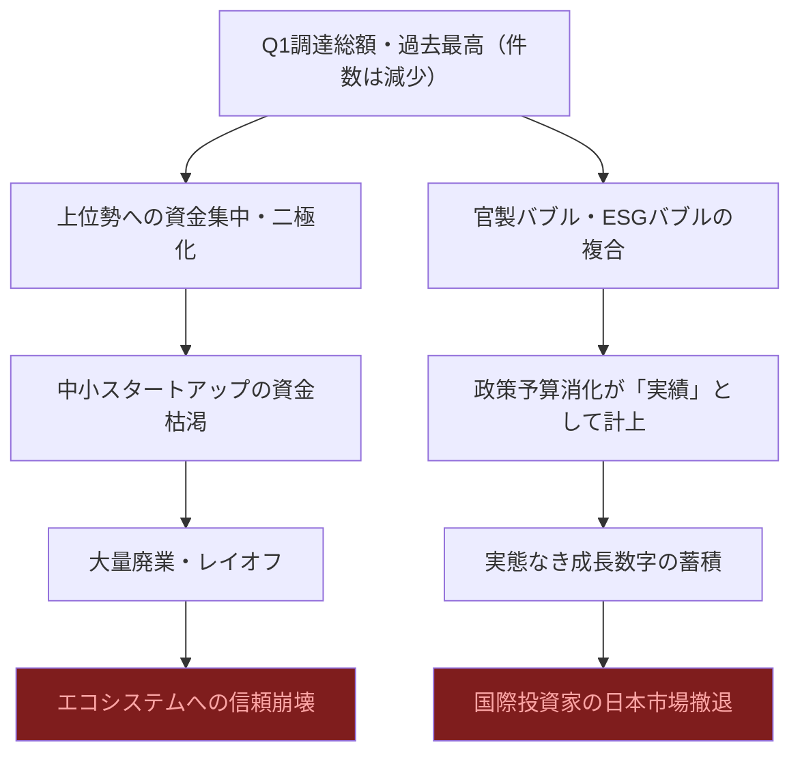
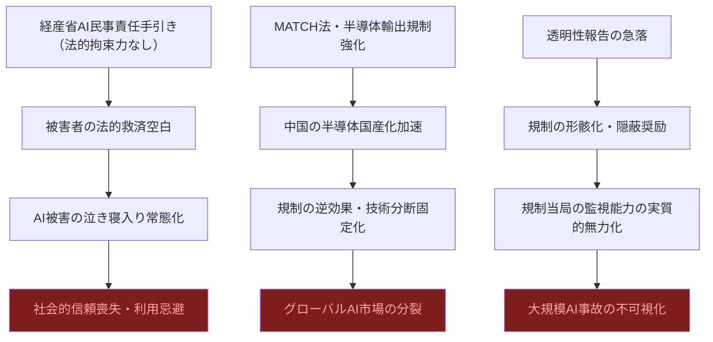
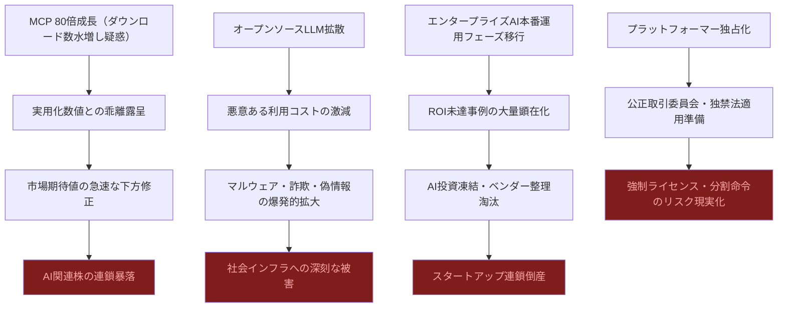

# ⚠️ Critic視点 分析
分析日時: 2026-04-29 21:31

---

## ⚠️ 日本のスタートアップ・資金調達

- **❌ 主なリスク**: <mark>「2026年Q1調達総額が過去最高」という見出しは、件数が減少しているという事実を巧みに隠蔽している。これはバブル崩壊前夜の典型的なパターンだ。少数の勝ち組に資金が集中し、残る大多数は干上がる二極化構造は、エコシステム全体の崩壊を予告するシグナルにほかならない。</mark>

- **楽観論への反論**:
  - ブレイブグループ80億円・BALLAS 24億円という大型調達は、それ自体が「バブルの証拠」として読むべきである。建設×AIというテーマはここ数年で何度も繰り返されてきたが、実際に黒字化したスタートアップはほぼ皆無だ。「AI活用の垂直特化型」は投資家を引き付けるストーリーであって、事業モデルとしての実証はまだなされていない。
  - ミツモア30億円・ECOММИТ15億円など「ヘルスケア・サステナビリティ系が目立つ」という評価も、ESGバブルの末期症状と見ることができる。欧米ではサステナビリティ投資への反動（アンチESGムーブメント）がすでに顕在化しており、日本市場はその波に3〜4年遅れて追随するのが歴史的パターンだ。
  - 上位集中は「勝者の証明」ではなく「弱者の切り捨て」である。VC側が選別を強化している背景には、LP（年金・機関投資家）からのリターン要求が厳しくなっているという現実がある。これは次のファンドサイズ縮小・投資冬の時代の前触れだ。

- **🔍 注意すべきポイント**:
  - 日本の政策系スタートアップ支援（SBIR・スタートアップ育成5ヶ年計画）の予算消化が「実績数字」として盛り込まれている可能性がある。政府資金は民間リターンを生まない。官製バブルの崩壊は民間バブルより遅く、しかし壊滅的だ。
  - 「過去最高」という数字は円安効果で水増しされている可能性がある。ドルベースで見ると、実質調達額は欧米主要国の同期比で依然として劣後している。日本のスタートアップ規模を世界水準と比較することなく「最高記録」を誇る報道姿勢そのものが危険だ。

### リスク連鎖図（必須）

### リスクマトリクス（必須）

| リスク項目 | 発生確率 | 影響度 | 総合評価 | 対策 |
|-----------|--------|--------|---------|------|
| 件数減少による中小スタートアップ大量廃業 | 高 | 大 | ❌ 最重大 | エコシステム多様性の維持・小口分散支援の強化 |
| 官製バブル崩壊（政府資金依存の反動） | 中 | 大 | ⚠️ 要警戒 | 政府資金依存度の透明な開示義務化 |
| ESG・サステナビリティ投資テーマの枯渇 | 高 | 中 | ⚠️ 要警戒 | アンチESGトレンドの先読みと撤退基準の明確化 |
| 円安水増し効果の剥落による実態露呈 | 中 | 中 | 🔍 監視 | ドルベースでの調達額比較の常態化 |
| LP（年金基金）のVC資金回収圧力強化 | 高 | 大 | ❌ 最重大 | 短期回収圧力に対抗できるLP多様化 |

---

## ⚠️ 規制・政策動向

- **❌ 主なリスク**: <mark>経産省の「AI民事責任手引き」は法的拘束力を持たない単なる「解釈指針」にすぎず、被害者が実際に損害賠償を請求できる法的基盤は依然として存在しない。AI被害が発生した際に「手引きを読め」と言われるだけで救済されない状況を合法化する隠れ蓑として機能するリスクがある。</mark>

- **楽観論への反論**:
  - 「AI関連法を持つ国が47カ国に増加」という数字は、法律の質・実効性を一切考慮していない。形式的に「AI法」を制定しても、執行能力・司法の専門知識・被害者への救済手段が欠如していれば紙切れ同然だ。EU AI Actでさえ、執行機関の人員不足・技術的理解の欠如が深刻な問題として指摘されている。
  - 執行措置件数「2024年比3.6倍・156件」のうちEUが57%を占めるという事実は、日本・米国・アジアがほぼ放置状態であることを示す。EUだけが先走り、残る大多数の国がAI規制を棚上げにしている非対称な世界で、AI企業は規制の最も緩い管轄に逃げるだけだ。
  - MATCH法（米国の多国間半導体規制）による日本・オランダへの連携要請は、同盟国の半導体産業に一方的な経済的負担を強いる構造だ。日本のASML依存度・TSMC依存度を考慮すると、米国主導の規制に追随することで日本企業は短期的に甚大な競争不利を被る。これは「連携」ではなく「従属」である。
  - 「企業の透明性報告が急落」という矛盾をスタンフォードHAIが指摘しているにもかかわらず、各国政府は自主報告を求める姿勢を崩していない。透明性報告が急落する一方で規制は強化されるという矛盾は、AI企業が規制の形式だけを満たしながら実態を隠蔽することを加速させる。

- **🔍 注意すべきポイント**:
  - 経産省の手引きは2026年4月公開だが、経産省が同時に「AI活用促進」を掲げているという根本的な利益相反がある。同じ省庁がアクセルとブレーキを同時に踏む構造は、規制の実効性をゼロにするメカニズムとして機能する。
  - 半導体規制の強化は中国のAI開発を抑制するのではなく、国産化を加速させるだけだ。過去の対中輸出規制の歴史は、制裁が技術自立を促進した事例に満ちている。規制が逆効果を生む典型的な政策ミスを繰り返そうとしている。

### リスク連鎖図（必須）

### リスクマトリクス（必須）

| リスク項目 | 発生確率 | 影響度 | 総合評価 | 対策 |
|-----------|--------|--------|---------|------|
| 経産省手引きの法的空洞化による被害救済不全 | 高 | 大 | ❌ 最重大 | 行政不服申立・損害賠償制度のAI対応改正を早急に立法化 |
| MATCH法への追随による日本企業の競争劣位 | 高 | 大 | ❌ 最重大 | 国益ベースの独自判断と産業保護条項の交渉 |
| 中国の対抗的半導体国産化加速 | 高 | 中 | ⚠️ 要警戒 | 規制効果の定期検証と出口戦略の設計 |
| 企業透明性報告急落による規制形骸化 | 高 | 大 | ❌ 最重大 | 第三者監査の義務化・報告内容の法的拘束力付与 |
| 47カ国AI法の実効性ゼロ（形式的制定） | 中 | 大 | ⚠️ 要警戒 | 執行能力・司法専門知識の国際的底上げ支援 |

---

## ⚠️ 生成AI・LLM最新動向

- **❌ 主なリスク**: <mark>「AIエージェントが試す段階からROIを問われる本番運用フェーズへ移行」という業界の自己申告は、ROIが実際に証明されていないことを婉曲に告白しているにすぎない。本番運用で初めてROIが問われる段階に入ったということは、これまでの数年間・数兆円規模の投資が「試験段階」だったということだ。株主への説明責任が問われる局面がついに到来した。</mark>

- **楽観論への反論**:
  - MCPのダウンロード数が1年で10万→800万（80倍）という数字は、技術バブルの最も古典的な虚偽指標だ。npmパッケージのダウンロード数は自動化ツール・CI/CDパイプラインの繰り返し実行で容易に水増しされる。「ダウンロード数＝実用化」という等式は成立せず、実際のプロダクション環境での稼働数・障害発生率・ROI実績は一切開示されていない。
  - 「オープンソースLLMがコーディング分野で商用モデルと同等性能を達成」という主張は、特定のベンチマーク（HumanEval等）における数字であり、現実の開発現場での安全性・セキュリティ・ハルシネーション率・長文整合性では依然として深刻な格差が存在する。しかも、オープンソース化による悪意ある利用（マルウェア生成・フィッシング高度化・ディープフェイク量産）は商用モデルとは比較にならないほど制御不能だ。
  - 公正取引委員会の調査が「プラットフォーマーによる独占的地位の強化」を指摘したことは、AI市場が少数巨大企業による支配構造へと固定化されていることを意味する。「新興勢力のオープンソース台頭」という対抗軸も、結局はOpenAI・Google・Metaがオープンソースを戦略的に「解放」してエコシステムを支配するための手段に過ぎない。オープンソースはフリーではなく、特定プラットフォームへの依存を深化させるトロイの木馬だ。

- **🔍 注意すべきポイント**:
  - 「ROIを問われる本番運用フェーズ」に移行した瞬間、ROIが出ない事例が大量に顕在化する。過去の技術バブル（ERP導入失敗・ビッグデータ投資の無駄）と同様に、2026年後半〜2027年にかけてエンタープライズAI失敗事例の報告が急増するシナリオは十分にリアルだ。
  - 生成AI市場の「競争環境調査」を公正取引委員会が実施したこと自体が、独占禁止法適用の準備段階を示している。AIプラットフォームへの強制ライセンス義務化・分割命令のシナリオは現実的になりつつあり、プラットフォーム株への投資リスクは市場が織り込んでいる以上に高い。

### リスク連鎖図（必須）

### リスクマトリクス（必須）

| リスク項目 | 発生確率 | 影響度 | 総合評価 | 対策 |
|-----------|--------|--------|---------|------|
| エンタープライズAIのROI未達・投資凍結 | 高 | 大 | ❌ 最重大 | 導入前のROI試算義務化・段階的展開の徹底 |
| オープンソースLLMを悪用した犯罪・偽情報拡散 | 高 | 大 | ❌ 最重大 | オープンソース配布への安全審査・悪用追跡システムの義務化 |
| MCPバブル崩壊（実用化乖離の露呈） | 中 | 大 | ⚠️ 要警戒 | ダウンロード数以外の実用指標（プロダクション稼働率・障害率）の開示要求 |
| プラットフォーマー独占への独禁法適用 | 中 | 大 | ⚠️ 要警戒 | 複数ベンダー分散・ベンダーロックイン回避の設計原則徹底 |
| AIエージェント障害による業務停止・損害 | 高 | 大 | ❌ 最重大 | エージェント稼働の人間監視義務化・フェイルセーフ設計の標準化 |

---

## 💡 総括：楽観論の正体と複合崩壊シナリオ

2026年に語られる「成長」「過去最高」「本格展開」というキーワードは、すべて**バブル末期に頻出するシグナル**だ。以下の複合崩壊シナリオを、業界のどのレポートも正面から語ろうとしていない。

1. **スタートアップ二極化の加速→エコシステム崩壊**: 資金が上位集中する構造は自己強化的であり、多様性の喪失→次世代イノベーションの枯渇→日本スタートアップ全体の国際競争力喪失という不可逆的ダメージをもたらす。
2. **規制の形骸化→大規模AI事故の不可視化**: 手引き・ガイドラインは被害を防がない。実効的な法整備なき状態でのAI本番運用拡大は、いつか必ず大規模事故を引き起こす。問題はいつかではなく、どの規模かだ。
3. **ROI神話の崩壊→AI投資バブルの終焉**: 「本番運用フェーズ」でROIが出なかった時、市場の巻き戻しは急速かつ残酷だ。2000年のドットコムバブル崩壊と同じ構造が、今度はAIという名前を冠して繰り返されようとしている。

<mark>最も危険なのは、すべての関係者（投資家・企業・政府・メディア）が一斉に楽観論を語るこの同調圧力の瞬間そのものである。異論・懐疑論が消えた市場に残るのは、崩壊だけだ。</mark>
