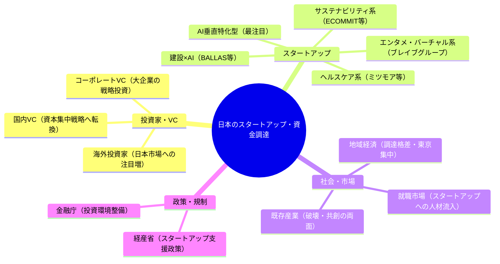
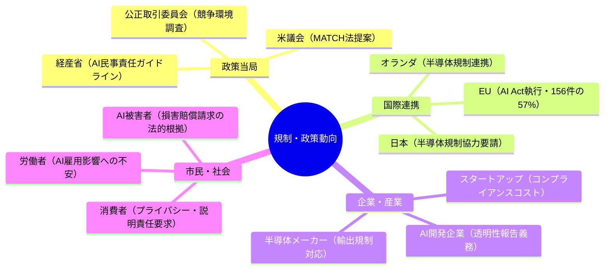
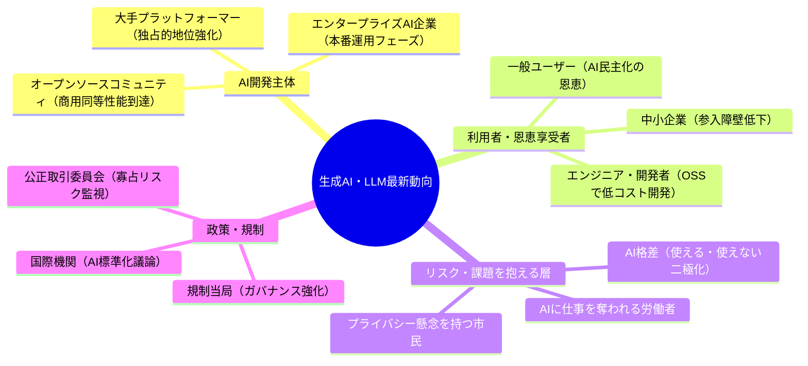
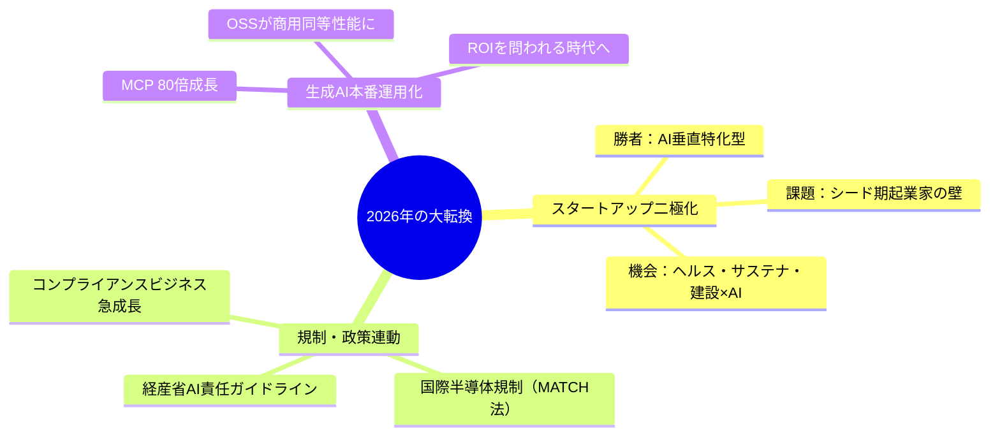

# 🌍 Human視点 分析
分析日時: 2026-04-29 21:31

## 📋 エグゼクティブ・サマリー

3トピックを横断すると「日本社会が静かな大転換点に立っている」という共通構図が浮かび上がる。スタートアップ資金調達の二極化は「少数精鋭への集中投資時代」の幕開けであり、AI規制の国際連動は日本企業が規制を先読みしてビジネス戦略を描く必要性を示す。生成AIのROI問われる本番運用フェーズ移行は、「使えない人・組織」が競争から脱落する現実的リスクを予告している。<mark>今後2〜3年は、AI恩恵を享受できる側になれるかどうかを決める分岐点であり、個人・企業・政策当局すべてに主体的な意思決定が求められる。</mark>

---

## 🌍 日本のスタートアップ・資金調達

- **社会的インパクト**: 2026年Q1の調達総額が過去最高を記録しながら件数が減少した事実は、VC・投資家が「数を打つ」戦略から「少数の本命に大きく張る」戦略へ転換したことを意味する。<mark>資金が上位スタートアップへ集中する二極化は、挑戦者（シード期起業家）にとっての「壁の高さ」が増したことを示すと同時に、選ばれた企業には桁違いのリソースが与えられるという新しい競争環境の幕開けを意味する。</mark>建設×AIのBALLAS 24億円、ブレイブグループ80億円という大型調達は、垂直特化型AIの社会実装が「実験段階」を超えたことの証左だ。

- **💰 ビジネスチャンス**: ミツモア約30億円（ヘルスケア）、ECOММIT約15億円（サステナビリティ）という具体的調達実績から、**ヘルスケア・ディープテック・サステナビリティ系が投資家の確実な関心領域**であることが読み取れる。AI活用の垂直特化型スタートアップへの投資加速は、「特定業界の課題をAIで解く専門特化型SaaS」が最も資金調達しやすいモデルであることを示している。Q1の過去最高調達総額は日本のスタートアップエコシステムへの資本流入が続いていることを示し、2026年通年での更なる更新も視野に入る。

- **🔥 話題性・熱量**: ブレイブグループ80億円という大型調達は、エンタメ×バーチャル領域（VTuberなど）が「ニッチ」から「主流産業」へ格上げされたことを象徴する。ディープテック・サステナビリティ系への資金流入は、社会課題解決型ビジネスへの投資家の期待が高まっていることを示しており、「稼げる社会貢献」という新しい起業ナラティブが浸透しつつある。

### ステークホルダーマップ（必須）

### 影響度マトリクス（必須）

| ステークホルダー | 影響度 | 時間軸 | 主なインパクト |
|----------------|--------|--------|--------------|
| AI垂直特化型スタートアップ | ★★★★★ | 即時〜1年 | 大型調達獲得、事業加速、採用競争激化 |
| シード期起業家 | ★★★★☆ | 即時〜2年 | 資金調達難易度上昇、独自ニッチ開拓が必須 |
| 既存産業（建設・ヘルスケア等） | ★★★★☆ | 1〜3年 | AI活用スタートアップとの競合・協業 |
| 地方・中小企業 | ★★★☆☆ | 2〜5年 | 東京集中の資金格差拡大リスク |
| 就職活動中の若者 | ★★★☆☆ | 即時〜2年 | スタートアップへの就職魅力度向上 |
| サステナビリティ分野 | ★★★★☆ | 1〜3年 | ESG投資家との親和性、社会的評価向上 |

---

## 🌍 規制・政策動向

- **社会的インパクト**: AI関連法を持つ国が47カ国に増加し、執行措置件数が2024年比**3.6倍の156件**（EUが57%）という数字は、「AIルール作り」が国際政治の主戦場になっていることを示す。経産省が2026年4月に公開した「AI起因の損害賠償責任の考え方」は、日本の法的AI基盤形成の第一歩であり、<mark>企業がAIを使って起こしたトラブルの責任の所在が法的に明確化されたことは、AI活用を躊躇っていた企業が踏み出せる環境が整ったことを意味する。</mark>米中半導体規制の連鎖は日本・オランダへの協力要請という形で広がり、日本がサプライチェーン政治の重要プレイヤーとなっている。

- **💰 ビジネスチャンス**: AI執行措置の急増（156件、EUが57%）は「AIコンプライアンス支援」というビジネスニーズを爆発的に生み出している。規制対応コンサルティング・AIガバナンスツール・透明性レポート自動生成SaaSは、**企業のコンプライアンス部門が今最も必要としているソリューション**だ。経産省ガイドラインの法的拘束力化が今後見込まれれば、このニーズはさらに拡大する。MATCH法（多国間半導体規制調整法）の提案により、日本の半導体・AI政策への影響度が高まり、関連産業の国内生産・サプライチェーン強化が加速する可能性がある。

- **🔥 話題性・熱量**: 企業の透明性報告が急落しているという矛盾（規制は強化されているのに、企業の自己開示は後退）は、AI時代の「見えない権力」問題として社会的議論を呼んでいる。規制当局・市民社会・企業の間の緊張関係が高まっており、AIガバナンスを巡るニュースが今後も継続的に話題を提供し続けるだろう。

### ステークホルダーマップ（必須）

### 影響度マトリクス（必須）

| ステークホルダー | 影響度 | 時間軸 | 主なインパクト |
|----------------|--------|--------|--------------|
| AI開発・提供企業 | ★★★★★ | 即時〜2年 | 透明性義務・責任明確化によるコスト増と信頼醸成 |
| 半導体関連企業（日本） | ★★★★★ | 即時〜3年 | MATCH法対応・輸出規制・サプライチェーン再編 |
| AIコンプライアンス事業者 | ★★★★☆ | 即時〜1年 | 規制対応需要の急増による事業拡大機会 |
| 一般市民・AI被害者 | ★★★☆☆ | 2〜5年 | 損害賠償請求の法的環境整備による保護強化 |
| 新興スタートアップ | ★★★☆☆ | 1〜3年 | 規制コスト増だが、コンプライアンス先行が競争優位に |
| 大学・研究機関 | ★★★☆☆ | 2〜5年 | AI研究の倫理規制・ガバナンス研究需要増 |

---

## 🌍 生成AI・LLM最新動向

- **社会的インパクト**: Model Context Protocol（MCP）のダウンロード数が1年で10万→**800万（80倍）**に急増した数字は、AIが「個人が試す道具」から「社会インフラ」へ移行したことを示す最も端的な証拠だ。<mark>エンタープライズでの生成AI本格展開とROI問われる本番運用フェーズへの移行は、「AIを使えない労働者・組織」が競争から脱落するという厳しい社会現実の幕開けを意味する。</mark>オープンソースLLMが商用モデルと同等性能を達成したことは、AIの民主化として個人や中小企業にも大きなチャンスをもたらすと同時に、AI開発の地政学的独占への抵抗という側面も持つ。

- **💰 ビジネスチャンス**: 公正取引委員会がLLM市場のプラットフォーマーによる独占的地位強化と新興勢力オープンソース台頭という二極構図を報告していることは、**オープンソースLLMを活用した専門特化型AIサービス**の事業機会が極めて大きいことを示唆する。AIエージェントが「試す段階」から「ROIを問われる本番運用」フェーズへ移行したことは、企業のAI導入支援・業務改善コンサル・効果測定ツールという新たな受託ビジネスの需要が急増することを意味する。コーディング分野でOSSが商用モデルと同等性能を達成したことで、**開発コストの大幅削減と新規事業の参入障壁低下**が実現しつつある。

- **🔥 話題性・熱量**: MCPの80倍成長という数字はAI業界全体を興奮させており、「次のデファクトスタンダード」を巡る競争が激化している。生成AIが情報システムの設計・運用パラダイムを根本から変えるという認識が企業CIO・CTO層に浸透し始めており、2026年は「AI投資の本格予算化元年」として記憶されるだろう。

### ステークホルダーマップ（必須）

### 影響度マトリクス（必須）

| ステークホルダー | 影響度 | 時間軸 | 主なインパクト |
|----------------|--------|--------|--------------|
| エンタープライズ企業（全業種） | ★★★★★ | 即時〜2年 | ROI測定・本番運用移行・業務改革加速 |
| AIエージェント開発・導入事業者 | ★★★★★ | 即時〜1年 | 企業需要急増によるビジネス拡大機会 |
| ホワイトカラー労働者 | ★★★★☆ | 1〜3年 | 業務自動化による役割変化・スキル再習得必須 |
| 中小企業・スタートアップ | ★★★★☆ | 即時〜2年 | OSSで低コスト参入・専門特化AI構築可能 |
| 大手プラットフォーマー | ★★★☆☆ | 1〜3年 | 寡占地位強化vs.オープンソース台頭の競争激化 |
| 教育機関・個人学習者 | ★★★☆☆ | 1〜5年 | AI活用スキル習得が就職・起業の前提条件に |

---

## 💡 総合所感・アクション提言

**今すぐ動くべきアクション**:

1. ✅ **AI垂直特化型SaaSで起業・参入**: 建設・医療・物流などの特定業界課題×AIという組み合わせが最も資金調達しやすいモデル
2. ✅ **コンプライアンスビジネスを立ち上げる**: AI規制執行件数3.6倍・経産省ガイドライン公開により、AIガバナンス支援の需要が今最も熱い
3. ✅ **OSSを活用したAIサービス開発**: 商用モデルと同等性能のOSSで、低コスト・高速な専門特化AIサービスを構築する好機
4. 🔍 **要注目**: AI利用格差の拡大に伴う「AIリスキリング」市場は、教育×AI分野の巨大ビジネスチャンス
5. ⚠️ **リスク管理**: AI起因の損害賠償責任が法的に整理された今、企業はAI利用規程・責任体制の整備を急ぐべき
