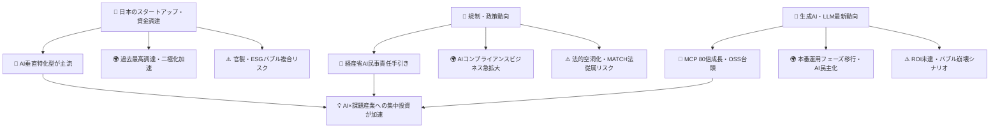
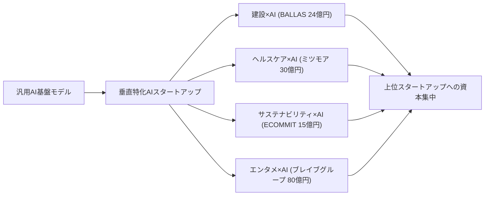
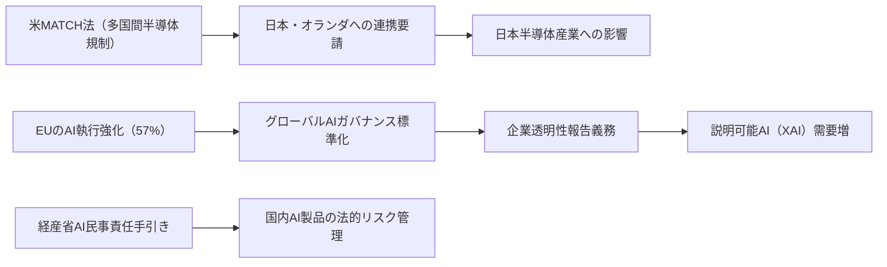
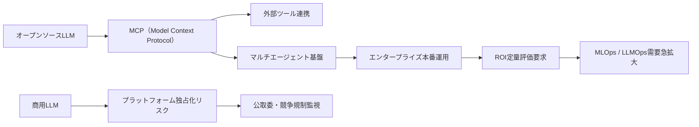
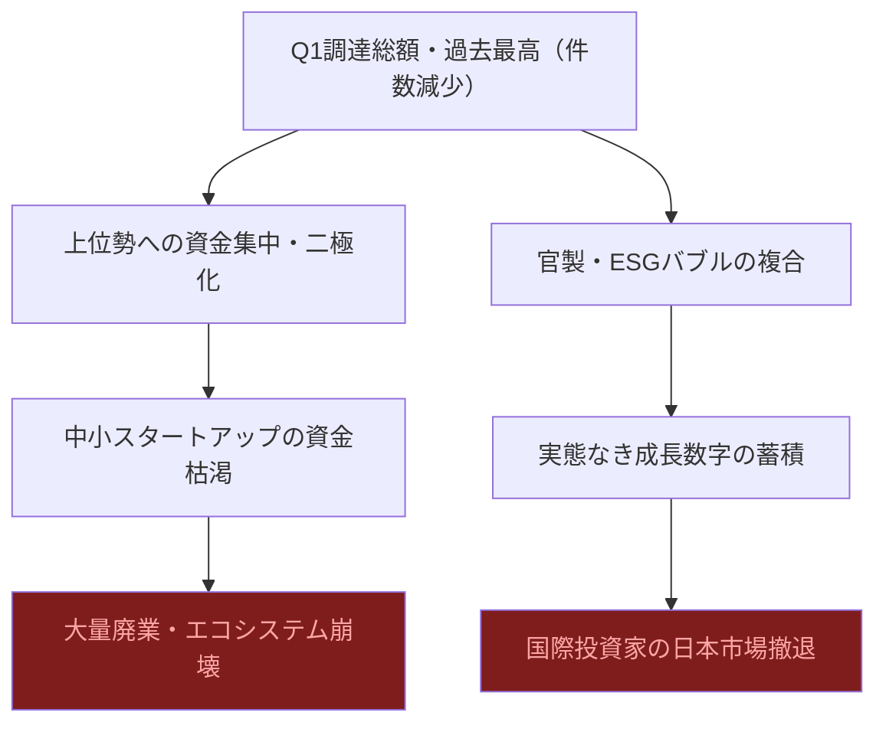
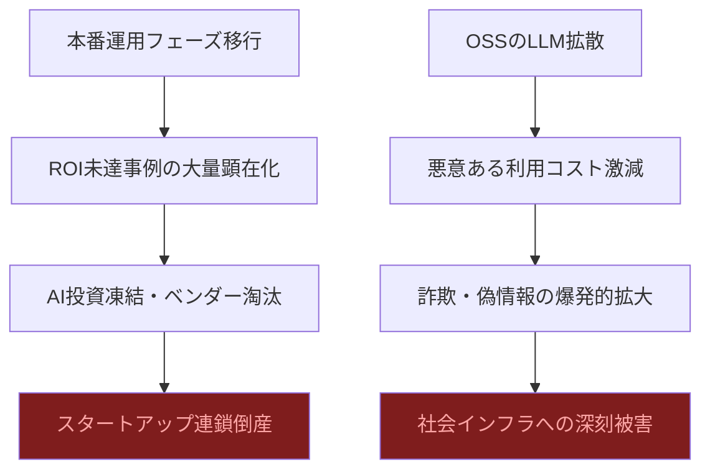

# 📊 トレンド日報 2026-04-29

## 📋 エグゼクティブ・サマリー

> **本日の重要トピック**: 日本のスタートアップ・資金調達, 規制・政策動向, 生成AI・LLM最新動向
>
> 2026年Q1のスタートアップ調達総額が過去最高を記録した一方、件数は減少し**資金の上位集中・二極化**が鮮明になっている。AI規制では経産省がAI民事責任手引きを公開し法的基盤の整備が始まったが、法的拘束力のない「解釈指針」にとどまる。生成AI領域ではMCPダウンロード数が1年で80倍に急増し、エンタープライズAIは「試す段階」から「ROIを問われる本番運用フェーズ」へ移行した。<mark>三つのトピックに共通するのは「選別と二極化の加速」——資金も規制も技術も、勝ち組と負け組を分ける分水嶺が今まさに形成されている。</mark>

---

## 🗺️ トピック関係図

---

## 🔬 Tech視点

### 🚀 日本のスタートアップ・資金調達

- **技術的注目点**: <mark>AI活用の垂直特化型スタートアップへの投資が加速。建設×AIのBALLAS（24億円）を筆頭に、「バーティカルAI」モデルが技術投資の主流トレンドとして確立された。</mark>
- **📊 データ**: ミツモア約30億円、BALLAS約24億円、ブレイブグループ80億円、ECOМMIT約15億円。2026年Q1調達総額は過去最高・件数は減少。
- **技術的意義**: 汎用AIではなくドメイン固有データ×専門知識を組み合わせた垂直統合型AIプロダクトへの評価が高まり、PMFを確立した企業への資本集中が鮮明化。
- **展望**: 垂直特化型AIは高評価継続。中小スタートアップはニッチ深掘りか大手協業・買収が出口戦略の主軸になる。

| 指標 | 現状値 | 備考 |
|------|--------|------|
| ブレイブグループ調達額 | **80億円** | エンタメ×AI最大規模 |
| BALLAS調達額 | **24億円** | 建設×AIバーティカルSaaS |
| ミツモア調達額 | **約30億円** | ヘルスケア・マッチング領域 |
| 2026年Q1調達総額 | **過去最高** | 件数は減少（二極化顕著） |

### 🚀 規制・政策動向

- **技術的注目点**: <mark>AI関連法を持つ国が47カ国に増加、執行措置件数が2024年比3.6倍（156件）に急増。EUが57%を占めグローバルAIガバナンスの標準化を主導。</mark>
- **📊 データ**: 執行措置156件（EUが57%）、米MATCH法で日本・オランダへの連携要請。経産省AI民事責任手引き（2026年4月 第1.0版）公開。
- **技術的意義**: 企業の透明性報告が急落している矛盾は説明可能AI（XAI）需要増のシグナル。MATCH法は日本の半導体産業（東京エレクトロン等）に直接影響。
- **展望**: 日本はソフトロー→ハードロー移行が加速。XAI・監査可能AIの技術開発が規制対応需要として急拡大する見込み。

| 指標 | 現状値 | 成長率 | 備考 |
|------|--------|--------|------|
| AI法整備国数 | **47カ国** | ↑ | 前年より増加 |
| AI執行措置件数 | **156件** | **+3.6倍** | EUが57%占有 |
| 経産省手引き | **2026年4月公開** | 初版 | AI民事責任の法的基盤 |

### 🚀 生成AI・LLM最新動向

- **技術的注目点**: <mark>MCPのダウンロード数が1年で10万→800万に急増（80倍）。オープンソースLLMがコーディング分野で商用モデルと同等性能を達成し、AIエージェントが「試す段階」から「本番運用フェーズ」へ移行。</mark>
- **📊 データ**: MCP 10万→800万（80倍）、公取委が生成AI市場調査報告書ver.2.0を公開（2026年4月）。
- **技術的意義**: MCPの爆発的普及は「単一モデル」から「マルチエージェント・オーケストレーション」への設計パラダイムシフトを示す。公取委調査はモデル・API・クラウドの垂直統合による独占化リスクへの懸念が政策レベルで顕在化した証左。
- **展望**: MCPハブのエージェントエコシステムが産業標準化へ。MLOps/LLMOps領域のツール需要が急拡大。OSSの台頭はオンプレ・エッジ展開ニーズを加速。

| 指標 | 現状値 | 成長率 | 備考 |
|------|--------|--------|------|
| MCPダウンロード数 | **800万** | **+8,000%（1年）** | 10万→800万 |
| エンタープライズAI展開フェーズ | **本番運用** | — | 「試す段階」を脱却 |
| OSSのコーディング性能 | **商用モデルと同等** | ↑ | 次：推論・マルチモーダル |

---

## 🌍 Human視点

### 🌍 日本のスタートアップ・資金調達

- **社会的インパクト**: <mark>調達総額過去最高・件数減少という二律背反は「少数精鋭への集中投資時代」の幕開け。挑戦者には壁が、選ばれた企業には桁違いのリソースが与えられる新競争環境が成立した。</mark>
- **💰 ビジネスチャンス**: ヘルスケア・ディープテック・サステナビリティ系が投資家の確実な関心領域。**AI×課題産業の専門特化型SaaS**が最も資金調達しやすいモデルとして定着。
- **🔥 話題性**: ブレイブグループ80億円はVTuber等エンタメ領域が「ニッチ」から「主流産業」へ格上げされた象徴。「稼げる社会貢献」という新起業ナラティブが浸透中。

### 🌍 規制・政策動向

- **社会的インパクト**: <mark>経産省のAI損害賠償責任明確化は、AI活用を躊躇っていた企業が踏み出せる環境を整備した。法的グレーゾーン解消により企業のAI本格展開が加速する。</mark>
- **💰 ビジネスチャンス**: AI執行措置急増（3.6倍）が「AIコンプライアンス支援」ニーズを爆発的に生み出す。AIガバナンスツール・透明性レポート自動生成SaaSが**今最も熱いビジネス領域**。
- **🔥 話題性**: 企業の透明性報告が急落しているにもかかわらず規制は強化されるという矛盾が「AIの見えない権力」問題として社会的議論を呼んでいる。

### 🌍 生成AI・LLM最新動向

- **社会的インパクト**: <mark>エンタープライズAIのROI本番運用フェーズ移行は「AIを使えない労働者・組織」が競争から脱落する現実的リスクの幕開けを意味する。</mark>
- **💰 ビジネスチャンス**: OSSが商用モデルと同等性能を達成したことで**開発コストの大幅削減と参入障壁低下**が実現。AI導入支援・業務改善コンサル・効果測定ツールの需要が急増。
- **🔥 話題性**: MCP 80倍成長という数字はAI業界を興奮させており、「次のデファクトスタンダード」を巡る競争が激化。2026年は**AI投資の本格予算化元年**として記憶される年になる。

---

## ⚠️ Critic視点（辛口評価）

### ⚠️ 日本のスタートアップ・資金調達

- **❌ 主なリスク**: <mark>「調達総額過去最高」は件数減少という事実を隠蔽するバブル崩壊前夜の典型パターン。上位集中は「勝者の証明」ではなく「弱者の切り捨て」であり、エコシステム崩壊のシグナルだ。</mark>
- **楽観論への反論**: 建設×AIは何度も繰り返されてきたテーマだが黒字化企業はほぼ皆無。「過去最高」も円安効果で水増しされている可能性があり、ドルベース比較では欧米主要国に劣後。
- **🔍 注意点**: LP（年金・機関投資家）のリターン要求厳格化が次のVC資金縮小・投資冬の時代の前触れ。官製バブルの崩壊は民間バブルより遅く、しかし壊滅的だ。

| リスク項目 | 発生確率 | 影響度 | 総合評価 |
|-----------|--------|--------|---------|
| 中小スタートアップ大量廃業 | 高 | 大 | ❌ 最重大 |
| 官製バブル崩壊 | 中 | 大 | ⚠️ 要警戒 |
| ESG投資テーマ枯渇 | 高 | 中 | ⚠️ 要警戒 |
| LP資金回収圧力強化 | 高 | 大 | ❌ 最重大 |

### ⚠️ 規制・政策動向

- **❌ 主なリスク**: <mark>経産省AI民事責任手引きは法的拘束力を持たない「解釈指針」にすぎず、被害者が実際に救済される法的基盤は依然として存在しない。AI被害の泣き寝入りを合法化する隠れ蓑として機能するリスクがある。</mark>
- **楽観論への反論**: 「47カ国がAI法を制定」は質を一切考慮していない数字。EUだけが先走り残る大多数は棚上げ状態で、企業は規制の最も緩い管轄に逃げるだけだ。MATCH法への追随は「連携」ではなく「従属」であり、日本企業は短期的に甚大な競争不利を被る。
- **🔍 注意点**: 経産省が同時に「AI活用促進」を掲げるという根本的利益相反は、規制の実効性をゼロにするメカニズムだ。半導体規制強化は中国の国産化を加速させるだけで逆効果を生む政策ミスの繰り返し。

| リスク項目 | 発生確率 | 影響度 | 総合評価 |
|-----------|--------|--------|---------|
| 手引きの法的空洞化・被害救済不全 | 高 | 大 | ❌ 最重大 |
| MATCH法追随による競争劣位 | 高 | 大 | ❌ 最重大 |
| 企業透明性報告急落・規制形骸化 | 高 | 大 | ❌ 最重大 |
| AI法47カ国の実効性ゼロ | 中 | 大 | ⚠️ 要警戒 |

### ⚠️ 生成AI・LLM最新動向

- **❌ 主なリスク**: <mark>「ROIを問われる本番運用フェーズへ移行」という業界の自己申告は、ROIが実際に証明されていないことの婉曲な告白だ。数兆円規模の投資が「試験段階」だったと認めた瞬間、ROI未達事例が大量顕在化するシナリオは十分にリアルだ。</mark>
- **楽観論への反論**: MCPの80倍成長は自動化ツール・CI/CDの繰り返し実行で容易に水増しされる虚偽指標だ。OSSのコーディング同等性能も特定ベンチマーク上の話であり、現実の安全性・ハルシネーション率では深刻な格差が存在する。オープンソース化はプラットフォーム支配を深化させるトロイの木馬にすぎない。
- **🔍 注意点**: 2026年後半〜2027年にかけてエンタープライズAI失敗事例が急増するシナリオは十分リアル。公取委調査は独禁法適用の準備段階を示しており、強制ライセンス・分割命令のリスクは市場が織り込む以上に高い。

| リスク項目 | 発生確率 | 影響度 | 総合評価 |
|-----------|--------|--------|---------|
| エンタープライズAI・ROI未達 | 高 | 大 | ❌ 最重大 |
| OSSを悪用した犯罪・偽情報拡散 | 高 | 大 | ❌ 最重大 |
| MCPバブル崩壊 | 中 | 大 | ⚠️ 要警戒 |
| プラットフォーマー独禁法適用 | 中 | 大 | ⚠️ 要警戒 |

---

## 💡 総合所感・アクション提言

本日の3トピックを横断すると、**「楽観と懐疑が同居する2026年の分水嶺」**という共通構図が浮かぶ。調達総額の過去最高・MCPの80倍成長・規制法整備国47カ国といった数字はすべて楽観論の根拠として語られているが、裏側には件数減少・透明性報告急落・ROI未証明という深刻な矛盾が隠れている。<mark>特に危険なのは、すべての関係者が一斉に楽観論を語る同調圧力の瞬間そのものであり、異論・懐疑論が消えた市場には崩壊しか残らない。</mark>

**今すぐ取るべきアクション**:

1. ✅ **AI垂直特化型SaaSで差別化**: 建設・医療・物流など特定業界課題×AIが最も資金調達しやすいモデル——ただし黒字化への明確な道筋を示せるかどうかが生死を分ける
2. ✅ **AIコンプライアンス支援ビジネスに参入**: 規制執行3.6倍・経産省ガイドライン公開により、AIガバナンス支援の需要が今最も熱い
3. ✅ **OSSを活用したAIサービスを低コストで構築**: 商用モデルと同等性能のOSSで専門特化AIサービスを構築できる絶好の好機——ただしセキュリティ・ハルシネーションリスク管理は必須
4. 🔍 **要注目**: AI利用格差の拡大に伴う「AIリスキリング」市場は教育×AI分野の巨大ビジネスチャンス
5. ⚠️ **リスク管理を怠るな**: AI起因の損害賠償責任が整理された今、企業はAI利用規程・責任体制の整備を急ぐこと——「手引き」があるからといって法的リスクが消えるわけではない

---

*レポート生成: 2026-04-29 21:31 | RUN_ID: 20260429-213147*
