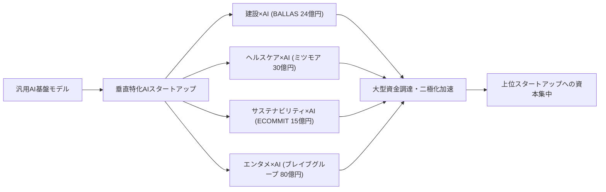
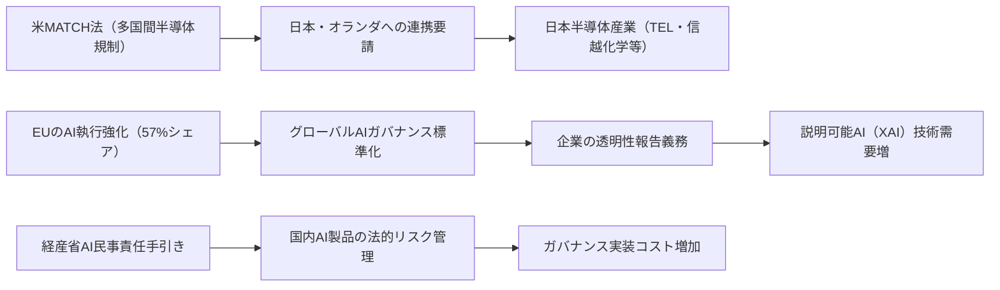
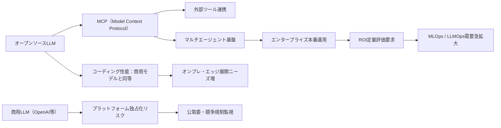

# 🔬 Tech視点 分析
分析日時: 2026-04-29 21:31

## 🚀 日本のスタートアップ・資金調達

- **技術的注目点**: <mark>AI活用の垂直特化型スタートアップへの投資が加速しており、建設×AIのBALLAS（24億円）など、特定産業ドメインにAIを深く組み込む「バーティカルAI」モデルが主流トレンドに浮上。</mark>
- **📊 データ・数字**: ミツモア約30億円、ECOММIT約15億円、BALLAS約24億円、ブレイブグループ80億円。2026年Q1調達総額は過去最高を記録、一方で件数は減少（上位スタートアップへの資金集中が顕著）。
- **技術的意義**: 大型調達が続くのはヘルスケア・ディープテック・サステナビリティ・建設などの「課題産業」領域で、汎用AIではなくドメイン固有データと専門知識を組み合わせた垂直統合型AIプロダクトが評価されている。二極化は技術的成熟度の差を反映し、PMF（プロダクト・マーケット・フィット）を確立したスタートアップへ資本が集中する選別フェーズに突入している。
- **展望**: 垂直特化型AIスタートアップは今後も高評価を受けやすいが、資本集中が進む中で中小スタートアップはニッチドメインの深掘りか、大手との協業・買収が主要な出口戦略になると予測される。

### 技術関係図（必須）

### 主要指標（必須）

| 指標 | 現状値 | 成長率 | 備考 |
|------|--------|--------|------|
| ミツモア調達額 | 約30億円 | — | ヘルスケア・マッチング領域 |
| BALLAS調達額 | 約24億円 | — | 建設×AI バーティカルSaaS |
| ブレイブグループ調達額 | 約80億円 | — | エンタメ×AI 最大規模 |
| ECOММIT調達額 | 約15億円 | — | サステナビリティ×AI |
| 2026年Q1調達総額 | 過去最高 | ↑ | 件数は減少（二極化が顕著） |

---

## 🚀 規制・政策動向

- **技術的注目点**: <mark>AI関連法を持つ国が47カ国に増加し、執行措置件数が前年比3.6倍（156件）に急増。特にEUが57%を占め、グローバルなAIガバナンスの主導権をEUが事実上握りつつある。</mark>
- **📊 データ・数字**: AI法整備国47カ国、執行措置156件（2024年比3.6倍）、EU比率57%。米議会がMATCH法（多国間半導体規制調整法）を新提案、日本・オランダへの連携要請。経産省AI民事責任手引き（第1.0版）が2026年4月公開。
- **技術的意義**: 半導体規制（MATCH法）はAIチップの設計・製造・輸出において日本の半導体産業（東京エレクトロン・信越化学等）に直接影響を及ぼす可能性がある。経産省の民事責任手引きはAI製品・サービスの法的リスク管理フレームワークを提示し、国内AI企業のガバナンス実装コストと設計要件を規定する重要文書となる。企業の透明性報告が急落している点は、技術的ブラックボックス化が加速しているシグナルであり、説明可能AI（XAI）技術の需要増加につながる。
- **展望**: 日本はEUほど強制力のある規制枠組みを持たないが、経産省の手引きにより「ソフトロー→ハードロー」への移行が加速する可能性がある。MATCH法成立時には半導体サプライチェーンの再編が求められ、日本メーカーへの影響が大きい。XAIや監査可能AIの技術開発が規制対応需要として急拡大する見込み。

### 技術関係図（必須）

### 主要指標（必須）

| 指標 | 現状値 | 成長率 | 備考 |
|------|--------|--------|------|
| AI法整備国数 | 47カ国 | ↑ | 前年より増加傾向 |
| AI執行措置件数 | 156件 | +3.6倍（対2024年比） | EUが57%を占める |
| EUのAI執行シェア | 57% | — | グローバル規制主導 |
| 経産省手引き公開 | 2026年4月（v1.0） | 初版 | AI民事責任の法的基盤 |
| MATCH法対象国 | 日本・オランダ含む | 新規提案 | 米議会で審議中 |

---

## 🚀 生成AI・LLM最新動向

- **技術的注目点**: <mark>Model Context Protocol（MCP）のダウンロード数が1年で10万→800万に急増（80倍）し、オープンソースLLMがコーディング分野で商用モデルと同等性能を達成。エンタープライズAIは「試す段階」から「ROIを問われる本番運用フェーズ」へ移行した。</mark>
- **📊 データ・数字**: MCPダウンロード数 10万→800万（1年間で80倍増）。エンタープライズ生成AI本番運用フェーズへ移行。公取委調査（2026年4月 ver.2.0）：プラットフォーマーによる独占化 vs. オープンソース勢の台頭という二項構造が明確化。
- **技術的意義**: MCPの爆発的普及は、LLMを外部ツール・データソース・APIと接続するエージェント基盤として標準プロトコルが確立されつつあることを示す。これにより「単一モデル」から「マルチエージェント・オーケストレーション」への設計パラダイムシフトが加速する。オープンソースLLMの商用モデルへの性能追従はコーディング領域から始まっており、次は推論・マルチモーダル領域へ波及する可能性が高い。公取委の競争環境調査は、モデル・API・クラウドの垂直統合による独占化リスクへの懸念が政策レベルで顕在化したことを示す。
- **展望**: MCPをハブとするエージェントエコシステムが2026年中に産業標準化する可能性が高い。ROI要求が高まるエンタープライズ市場では、推論コスト・レイテンシ・信頼性の定量評価が必須となり、MLOps・LLMOps領域のツール需要が急拡大する。オープンソースLLMの台頭はクラウドLLM APIへの依存低減を促し、オンプレ・エッジ展開のニーズが増加する。

### 技術関係図（必須）

### 主要指標（必須）

| 指標 | 現状値 | 成長率 | 備考 |
|------|--------|--------|------|
| MCPダウンロード数 | 800万 | +8,000%（1年間） | 10万→800万に急増 |
| エンタープライズAI展開フェーズ | 本番運用（ROI要求） | — | 「試す段階」を脱却 |
| オープンソースLLM性能 | コーディングで商用同等 | ↑ | 次：推論・マルチモーダル |
| AI市場競争構造 | 独占化 vs. OSS二項対立 | — | 公取委が調査・報告 |
| 公取委調査報告 | 2026年4月（ver.2.0） | 2版目 | 競争環境の継続監視 |
