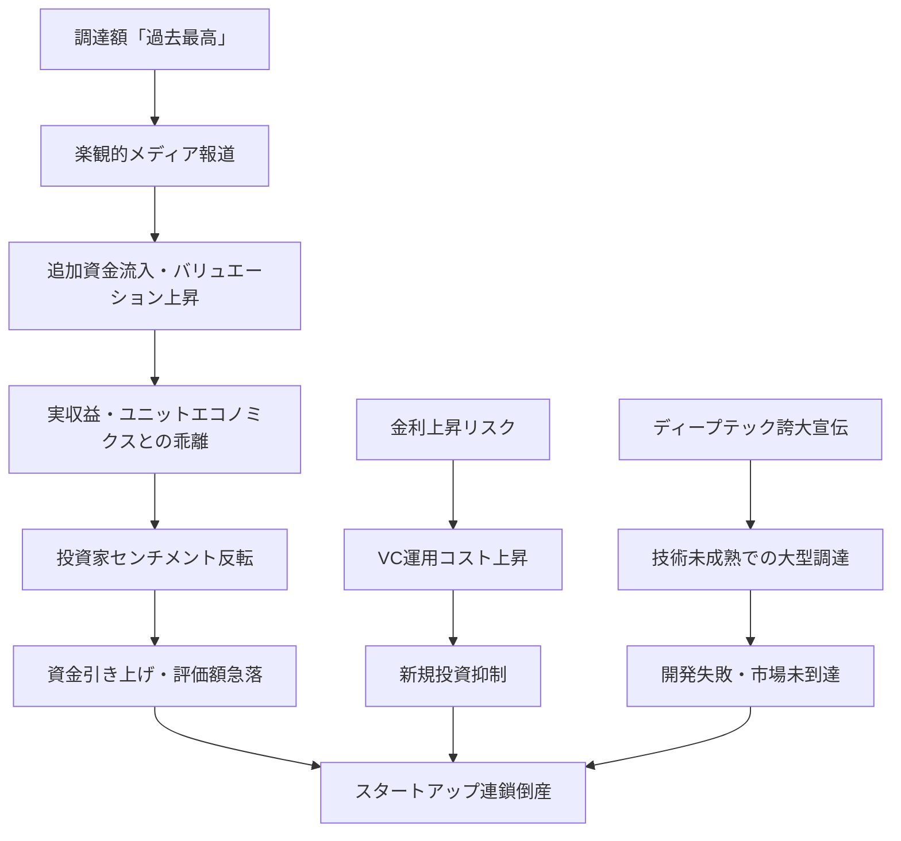
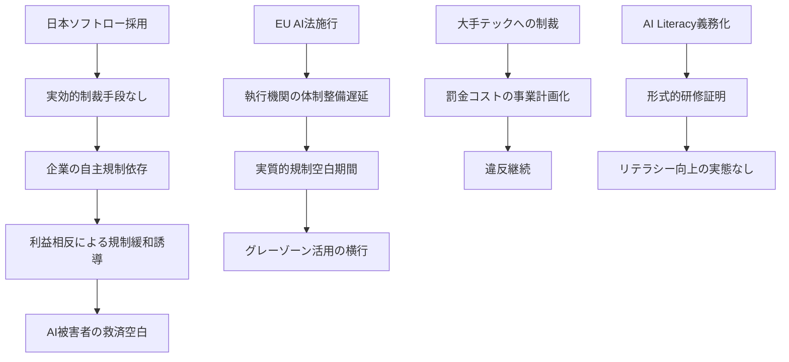
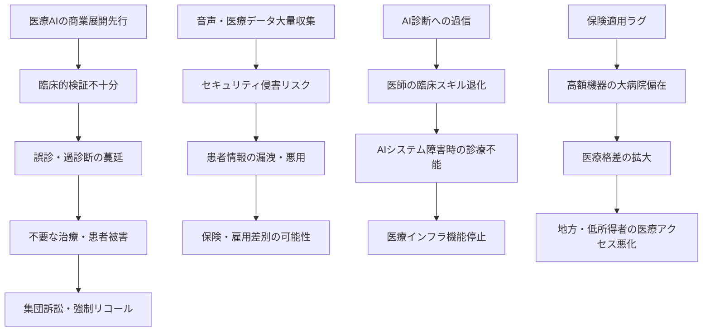

# Critic視点 分析
分析日時: 2026-04-30 21:37

## ⚠️ 日本のスタートアップ・資金調達

### バブルリスクと構造的問題の辛口分析

<mark>「Q1調達総額が過去最高」という見出しは、投資家センチメントが高揚している局面特有の危険な楽観シグナルである。バブルはいつも「史上最高」の時期に崩壊する。</mark>

#### ❌ 楽観論への反論

- **資金集中の真の意味**: 75.5億円のうちブレイブグループ80億円が単独で超過するという矛盾（週間合計より1社の調達額が大きい）は、数字の読み方に要注意を示している。実態は「数十の弱小企業＋数件の超大型案件」という二極化であり、スタートアップ全体の健全性とは無関係である
- **ブレイブグループ80億円の実態**: Vチューバー事業への80億円調達は、エンタメバブルの典型である。VTuber市場は既に成熟・飽和局面に入りつつあり、ピーク需要を前提とした過剰評価でバリュエーションが吊り上げられているリスクが高い
- **ディープテック・グリーンテックの誇大宣伝**: 「台頭が目立つ」とされるが、技術的検証が不十分なまま「ディープテック」を標榜する企業が急増しており、5年後の生存率は低い。BALLASの詳細非公開という事実は、技術的成熟度への疑問符を残す
- **Q1最高調達額の本当の背景**: 2025〜2026年の日本スタートアップ資金調達の急増は、国内金利の急上昇リスクから逃げたVC資金の行き場探しに過ぎない可能性がある。構造的な産業転換ではなく、余剰資金の一時的流入という診断も成り立つ

| リスク要因 | 楽観的解釈 | 批判的評価 | 深刻度 |
|-----------|-----------|----------|--------|
| Q1最高調達額 | 市場成熟・信頼性の証 | バブル最終局面の典型シグナル | **高** |
| 資金の上位集中 | 選別眼の高度化 | 弱者切り捨て・多様性消滅 | **高** |
| ヘルスケア人気 | 社会課題解決への資本 | 規制対応コスト未算入の過大評価 | **中** |
| ディープテック台頭 | 技術立国への回帰 | 技術的実績なき「看板」多数 | **高** |

---

## ⚠️ 規制・政策動向

### 規制の実効性・抜け穴・実装上の問題を辛口分析

<mark>「日本はソフトロー、EUはハードロー」という対比は聞こえがよいが、実態は「日本は規制が実質的に存在しない」と同義である。市民が被害を受けた際に救済手段がないことへの認識が決定的に欠けている。</mark>

#### ❌ 日本AI基本法への批判

- **「ソフトロー」の正体**: 自主規制は、利益相反関係にある当事者（AI企業）が自ら設計する規制であり、監視と規制が同一主体によって行われる構造的欠陥を内包する。日本の「AI戦略本部」は実効的な制裁権限を持たない諮問機関に過ぎず、違反企業への実効的抑止力を持たない
- **「イノベーション優先」の欺瞞**: イノベーション促進を名目に規制を緩くすることで、AI被害（差別的アルゴリズム・雇用差別・プライバシー侵害）の被害者が泣き寝入りを強いられる構造が温存される。特に社会的弱者（高齢者・障害者・低所得層）が最初の被害者となるリスクが高い
- **「ソフトローで国際競争力」という幻想**: 日本企業がEU市場に展開する際にはEU AI法に全面準拠が必要であり、国内のソフトロー環境での「ぬるい」開発体制が後付けで高コストな改修を要求される。これはイノベーション促進ではなく、技術的負債の先送りである

#### ❌ EU AI法への批判

- **施行から規制運用まで数年のラグ**: 2026年8月に全章適用といっても、実際の執行機関（各国AI当局）の体制整備・執行能力の確立には数年を要する。「施行済み」は「執行済み」ではなく、当面は規制の抜け穴が多数存在する
- **「売上高7%制裁」の実効性**: 大手テック企業（Google・Microsoft・OpenAI）にとって売上高7%は「事業継続可能な罰金」に過ぎない。GDPR施行後も大手プラットフォームは制裁を織り込み済みのコストとして違反を継続した事実を忘れてはならない
- **「AI Literacy義務化」の空洞化リスク**: 義務化されたリテラシー研修の内容が企業の自己申告に委ねられた場合、形式的な研修修了証発行で義務回避が横行する。EUの機能的なAIリテラシー評価体制が整備されない限り、有名無実化は避けられない

| 規制手段 | 建前 | 実態・抜け穴 | 市民への影響 |
|---------|------|------------|-------------|
| 日本AI基本法 | AI安全・信頼の確保 | 制裁権限なし・企業自主規制 | 被害時の救済手段なし |
| EU AI法 4段階分類 | リスク比例規制 | 執行体制未整備・抜け穴大量存在 | 数年は実質無防備 |
| EU 売上高7%制裁 | 大企業への抑止力 | 事業継続可能な「許容コスト」 | 大企業の行動変容なし |
| AI Literacy義務化 | 社会的AIリテラシー向上 | 形式研修の横行 | 実質的スキル向上なし |

---

## ⚠️ ヘルスケアテック

### 倫理リスク・プライバシー問題・誇大広告を辛口に分析

<mark>「医療AIが実用フェーズへ」という楽観的な言説の裏で、患者の命に直結するリスクが十分に議論されないまま商業展開が先行している。これは医療倫理の観点から許容できない状況である。</mark>

#### ❌ 「市場規模急成長」予測への根本的批判

- **393.4億ドル市場規模の前提条件**: グローバル医療AI市場の「急成長」は、保険償還制度がAI医療機器に対応している先進国市場を前提とした試算である。日本では診療報酬体系が医療AIの広範な保険適用に追いついておらず、実際の病院導入数は市場規模予測の10分の1以下になる現実的なシナリオが存在する
- **年率21.7%成長の持続可能性への疑問**: CAGRは直線的成長を前提とした数字の魔術である。医療AI普及の最大障壁（薬事承認取得・保険適用・医師へのトレーニング・患者の同意取得・IT基盤整備）は複合的に絡み合っており、これらを考慮すれば予測値は楽観的すぎる

#### ❌ CogniTalk（音声AI認知機能評価）への批判

- **「30秒スクリーニング」の臨床的根拠の脆弱性**: 従来の認知症診断は神経心理学的評価・画像診断・血液検査の組み合わせで行われるが、30秒の音声のみでの認知機能「可視化」の感度・特異度が独立した臨床試験で十分に検証されているかは不明確である。商業展開先行の医療ツールが患者に「見せかけの安心」を与え、本来必要な精密検査の受診機会を逃させるリスクがある
- **個人音声データの長期蓄積リスク**: 認知機能評価のためには継続的な音声データの蓄積が必要だが、これは最も機微な個人情報の一つである。音声データから年齢・感情状態・精神疾患の有無・社会経済的背景が推測可能であり、保険会社・雇用者・金融機関への二次利用（差別的判断）の温床となりうる
- **「早期発見＝早期介入」という誤った前提**: 認知症においても「早期発見」が常に患者の利益になるとは限らない。有効な治療法が限定的な状況での早期診断は、患者・家族の心理的負担を増大させるのみの可能性がある。CogniTalkが生み出す「早期発見市場」は、治療エコシステムが整備されない限り医療不安ビジネスに留まる

| 医療AIリスク | 楽観的業界説明 | 批判的評価 | 被害想定 |
|-------------|--------------|----------|---------|
| 臨床検証不十分 | 「革新的技術の迅速普及」 | 患者実験の商業化 | 誤診による治療遅延・死亡 |
| 音声データ収集 | 「匿名化で安全」 | 再識別技術で個人特定可能 | 保険差別・雇用差別 |
| 診断精度の過信 | 「AIが医師を支援」 | 医師のスキル劣化加速 | 医療クライシス時の対応不能 |
| 市場規模予測 | 「2030年18.7億ドル」 | 保険適用・規制ラグを未考慮 | 投資家への誤情報提供 |
| 大病院優先導入 | 「技術普及の第一段階」 | 地方・中小クリニック永続的排除 | 地域医療格差の固定化 |

#### ❌ フィリップス「Verida」・GEヘルスケアへの批判

- **「世界初」の販売タイミング**: 規制当局審査が完了したばかりの機器を「即座に国内発売」するスピードは、製品の長期的安全性データの蓄積が不十分なまま患者に使用されることを意味する。医療機器における「世界初」は革新の証明ではなく、臨床的リスクの先送りを購入病院・患者が引き受けることを意味する
- **高額医療機器のコスト転嫁**: AI搭載スペクトラルCTの導入コストは数億円規模となり、病院経営に対する財務的プレッシャーが検査の過剰利用（医療費増大）へのインセンティブを生む。「AIが便利だから検査しよう」という診療パターンが、不必要な被ばく・医療費膨張につながるリスクがある

---

## 💡 Critic総括

**今週のトレンドに共通する構造的問題**: 成長数字・技術革新・市場拡大という「良い話」が先行する一方、被害者保護・倫理的データ利用・規制の実効性という「不都合な現実」が組織的に過小評価されている。<mark>楽観的な成長ストーリーに乗る前に、「誰が損をするのか」という問いを常に立てることが、真に持続可能な技術社会の構築に不可欠である。</mark>
