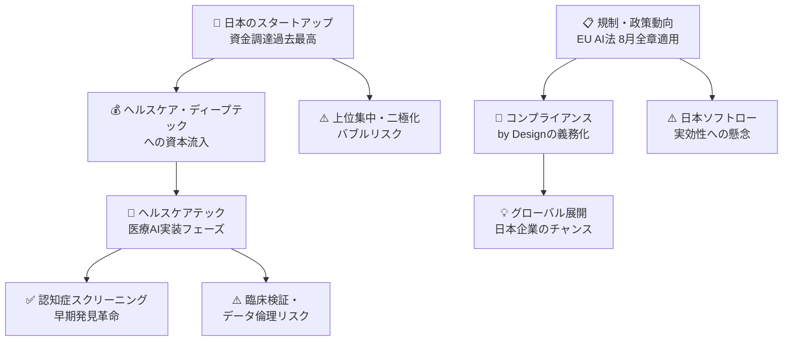
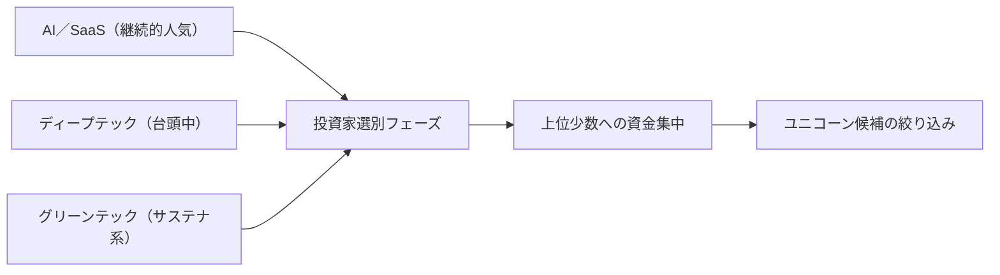
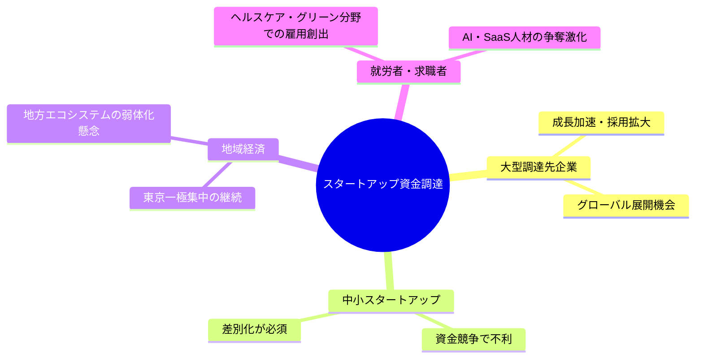
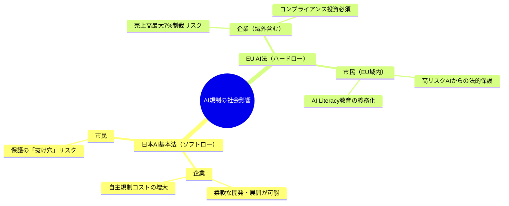
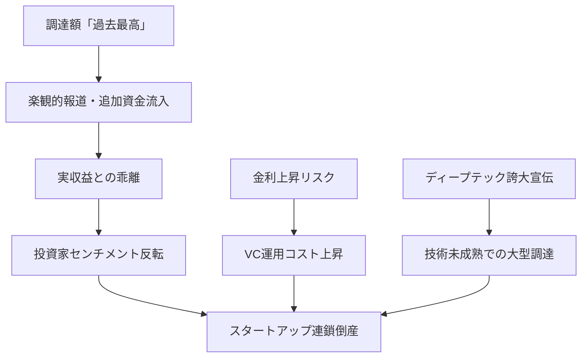
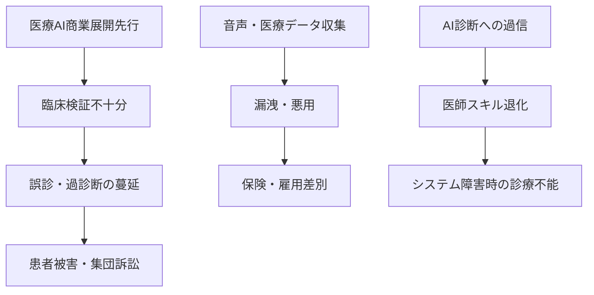

# 📊 トレンド日報 2026-04-30

## 📋 エグゼクティブ・サマリー
> **本日の重要トピック**: 日本のスタートアップ・資金調達、規制・政策動向、ヘルスケアテック

日本のスタートアップ市場はQ1調達総額が過去最高を記録し、4月20〜24日だけで21件・**75.5億円**が調達された。一方、資金は上位少数の大型案件に集中しており、選別と集中の二極化が鮮明となっている。規制面では**EU AI法が2026年8月に全章適用開始**を迎え、日本企業にも域外適用による対応が急務。ヘルスケアテックでは、フィリップスの世界初AI搭載スペクトラルCT「Verida」国内発売やエクサウィザーズの音声AI「CogniTalk」提供開始など、<mark>医療AIがいよいよ「実証」から「実装」フェーズへ本格移行した転換点となる週であった。</mark>

---

## 🗺️ トピック関係図

---

## 🔬 Tech視点

### 🚀 日本のスタートアップ・資金調達

**AI/SaaS領域が安定的人気**を保ちながら、ディープテック・グリーンテックへの資本シフトが2026年最大の変化点となっている。

| 企業名 | 調達額 | 技術領域 | 技術的特徴 |
|--------|--------|----------|-----------|
| ブレイブグループ | **80億円** | エンタメテック | VTuber・ライブ配信プラットフォーム |
| ミツモア | **30億円** | SaaS／マッチング | BtoB受発注DX、AI自動マッチング |
| BALLAS | **24億円** | ディープテック | 深技術系（詳細非公開） |

### 📊 規制・政策動向

EU AI法リスク分類と企業への技術的対応要件が明確化された。

| リスク分類 | 対象例 | 違反制裁上限 |
|-----------|--------|------------|
| 許容不可（禁止） | 社会スコアリングAI | 禁止 |
| 高リスク | 医療診断AI・採用選考AI | **売上高7%** |
| 限定リスク | チャットボット | 売上高3% |
| 最小リスク | スパムフィルタ | なし |

<mark>日本のソフトロー路線は「Compliance by Design」の観点で技術的負債を先送りしており、グローバル展開時に高コストな後付け改修を強いられるリスクが高い。</mark>

### 🏥 ヘルスケアテック（Tech詳細）

フィリップス「Verida」は**世界初のAI搭載マルチエナジースペクトラルCT**として、撮影から再構成まで深層学習モデルをリアルタイム統合。エクサウィザーズ「CogniTalk」は30秒音声から音響・語彙・時間・構造の4軸特徴量を抽出し認知機能を定量化する革新的デジタルバイオマーカー技術である。

| 技術要素 | 従来CT | Verida | 臨床的意義 |
|---------|--------|--------|-----------|
| X線エネルギー | 単一 | **複数帯域同時** | 組織識別精度向上 |
| AI処理 | 後処理のみ | **リアルタイム統合** | スループット向上 |
| 病変検出 | 目視中心 | **AI自動フラグ** | 見落とし低減 |

**日本の医療AI市場CAGR 21.7%（2030年：18.7億ドル目標）**は、高齢化社会の深刻度と医師不足が技術採用を強力に後押しする構造を反映している。

---

## 🌍 Human視点

### 💰 日本のスタートアップ・資金調達

<mark>資金の偏在構造が固定化されることで、小規模・地方スタートアップの参入障壁がさらに高まるリスクがある。ヘルスケア・ディープテック・サステナビリティへの資本流入は、日本社会の長期課題に対して民間主導の解決策を加速させる一方で、「勝者総取り」構造によるイノベーションの多様性喪失が懸念される。</mark>

### 🌍 規制・政策動向

日本のソフトロー路線は短期的に企業自由度を高めるが、EU基準に準拠できない日本企業が欧州市場から排除される「規制デジタル鎖国」を招く懸念がある。

### 🏥 ヘルスケアテック（Human詳細）

<mark>エクサウィザーズのCogniTalkが実現する「30秒会話による認知機能可視化」は、日本における認知症早期発見のボトルネックを根本から変えうる、社会インフラレベルの変革である。</mark>

現在、認知症患者数は**約600万人**（2025年推計）に達し、2040年には900万人超が見込まれる。AIが医療アクセス格差を縮小する可能性は大きいが、大病院・都市部先行による「医療AIデジタルデバイド」と、AI判断への過信による医師臨床スキルの退化リスクが制度的課題として残る。

| 技術・製品 | 主要受益者 | 社会的インパクト | 懸念点 |
|-----------|-----------|----------------|--------|
| Verida（スペクトラルCT） | 患者・放射線科医 | **がん・心疾患の早期発見率向上** | 高額機器・大病院偏在 |
| CogniTalk（音声AI） | 高齢者・介護者・医師 | **認知症30秒スクリーニング** | 誤診・過信リスク |
| AIエージェント（電子カルテ） | 医師・看護師・患者 | 医師の労働負担軽減 | データセキュリティ・責任所在 |

---

## ⚠️ Critic視点

### 🔍 日本のスタートアップ・資金調達

「Q1調達総額が過去最高」という見出しは、投資家センチメントが高揚している局面特有の**危険な楽観シグナル**である。バブルはいつも「史上最高」の時期に崩壊する。

<mark>「選別と集中」は健全化ではなく、弱者切り捨て・多様性消滅の婉曲表現である。ブレイブグループへの80億円はVTuber市場の成熟・飽和局面での過剰評価リスクが高い。</mark>

### 🔍 規制・政策動向

「日本はソフトロー」の実態は「実質的な規制が存在しない」と同義であり、市民が被害を受けた際の救済手段の欠如が最大の問題点である。EU AI法の「売上高7%制裁」も大手テック企業にとっては**事業継続可能な許容コスト**に過ぎず、GDPR施行後の違反継続という前例がある。

| 規制手段 | 建前 | 実態・抜け穴 |
|---------|------|------------|
| 日本AI基本法 | AI安全の確保 | 制裁権限なし・企業自主規制 |
| EU AI法制裁 | 大企業への抑止力 | 事業継続可能な「許容コスト」 |
| AI Literacy義務化 | 社会的スキル向上 | 形式研修の横行で空洞化 |

### 🔍 ヘルスケアテック

<mark>医療AIの商業展開先行により、臨床的検証が不十分なまま患者に使用されるリスクが組織的に過小評価されている。これは医療倫理の観点から許容できない状況である。</mark>

音声データ（認知機能評価）の長期蓄積は再識別可能な最も機微な個人情報であり、保険・雇用差別への二次利用が現実的リスクとして存在する。

---

## 💡 総合所感・アクション提言

**今週のトレンドを貫くキーワードは「実装と責任の非対称性」**である。テクノロジーが「実用フェーズ」へと急速に移行する一方、制度・倫理・安全性の枠組み整備は明らかに遅れている。

1. **スタートアップへの投資家・起業家へ**: Q1過去最高という数字に乗じた過剰なバリュエーション設定を避け、ユニットエコノミクスと実収益に基づく評価を徹底すること。特にヘルスケア・ディープテック領域は規制対応コストを初期から事業計画に組み込むべきである

2. **日本企業のグローバル展開担当者へ**: EU AI法の2026年8月全章適用まで数ヶ月しかない。高リスク分類に該当するAIシステム（医療診断・採用選考等）のコンプライアンス評価を今すぐ着手すること。後付け対応は技術的・財務的負債を生む

3. **ヘルスケア事業者・病院管理者へ**: 医療AI導入の意思決定において「市場成長予測」より「臨床試験データと薬事承認状況」を最優先指標とすること。音声・医療データの二次利用防止規約の整備と患者への明確な同意プロセスが、中長期的な信頼構築の基盤となる

Sources:
- [4月20〜24日 スタートアップ資金調達まとめ読み](https://www.nikkei.com/article/DGXZQOUC23AJ70T20C26A4000000/)
- [スタートアップの1〜3月期、資金調達は過去最高も上位勢に集中](https://www.nikkei.com/article/DGXZQOUC211X60R20C26A4000000/)
- [AIのグローバル規制・政策動向：2025年の動きと2026年への示唆](https://arakiplaw.com/insight/2658/)
- [2026年8月にEU AI法施行開始！日本企業が今すぐ始めるべきAIガバナンス対策](https://smart-generative-chat.com/2026/01/27/eu-ai-act-2026-ai-governance-japan/)
- [医療機器関連ニュース（2026年4月18日〜4月24日）](https://blog.rso.or.jp/%E5%8C%BB%E7%99%82%E6%A9%9F%E5%99%A8%E9%96%A2%E9%80%A3%E3%83%8B%E3%83%A5%E3%83%BC%E3%82%B9%EF%BC%882026%E5%B9%B44%E6%9C%8818%E6%97%A5%E3%80%9C2026%E5%B9%B44%E6%9C%8824%E6%97%A5%EF%BC%89/)
- [2026年、医療AIは実用フェーズへ｜市場規模と主要トレンドを整理](https://smart-generative-chat.com/2026/01/30/healthcare-ai-implementation-2026/)
- [医療×AIエージェント完全ガイド2026](https://www.ailead.app/blog/ai-agent-healthcare-medical-guide-2026)
