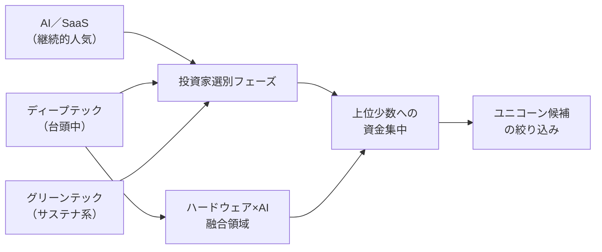
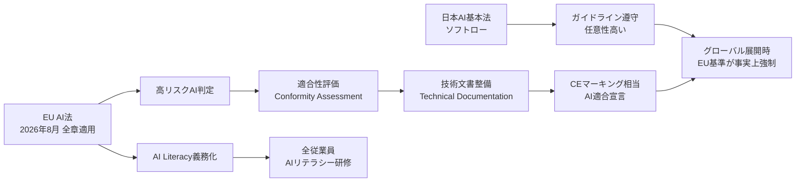
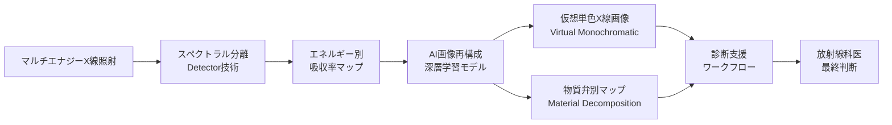
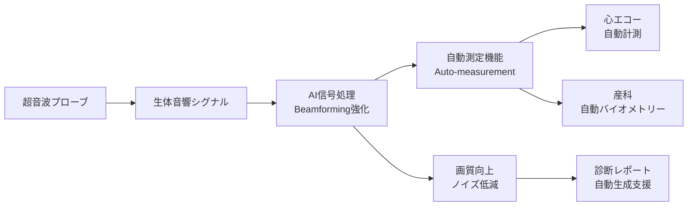
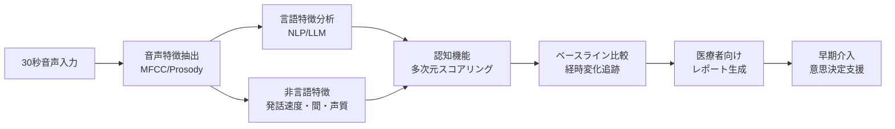
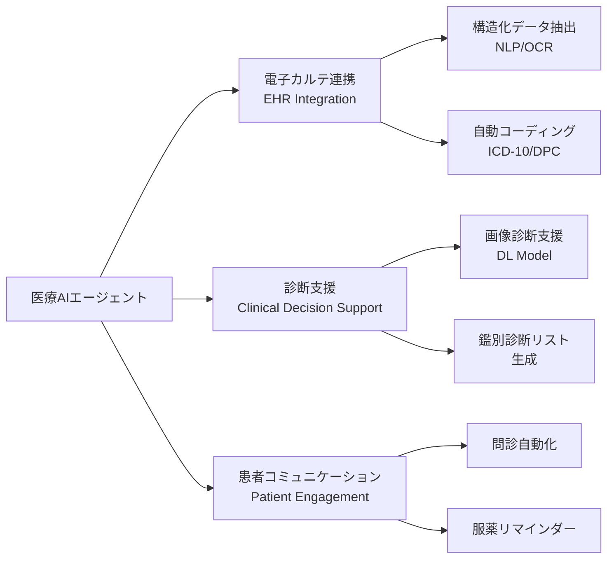

# Tech視点 分析
分析日時: 2026-04-30 21:37

## 🚀 日本のスタートアップ・資金調達

### 技術スタックと資金集中の傾向分析

4月20〜24日の1週間で **21件・計75.5億円** が調達された。Q1調達総額は過去最高を記録し、技術領域における投資家の選別眼が鋭くなっている。

<mark>AI・SaaSは引き続き安定した投資対象であるが、ディープテック・グリーンテックへの資金シフトが2026年の最大の変化点となっている。</mark>

#### 主要調達案件と技術領域

| 企業名 | 調達額 | 技術領域 | 技術的特徴 |
|--------|--------|----------|-----------|
| ブレイブグループ | **80億円** | エンタメテック | VTuber・ライブ配信プラットフォーム |
| ミツモア | **30億円** | SaaS／マッチング | BtoB受発注DX、AI自動マッチング |
| BALLAS | **24億円** | ディープテック | 詳細非公開、深技術系 |
| その他18件 | 計41.5億円 | ヘルスケア・サステナ等 | 多様な垂直SaaS |

#### 技術トレンドの構造的分析

- **技術的観点での注目点**: 資金の偏在は「勝者総取り」構造を示唆。AI/SaaSの成熟により、差別化のためにディープテック（バイオ、素材、量子、宇宙など）への資本が流入している
- **エンジニアリング視点**: グリーンテック系はハードウェア×ソフトウェアのスタック複雑性が高く、参入障壁が高い分、一度確立されると競合が困難
- **選別と集中の意味**: Q1最高調達額にもかかわらず件数ベースで大型案件への偏重が顕著であり、シード・アーリーステージへの資金は相対的に縮小傾向

---

## 📊 規制・政策動向

### AI法制度の技術実装・コンプライアンス観点

<mark>日本AI基本法（ソフトロー）とEU AI法（ハードロー）の並存は、グローバル展開する日本企業に対して二重のコンプライアンス対応を強制する構造的課題である。</mark>

#### EU AI法リスク分類と技術対応要件

| リスク分類 | 対象例 | 技術的対応要件 | 違反制裁 |
|-----------|--------|--------------|---------|
| 許容不可（禁止） | 社会スコアリング、潜在意識操作AI | 当該システムの廃止・改修 | 最大**売上高7%** |
| 高リスク | 医療診断AI、採用選考AI、重要インフラ | 適合性評価、ログ記録、人間監督 | 最大**売上高3%** |
| 限定リスク | チャットボット、ディープフェイク生成 | 透明性確保・開示義務 | 最大**売上高1.5%** |
| 最小リスク | スパムフィルタ、AIゲーム | 自主的な行動規範 | 制裁なし |

#### 技術アーキテクチャへの影響フロー

- **実装コストの現実**: 高リスクAIシステムには、ログ記録・バイアス評価・人間監督インターフェース・ロバスト性テストが追加実装コストとして発生
- **域外適用の技術的意味**: 日本国内のシステムでもEU市場向けデータ処理や出力提供があれば規制対象となり、API設計段階からコンプライアンスを組み込む「Compliance by Design」が必要
- **日本ソフトロー戦略のリスク**: 国際競争力維持の観点では柔軟性があるが、EU市場参入時に後付け対応となり、技術的負債を生む可能性

---

## 🏥 ヘルスケアテック

### 医療AI・デジタルヘルス技術の詳細分析

ヘルスケアテックは現在、**AIの医療機器への本格組み込み**フェーズに突入している。単なるデータ分析ツールから、診断・治療意思決定支援の中核を担うシステムへと進化している。

<mark>グローバル医療AI市場は2025年時点で393.4億ドルに達しており、日本市場は年率21.7%という急速な成長軌道にある。2030年の18.7億ドル到達予測は保守的である可能性も高い。</mark>

---

### 🔬 フィリップス「Verida」— 世界初AI搭載マルチエナジースペクトラルCT

#### 技術的革新の詳細

フィリップスが2026年4月22日に国内発売した「Verida」は、CTスキャナーにおける技術的ブレークスルーである。

**マルチエナジースペクトラルCTの技術原理**:
- 従来CTは単一エネルギーのX線で組織を撮影するが、スペクトラルCTは複数エネルギー帯のX線を同時照射
- 組織・物質ごとのエネルギー吸収特性の差異を利用し、造影剤なしで組織を区別可能
- **AI統合**: ノイズ除去・画像再構成・病変自動検出をリアルタイム実行

| 技術要素 | 従来CT | Verida（スペクトラルCT） | 臨床的意義 |
|---------|--------|------------------------|-----------|
| X線エネルギー | 単一（平均的） | **複数帯域同時** | 組織識別精度向上 |
| 造影剤依存 | 高（腎臓負担） | 一部不要 | 腎機能低下患者に対応 |
| AI処理 | 後処理のみ | **リアルタイム統合** | スループット向上 |
| 画像再構成 | FBP/IR法 | **深層学習再構成** | 低線量でも高画質 |
| 病変検出 | 目視中心 | **AI自動フラグ** | 見落とし低減 |

---

### 🔬 GEヘルスケア 超音波装置AI新版

GEヘルスケアが販売開始した超音波装置の新版では、AIによる自動計測・画質最適化・検査ガイダンス機能が統合されている。

| 機能 | 技術詳細 | 臨床応用 |
|------|---------|---------|
| AI自動計測 | 深層学習による臓器境界認識 | 心臓・胎児径の自動測定 |
| 画質最適化 | リアルタイムビームフォーミングAI | 術者技量依存の低減 |
| ガイダンス機能 | 3Dポーズ推定+音響窓最適化 | 非熟練者の検査精度向上 |

---

### 🧠 エクサウィザーズ「CogniTalk」— 音声AIによる認知機能可視化

#### 30秒会話AIの技術分析

**CogniTalk** は、わずか30秒の会話音声から認知機能の変化を定量化するシステムである。これはデジタルバイオマーカーの実用化として特に注目すべき技術的事例である。

| 分析軸 | 抽出特徴量 | 認知機能との関連 |
|--------|----------|----------------|
| 音響特徴 | 基本周波数・声質・韻律 | 発話制御能力・前頭葉機能 |
| 語彙特徴 | 語彙多様性・具体性・一貫性 | 意味記憶・言語流暢性 |
| 時間特徴 | **発話速度・沈黙時間** | 情報処理速度・記憶検索 |
| 構造特徴 | 文章の論理的一貫性 | 実行機能・ワーキングメモリ |

**技術的課題と展望**:
- **精度の臨床的妥当性**: 30秒という極めて短い入力でのスコアリングは、従来の神経心理検査（30〜90分）と比較して感度・特異度の継続的な検証が必要
- **多言語・方言対応**: 日本語の方言・話速の個人差が特徴量抽出に与える影響をどう制御するかが技術的課題
- **縦断データの蓄積**: 認知症の早期発見には単点スコアより経時変化の追跡が重要であり、プライバシー保護との両立が求められる

---

### 💰 AIエージェントの医療DX展開

医療現場へのAIエージェント実装は3つの主要領域で進行中：

| 展開領域 | 技術スタック | 実装上の課題 |
|---------|------------|------------|
| 電子カルテ連携 | NLP・HL7 FHIR・OCR | レガシーシステムとの相互運用性 |
| 診断支援 | CNN・Vision Transformer | **薬事承認（PMDA）の取得** |
| 患者コミュニケーション | LLM・RAG・音声合成 | 医療情報の正確性保証 |

**📊 市場規模と成長予測**:

| 地域 | 2025年市場規模 | 2030年予測 | CAGR |
|------|-------------|-----------|------|
| グローバル | **393.4億ドル** | 約1,000億ドル超 | 約20%以上 |
| 日本 | 約9億ドル（推計） | **18.7億ドル** | **21.7%** |

<mark>日本の医療AI市場は2030年に向けてグローバル平均を上回るCAGRで成長する見込みであり、高齢化社会の深刻度と医療従事者不足が技術採用を強力に後押ししている。</mark>

---

## 💡 Tech視点 総合所感

1. **資金調達**: ディープテック・グリーンテックへの資本シフトは、AI/SaaSの成熟化を示す構造変化。エンジニアはハードウェア×ソフトウェアのフルスタック能力が差別化要因になる
2. **規制対応**: EU AI法の「Compliance by Design」実装が急務。特に医療AIは高リスク分類に該当し、PMDA承認×EU CE適合の二重認証が必要になるケースが増える
3. **ヘルスケアテック**: スペクトラルCT・音声認知AI・AIエージェントの三方向で医療現場のデジタル化が加速。**日本市場のCAGR 21.7%** は投資・開発双方において最優先注目領域である
