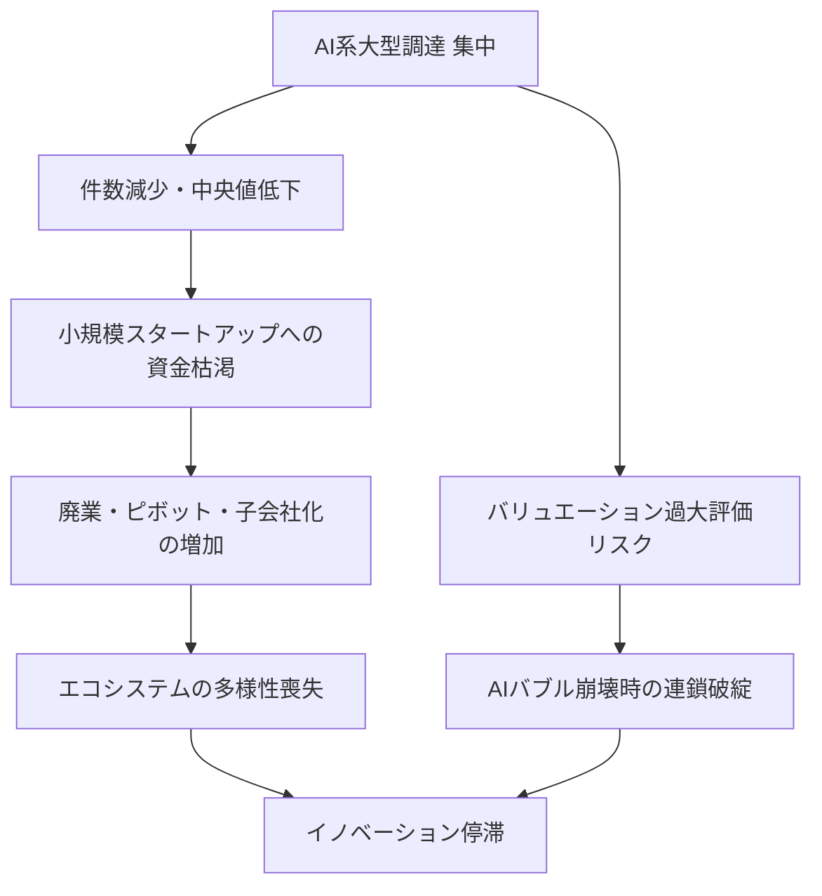
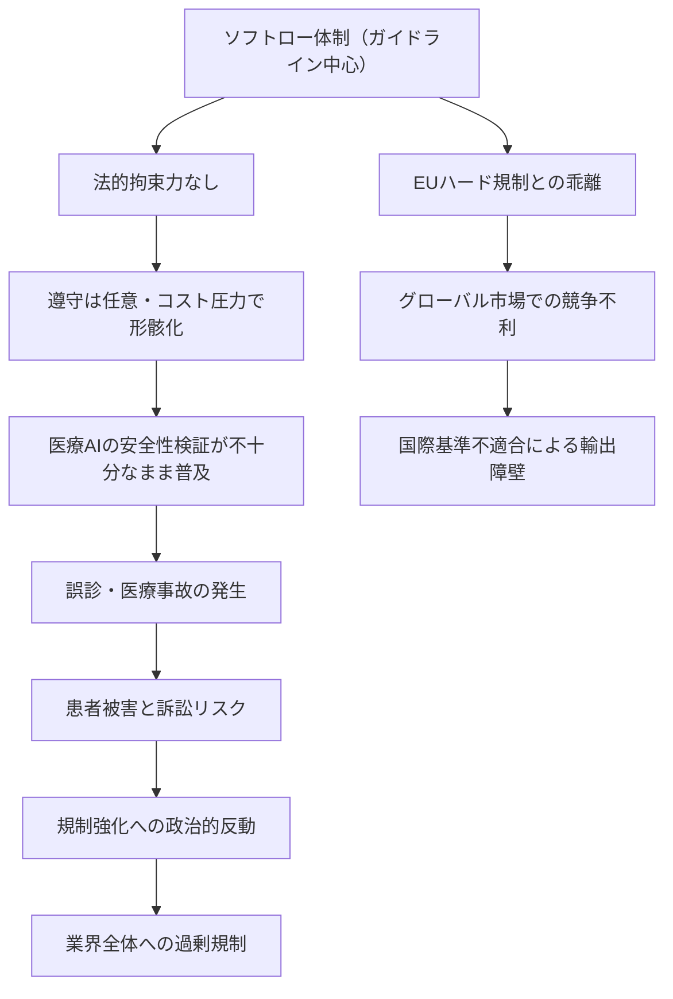
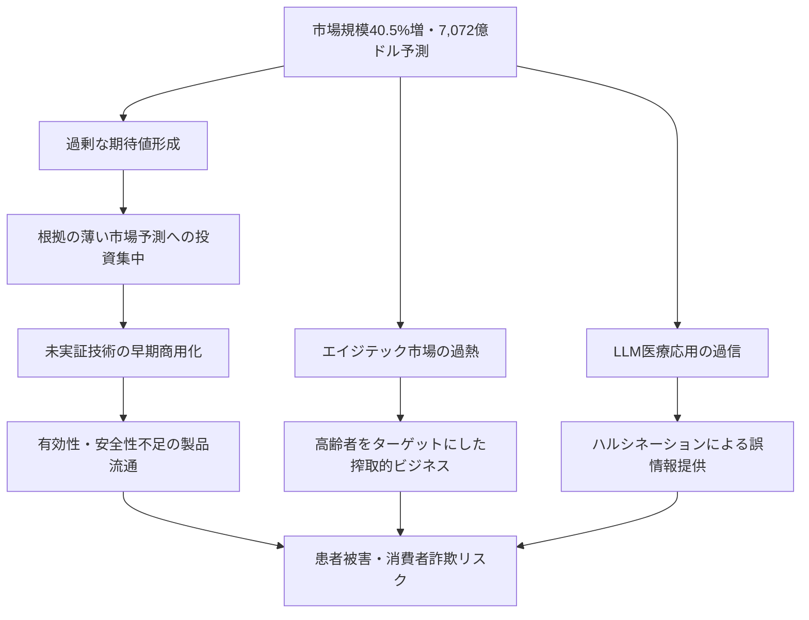

# Critic視点 分析
分析日時: 2026-05-01 10:00

---

## 📋 エグゼクティブ・サマリー（辛口版）

**楽観論の罠に注意せよ。** 今回の3トピックはいずれも「成長・改革・革新」という美辞麗句で飾られているが、その実態は「勝者総取りの格差拡大」「抜け穴だらけのソフトロー」「数字の一人歩きによる過剰期待」の三点セットである。表面の数字に踊らされることなく、構造的な問題を直視する必要がある。

---

## 🏚️ 日本のスタートアップ・資金調達

### ⚠️ 「過去最高」の欺瞞：数字の裏に潜む格差構造

「調達総額が過去最高」というヘッドラインは、エコシステム全体の健全性を示すものでは**まったくない**。件数が減少しながら総額が増えるということは、ごく少数の大型案件が統計を歪めているに過ぎない。これは祭りではなく、**富の極端な集中**の証拠である。

#### リスク連鎖図

#### リスクマトリクス

| リスク項目 | 発生確率 | 影響度 | 総合危険度 | 評価 |
|---|---|---|---|---|
| AI特化バブルの崩壊 | 高 | 極大 | ⛔ 最高 | 楽観論が最も危険 |
| 小規模ST資金枯渇による廃業増 | 高 | 大 | ❌ 高 | すでに進行中 |
| 被買収・子会社化による独立性喪失 | 高 | 中 | ❌ 高 | 167件は警戒水準 |
| 防衛・宇宙への偏重による民生技術軽視 | 中 | 大 | 🔍 要注目 | 政策誘導の歪み |
| 海外VCへの依存と技術流出 | 中 | 大 | 🔍 要注目 | 長期リスク |

#### 辛口分析ポイント

- **「過去最高」は幻想だ**：中央値が低下しているという事実は、大多数のスタートアップが苦境にあることを意味する。一部AI企業の大型調達が平均を引き上げているだけであり、エコシステム全体の底上げとは無縁の話である。

- <mark>被買収・子会社化167件という数字は、スタートアップ「生態系」の縮小を示す不吉なシグナルである。成功の証ではなく、独立系プレイヤーが市場から退場させられていることの記録だ。</mark>

- **防衛・宇宙ディープテックへの投資集中**は、政府の政策誘導と補助金依存の産物に過ぎない。民間主導の真のイノベーションとは呼べず、政策変更一つで崩壊するリスクを内包している。

- **「選別が進む」という美化**：投資家が慎重になったことを「成熟」と呼ぶのは都合が良すぎる。実態はリスク回避による新規投資の萎縮であり、多様なアイデアへの資金が絶たれている。

---

## 📜 規制・政策動向

### ⚠️ ソフトローという名の「やらない善」

日本の規制アプローチを「柔軟」「現実的」と評価する声があるが、それは規制する側の怠慢を正当化する論理である。ソフトローは企業に守る義務を課さない。事故が起きてから「ガイドラインに沿っていなかった」と言うだけでは、被害を受けた患者は救われない。

#### リスク連鎖図

#### リスクマトリクス

| リスク項目 | 発生確率 | 影響度 | 総合危険度 | 評価 |
|---|---|---|---|---|
| 医療AIによる誤診・事故（ソフトロー下） | 中〜高 | 極大 | ⛔ 最高 | 人命に直結 |
| 診療報酬加算の利益誘導による過剰AI導入 | 高 | 大 | ❌ 高 | 医療倫理の崩壊 |
| EU AI Actとの規制格差による輸出障壁 | 高 | 大 | ❌ 高 | 産業政策の失敗 |
| 「3省2ガイドライン」の縦割り矛盾 | 高 | 中 | 🔍 要注目 | 行政の機能不全 |
| 安全性未検証AIの医療現場導入 | 中 | 極大 | ⛔ 最高 | 即時対応が必要 |

#### 辛口分析ポイント

- **ソフトローは事故が起きてから役に立たない**：IPAの「評価観点ガイド」が公表されたことを「具体化が進む」と称賛するのは早計だ。ガイドラインに法的拘束力がない限り、コスト削減を優先する企業が安全性評価を省略しても誰も止められない。

- <mark>「3省2ガイドライン」という縦割り体制そのものがリスクである。省庁間の解釈の齟齬が生じた場合、どのガイドラインが優先されるのか明確でなく、医療現場が混乱するシナリオは容易に想像できる。</mark>

- **診療報酬加算の罠**：AI活用に診療報酬加算を設けることは、「AIを使えば儲かる」というインセンティブを医療機関に与える。これは安全性・有効性の検証より先に普及を促進する本末転倒な政策であり、医療倫理上の重大問題である。

- **EU比較の欺瞞**：「EUのハード規制より柔軟」という主張は、規制が緩い＝イノベーションが起きやすいという神話に基づく。しかしEU AI Actに準拠しない医療AIは欧州市場に輸出できない。日本独自路線は国内市場への閉じ込めを意味する可能性が高い。

---

## 🏥 ヘルスケアテック

### ⚠️ 数字の魔術：「40.5%増」と「7,072億ドル」という幻想

市場規模の成長数字は、それが実態の価値創造を反映しているかどうかを問わない。ヘルスケアテックの「成長」が、本当に患者の健康改善に貢献しているのか、それとも医療費の高騰と不必要な機器・サービスの乱立を意味するのか、冷静に問い直す必要がある。

#### リスク連鎖図

#### リスクマトリクス

| リスク項目 | 発生確率 | 影響度 | 総合危険度 | 評価 |
|---|---|---|---|---|
| LLMハルシネーションによる医療誤情報 | 高 | 極大 | ⛔ 最高 | 即刻警戒を要する |
| 市場予測値の過大評価とバブル崩壊 | 高 | 大 | ❌ 高 | アナリスト的予測の過信 |
| 高齢者向けエイジテックの搾取的商法 | 中〜高 | 大 | ❌ 高 | 倫理的問題 |
| ウェアラブルデバイスの個人健康データ漏洩 | 中 | 大 | 🔍 要注目 | プライバシー侵害 |
| 「前年比2.5倍」作業者安全サービスの持続可能性 | 高 | 中 | 🔍 要注目 | 補助金依存の疑い |

#### 辛口分析ポイント

- **「前年比40.5%増」は何を意味するのか**：市場規模の急拡大は、実際の健康アウトカムの改善を示していない。むしろ、効果が実証されていない製品・サービスへの支出が膨らんでいる可能性を疑うべきだ。「市場が成長している＝社会に価値を提供している」という等式は成立しない。

- <mark>LLMとウェアラブルデバイスを「注目技術」として称賛する前に直視すべき事実がある：LLMは医療情報についてハルシネーション（幻覚）を起こし、誤った症状判断・投薬情報を「自信を持って」提供することがある。これは笑い話では済まない人命リスクである。</mark>

- **作業者安全管理サービスの「前年比2.5倍」は異常値だ**：このような急成長は補助金・助成金の集中投下か、あるいは一過性の特需によるものである可能性が高い。持続可能な需要に基づく成長と混同してはならない。

- **エイジテック市場の倫理問題**：「高齢者需要が牽引」という表現の裏には、情報弱者である高齢者を標的にした高額製品・サービスの乱売が潜んでいる。技術的に優れていても、意思決定能力が低下した高齢者への販売は搾取的ビジネスモデルと紙一重である。

- **グローバル市場予測「7,072億ドル」の信頼性**：市場調査会社の予測は自社レポートを売るためのマーケティングツールである側面が強い。過去のヘルスケアテック市場予測がいかに外れてきたかを振り返れば、この数字を鵜呑みにすることの危険性は明白だ。

---

## 💡 総合所感：楽観論に対する最終警告

| 楽観的言説 | Critic反論 |
|---|---|
| 「スタートアップ調達が過去最高」 | 件数減少・中央値低下の格差構造を隠蔽する数字 |
| 「ソフトローで柔軟な規制対応」 | 拘束力なしの空手形、事故後に誰も責任を取らない |
| 「ヘルスケアテック市場が急成長」 | 患者アウトカム改善の証拠なし、バブルの可能性大 |
| 「AIが医療を変革する」 | ハルシネーションと過信による医療事故リスクが先行 |
| 「診療報酬加算でAI普及促進」 | 安全性検証より普及を優先する本末転倒な政策 |

**最終警告**：今回のトピックに共通するのは「数字の成長」と「政策的推進」という外形的指標への過度な依拠である。真に問うべきは「誰が、どのようなリスクを、誰に転嫁しながら利益を得ているのか」という構造的問いである。楽観論に踊る前に、その問いに正直に答えることを強く求める。
