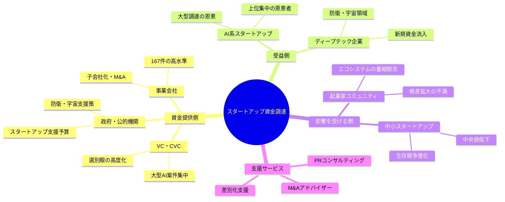
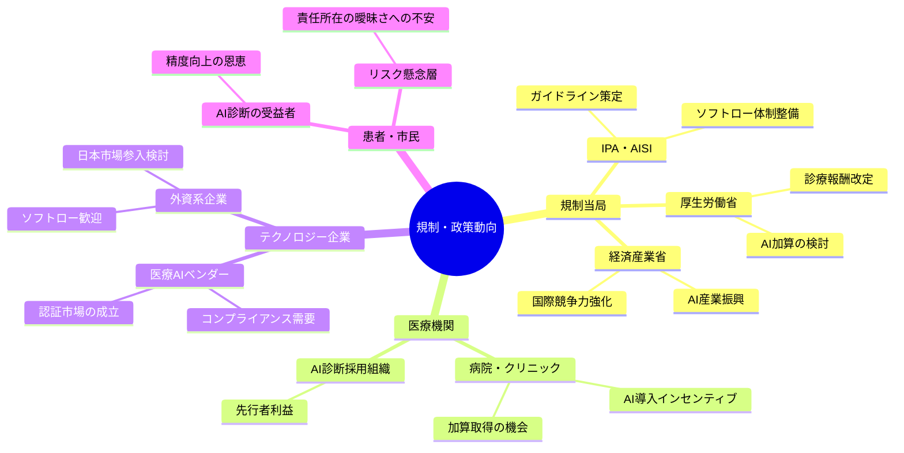
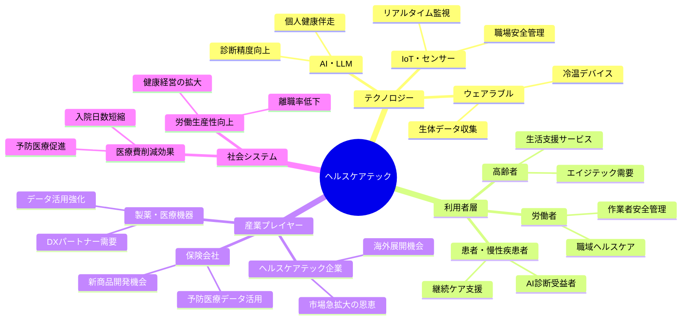
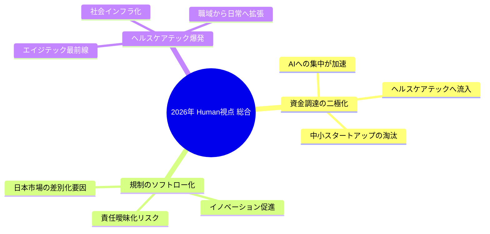

# Human視点 分析
分析日時: 2026-05-01 10:00

---

## 📋 エグゼクティブ・サマリー

- **日本のスタートアップ資金調達**は過去最高を更新しつつも、大型AI企業への集中・選別が深刻化。格差構造が固定化しつつある。
- **規制・政策動向**では、日本独自のソフトロー路線がヘルスケアAI普及の「追い風」となり得るが、責任の所在があいまいになるリスクも内包する。
- <mark>ヘルスケアテック市場は国内外で爆発的拡大局面に入っており、エイジテック・AI診断・ウェアラブルが社会インフラ化しようとしている。</mark>
- 3トピックは「資金→規制→市場」として連鎖しており、2026年は日本ヘルスケアDXの転換点となる可能性が高い。

---

## 🌍 日本のスタートアップ・資金調達

### 社会的インパクト

- **調達総額は過去最高**を記録したが、件数は減少。これはエコシステム全体の「厚み」ではなく「山高くして谷深し」の格差構造を意味する。
- 中央値の低下は、スタートアップの大多数が資金難に直面していることを示す。✅ 一部のAI系企業だけが恩恵を受け、❌ それ以外は生存競争が激化している。
- 防衛・宇宙ディープテック領域への関心拡大は、国家安全保障との民間協調という**新しい産業構造**への移行を示唆する。

### 💰 ビジネスチャンス

- 被買収・子会社化が167件と高水準：M&Aを通じた**「出口戦略の多様化」**がスタートアップにとって現実的選択肢となっている。
- 選別が進む環境では、「選ばれる企業」になるためのブランディング・PRコンサルや**差別化支援サービス**の需要が増す。
- ディープテック領域への政策的後押しを受け、**防衛・宇宙×スタートアップ**のハイブリッド事業モデルが台頭する可能性。

### ステークホルダーマップ

### 影響度マトリクス

| ステークホルダー | 影響の大きさ | 方向性 | 緊急度 | 備考 |
|---|---|---|---|---|
| AI系大手スタートアップ | ★★★★★ | ✅ ポジティブ | 高 | 資金集中の直接恩恵 |
| 中小スタートアップ | ★★★★☆ | ❌ ネガティブ | 高 | 選別圧力・中央値低下 |
| VC・投資家 | ★★★☆☆ | ✅ ポジティブ | 中 | 選別眼の向上で収益改善期待 |
| 防衛・宇宙企業 | ★★★★☆ | ✅ ポジティブ | 中 | 新資金流入の恩恵 |
| 起業家志望者 | ★★★☆☆ | ❌ ネガティブ | 中 | 参入障壁の心理的上昇 |
| M&Aアドバイザー | ★★★★☆ | ✅ ポジティブ | 高 | 167件の高水準が継続 |

---

## 📊 規制・政策動向

### 社会的インパクト

- IPAによるヘルスケア向けAI安全性評価ガイドの公表は、**日本型ソフトロー体制の具体化**という重要な一歩。
- <mark>日本は「3省2ガイドライン」によるリスクベースアプローチを採用しており、EUのような強制力を持つハード規制ではなく「事業者の自主性」に委ねる構造。これはイノベーション促進と引き換えに責任の所在を曖昧にするリスクを孕む。</mark>
- 2026年6月の診療報酬改定でAI活用への加算が本格化することで、**AIツールの採用が医療機関の経営インセンティブ**に直結するようになる。

### 💰 ビジネスチャンス

- ソフトロー体制下では、「ガイドラインに準拠した製品認証」や**コンプライアンス支援ビジネス**が新市場として成立する。
- 診療報酬加算の対象となるAI画像診断・ロボット手術分野は、**確実な収益モデルが見えた**状態になりつつある。
- 日本のソフトロー路線は、グローバル比較でEU参入コストを嫌う企業の「**日本先行展開拠点**」としての魅力を高める可能性がある。

### ステークホルダーマップ

### 影響度マトリクス

| ステークホルダー | 影響の大きさ | 方向性 | 緊急度 | 備考 |
|---|---|---|---|---|
| 医療AIベンダー | ★★★★★ | ✅ ポジティブ | 高 | 診療報酬加算で市場確定 |
| 病院・医療機関 | ★★★★☆ | ✅ ポジティブ | 高 | 2026年6月改定に向けた準備 |
| 患者・市民 | ★★★★☆ | 🔍 要注目 | 中 | 便益とリスク責任の両面 |
| コンプライアンス支援企業 | ★★★☆☆ | ✅ ポジティブ | 高 | ガイドライン準拠ニーズ増大 |
| 外資系テック企業 | ★★★☆☆ | ✅ ポジティブ | 中 | 日本先行展開の機会 |
| 倫理・市民団体 | ★★★☆☆ | ❌ ネガティブ | 中 | 責任所在の曖昧さへの批判 |

---

## 🚀 ヘルスケアテック

### 社会的インパクト

- 国内市場が前年比**40.5%増の1兆1,416億円**に到達。これは単なる市場拡大ではなく、ヘルスケアが**社会インフラとして認識される転換点**を意味する。
- グローバルでも2026年に7,072億ドル規模（前年比+20.3%）へ拡大。**超高齢社会の日本**は需要面でも供給面でも最前線に立つ。
- <mark>作業者安全管理サービスが前年比2.5倍の急伸を見せており、ヘルスケアテックが「病院の外」＝職場・日常生活へと浸透し始めていることを示す。これはヘルスケアの定義そのものの拡張を意味する。</mark>
- LLMとウェアラブル冷温デバイスの組み合わせは、**個人の健康管理をAIが伴走する時代**の到来を予告している。

### 💰 ビジネスチャンス

- エイジテック需要の増大は、**高齢者向けプロダクト設計・UX改善**の専門家・企業に大きなチャンス。
- ウェアラブルデバイス×LLMの接点は、**パーソナルヘルスAIアシスタント**という新カテゴリの創出を促す。
- 職域ヘルスケア（産業保健）分野の急伸は、**法人向けウェルビーイングSaaS**の市場爆発を示唆。
- グローバル市場の急成長を背景に、日本発のヘルスケアテック企業が**海外展開する最初の「旬」**を迎えつつある。

### ステークホルダーマップ

### 影響度マトリクス

| ステークホルダー | 影響の大きさ | 方向性 | 緊急度 | 備考 |
|---|---|---|---|---|
| 高齢者・エイジテック利用者 | ★★★★★ | ✅ ポジティブ | 高 | 市場牽引の主役、QoL向上 |
| ヘルスケアテック企業 | ★★★★★ | ✅ ポジティブ | 高 | 40.5%成長の直接恩恵 |
| 労働者（職域ヘルスケア） | ★★★★☆ | ✅ ポジティブ | 高 | 安全管理サービスが2.5倍急伸 |
| 保険会社 | ★★★★☆ | ✅ ポジティブ | 中 | 予防データ活用で新商品機会 |
| 製薬・医療機器メーカー | ★★★☆☆ | ✅ ポジティブ | 中 | DXパートナーとして再定義 |
| プライバシー懸念層 | ★★★☆☆ | ⚠️ リスク | 中 | 生体データ利活用への不安 |
| 医療従事者（代替懸念） | ★★★☆☆ | 🔍 要注目 | 低 | AI補助 vs. 代替の境界線議論 |

---

## 💡 総合所感

### 3トピックの連鎖構造

### アクション提言

| 優先度 | アクション | 対象 | 期待効果 |
|---|---|---|---|
| 🎯 最優先 | ヘルスケアテック×AIの事業立案 | 起業家・事業会社 | 市場急拡大に乗る最後の機会 |
| 🎯 最優先 | 2026年6月診療報酬改定への対応 | 医療AIベンダー | 加算取得で収益モデル確立 |
| 📈 重要 | エイジテック向けUX専門チーム組成 | プロダクト企業 | 高齢者需要の質的取り込み |
| 📈 重要 | 職域ヘルスケアSaaSの法人営業強化 | SaaS企業 | 2.5倍急伸市場への即時参入 |
| 💡 中期 | ソフトロー体制下のコンプライアンスサービス | 法律・コンサル | ガイドライン準拠需要の獲得 |
| 💡 中期 | M&A・出口戦略支援サービスの強化 | アドバイザリー | 167件高水準の継続に対応 |

**2026年の日本は、高齢化・AI規制・資金選別が同時進行する「収斂点」にある。** ヘルスケアテックを軸に、規制環境を味方につけたプレイヤーが次の10年の覇権を握る可能性が高い。
