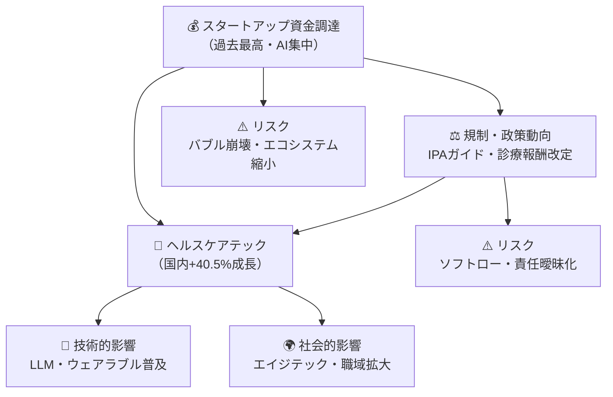
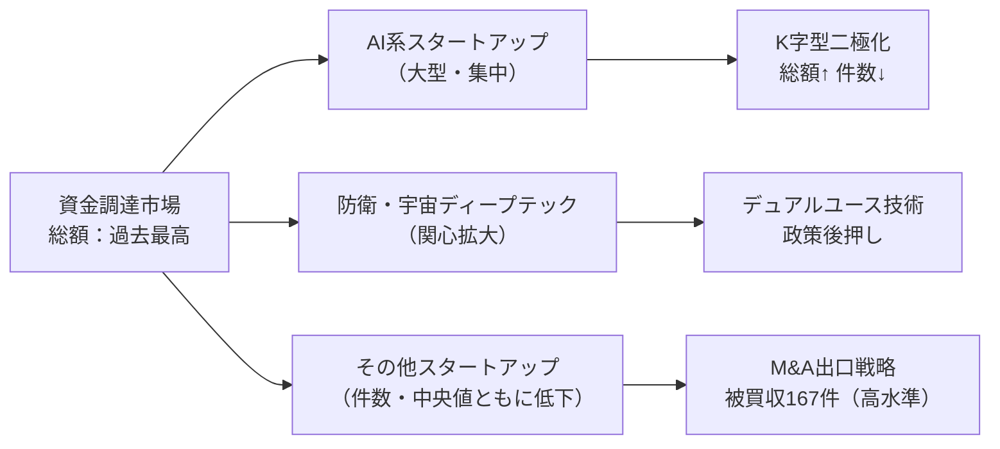
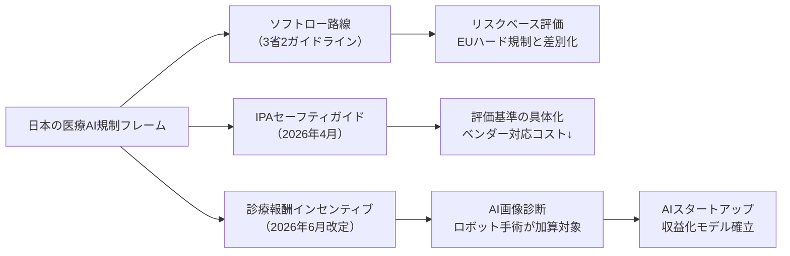
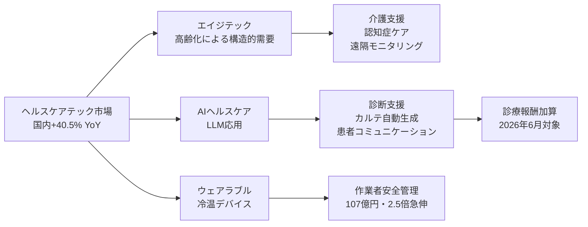
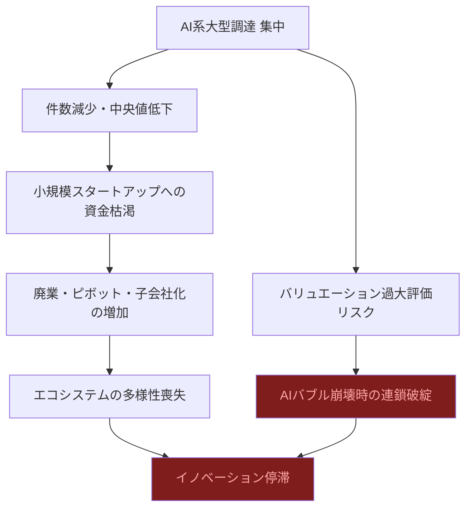
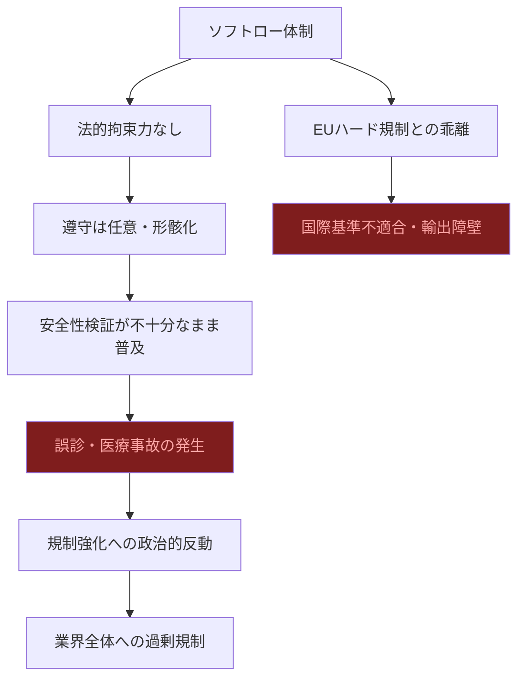
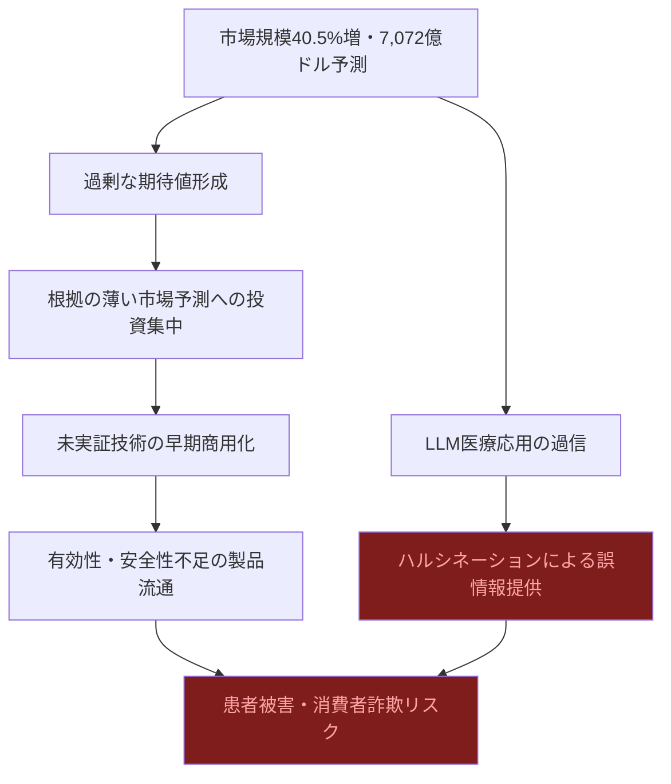

# 📊 トレンド日報 2026-05-01

## 📋 エグゼクティブ・サマリー

> **本日の重要トピック**: 日本のスタートアップ・資金調達 / 規制・政策動向 / ヘルスケアテック

<mark>2026年Q1のスタートアップ調達総額は過去最高を記録しながらも、件数・中央値ともに低下という「K字型二極化」が深刻化している。同時に国内ヘルスケアテック市場は前年比+40.5%と異例の成長を見せ、2026年6月の診療報酬改定でAI活用加算が本格化する。</mark>

- **資金調達**: 総額過去最高・件数減少の矛盾は、AI系大型案件への集中が生み出す格差構造を示す
- **規制**: 日本のソフトローモデルはイノベーション促進の利点を持つが、拘束力不在という構造的リスクを内包する
- **ヘルスケアテック**: 国内1兆1,416億円、グローバル7,072億ドルの市場規模拡大は、エイジテック×AI×ウェアラブルの複合成長が牽引
- 3トピックは「資金→規制→市場」として連鎖しており、**2026年は日本ヘルスケアDXの転換点**となる可能性が高い

---

## 🗺️ トピック関係図

---

## 🔬 Tech視点

### 🚀 日本のスタートアップ・資金調達

- **注目点**: <mark>調達総額は過去最高を更新する一方、件数・社数は減少しており、資本が少数のAI系大型案件に極度に集中する「K字型二極化」が鮮明。</mark>
- **📊 データ**: 2026年Q1調達総額=過去最高更新 / 調達件数=減少 / 被買収・子会社化=**167件**（高水準）
- **技術的意義**: M&A出口戦略の定着と防衛・宇宙ディープテック（衛星通信・自律制御・センシング）への投資拡大
- **展望**: デュアルユース技術の社会的受容が進み、民生転用可能な技術スタックへの資金流入が継続する見通し

| 指標 | 状況 | 変化 |
|------|------|------|
| 2026年Q1 調達総額 | 過去最高更新 | ✅ 上昇 |
| 調達件数 | 減少傾向 | ❌ 低下 |
| 調達社数中央値 | 低下 | ❌ 低下 |
| 被買収・子会社化 | **167件** | 🔍 高水準継続 |
| 主要牽引領域 | AI・防衛・宇宙ディープテック | 💰 急拡大中 |

### ⚖️ 規制・政策動向

- **注目点**: <mark>日本は「ソフトロー＋診療報酬インセンティブ」という独自路線でAI医療実装を加速しており、EU AI Actのハード規制とは対照的に市場を先行開放する戦略を取っている。</mark>
- **📊 データ**: IPAセーフティガイド（2026年4月公表）/ 診療報酬AI活用加算（2026年6月改定）/ リスクベースアプローチ採用
- **技術的意義**: ベンダーが自己評価できる観点を整理することで参入コストを低減。AI画像診断・ロボット手術が加算対象
- **展望**: AIスタートアップにとって収益化モデルが制度的に裏付けられる最重要イベントは2026年6月

| 規制・政策 | 発行元 | 対象 | 性質 | 施行時期 |
|-----------|--------|------|------|---------|
| ヘルスケアAIセーフティ評価ガイド | IPA / AISI | ヘルスケアAI全般 | ソフトロー | 2026年4月公表 |
| 3省2ガイドライン | 厚労省等3省 | 医療AI全般 | ソフトロー（リスクベース） | 既存・継続 |
| 診療報酬改定 | 厚労省 | AI画像診断・ロボット手術 | インセンティブ型加算 | **2026年6月** |

### 🏥 ヘルスケアテック

- **注目点**: <mark>国内ヘルスケア市場が前年比40.5%増という異例の成長率を記録しており、エイジテック需要とAI実装の複合効果が既存医療DX投資を大幅に上回るペースで市場を拡大させている。</mark>
- **📊 データ**: 国内市場**1兆1,416億円（前年比+40.5%）** / グローバル2026年予測**7,072億ドル（+20.3%）** / 作業者安全管理**107億円・前年比2.5倍**
- **技術的意義**: LLM応用（問診支援・カルテ自動生成・薬剤相互作用チェック）とウェアラブル冷温デバイスが新カテゴリを形成
- **展望**: エイジテック（少子高齢化の構造的需要）が国内市場を持続的に牽引する。グローバル市場は2030年に向けて急拡大

| 指標 | 数値 | 変化率 | 備考 |
|------|------|--------|------|
| 国内市場規模 | **1兆1,416億円** | **前年比 +40.5%** | エイジテック・AI実装が牽引 |
| グローバル市場（2025年） | **5,879億ドル** | ベースライン | — |
| グローバル市場（2026年予測） | **7,072億ドル** | **YoY +20.3%** | 1年で1,193億ドル増 |
| 作業者安全管理サービス | **107億円** | **前年比 +150%（2.5倍）** | 最大の急伸カテゴリ |

---

## 🌍 Human視点

### 💰 日本のスタートアップ・資金調達

- **社会的インパクト**: 調達総額が過去最高でもエコシステムは「山高くして谷深し」の格差構造。大多数のスタートアップが資金難に直面
- **💰 ビジネスチャンス**: M&A出口戦略の多様化（167件）、選別環境での差別化支援サービス需要、防衛・宇宙×スタートアップのハイブリッド事業
- **🔥 話題性**: <mark>防衛・宇宙ディープテックへの投資拡大は、国家安全保障と民間協調という新しい産業構造への移行を示唆する。</mark>

| ステークホルダー | 影響の大きさ | 方向性 | 緊急度 |
|---|---|---|---|
| AI系大手スタートアップ | ★★★★★ | ✅ ポジティブ | 高 |
| 中小スタートアップ | ★★★★☆ | ❌ ネガティブ | 高 |
| VC・投資家 | ★★★☆☆ | ✅ ポジティブ | 中 |
| M&Aアドバイザー | ★★★★☆ | ✅ ポジティブ | 高 |

### 📜 規制・政策動向

- **社会的インパクト**: <mark>日本型ソフトロー体制はイノベーション促進と引き換えに責任の所在を曖昧にするリスクを孕む。</mark>事業者の自主性に委ねる構造は利便性と危険性を同時に持つ
- **💰 ビジネスチャンス**: コンプライアンス支援ビジネスの新市場、診療報酬加算によるAI画像診断・ロボット手術の確実な収益モデル、EU参入コストを嫌う企業の日本先行展開拠点化
- **🔥 話題性**: 2026年6月改定という具体的なデッドラインが業界全体を動かしている

### 🏥 ヘルスケアテック

- **社会的インパクト**: <mark>作業者安全管理サービスが前年比2.5倍の急伸を見せており、ヘルスケアテックが「病院の外」＝職場・日常生活へと浸透し始めていることを示す。ヘルスケアの定義そのものの拡張だ。</mark>
- **💰 ビジネスチャンス**: エイジテック向けプロダクト設計・UX改善、パーソナルヘルスAIアシスタント、職域ヘルスケアSaaS、日本発ヘルスケアテックの海外展開機会
- **🔥 話題性**: 国内前年比40.5%増という成長率は、ヘルスケアが社会インフラとして認識される転換点

---

## ⚠️ Critic視点（辛口）

### 🏚️ 日本のスタートアップ・資金調達

- **❌ 主なリスク**: <mark>被買収・子会社化167件という数字は、スタートアップ「生態系」の縮小を示す不吉なシグナルである。成功の証ではなく、独立系プレイヤーが市場から退場させられていることの記録だ。</mark>
- **楽観論への反論**: 「過去最高」は幻想。中央値低下はエコシステム全体の危機を示す。防衛・宇宙ディープテックへの集中は政府誘導の補助金依存の産物に過ぎない
- **🔍 注意すべきポイント**: AI特化バブルの崩壊時に連鎖破綻が起きるリスク、海外VCへの依存と技術流出の長期リスク

| リスク項目 | 発生確率 | 影響度 | 総合評価 |
|---|---|---|---|
| AI特化バブルの崩壊 | 高 | 極大 | ⛔ 最高 |
| 小規模ST資金枯渇による廃業増 | 高 | 大 | 🔴 高 |
| 被買収・子会社化による独立性喪失 | 高 | 中 | 🔴 高 |
| 防衛・宇宙への偏重による民生技術軽視 | 中 | 大 | 🟡 要注目 |

### 📜 規制・政策動向

- **❌ 主なリスク**: <mark>「3省2ガイドライン」という縦割り体制そのものがリスクである。省庁間の解釈の齟齬が生じた場合、どのガイドラインが優先されるのか明確でなく、医療現場が混乱するシナリオは容易に想像できる。</mark>
- **楽観論への反論**: ソフトローは事故が起きてから役に立たない。診療報酬加算は「AIを使えば儲かる」という本末転倒のインセンティブを医療機関に与える。EU AI Actに準拠しない医療AIは欧州市場に輸出できない
- **🔍 注意すべきポイント**: 医療AI安全性未検証のまま普及が先行するリスク

| リスク項目 | 発生確率 | 影響度 | 総合評価 |
|---|---|---|---|
| 医療AIによる誤診・事故 | 中〜高 | 極大 | ⛔ 最高 |
| 診療報酬加算による過剰AI導入 | 高 | 大 | 🔴 高 |
| EU AI Actとの規制格差による輸出障壁 | 高 | 大 | 🔴 高 |
| 「3省2ガイドライン」の縦割り矛盾 | 高 | 中 | 🟡 要注目 |

### 🏥 ヘルスケアテック

- **❌ 主なリスク**: <mark>LLMとウェアラブルデバイスを「注目技術」として称賛する前に直視すべき事実がある：LLMは医療情報についてハルシネーションを起こし、誤った症状判断・投薬情報を「自信を持って」提供することがある。これは笑い話では済まない人命リスクである。</mark>
- **楽観論への反論**: 市場規模+40.5%増は患者アウトカム改善の証拠ではない。作業者安全管理サービスの2.5倍急伸は補助金依存の一過性特需の可能性大。エイジテック市場は情報弱者の高齢者を標的にした搾取的ビジネスと紙一重
- **🔍 注意すべきポイント**: 市場調査会社の予測数字（7,072億ドル）は自社レポート販売目的のマーケティングツールとしての側面が強い

| リスク項目 | 発生確率 | 影響度 | 総合評価 |
|---|---|---|---|
| LLMハルシネーションによる医療誤情報 | 高 | 極大 | ⛔ 最高 |
| 市場予測値の過大評価とバブル崩壊 | 高 | 大 | 🔴 高 |
| 高齢者向けエイジテックの搾取的商法 | 中〜高 | 大 | 🔴 高 |
| ウェアラブルの個人健康データ漏洩 | 中 | 大 | 🟡 要注目 |

---

## 💡 総合所感・アクション提言

**2026年の日本は、高齢化・AI規制・資金選別が同時進行する「収斂点」にある。** ヘルスケアテックを軸に、規制環境を味方につけたプレイヤーが次の10年の覇権を握る可能性が高い。ただし、楽観論に踊る前に構造的リスクへの目配りが不可欠だ。

| 優先度 | アクション | 対象 | 期待効果 |
|---|---|---|---|
| 🎯 最優先 | **2026年6月診療報酬改定への即時対応** | 医療AIベンダー | 診療報酬加算取得で収益モデル確立 |
| 🎯 最優先 | **ヘルスケアテック×AIの事業立案** | 起業家・事業会社 | 市場急拡大（+40.5%）に乗る機会 |
| 📈 重要 | **エイジテック向けUX専門チーム組成** | プロダクト企業 | 高齢者需要の質的取り込み |
| 📈 重要 | **職域ヘルスケアSaaSの法人営業強化** | SaaS企業 | 前年比2.5倍市場への即時参入 |
| 💡 中期 | **LLMハルシネーション対策の実装** | AI医療ベンダー | 人命リスクの回避と信頼確保 |
| 💡 中期 | **IPAガイド準拠のコンプライアンスサービス** | 法律・コンサル | ガイドライン準拠需要の獲得 |

> **リーダー所感**: 今週最大の注目点は「2026年6月の診療報酬改定」だ。これはAI医療ベンダーが収益化できる法的な根拠を持つ最初の大きなゲートとなる。一方でCritic視点が鋭く指摘するように、ソフトローによる「野放し普及」は患者リスクを内包する。Speed vs. Safetyのトレードオフをどう設計するか——規制当局・ベンダー・医療現場の三者が2026年中に答えを出すことになる。

---

*Sources: [日経新聞](https://www.nikkei.com/) / [スピーダ](https://initial.inc/) / [東洋経済](https://toyokeizai.net/) / [IPA](https://www.ipa.go.jp/) / [富士キメラ総研](https://www.nikkei.com/article/DGXZRSP706664_R00C26A5000000/) / [GII](https://www.gii.co.jp/) / [Xenobrain](https://service.xenobrain.jp/)*
