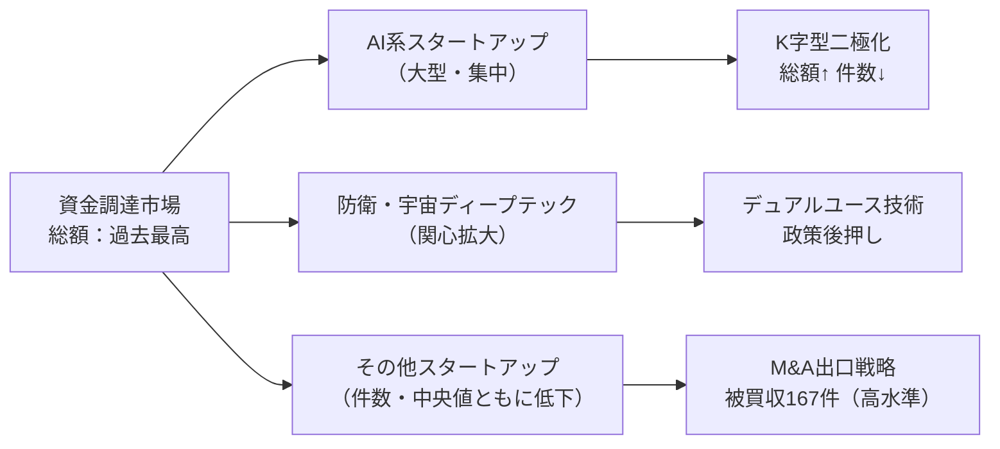
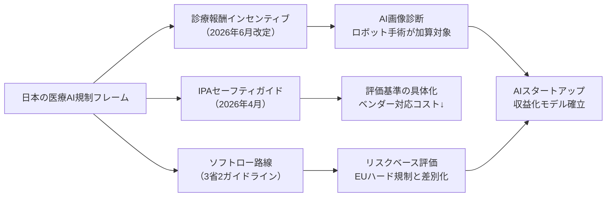
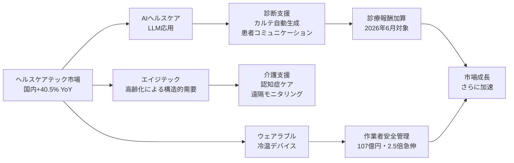

# Tech視点 分析
分析日時: 2026-05-01 10:00

---

## 🚀 日本のスタートアップ・資金調達

### 📊 データサマリー

| 指標 | 状況 | 変化 |
|------|------|------|
| 2026年Q1 調達総額 | 過去最高更新 | ✅ 上昇 |
| 調達件数 | 減少傾向 | ❌ 低下 |
| 調達社数中央値 | 低下 | ❌ 低下 |
| 被買収・子会社化 | **167件** | 🔍 高水準継続 |
| 主要牽引領域 | AI・防衛・宇宙ディープテック | 💰 急拡大中 |

### 💡 テック構造分析

<mark>調達総額は過去最高を更新する一方、件数・社数は減少しており、資本が少数のAI系大型案件に極度に集中する「K字型二極化」が鮮明となっている。</mark>

- **AI系企業の大型調達**が全体の総額を押し上げる構図が固定化：件数減少＋総額増加＝1件あたり平均調達額の急増を意味する
- **防衛・宇宙ディープテック**への関心拡大はデュアルユース技術の社会的受容が進んだことを示す。衛星通信・自律制御・センシング技術など、民生転用可能な技術スタックへの投資が拡大
- **被買収・子会社化が167件と高水準**：スタートアップの出口戦略が IPO 一択から M&A へシフト。技術獲得型買収が件数増加の背景にある

---

## ⚠️ 規制・政策動向

### 📊 データサマリー

| 規制・政策 | 発行元 | 対象 | 性質 | 施行時期 |
|-----------|--------|------|------|---------|
| ヘルスケアAIセーフティ評価ガイド | IPA / AISI | ヘルスケアAI全般 | ソフトロー | 2026年4月公表 |
| 3省2ガイドライン | 厚労省等3省 | 医療AI全般 | ソフトロー（リスクベース） | 既存・継続 |
| 診療報酬改定 | 厚労省 | AI画像診断・ロボット手術 | インセンティブ型加算 | **2026年6月** |

### 💡 テック構造分析

<mark>日本は「ソフトロー＋診療報酬インセンティブ」という独自路線でAI医療実装を加速しており、EU AI Actのハード規制とは対照的に、市場を先行開放する戦略を取っている。</mark>

- **IPAによるAISIガイド**（2026年4月公表）はソフトロー体制の具体化として重要な里程標。ベンダーが自己評価できる観点を整理することで参入コストを低減
- **リスクベースアプローチ**：高リスク用途のみ厳格評価、低リスクは自己申告→スタートアップへの参入障壁を意図的に下げる設計
- **2026年6月診療報酬改定**でAI活用加算が本格検討→AIベンダーにとって収益化モデルが制度的に裏付けられる最重要イベント。AI画像診断・ロボット手術が対象

---

## 🌍 ヘルスケアテック

### 📊 データサマリー

| 指標 | 数値 | 変化率 | 備考 |
|------|------|--------|------|
| 国内市場規模 | **1兆1,416億円** | **前年比 +40.5%** | エイジテック・AI実装が牽引 |
| グローバル市場（2025年） | **5,879億ドル** | ベースライン | — |
| グローバル市場（2026年予測） | **7,072億ドル** | **YoY +20.3%** | 1年で1,193億ドル増 |
| 作業者安全管理サービス | **107億円** | **前年比 +150%（2.5倍）** | 最大の急伸カテゴリ |
| 注目技術 | LLM・ウェアラブル冷温デバイス | — | 2030年市場を牽引 |

### 💡 テック構造分析

<mark>国内ヘルスケア市場が前年比40.5%増という異例の成長率を記録しており、エイジテック需要とAI実装の複合効果が既存医療DX投資を大幅に上回るペースで市場を拡大させている。</mark>

- **エイジテック（高齢者向けテクノロジー）**が国内市場を牽引：少子高齢化の深刻化が需要の構造的ドライバーであり、一過性のブームではない
- **LLM応用の多様化**：問診支援・カルテ自動生成・患者コミュニケーション・薬剤相互作用チェックなど複数ユースケースが同時並走
- **ウェアラブル冷温デバイス**：体温管理・労働環境安全に特化した新カテゴリ。作業者安全管理サービスが**107億円・前年比2.5倍**という急伸は技術需要が実装段階に入った証拠
- グローバル市場は2025→2026の1年で**1,193億ドル増加**（+20.3%）：医療デジタル化の加速度的普及が確認される

---

## 💡 総合テック所感

3トピックのテック横断的な見立て：

1. **資金→規制→市場の正のサイクル形成中**：AIスタートアップへの大型資金流入 → IPAガイドによる規制整備（2026年4月） → 診療報酬インセンティブ（2026年6月） → ヘルスケアテック市場急拡大（+40.5%）、という連鎖が確認できる
2. **日本独自のソフトローモデル**がEUとの差別化要因となり、AI医療ベンダーの参入コストを抑制。グローバル競争上の優位性に転化しうる
3. **ディープテック（防衛・宇宙）とヘルスケアテックの二本柱**が今後のスタートアップ投資の主軸となることが、今回のデータから明確に読み取れる
