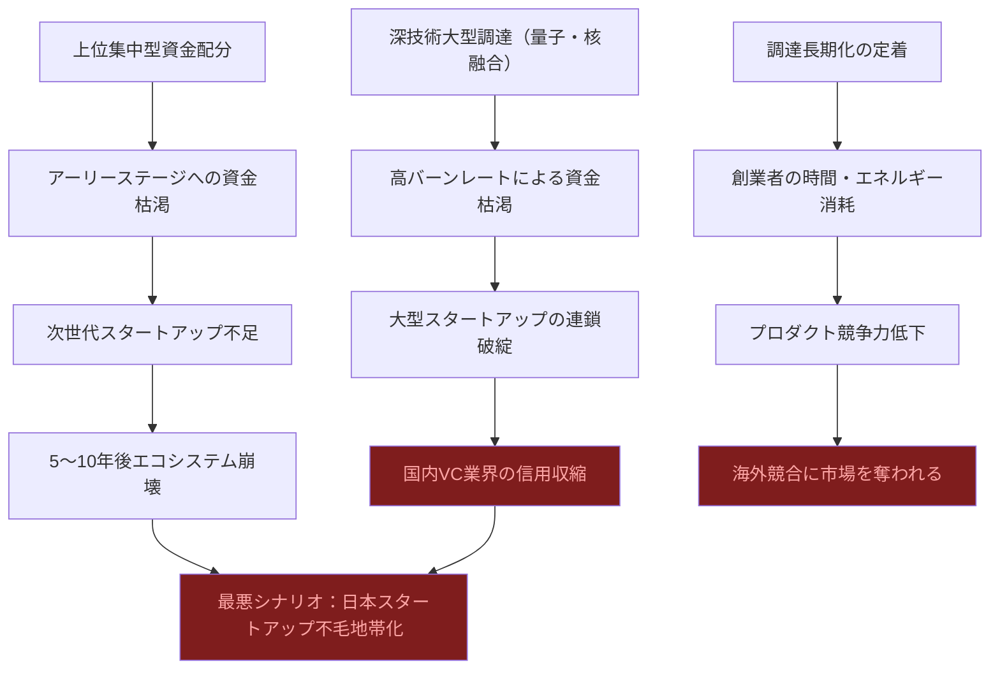
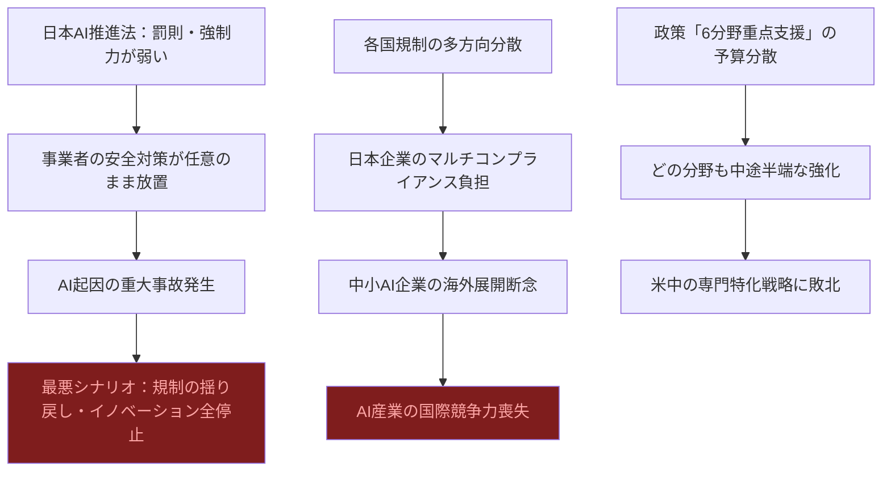
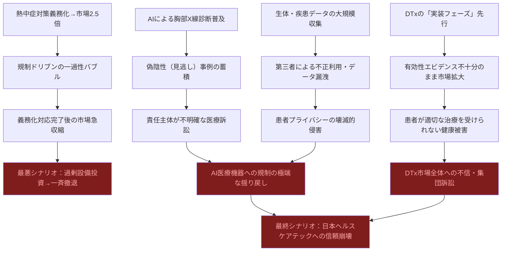

# ⚠️ Critic視点 分析
分析日時: 2026-05-02 21:35

---

## ⚠️ 日本のスタートアップ・資金調達

- **❌ 主なリスク**: <mark>「調達総額が過去最高」という見出しは、件数が減少しているという事実を巧みに隠蔽したマーケティング的数字操作である。一握りの深技術スタートアップへの極端な資金集中は、エコシステム全体の健全性が崩壊しつつあることを示す警戒シグナルに他ならない。件数減少＋金額増加という構造は、バブル末期に必ず現れる「選択と集中の幻想」そのものだ。</mark>

- **楽観論への反論（辛口）**:
  - **「量子15億円・核融合27億円」という数字を素直に喜ぶのは無知である。** 量子コンピューターも核融合も、現時点では実用的な商業価値をほぼ生み出していない技術領域だ。Qubitcore・ヘリカルフュージョンが調達した資金が実際に収益を生むまでに10年以上かかるとしたら、それは「投資」ではなく「ギャンブル」に近い。VCはExit（IPOやM&A）を目的に投資しているが、量子や核融合でのIPOシナリオはほぼ現実性がない。
  - **トグルホールディングスの33億円不動産DX調達も、本質的な疑問がある。** 日本の不動産業界はDXに何十年も抵抗し続けた岩盤業界である。「DXで解決できる」という前提自体が、業界慣行・規制・既得権益の複雑な絡み合いを理解していない楽観論に基づいている。
  - 「シリーズC以降のレイターに集中」は健全化ではなく、**アーリーステージへの資金が干上がっていることの裏返しだ。** 次世代の革新的スタートアップが生まれる土壌が失われており、5〜10年後の日本スタートアップエコシステムの枯渇が今この瞬間に進行している。
  - 「資金調達の長期化が定着」とは、スタートアップが半年〜1年以上の調達活動に時間を浪費することを意味する。その間に製品開発・顧客獲得が滞り、競合（特に中国・米国の資金力豊富なプレイヤー）に後れを取る。「選別の厳格化」を美化するな。

- **🔍 注意すべきポイント**:
  - 深技術（ディープテック）はバーンレートが桁違いに高い。27億円の核融合スタートアップが2〜3年で資金切れになるシナリオを、誰も真剣に計算していない。
  - 上位集中型の資金配分は、失敗時の損害額も集中することを意味する。1件の大型失敗が国内VC業界全体の信用収縮を引き起こすリスクがある。
  - 「過去最高の調達総額」報道は、日本メディアが繰り返すポジティブバイアスの典型例であり、投資家・起業家への歪んだシグナルを送り続けている。

### リスク連鎖図（必須）

### リスクマトリクス（必須）

| リスク項目 | 発生確率 | 影響度 | 総合評価 | 対策 |
|---|---|---|---|---|
| 量子・核融合スタートアップの資金枯渇 | 高 | 大 | 🔴 緊急 | 段階的資金供給・マイルストーン管理の厳格化 |
| アーリーステージ資金の干上がり | 高 | 甚大 | 🔴 緊急 | 公共資金によるシード期補完（現状は不十分） |
| 調達長期化による競争力喪失 | 確実 | 大 | 🔴 緊急 | 標準化されたDD短縮プロセスの業界整備 |
| 不動産DXの業界抵抗による失敗 | 中 | 中 | 🟠 要注意 | 規制改革との連動なき単独DXは無効 |
| VC信用収縮の連鎖 | 中 | 甚大 | 🔴 緊急 | ファンドの分散・政府バックストップ整備 |

---

## ⚠️ 規制・政策動向

- **❌ 主なリスク**: <mark>日本のAI推進法は、EU AI Actと比較して罰則・強制力が著しく弱い。「推進」を前面に出した法律が事業者への規律として機能しないことは立法段階から明白であり、安全規制なきイノベーション促進は将来の大規模事故発生時に「規制の失敗」として政府に跳ね返ってくる時限爆弾だ。</mark>

- **楽観論への反論（辛口）**:
  - **高市政権の「6分野重点支援」は予算規模が不明確なままの空手形だ。** AI・量子・半導体を並列で支援するという方針は、資源配分の集中という戦略の真逆であり、少ない予算を薄く広げる典型的な官僚的失敗パターンである。米国のCHIPS法・EUのAI法のような法的強制力と巨額資金を伴わない「重点支援」は、産業政策として機能しない。
  - **「総務省が生成AIの信頼性・安全性評価基盤の開発を開始」は2026年開始である。** EU AI Actが2024年施行、米国が大統領令レベルで動いている中で、日本は2026年にようやく評価基盤の「開発を開始」する。この時間差は埋めようのない後進性であり、グローバルなAI標準化議論から日本が実質的に排除されていることを意味する。
  - **トランプ政権の州独自AI規制牽制は、日本企業への直撃弾でもある。** 「民間への直接的法的拘束力はない」という記述は楽観的すぎる。連邦調達基準を通じた実質的影響は、米国政府との取引を持つ日本企業（防衛・インフラ分野）に直接かつ深刻な影響を与える。
  - EU AI Actの生成AIコンテンツ透明性行動規範が2026年5〜6月に最終版公表されるということは、**日本企業はまた後追いで対応を迫られる**ということだ。法令遵守コストの増大は中小AI企業にとって致命的になりうる。

- **🔍 注意すべきポイント**:
  - 各国の規制が異なる方向に進むと、グローバル展開する日本のAI企業は複数の規制を同時に満たす「規制のコングロマリット対応」コストを強いられ、中小企業は事実上の市場締め出しに遭う。
  - 「AI推進法」という名称自体が、安全規制より商業利用促進を優先させる政治的メッセージとして機能し、事故発生時の行政責任を曖昧にする免罪符となりうる。

### リスク連鎖図（必須）

### リスクマトリクス（必須）

| リスク項目 | 発生確率 | 影響度 | 総合評価 | 対策 |
|---|---|---|---|---|
| AI推進法の規律不足による大規模事故 | 中 | 甚大 | 🔴 緊急 | 罰則条項の早期追加立法 |
| 欧米規制対応コストによる中小AI企業淘汰 | 高 | 大 | 🔴 緊急 | 共通規制対応支援の公費負担 |
| 6分野予算分散による全分野中途半端化 | 確実 | 大 | 🔴 緊急 | 優先順位の明確化と資源集中 |
| グローバルAI標準化議論からの疎外 | 確実 | 甚大 | 🔴 緊急 | 国際標準化機関への人材投入強化 |
| トランプ政権政策の日本企業への間接打撃 | 高 | 中 | 🟠 要注意 | 米国調達基準への先行対応 |

---

## ⚠️ ヘルスケアテック（詳細・辛口）

- **❌ 主なリスク**: <mark>「市場2.5倍急伸」「DTxが実装フェーズへ」という華やかな表現の陰で、臨床的有効性の証明が不十分なまま商業展開が先行するという構造的欠陥が見過ごされている。熱中症対策義務化による市場急拡大は規制ドリブンの一時的バブルであり、義務化の適用範囲や実効性次第では市場規模が大幅に下振れするリスクがある。さらにCureAppのHAUDY（減酒アプリ）は医薬品メーカーによる販売という前例のないモデルを採用しているが、実臨床での有効性・安全性・依存性リスクの長期評価は何ら確立されていない。</mark>

- **楽観論への反論１：熱中症対策市場107億円の実態**:
  - **「義務化による市場急伸」は規制バブルの典型パターンだ。** 職場の熱中症対策義務化は、企業に「何かを導入しなければならない」という強制需要を生む。しかしこれは本質的な問題解決への需要ではなく、「コンプライアンス対応のための形式的購入」である。一旦義務化対応が完了すれば市場は急速に縮小する。「前年比2.5倍」という数字は持続可能な成長ではなく、一過性の駆け込み需要に過ぎない。
  - **ウェアラブル機器・冷温デバイスの「好調」は検証なき楽観論だ。** これらのデバイスが実際に熱中症を何件防いだか、具体的なアウトカムデータが一切示されていない。販売台数と効果は全く別物である。建設現場・物流現場の劣悪な環境でウェアラブルが正確に機能するという前提は、実証的根拠に乏しい。
  - **「作業者安全管理サービス107億円市場」は誰が儲けるのかを直視すべきだ。** 中小建設企業・物流企業は義務化対応コストを利益から捻出しなければならない。これはテクノロジー企業にとっての「市場」だが、現場事業者にとっては純粋なコスト増加だ。行政は規制で需要を創出し、テック企業が利益を得る一方、現場企業の経営を圧迫する構造になっている。

- **楽観論への反論２：エルピクセルAI医療機器の問題点**:
  - **「胸部X線AI最新版」と「AI医師コンセプト」を同一の展示会で見せることの欺瞞性に注目すべきだ。** 前者は薬機法承認が必要な医療機器であり、後者はコンセプト段階の構想に過ぎない。この二つを並列で展示することで、AIが「もう医師の代替まで見えている」という印象操作が行われている。実際のAI診断補助の臨床承認まで残り何年かかるかを誰も正直に言わない。
  - **フィリップス・ジャパンの超音波診断装置・CT新機種への言及は、AI特有のリスクを全く触れていない。** 大手医療機器メーカーがAI機能を搭載する際、そのAIコンポーネントのソフトウェアアップデート・セキュリティ対応・経年劣化（モデルドリフト）責任が不明確なまま販売される問題は、将来の医療事故の構造的原因となりうる。
  - **AIによる偽陰性（見逃し）の責任は誰が取るのか？** 胸部X線AIが「正常」と判断して見逃した肺がんが数年後に発覚した場合、責任は医師・病院・AI開発会社・医療機器メーカーの誰にあるのか。現行の医療訴訟制度はこの責任分担を全く想定していない。被害者が泣き寝入りするか、全当事者が訴訟に巻き込まれるかの二択となる。

- **楽観論への反論３：CureApp HAUDY（減酒アプリ）の深刻な問題**:
  - **「沢井製薬が2025年9月から販売開始」という事実は、医薬品メーカーがソフトウェアを医薬品として販売するという前例のない事態だ。** 沢井製薬はジェネリック医薬品の製造・品質管理に強みを持つが、デジタル治療薬の有効性・依存性・プライバシーリスクに関する専門知識を持っているという証拠はない。販売チャネルを借りた商業展開は、有効性より「流通力」で普及させることを優先するモデルであり、医療倫理上の問題を孕む。
  - **「減酒治療補助アプリ」の有効性エビデンスは極めて限定的だ。** アルコール依存症・有害飲酒は、単なるデジタルコーチングで解決できるほど単純な疾患ではない。薬物療法・認知行動療法・社会的支援の組み合わせが必要であり、アプリ単独での「治療補助」効果を誇張することは、適切な医療を受けるべき患者を遠ざけるリスクがある。
  - **NASH（非アルコール性脂肪肝炎）治療用DTxの「開発中」という表現の意味を軽視すべきではない。** NASHは現在も治療法が確立していない深刻な疾患だ。アプリが「NASH治療用」として開発されるということは、有効な薬物治療がない領域でデジタル製品の承認を狙う、言い換えれば「競合不在の市場」への規制裁定狙いに他ならない。患者に真の治療的価値をもたらすかどうかは、現段階では全く不明だ。
  - **「デジタル治療薬が実装フェーズへ」というフレーミング自体が問題だ。** 実装フェーズへの移行は、有効性エビデンスの確立を意味しない。日本の薬機法改正によるプログラム医療機器（SaMD）の承認制度整備は、厳格な臨床試験を求めた欧米と比べて「条件付き承認」「市販後調査」への依存度が高い。市場先行・安全性後追いというパターンは、将来の健康被害訴訟リスクを市場拡大と引き換えに積み上げていることを意味する。

- **🔍 注意すべきポイント（ヘルスケアテック総括）**:
  - 医療AIの「実装フェーズ」移行は、病院の診療報酬によるAI機器償還が前提だが、2024〜2025年の診療報酬改定でAI医療機器への保険適用拡大は非常に限定的であった。市場が拡大するためには診療報酬上の手当てが不可欠であり、それが整わない限り「市場急拡大」は病院の自費投資に依存した細い道だ。
  - ヘルスケアデータのプライバシー問題は報告書から完全に欠落している。ウェアラブルによる生体データ・DTxによる疾患・行動データが第三者（製薬企業・保険会社・広告企業）に利用されるリスクは、現行の個人情報保護法では不十分にしか対処できない。
  - AIが医療判断に介入する範囲が拡大すると、医師・看護師の臨床スキルが系統的に劣化する。AIシステム障害・サイバー攻撃時の医療継続能力喪失は、BCP上の致命的脆弱性であり、誰も語りたがらない最大のリスクだ。

### リスク連鎖図（必須）

### リスクマトリクス（必須）

| リスク項目 | 発生確率 | 影響度 | 総合評価 | 対策 |
|---|---|---|---|---|
| 熱中症対策市場の一過性バブル崩壊 | 高 | 中 | 🟠 要注意 | 義務化以外の価値提供モデルの確立 |
| AI診断の偽陰性による医療訴訟 | 中 | 甚大 | 🔴 緊急 | AIアウトカム責任分担制度の法整備 |
| DTx有効性エビデンス不足のまま普及 | 確実 | 大 | 🔴 緊急 | 市販後の強制的リアルワールドエビデンス収集 |
| HAUDYによるアルコール依存患者の適切治療機会喪失 | 中 | 大 | 🟠 要注意 | 適応患者選定基準の厳格化・専門医連携必須化 |
| 医療AIデータの第三者不正利用 | 高 | 甚大 | 🔴 緊急 | 医療データ利用の専用規制法制定 |
| 医療AIシステム障害時の診療継続不能 | 中 | 甚大 | 🔴 緊急 | バックアップ体制・BCP策定の義務化 |
| 診療報酬未整備によるAI医療機器普及停滞 | 高 | 大 | 🔴 緊急 | 次回改定での積極的な保険適用拡大 |

---

## 💡 総括：2026年後半に向けた最悪ケースシナリオ

<mark>今回の3トピックが示す「成長」は、いずれも**持続可能な基盤の上に立っていない**。スタートアップ資金は件数減少という足元の崩壊を隠した数字マジックであり、規制政策は実効性なき名ばかり推進であり、ヘルスケアテックは臨床エビデンスより商業速度を優先した危険な先行展開だ。</mark>

**複合崩壊シナリオ（2027年）**：
1. **スタートアップバブル崩壊**：深技術大型調達案件の相次ぐ資金枯渇→国内VCの信用収縮→アーリーステージ資金の完全凍結
2. **医療AI事故の顕在化**：診断AIの見逃し被害の集積→責任主体不在のまま集団訴訟→DTx市場への不信連鎖
3. **規制の失敗と揺り戻し**：安全規制不備のAI推進法下での重大事故→政治的介入による過剰規制→イノベーション全停止

**これらは独立したリスクではなく相互に連鎖する。** 一つの崩壊が次の崩壊を加速させる「リスク連鎖爆発」に日本のテックエコシステムは無防備である。
