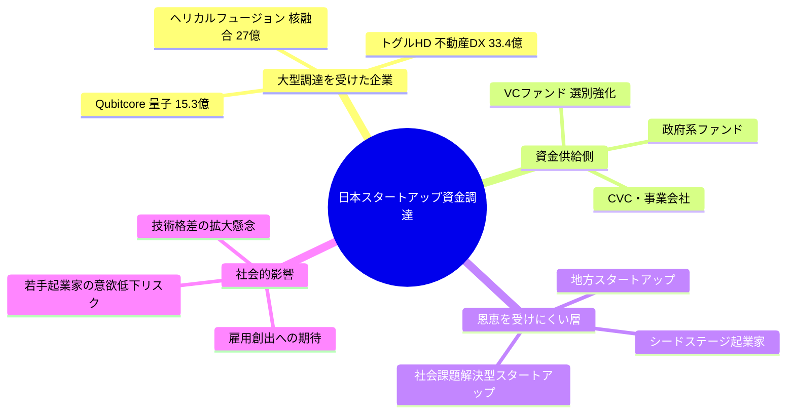
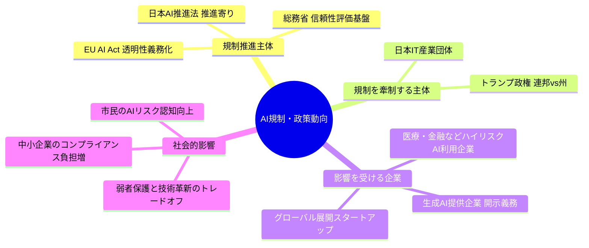
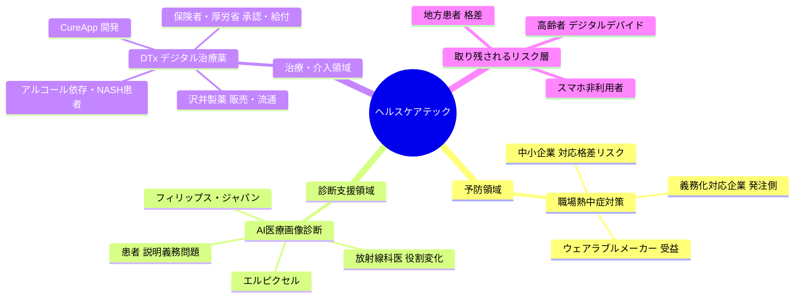

# 🌍 Human視点 分析
分析日時: 2026-05-02 21:35

---

## 📋 エグゼクティブ・サマリー

3トピック横断で見えてくる本質的課題は「恩恵の非対称性」である。資金調達は深技術スタートアップへ集中し、AI規制は大企業が先行対応し、ヘルスケアテックはデジタルリテラシーのある現役世代にのみ届く。<mark>技術・資金・政策のすべてが「すでに恵まれた人をさらに有利にする」方向に働いており、社会的包摂の観点からは危機的状況である。</mark>今この瞬間に制度設計を間違えれば、2030年代には取り返しのつかない格差社会が固定化されるリスクがある。

---

## 🌍 日本のスタートアップ・資金調達

- **社会的インパクト**: 調達総額「過去最高」という見出しの裏に、件数の減少という不都合な真実が隠れている。<mark>富が特定の少数スタートアップに集中し、中間層のスタートアップが枯死しつつある「砂時計型エコシステム」が形成されている。</mark>量子・核融合・不動産DXという選ばれた深技術分野は巨額を得る一方、それ以外の多くの起業家は資金調達競争から脱落しかねない。
- **💰 ビジネスチャンス**: 深技術分野3社合計**75.7億円**（Qubitcore 15.3億円＋ヘリカルフュージョン 27億円＋トグルHD 33.4億円）が1週間で調達。レイターステージ（シリーズC以降）支援特化のファンド・財務顧問・採用エージェントには追い風。
- **🔥 話題性・熱量**: 深技術への資金流入は「日本版スプートニク・モーメント」として一部メディアで過熱報道。ただし熱量は経済紙・テック界隈に限定的で、一般市民への波及は現時点で薄い。起業ブームと格差拡大が同時進行する矛盾に対する批判的論調は今後高まると予測する。

### ステークホルダーマップ（必須）

### 影響度マトリクス（必須）

| ステークホルダー | 影響度 | 時間軸 | 主なインパクト |
|---|---|---|---|
| 深技術スタートアップ（受益者） | ✅ 非常に高い | 即時〜3年 | 大型調達→人材採用加速・研究開発推進 |
| レイターステージVC | ✅ 高い | 即時〜2年 | 選別強化で高収益案件への集中投資が可能 |
| シードステージ起業家 | ❌ 低い | 即時〜1年 | 投資対象外化が進み、創業機会が縮小 |
| 地方・社会起業家 | ❌ 低い | 1〜3年 | 注目集まらず、地域課題解決の担い手不足深刻化 |
| 一般就職希望者（若年層） | 🔍 中程度 | 2〜5年 | 深技術スタートアップが高スキル人材を争奪、給与格差拡大 |
| 政府・経産省 | 🔍 中程度 | 1〜3年 | スタートアップ振興の「成功」として喧伝しやすいが、裾野育成は課題 |

---

## 🌍 規制・政策動向

- **社会的インパクト**: 日本・EU・米国の三極が異なる速度・方向性でAI規制を進める「規制トリレンマ」が深刻化している。<mark>高市政権の「推進寄り」政策とEU AI Actの「リスク規制強化」路線の乖離が、日本企業のグローバル展開において法的コンプライアンスの二重負担を生み出す。</mark>トランプ政権による州規制牽制は一見「規制緩和」に見えるが、連邦調達基準を通じた実質的な縛りは残存するため企業側の混乱は続く。
- **💰 ビジネスチャンス**: AI規制対応コンサル・コンプライアンスSaaS・生成AI信頼性評価ツールへの需要が三極分裂で急拡大。特に日EU間でのAI法令比較対応支援は高単価案件になりやすい。
- **🔥 話題性・熱量**: 政策トレンドとしては高い注目度。ただし企業現場では「規制の内容が複雑すぎて理解が追いつかない」という疲弊感も漂う。市民レベルでのAIリスク意識は高まりつつあるが、具体的行動変容にはまだ距離がある。

### ステークホルダーマップ（必須）

### 影響度マトリクス（必須）

| ステークホルダー | 影響度 | 時間軸 | 主なインパクト |
|---|---|---|---|
| 大手AI企業（国内外） | ⚠️ 非常に高い | 即時〜2年 | 透明性義務・開示コストが経営負担として直撃 |
| グローバル展開スタートアップ | ❌ 高い（負担） | 即時〜3年 | 日EU米三極の規制差異への対応コストが重くのしかかる |
| AI規制コンサル・法律事務所 | ✅ 高い | 即時〜2年 | 規制複雑化が特需を生む。高収益ビジネス機会 |
| 中小企業（AI利用者） | ❌ 中程度 | 1〜3年 | 規制理解・対応リソース不足で競争劣位に陥るリスク |
| 一般市民 | 🔍 中程度 | 2〜5年 | AI利用の透明性向上でリスク認知は上がるが、恩恵の実感は遅い |
| 高市政権・経産省 | ✅ 高い | 即時〜2年 | 「AI推進」を旗印に国際競争力強化の成果を示しやすい局面 |

---

## 🌍 ヘルスケアテック（詳細分析）

- **社会的インパクト**: ヘルスケアテックは「予防・管理・治療」の三段階すべてで同時革新が起きているという点で、他トピックと異なる「全方位型変革」フェーズにある。<mark>デジタル治療薬（DTx）がCureAppのHAUDYとして沢井製薬経由で実処方に入ったことは、「アプリが薬になる」という概念が日本の保険医療体制に公式に組み込まれた歴史的転換点である。</mark>しかし同時に、これらの恩恵が届く層は「スマートフォンリテラシーのある現役世代」に限られており、高齢者・デジタルデバイド層は置き去りになるリスクが極めて高い。
- **💰 ビジネスチャンス**:
  - 職場熱中症対策サービス市場: **107億円（前年比2.5倍）**という急成長。義務化という強制力を背景に需要はほぼ確実。
  - AIシステム医療画像診断: ITEM2026での展示は導入検討段階から実装段階への移行を示唆。病院・クリニックのシステム更新需要が今後3年で本格化。
  - DTx（デジタル治療薬）市場: HAUDY（減酒）に加えNASH治療用アプリも開発中。製薬会社×スタートアップの提携モデルが標準化すれば市場規模は一気に拡大する。
- **🔥 話題性・熱量**: 医療従事者・保健師・産業医など専門職コミュニティでの関心は高い。ただし一般市民レベルでは「AIに診断されること」への不安・不信感が払拭されておらず、技術の普及と社会的受容のギャップが依然として存在する。DTxについても「アプリで本当に病気が治るのか」という懐疑論は根強い。

### 📋 ヘルスケアテック3分野の詳細

#### 🌡️ 1. 職場熱中症対策（予防ヘルスケア）

義務化という規制ドライバーで市場が急拡大している。**前年比2.5倍・107億円**は異常な伸び率であり、義務化前後の一時的バブルの可能性も否定できない。企業が「とりあえず導入する」対応に終始し、データ活用による実質的な熱中症ゼロに繋がらない形式的整備にとどまるリスクがある。特に中小企業・建設業・農業従事者など炎天下作業者へのリーチが課題で、「大企業はウェアラブル導入、中小企業は紙の記録」という二極化が生じかねない。

| 項目 | 現状 | 課題 |
|---|---|---|
| 市場規模 | **107億円（前年比2.5倍）** | 義務化バブル崩壊後の持続性 |
| 主な受益企業 | ウェアラブルメーカー・冷温デバイス業者 | 中小企業向けの低価格帯製品不足 |
| リーチできていない層 | 建設業・農業の中小企業 | 導入コスト・リテラシー格差 |
| データ活用 | まだ「記録・管理」が中心 | 予測・予防への高度化が今後の差別化軸 |

#### 🏥 2. AI医療画像診断（診断支援ヘルスケア）

エルピクセルの胸部X線AI・AI医師コンセプトとフィリップスの医療機器展示が示すのは、診断支援AIの「商品化」が完了しつつあるという段階変化だ。しかし以下の課題は依然として未解決のままである。

| 課題 | 内容 | 深刻度 |
|---|---|---|
| 責任の所在 | 誤診時に医師・AI企業・病院のどこが責任を負うか不明確 | ❌ 高い |
| 過剰診断リスク | 「見落とさない」一方で「陽性率が上がる」問題の患者説明 | ⚠️ 中程度 |
| 地域格差 | 都市部先行で地方・離島への実装スピードが著しく遅れる構造 | ❌ 高い |
| 医師の受容 | AI判断と医師判断が異なる場合の最終意思決定プロトコル未整備 | ⚠️ 中程度 |

#### 💊 3. デジタル治療薬・DTx（治療ヘルスケア）—— 最重要分析

CureApp HAUDYの沢井製薬販売開始は、DTx市場において最も注目すべき実装事例である。

**「減酒」という切り口の巧みさ**: 禁酒は意志力の問題とされがちだったが、アプリによる行動変容介入を「治療」と定義することで、医療保険適用という強力な普及経路を確保した。患者がアプリを「使う気になる」UXデザインと、医師が「処方したくなる」エビデンス提示の両立こそがDTx普及の鍵であり、CureAppはその難題を乗り越えた最初の日本企業といえる。

**NASH治療用アプリの社会的意義**: 非アルコール性脂肪肝炎（NASH）は日本の潜在患者が**数百万人規模**とされ、生活習慣改善が治療の核となる疾患。DTxの適応拡大が最も期待できる領域の一つであり、製薬会社が莫大な費用をかけて開発してきた「生活習慣改善薬」市場をアプリが代替・補完する構造変化が起きる可能性がある。

**批判的視点（辛口）**: 沢井製薬という後発医薬品大手がDTxの販路を担うモデルは、「イノベーションを既存製薬流通が寡占する」構造でもある。スタートアップが技術とエビデンスを構築しても、販売・普及の恩恵は大企業が持っていく非対称性が固定化されるリスクがある。CureAppが交渉力を持てるのは今だけで、後続のDTx企業は「販路なし」で生き残れるのかという問いかけは重い。

| DTx製品 | 対象疾患 | 販売開始 | 流通パートナー | 社会的意義 |
|---|---|---|---|---|
| HAUDY | アルコール依存・減酒 | 2025年9月 | 沢井製薬 | 依存症の新治療パラダイム確立 |
| 開発中アプリ | NASH（非アルコール性脂肪肝炎） | 未定 | 未定 | 潜在患者数百万人へのアプローチ |

### ステークホルダーマップ（必須）

### ヘルスケアテック影響度マトリクス（必須）

| ステークホルダー | 影響度 | 時間軸 | 主なインパクト |
|---|---|---|---|
| 職場熱中症対策サービス提供企業 | ✅ 非常に高い | 即時〜2年 | 義務化特需で107億円市場に急成長。バブル崩壊後の継続需要確保が課題 |
| CureApp（DTxスタートアップ） | ✅ 高い | 即時〜3年 | 沢井製薬との提携で全国販路確保。ただし収益の主導権は製薬側が握る |
| 沢井製薬 | ✅ 高い | 1〜5年 | ジェネリック依存からDTxへの多角化。後発薬市場縮小への布石として有効 |
| 放射線科医・専門医 | ⚠️ 高い（変容） | 2〜5年 | AI診断支援で業務効率化される一方、役割・価値の再定義を迫られる |
| 中小企業・現場作業者 | 🔍 中程度 | 即時〜2年 | 大企業が先行導入、中小企業は遅れ。恩恵到達に時間的格差あり |
| 高齢者・デジタルデバイド層 | ❌ 低い | 3〜10年 | DTx・AI診断ともに利用ハードル高く、最も支援が必要な層に届かないパラドックス |
| 地方・離島患者 | ❌ 低い | 3〜10年 | AI診断インフラ整備が都市部中心で、医師不足地域への実装格差が拡大 |
| 厚労省・規制当局 | ⚠️ 中程度 | 即時〜3年 | DTx承認・給付設計が市場普及速度を左右。審査体制の整備が急務 |

### ⚠️ ヘルスケアテックの否定的視点（辛口評価）

| リスク項目 | 深刻度 | 内容 |
|---|---|---|
| デジタルデバイドの深刻化 | ❌❌ 非常に高い | 技術が進むほど「使えない人」が置き去りになる。医療格差の新形態 |
| 義務化バブルの崩壊 | ❌ 高い | 熱中症対策市場の2.5倍成長は義務化という規制ドライバー依存。対応完了後に市場急収縮するリスク大 |
| AI誤診の責任不在 | ❌ 高い | 放射線AIが見落とした場合の法的責任所在が不明確。「AIが言ったから」という責任転嫁文化の醸成リスク |
| DTxの製薬大手寡占 | ⚠️ 中程度 | スタートアップが開発してもチャネルを製薬大手に握られる構造。イノベーションの果実がスタートアップに還元されない |
| 患者データの集積と利用 | ⚠️ 中程度 | DTx・ウェアラブルが集積する健康行動データの二次利用・保険引受への活用リスクが透明性不足のまま進行 |

---

## 💡 総合所感（Human視点アクション提言）

**3トピック横断で見えてくる本質的課題は「恩恵の非対称性」である。** 資金調達は深技術スタートアップへ集中し、AI規制は大企業が先行対応し、ヘルスケアテックはデジタルリテラシーのある現役世代にのみ届く。技術・資金・政策のすべてが「すでに恵まれた人をさらに有利にする」方向に働いており、社会的包摂の観点からは危機的状況である。

**アクション提言:**

1. ✅ **スタートアップエコシステム**: 深技術への集中投資を批判するのではなく、「シード支援の別予算化」を政策提言として制度化することが急務。件数の減少を放置すれば、次世代の中堅スタートアップが育たない。
2. ✅ **AI規制**: 中小企業向けの「規制対応ガイドライン」の平易化・無料提供を政府が主導すべき。複雑化する規制に大企業だけが適応できる現状は、競争公正性を損なう。
3. ✅ **ヘルスケアテック**: DTxや医療AIの「デジタルデバイド解消」を製品設計の必須要件とする規制・ガイドラインを厚労省が早急に策定すべき。技術が「持つ者と持たざる者」の健康格差をさらに拡大させる前に手を打つことが、社会的責任として不可欠である。
4. 🔍 **要注目**: CureApp×沢井製薬モデルの成否は後続DTx企業の参入意欲を大きく左右する。スタートアップが収益を適切に得られる仕組みが確保されるかどうかを注視する必要がある。
