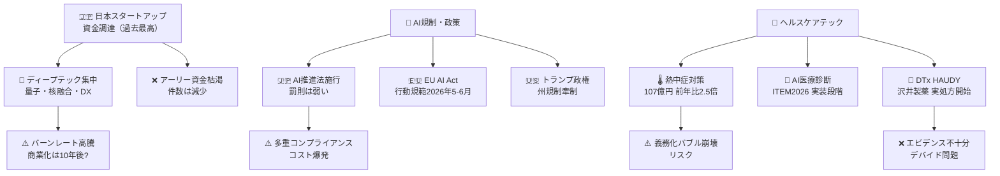
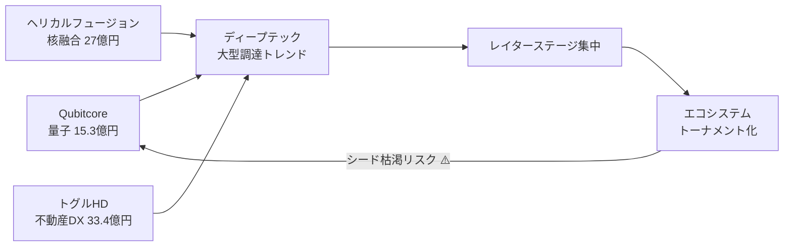
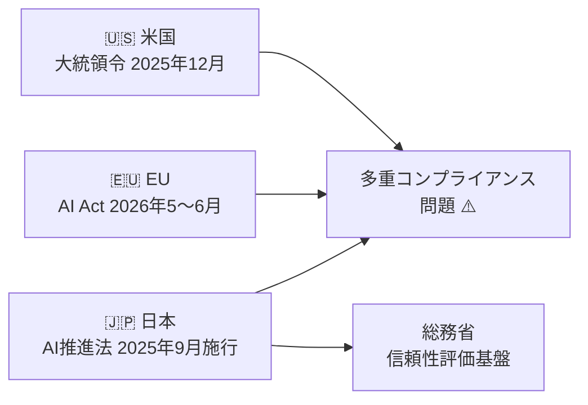
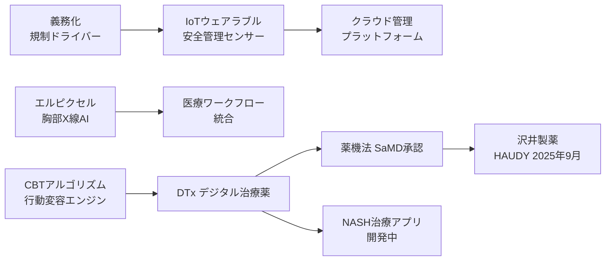
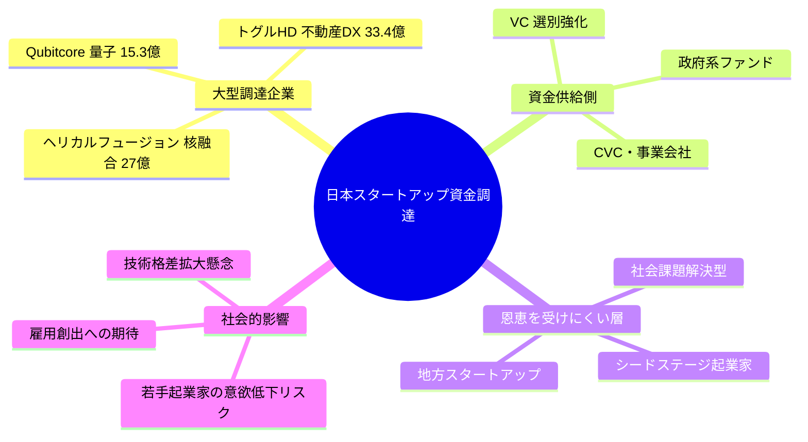
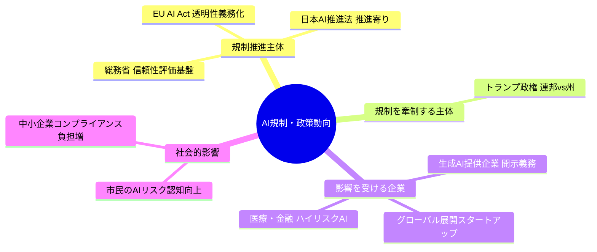
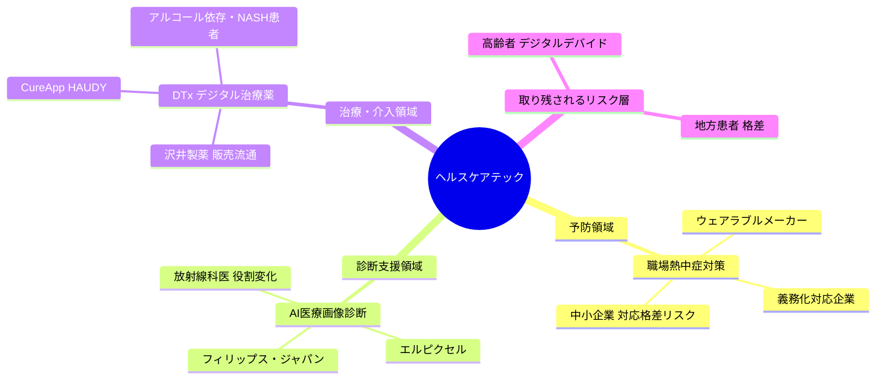
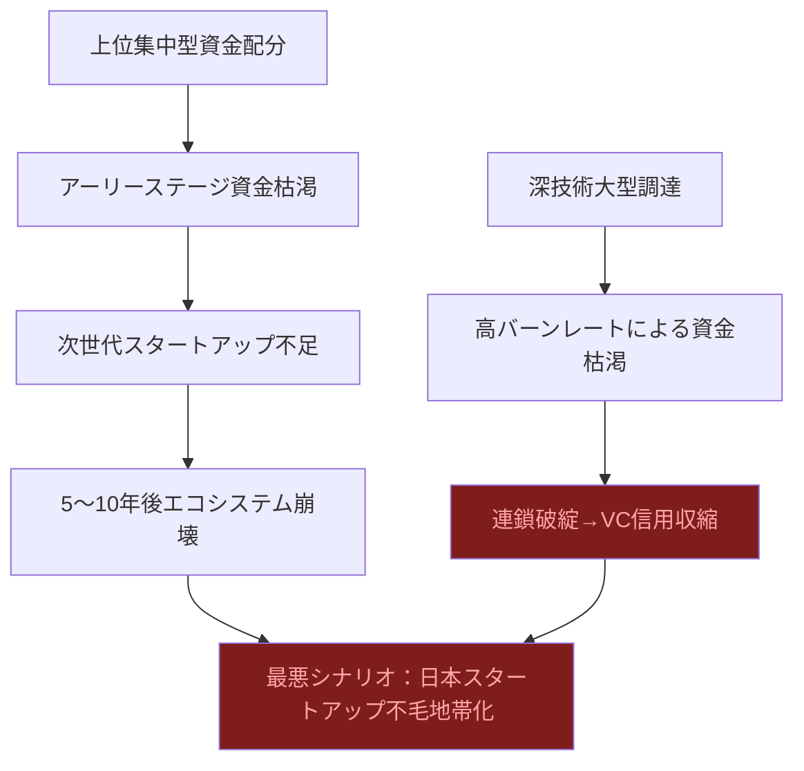
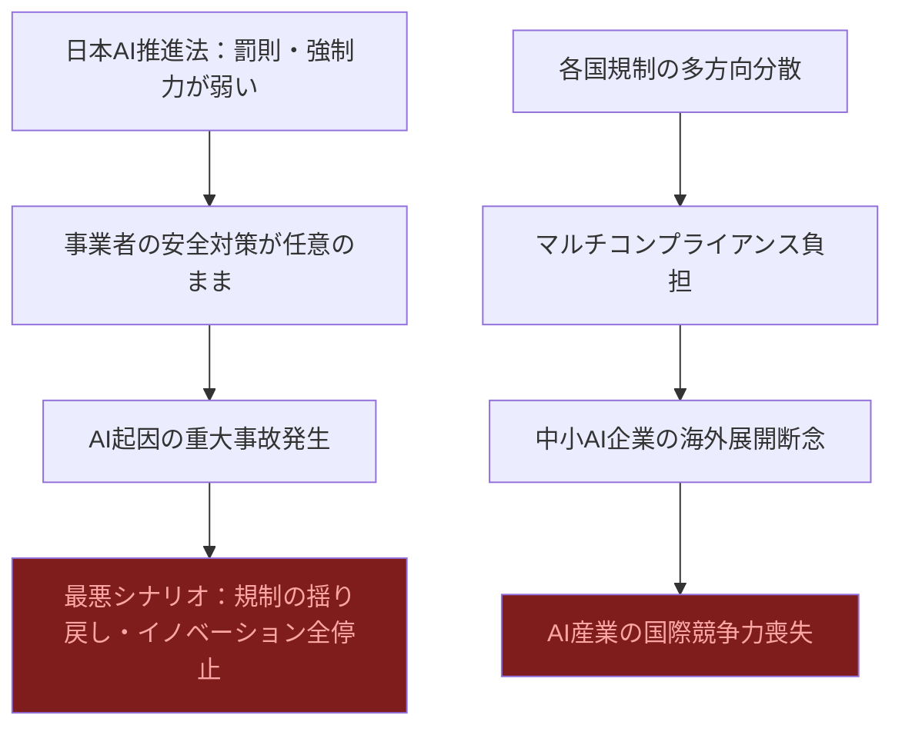
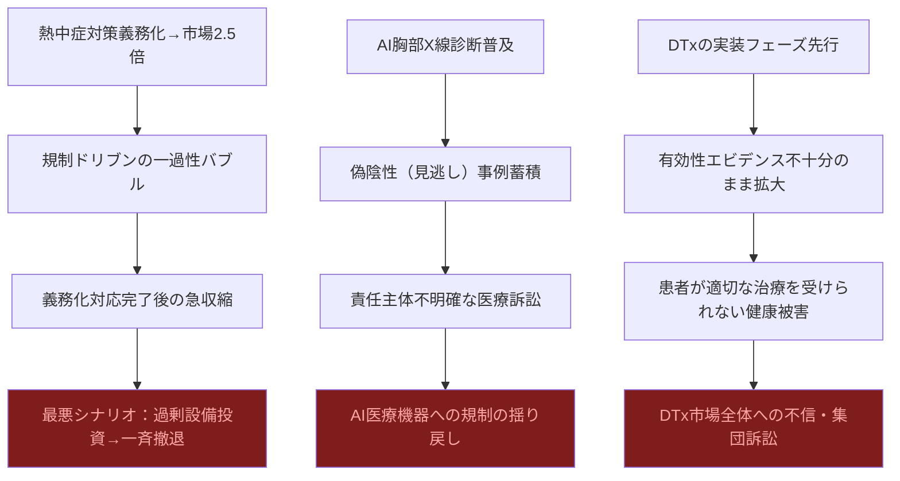

# 📊 トレンド日報 2026-05-02

## 📋 エグゼクティブ・サマリー

> **本日の重要トピック**: 日本のスタートアップ・資金調達 / 規制・政策動向 / ヘルスケアテック
>
> <mark>2026年Q1の国内スタートアップ調達総額は「過去最高」を記録したが、実態は件数減少・ディープテックへの極端な集中という「砂時計型エコシステム」の形成であり、アーリーステージ資金の枯渇が今まさに進行している。</mark> AI規制は日本・EU・米国が三極に分岐し、グローバル展開する企業への多重コンプライアンスコストが深刻化。ヘルスケアテックはCureApp「HAUDY」の実処方開始・熱中症対策市場2.5倍急伸で「実装フェーズ」に入ったが、臨床エビデンスの不十分さとデジタルデバイド問題が影を落とす。**技術・資金・政策の三分野すべてで「恩恵の非対称性」が拡大しており、2027年に向けた複合崩壊リスクを見逃してはならない。**

---

## 🗺️ トピック関係図

---

## 🔬 Tech視点

### 🚀 日本のスタートアップ・資金調達

- **技術的注目点**: <mark>量子コンピューター・核融合・不動産DXという「ディープテック」への集中が顕著で、2026年Q1は件数減少と引き換えに1件あたりの調達規模が拡大している。</mark> 従来のSaaS型スタートアップからハードウェア・物理科学基盤の企業へ投資重心が移行しつつある。
- **📊 データ・数字**: Qubitcore（量子・**15.3億円**）、ヘリカルフュージョン（核融合・**27億円**）、トグルホールディングス（不動産DX・**33.4億円**）。1週間で**合計75.7億円**の深技術調達。2026年Q1は国内調達総額が**過去最高**を更新したにもかかわらず、件数は減少。
- **技術的意義**: 核融合・量子は開発サイクルが10〜20年単位であり、レイターステージ集中傾向との整合性は高い。ただしVC側の「勝ち馬への追加投資」モデルへの移行は少数精鋭トーナメント型エコシステムへの転換を示す。
- **展望**: シリーズC以降への集中とディープテック大型化が同時進行する場合、アーリーステージのシード投資が枯渇するリスクがある。量子・核融合の商業化タイムライン精査が投資判断の核心。

| 指標 | 現状値 | 成長率 | 備考 |
|------|--------|--------|------|
| 2026年Q1調達総額 | 過去最高 | 前年比増 | 件数は減少 |
| Qubitcore | 15.3億円 | — | 量子コンピューター |
| ヘリカルフュージョン | 27億円 | — | 核融合発電 |
| トグルHD | 33.4億円 | — | 不動産DX |
| 主力ステージ | シリーズC以降 | — | 2025年通年トレンド |

### 📊 規制・政策動向

- **技術的注目点**: <mark>日本・EU・米国の三極でAI規制アーキテクチャが異なる方向へ分岐しており、グローバル展開するAI企業は多重コンプライアンス対応を強いられる「規制の非対称性」が深刻化している。</mark>
- **📊 データ・数字**: 日本AI推進法は**2025年5月成立・9月全面施行**。EU AI Actの生成AI行動規範最終版は**2026年5〜6月**公表予定。米国はトランプ政権が**2025年12月**に大統領令に署名。高市政権はAI・量子・半導体など**6分野**を重点支援指定。
- **技術的意義**: 日本のAI推進法は「推進」に重心を置きEUのリスクベースアプローチとは対照的。総務省の**生成AI信頼性・安全性評価基盤（2026年〜）**は日本独自の技術標準策定の試みとして注目。
- **展望**: 評価基盤の技術的中身（ベンチマーク設計・レッドチーミング・監査プロセス）が未確定。国際標準化の主導権を巡る技術外交が本格化。

| 指標 | 現状値 | 施行・公表時期 | 備考 |
|------|--------|----------------|------|
| 日本AI推進法 | 全面施行済 | 2025年9月 | 推進重視・罰則は弱い |
| EU AI Act 行動規範 | 最終版準備中 | 2026年5〜6月予定 | 生成AIコンテンツ透明性 |
| 米国大統領令 | 署名済 | 2025年12月 | 州規制への牽制 |
| 政策重点分野 | 6分野指定 | 2025年10月〜 | AI・量子・半導体等 |

### 🏥 ヘルスケアテック（詳細）

- **技術的注目点**: <mark>ヘルスケアテックは「義務化による市場創出（IoT）」「AI診断の実用展開」「デジタル治療薬（DTx）の商業化」という3つの異なるドライバーが同時に走っており、技術成熟度（TRL）の軸で整理するとセグメントごとに全く異なるフェーズにある。</mark>
- **📊 データ・数字**: 作業者安全管理サービス市場**107億円（前年比2.5倍）**。CureApp HAUDY：**2025年9月**販売開始（沢井製薬）。ITEM2026（2026年4月21日）でエルピクセルが胸部X線AI最新版展示。DTx市場は**実装フェーズ**へ移行。

**セグメント1: 職場熱中症対策IoT**（義務化ドリブン）: 市場**107億円・前年比2.5倍**。IoTセンサー・クラウド管理プラットフォームが急拡大。エッジコンピューティングによる現場判断の即時化も競争軸に。

**セグメント2: AI医療診断**（画像・診断支援AI）: エルピクセルが胸部X線AI最新版とAI医師コンセプトを展示。フィリップスが超音波2機種＋CT新機種を訴求。診断支援AIのTRLは最高水準に到達。

**セグメント3: デジタル治療薬（DTx）**: CureApp HAUDY（減酒治療補助）が沢井製薬経由で実処方開始。「ソフトウェアが薬になる」概念実証が日本市場で完成しつつある。NASH治療用アプリも開発中。

| セグメント | 指標 | 現状値 | 成長率 | 備考 |
|-----------|------|--------|--------|------|
| 熱中症対策IoT | 市場規模 | **107億円** | **前年比2.5倍** | 富士キメラ総研 2026年5月 |
| AI診断 | エルピクセル展示 | 胸部X線AI最新版 | — | ITEM2026 2026年4月 |
| DTx | HAUDY販売 | 2025年9月〜 | — | 沢井製薬流通 |
| DTx | 市場フェーズ | **実装フェーズ** | — | 概念実証→商業展開 |

---

## 🌍 Human視点

### 🌍 日本のスタートアップ・資金調達

- **社会的インパクト**: 調達総額「過去最高」の裏に件数減少という不都合な真実が隠れている。<mark>富が特定の少数スタートアップに集中し、中間層が枯死しつつある「砂時計型エコシステム」が形成されている。</mark> 量子・核融合・不動産DXという選ばれた分野は巨額を得る一方、それ以外の多くの起業家は資金調達競争から脱落しかねない。
- **💰 ビジネスチャンス**: 深技術3社合計**75.7億円**が1週間で調達。レイターステージ支援特化のファンド・財務顧問・採用エージェントには追い風。
- **🔥 話題性・熱量**: 「日本版スプートニク・モーメント」として経済紙・テック界隈で過熱報道。ただし一般市民への波及は薄く、起業ブームと格差拡大の矛盾への批判的論調は今後高まると予測される。

| ステークホルダー | 影響度 | 時間軸 | 主なインパクト |
|----------------|--------|--------|--------------|
| 深技術スタートアップ | ✅ 非常に高い | 即時〜3年 | 大型調達→人材採用・研究開発推進 |
| レイターVC | ✅ 高い | 即時〜2年 | 高収益案件への集中投資 |
| シードステージ起業家 | ❌ 低い | 即時〜1年 | 投資対象外化が進行 |
| 地方・社会起業家 | ❌ 低い | 1〜3年 | 地域課題解決の担い手不足深刻化 |

### 🌍 規制・政策動向

- **社会的インパクト**: 日本・EU・米国の三極が異なる速度・方向性でAI規制を進める「規制トリレンマ」が深刻化。<mark>高市政権の「推進寄り」政策とEU AI Actの「リスク規制強化」路線の乖離が、日本企業のグローバル展開において法的コンプライアンスの二重負担を生み出す。</mark>
- **💰 ビジネスチャンス**: AI規制対応コンサル・コンプライアンスSaaS・生成AI信頼性評価ツールへの需要が三極分裂で急拡大。日EU間のAI法令比較対応支援は高単価案件化。
- **🔥 話題性・熱量**: 政策トレンドとしては高注目度。ただし企業現場では「規制内容が複雑すぎて理解が追いつかない」という疲弊感も漂う。

| ステークホルダー | 影響度 | 時間軸 | 主なインパクト |
|----------------|--------|--------|--------------|
| 大手AI企業 | ⚠️ 非常に高い | 即時〜2年 | 透明性義務・開示コストが直撃 |
| グローバル展開スタートアップ | ❌ 高い（負担） | 即時〜3年 | 三極対応コストが重くのしかかる |
| AI規制コンサル・法律事務所 | ✅ 高い | 即時〜2年 | 規制複雑化が特需を生む |
| 中小企業（AI利用者） | ❌ 中程度 | 1〜3年 | 理解・対応リソース不足で競争劣位 |

### 🌍 ヘルスケアテック（詳細）

- **社会的インパクト**: <mark>CureApp HAUDYが沢井製薬経由で実処方に入ったことは、「アプリが薬になる」という概念が日本の保険医療体制に公式に組み込まれた歴史的転換点である。</mark> しかし恩恵が届く層は「スマートフォンリテラシーのある現役世代」に限られており、高齢者・デジタルデバイド層は置き去りになるリスクが極めて高い。
- **💰 ビジネスチャンス**: 職場熱中症対策**107億円（前年比2.5倍）**。AI医療診断は病院の実装段階移行で3年以内の更新需要本格化。DTxは製薬会社×スタートアップ提携モデルが標準化すれば市場規模が急拡大。
- **🔥 話題性・熱量**: 医療従事者・産業医コミュニティで高関心。ただし「AIに診断されること」への一般市民の不安・懐疑論は根強い。

| ステークホルダー | 影響度 | 時間軸 | 主なインパクト |
|----------------|--------|--------|--------------|
| 熱中症対策サービス企業 | ✅ 非常に高い | 即時〜2年 | 義務化特需で急成長。バブル崩壊後の継続確保が課題 |
| CureApp | ✅ 高い | 即時〜3年 | 全国販路確保。ただし収益主導権は製薬側が握る |
| 沢井製薬 | ✅ 高い | 1〜5年 | ジェネリック依存からDTxへの多角化 |
| 放射線科医・専門医 | ⚠️ 高い（変容） | 2〜5年 | AI診断で業務効率化される一方、役割再定義を迫られる |
| 高齢者・デジタルデバイド層 | ❌ 低い | 3〜10年 | DTx・AI診断ともにリーチできないパラドックス |

---

## ⚠️ Critic視点

### ⚠️ 日本のスタートアップ・資金調達

- **❌ 主なリスク**: <mark>「調達総額が過去最高」という見出しは、件数が減少しているという事実を巧みに隠蔽したマーケティング的数字操作である。一握りの深技術スタートアップへの極端な資金集中は、エコシステム全体の健全性が崩壊しつつあることを示す警戒シグナルに他ならない。件数減少＋金額増加という構造は、バブル末期に必ず現れる「選択と集中の幻想」そのものだ。</mark>
- **楽観論への反論**: 量子・核融合への大型調達は「投資」ではなく「ギャンブル」に近い。商業価値を生むまでに10年以上かかる技術にVCの5〜7年ファンドサイクルで投資することは、出口戦略の現実性が著しく低い。「シリーズC以降への集中」は健全化ではなく、アーリーステージ資金が干上がっていることの裏返しだ。
- **🔍 注意すべきポイント**: 深技術のバーンレートは桁違いに高い。27億円の核融合スタートアップが2〜3年で資金切れになるシナリオを誰も真剣に計算していない。1件の大型失敗が国内VC業界全体の信用収縮を引き起こすリスクがある。

| リスク項目 | 発生確率 | 影響度 | 総合評価 | 対策 |
|-----------|--------|--------|---------|------|
| 量子・核融合スタートアップの資金枯渇 | 高 | 大 | 🔴 緊急 | 段階的資金供給・マイルストーン管理 |
| アーリーステージ資金の干上がり | 高 | 甚大 | 🔴 緊急 | 公共資金によるシード期補完 |
| 調達長期化による競争力喪失 | 確実 | 大 | 🔴 緊急 | DD短縮プロセスの業界整備 |
| VC信用収縮の連鎖 | 中 | 甚大 | 🔴 緊急 | ファンドの分散・政府バックストップ整備 |

### ⚠️ 規制・政策動向

- **❌ 主なリスク**: <mark>日本のAI推進法は、EU AI Actと比較して罰則・強制力が著しく弱い。「推進」を前面に出した法律が事業者への規律として機能しないことは立法段階から明白であり、安全規制なきイノベーション促進は将来の大規模事故発生時に「規制の失敗」として政府に跳ね返ってくる時限爆弾だ。</mark>
- **楽観論への反論**: 高市政権の「6分野重点支援」は予算規模が不明確なままの空手形だ。EU AI Actが2024年施行、米国が大統領令レベルで動いている中で、日本は2026年にようやく評価基盤の「開発を開始」する。この時間差は埋めようのない後進性であり、グローバルなAI標準化議論から日本が実質的に排除されていることを意味する。
- **🔍 注意すべきポイント**: 各国規制の分岐は中小AI企業を事実上の市場締め出しに追い込む。「AI推進法」という名称自体が、事故発生時の行政責任を曖昧にする免罪符となりうる。

| リスク項目 | 発生確率 | 影響度 | 総合評価 | 対策 |
|-----------|--------|--------|---------|------|
| AI推進法の規律不足による大規模事故 | 中 | 甚大 | 🔴 緊急 | 罰則条項の早期追加立法 |
| 欧米規制対応コストによる中小AI企業淘汰 | 高 | 大 | 🔴 緊急 | 共通規制対応支援の公費負担 |
| グローバルAI標準化議論からの疎外 | 確実 | 甚大 | 🔴 緊急 | 国際標準化機関への人材投入強化 |
| 6分野予算分散による全分野中途半端化 | 確実 | 大 | 🔴 緊急 | 優先順位の明確化と資源集中 |

### ⚠️ ヘルスケアテック（詳細・辛口）

- **❌ 主なリスク**: <mark>「市場2.5倍急伸」「DTxが実装フェーズへ」という華やかな表現の陰で、臨床的有効性の証明が不十分なまま商業展開が先行するという構造的欠陥が見過ごされている。熱中症対策市場の急拡大は規制ドリブンの一時的バブルであり、CureApp HAUDYの有効性エビデンスは長期RCTデータが欠如したまま市場に出回っている。</mark>
- **楽観論への反論**:
  - 「義務化で市場2.5倍」は本質的な問題解決への需要ではなく「コンプライアンス対応のための形式的購入」だ。対応完了後に市場は急速に収縮する。
  - エルピクセルの「AI医師コンセプト」とPMDA承認済みのX線AI診断を同一展示会で並列展示することは、AIが「もう医師の代替まで見えている」という印象操作だ。AIによる偽陰性（見逃し）の責任は誰が取るのか、現行の医療訴訟制度は全く想定していない。
  - 沢井製薬（ジェネリック大手）がDTxの販路を担うモデルは「イノベーションを既存製薬流通が寡占する」構造であり、スタートアップが技術とエビデンスを構築しても収益の果実を製薬大手が持っていく非対称性を固定化する。

| リスク項目 | 発生確率 | 影響度 | 総合評価 | 対策 |
|-----------|--------|--------|---------|------|
| 熱中症対策市場の一過性バブル崩壊 | 高 | 中 | 🟠 要注意 | 義務化以外の価値提供モデル確立 |
| AI診断の偽陰性による医療訴訟 | 中 | 甚大 | 🔴 緊急 | AIアウトカム責任分担の法整備 |
| DTx有効性エビデンス不足のまま普及 | 確実 | 大 | 🔴 緊急 | 市販後の強制的RWE収集義務化 |
| 医療AIデータの第三者不正利用 | 高 | 甚大 | 🔴 緊急 | 医療データ利用専用規制法の制定 |
| 医療AIシステム障害時の診療継続不能 | 中 | 甚大 | 🔴 緊急 | バックアップ体制・BCP策定義務化 |
| 診療報酬未整備によるAI医療機器普及停滞 | 高 | 大 | 🔴 緊急 | 次回診療報酬改定での積極的保険適用拡大 |

---

## 💡 総合所感・アクション提言

本日のトレンドを横断すると、**「成長の見せ方」と「成長の実態」の乖離**というメタテーマが浮かび上がる。調達総額の過去最高・市場の2.5倍急伸・DTxの実装フェーズ移行——いずれの「好ニュース」も、数字の裏にある構造的リスクを直視しなければ誤った意思決定を招く。

**具体的アクション提言**:

1. 🔍 **スタートアップ投資家・起業家へ**: 「件数が減っている」という事実を見逃すな。深技術への集中を単純に賛美するのではなく、アーリーステージ支援の予算を別途確保する政策提言を今すぐ経産省に対して行うべきだ。
2. ✅ **AI規制対応に追われる企業へ**: EU AI Act行動規範の最終版が2026年5〜6月に公表される。今から対応チームを組成し、日本AI推進法との差分分析を着手せよ。中小企業は公費で提供される規制対応ガイドラインを政府に要求すべき。
3. ⚠️ **ヘルスケアテック企業・医療機関へ**: DTxの有効性エビデンス収集とAI診断の責任主体明確化を先送りするな。市場拡大を優先した結果、事故が起きた時には産業全体が信頼を失う。リアルワールドエビデンスの早期・強制的収集体制を業界団体が自律的に整備すべきだ。
4. 💰 **投資家・事業開発担当へ**: <mark>2026年後半に向けて最も高確率のビジネス機会は「AI規制対応コンサル・ツール」と「義務化以外の価値を提供できる熱中症対策プラットフォーム」の2領域だ。</mark> DTxは有望だがスタートアップが収益を適切に得られるチャネル構造かを必ず確認せよ。
