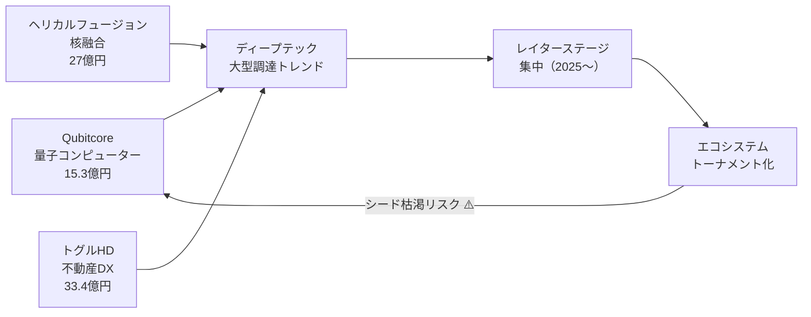
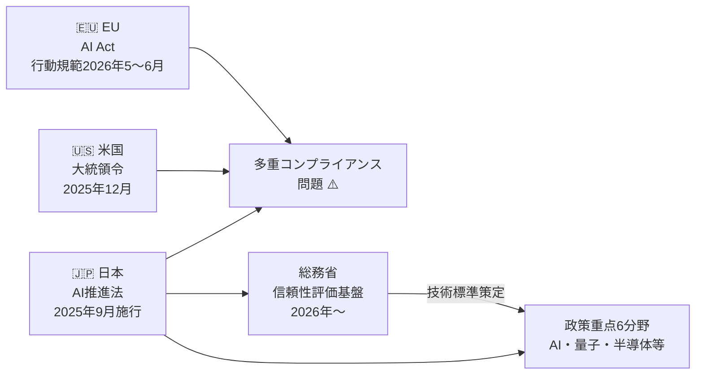
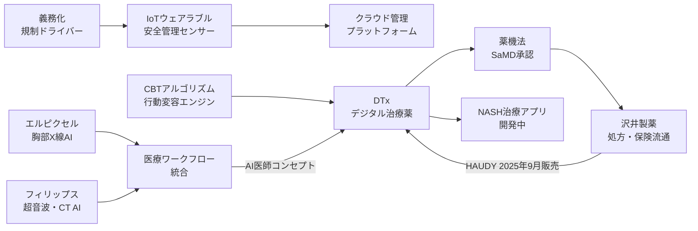

# 🔬 Tech視点 分析
分析日時: 2026-05-02 21:35

---

## 🚀 日本のスタートアップ・資金調達

- **技術的注目点**: <mark>量子コンピューター・核融合・不動産DXという「ディープテック」への集中が顕著で、2026年Q1は件数減少と引き換えに1件あたりの調達規模が拡大している。</mark> 従来のSaaS型スタートアップからハードウェア・物理科学基盤の企業へ投資重心が移行しつつある。
- **📊 データ・数字**: Qubitcore（量子・**15.3億円**）、ヘリカルフュージョン（核融合・**27億円**）、トグルホールディングス（不動産DX・**33.4億円**）。2026年Q1は国内調達総額が**過去最高**を更新したにもかかわらず、調達件数は減少。
- **技術的意義**: 核融合・量子は開発サイクルが10〜20年単位であり、レイターステージ集中傾向との整合性が高い。VC側は「早期発掘」から「勝ち馬への追加投資」へモデルチェンジしており、少数精鋭に資本が集中するトーナメント型エコシステムへの構造転換を示す。
- **展望**: シリーズC以降への集中とディープテック大型化が同時進行する場合、アーリーステージのシード投資が枯渇するリスクがある。量子・核融合は技術TRLが依然低く、商業化タイムラインの精査が投資判断の核心となる。

### 技術関係図（必須）

### 主要指標（必須）

| 指標 | 現状値 | 成長率 | 備考 |
|------|--------|--------|------|
| 2026年Q1調達総額 | 過去最高 | 前年比増 | 件数は減少 |
| Qubitcore調達額 | 15.3億円 | — | 量子コンピューター分野 |
| ヘリカルフュージョン調達額 | 27億円 | — | 核融合分野 |
| トグルHD調達額 | 33.4億円 | — | 不動産DX分野 |
| 主力ステージ | シリーズC以降 | — | 2025年通年トレンド |
| 調達期間傾向 | 長期化 | — | 資金調達の長期化が定着 |

---

## 📊 規制・政策動向

- **技術的注目点**: <mark>日本・EU・米国の三極でAI規制アーキテクチャが異なる方向へ分岐しており、グローバル展開するAI企業は多重コンプライアンス対応を強いられる「規制の非対称性」が深刻化している。</mark>
- **📊 データ・数字**: 日本AI推進法は**2025年5月成立・9月全面施行**。EU AI Actの生成AI行動規範最終版は**2026年5〜6月**公表予定。米国はトランプ政権が**2025年12月**に大統領令に署名。高市政権はAI・量子・半導体など**6分野**を重点支援に指定。
- **技術的意義**: 日本のAI推進法は規制よりも「推進」に重心を置いた設計であり、EUのリスクベースアプローチとは思想が対照的。米国の連邦vs州の対立は企業の法務コストを増大させる。総務省による**生成AI信頼性・安全性評価基盤（2026年〜）**は日本独自の技術標準策定の試みとして注目。
- **展望**: 評価基盤の技術的中身（ベンチマーク設計・レッドチーミング手法・監査プロセス）が未確定であり、標準化の主導権を巡り国際的な技術外交が本格化する。量子・半導体の6分野支援は防衛・経済安保とも連動し、輸出管理との交差点が増える。

### 技術関係図（必須）

### 主要指標（必須）

| 指標 | 現状値 | 施行・公表時期 | 備考 |
|------|--------|----------------|------|
| 日本AI推進法 | 成立・全面施行済 | 2025年5月成立・9月施行 | 推進重視の設計 |
| EU AI Act 行動規範 | 最終版準備中 | 2026年5〜6月公表予定 | 生成AIコンテンツ透明性 |
| 米国大統領令 | 署名済 | 2025年12月 | 州規制への牽制、法的拘束力なし |
| 日本政策重点分野 | 6分野指定 | 2025年10月〜（高市政権） | AI・量子・半導体など |
| 総務省評価基盤 | 開発開始 | 2026年〜 | 生成AI信頼性・安全性 |

---

## 🏥 ヘルスケアテック（詳細分析）

- **技術的注目点**: <mark>ヘルスケアテックは「義務化による市場創出」「AI診断の実用展開」「デジタル治療薬（DTx）の保険適用・商業化」という3つの異なるドライバーが同時に走っており、技術成熟度（TRL）の軸で整理すると各セグメントで全く異なるフェーズにある。</mark>

### 🌡️ セグメント1：職場熱中症対策・IoT安全管理（義務化ドリブン）

- **技術的内容**: 職場熱中症対策の義務化を受け、ウェアラブルセンサー（体温・心拍・発汗）・環境モニタリングIoT・冷温デバイスが一体化したリアルタイム作業者安全管理システムの需要が急伸。クラウド連携による自動アラート・管理者ダッシュボードが標準構成となっている。
- **📊 データ・数字**: 作業者安全管理サービス市場は**107億円**（**前年比2.5倍**）。富士キメラ総研が2026年5月1日に発表。ウェアラブル機器・冷温デバイス市場も連動して拡大。
- **技術的意義**: 規制義務化は「技術の市場投入」を一気に加速させる最強のカタリストであることを再確認。IoTセンサーの精度・電池寿命・耐環境性（熱・湿度）がキーテクノロジーとなる。エッジコンピューティングによる現場判断の即時化も競争軸になり得る。
- **⚠️ 技術的課題**: センサーデータのプライバシー管理（労働者の生体情報）・誤検知率の低減・屋外環境での通信安定性（5G/LTE依存）が解決すべき技術課題として残る。

### 🔬 セグメント2：AI医療診断（画像・診断支援AI）

- **技術的内容**: ITEM2026（2026年4月21日）でエルピクセルが胸部X線解析AI最新版を展示。同社はディープラーニングによる胸部X線の多疾患スクリーニングに加え、「AI医師コンセプト」として診断ワークフロー全体をAI化するビジョンも提示。フィリップス・ジャパンは超音波診断装置2機種（AI自動計測機能搭載）と新型CTを展示。
- **📊 データ・数字**: エルピクセルの胸部X線AIは**最新版**を展示（ITEM2026、2026年4月21日）。フィリップスは**超音波2機種＋CT1機種**を訴求。
- **技術的意義**:
  - 胸部X線AIはすでに医療機器承認（PMDA認証）フェーズにあり、TRLとしては最高水準。実装上の焦点は「放射線科医ワークフローへの統合」と「読影ミスの責任論点」。
  - 「AI医師コンセプト」は診断支援から診断代替へのパラダイムシフトを示唆しており、医師法・医療法との整合性が日本固有の規制ハードルとなる。
  - フィリップスのAI自動計測は超音波の定量化（心機能・胎児計測等）における再現性向上が主目的で、オペレーター技量依存性の低減という実用価値が大きい。
- **⚠️ 技術的課題**: 学習データのバイアス（人種・年齢・装置メーカー間変動）・モデルの説明可能性（XAI）・ドリフト検知と継続的学習の仕組みが産業標準として確立されていない。

### 💊 セグメント3：デジタル治療薬（DTx）——最重点分析

- **技術的内容**: CureApp開発の**HAUDY**（減酒治療補助アプリ）は認知行動療法（CBT）をアプリ化したDTxであり、沢井製薬が**2025年9月から販売開始**。処方医が患者にアプリを「処方」し、アルコール依存・有害使用への行動変容をデータ駆動で支援する。CureAppはさらに**NASH（非アルコール性脂肪肝炎）治療用アプリ**も開発中。
- **📊 データ・数字**: HAUDYは**2025年9月**販売開始（沢井製薬が販売担当）。NASH治療アプリは**開発中**（承認申請時期未定）。DTx市場は「**実装フェーズ**」へ移行中。
- **DTxの技術的構造**:
  - **コア技術**: 認知行動療法（CBT）のアルゴリズム化・行動変容モデル（TTM理論）の実装・患者ジャーニートラッキング
  - **データパイプライン**: 患者入力 → 行動ログ → PHR（個人健康記録） → 処方医フィードバックループ
  - **医療機器承認**: 日本ではプログラム医療機器（SaMD）として薬機法下で承認。治験データに基づく有効性エビデンスが承認要件
  - **ビジネスモデル**: 製薬会社（沢井）が販売担当することで医薬品と同様の処方・保険償還フローを活用
- **技術的意義**:
  - **ソフトウェアが「薬」になる**という概念実証が日本市場で完成しつつある。CureAppの高血圧・禁煙に続きアルコール・NASHへの適応拡大は、同プラットフォームの汎用性を示す。
  - 大手製薬企業（沢井）との提携は、DTxが医薬品の補完から**代替・拡張**へシフトする産業構造変化の前兆。
  - NASHは現在薬物治療の選択肢が限られており、DTxによる生活習慣改善介入は薬剤との併用療法として高いニーズがある。
- **展望**: 保険償還の拡大（現状は限定的）・エビデンス蓄積による適応症拡大・AIによる個別最適化（行動変容介入のパーソナライゼーション）が次の技術的マイルストーン。海外展開においては各国の薬事規制（FDA SaMD・CE MDR等）への対応が必要。
- **⚠️ 技術的課題**: 患者のアプリ継続率（アドヒアランス）・プラセボ効果との有効性分離・長期RCTデータの欠如・処方医のDTxリテラシー不足が普及の技術的・臨床的障壁。

### 技術関係図（必須）

### 主要指標（必須）

| セグメント | 指標 | 現状値 | 成長率 | 備考 |
|-----------|------|--------|--------|------|
| 熱中症対策IoT | 作業者安全管理サービス市場 | **107億円** | **前年比2.5倍** | 富士キメラ総研 2026年5月発表 |
| 熱中症対策IoT | ウェアラブル・冷温デバイス | 好調（詳細未開示） | — | 義務化に連動して拡大 |
| AI診断 | エルピクセル胸部X線AI | 最新版展示 | — | ITEM2026（2026年4月21日） |
| AI診断 | フィリップス展示機種数 | 超音波2機種＋CT1機種 | — | AI自動計測機能搭載 |
| DTx | HAUDY販売開始 | 2025年9月〜 | — | 沢井製薬が流通担当 |
| DTx | NASH治療アプリ | 開発中 | — | CureApp、時期未定 |
| DTx | 市場フェーズ | **実装フェーズ** | — | 概念実証から商業展開へ移行 |

---

## 💡 Tech総合所感

3トピックを横断すると、共通のメタトレンドが浮かぶ。

1. **技術の成熟 × 規制・義務化 = 市場爆発**: 熱中症対策IoTはその典型で、技術は既にあったが義務化が市場を一気に拡大した。AI規制も同様に、標準化競争が技術採用を加速させる可能性がある。
2. **ディープテック × 長期資本 = 新エコシステム**: 量子・核融合への大型調達は、10年スパンの開発を許容する「忍耐資本」の存在を前提とする。日本のVC市場がそれに耐えられるか継続的な検証が必要。
3. **ソフトウェアの医療化（DTx）**: CureApp事例は、SaaS企業が薬機法規制産業に参入する際の完成形ロードマップを示した。アドヒアランス・エビデンス・保険償還の3ハードルを越えたプレイヤーが次の市場を独占する。
