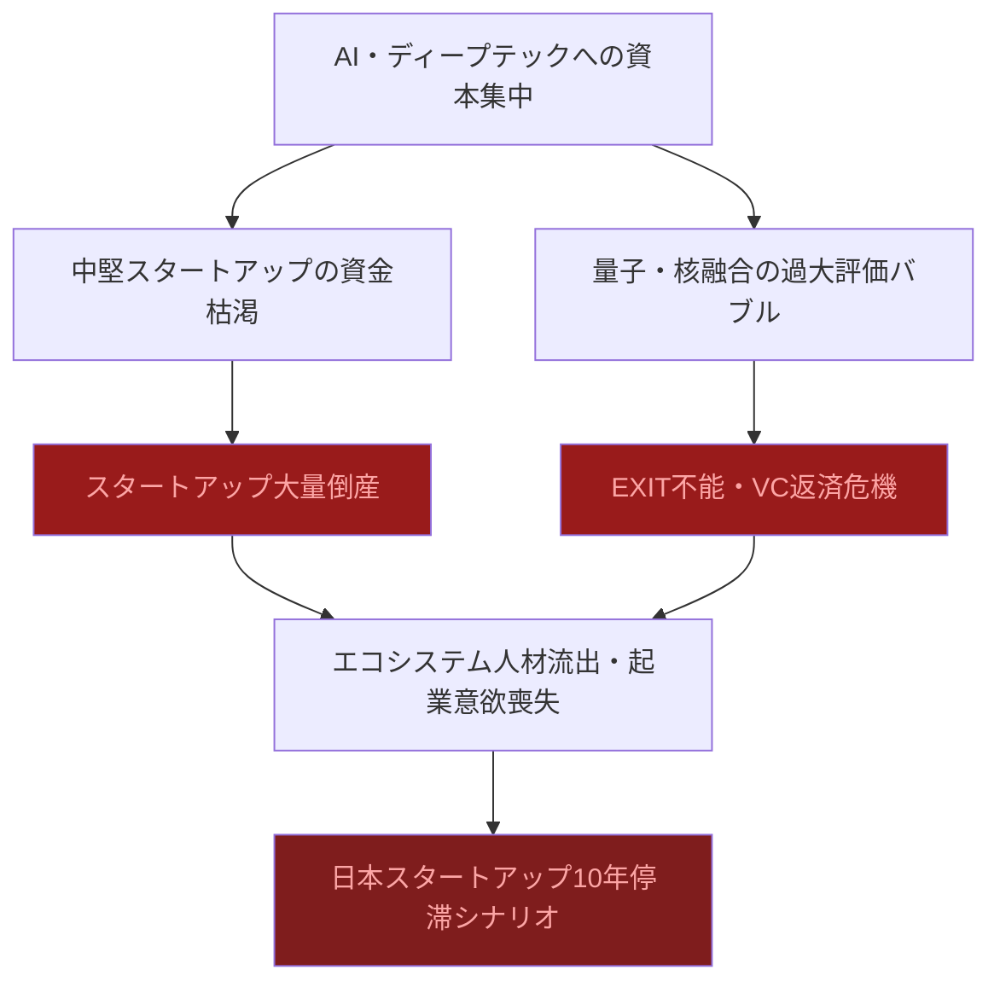
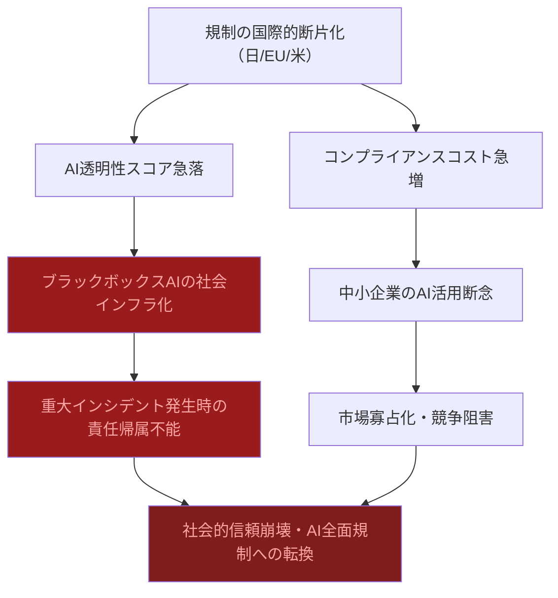
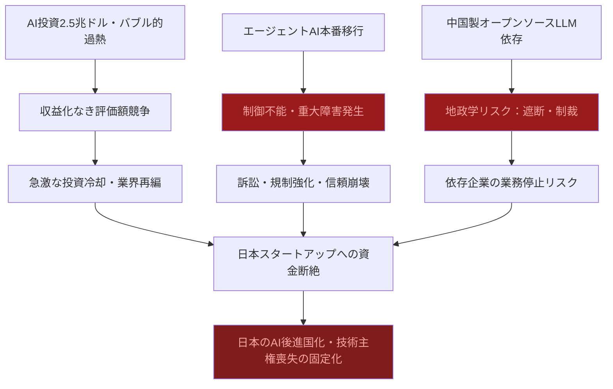

# ⚠️ Critic視点 分析
分析日時: 2026-05-03 21:35

---

## ⚠️ 日本のスタートアップ・資金調達

- **❌ 主なリスク**: 「調達総額が過去最高」という数字は完全なミスリードである。**件数が減少しているにもかかわらず総額が増加**しているという事実は、少数の勝ち組への資本集中であり、エコシステム全体の健全性とは無関係だ。<mark>資金枯渇企業の増加は、この見た目の好景気の裏に大量のゾンビ・スタートアップが生まれていることを示しており、近い将来の連鎖破綻リスクは極めて高い。</mark> 核融合（27億円）・量子コンピュータ（15.3億円）は技術的に商業化まで10〜20年を要する可能性が高く、投資家の期待回収期間と根本的にミスマッチしている。

- **楽観論への反論**: 「多様な領域での調達」という報道は実態を歪曲している。PathAheadの1.36億円と核融合の27億円では規模が20倍異なる。「多様性」と「ロングテールの消滅」を混同させる巧みな情報操作であり、**実際には少数のAI・ディープテック企業がパイを独占し、大多数の中堅スタートアップは資金難で窒息している**。VCの選別志向が強化されたという事実は、失敗企業の増加を間接的に認めており、過去最高調達の裏側でスタートアップ死亡率が急上昇しているとみるべきだ。「延長戦」という表現自体がすでに倒産回避のための時間稼ぎを意味する。

- **🔍 注意すべきポイント**: AI企業への大型調達集中は**AIバブルの典型的な兆候**である。2000年のドットコムバブルと構造が酷似しており、収益化前の「夢への投資」が続いている。量子コンピュータ・核融合といった超長期技術への資金流入はVCのファンド期間（通常10年）と整合せず、**EXIT不能案件が積み上がることでVC自身のLP（出資者）への返済危機を引き起こす**可能性がある。

### リスク連鎖図（必須）

### リスクマトリクス（必須）

| リスク項目 | 発生確率 | 影響度 | 総合評価 | 対策 |
|---|---|---|---|---|
| 資金枯渇スタートアップの連鎖倒産 | **高** | 大 | 🔴 最大級 | 早期の撤退判断・ブリッジ調達 |
| AIバブル崩壊による投資冷却 | **中〜高** | 甚大 | 🔴 最大級 | 収益化を伴うビジネスモデル検証を優先 |
| 量子・核融合投資のEXIT不能化 | **高** | 中 | 🟠 重大 | ファンド期間・回収シナリオの再設計 |
| VCの選別強化による新興企業の資金調達断絶 | **高** | 大 | 🔴 最大級 | 公的資金・CVC活用への依存シフト |
| 二極化加速による中間層スタートアップ消滅 | **高** | 大 | 🟠 重大 | エコシステム多様性維持への政策介入 |

---

## ⚠️ 規制・政策動向

- **❌ 主なリスク**: 「日本AI推進法成立・施行」を成果として語る論調は根本的に危険だ。**法律が成立した事実と、その法律が実効性を持つかどうかは全く別の問題である。** 日本の過去の規制立法（個人情報保護法の形骸化、サイバーセキュリティ基本法の実効性なき運用等）が示す通り、施行後に骨抜きになるパターンは反復してきた。<mark>AI透明性スコアが急落しているという事実は、規制強化と実態の乖離が既に始まっていることの証左であり、企業のガバナンス整備は「形式的なポーズ」に終わるリスクが極めて高い。</mark>

- **楽観論への反論**: AIガバナンス責任者（AI Governance Officer）の設置が「本格化」という報道は欺瞞的である。**肩書きの設置は何も解決しない。** 実権なき名目上のポストが量産されるだけであり、実際の意思決定プロセスにおいてAIリスクが適切に考慮される組織文化が育っているとは到底言えない。EU AI Act行動規範の最終版が2026年5〜6月に公表されるという事実は、規制の国際的な非整合が続くことを意味し、グローバルに事業展開する日本企業は「どの規制に準拠するか」という泥沼のジレンマに陥る。米中AIパフォーマンス差が2.7%まで縮小した事実は、米国主導の規制強化（＝中国への技術制限）が機能していないことを露骨に示しており、**地政学的な規制競争は日本のAI産業を板挟みにする**。

- **🔍 注意すべきポイント**: 規制の国際的な断片化（日本法・EU AI Act・米州法）が進むことで、**コンプライアンスコストが中小企業にとって致命的な参入障壁となる**。大企業のみが規制対応に耐えられる構造が生まれ、市場の寡占化を規制自体が助長するという逆説的な帰結をもたらす。また、AI透明性スコアの急落は、普及率53%という数字と組み合わせると「誰も中身を把握していないAIが社会インフラ化している」という最悪のシナリオが既に進行中であることを示唆している。

### リスク連鎖図（必須）

### リスクマトリクス（必須）

| リスク項目 | 発生確率 | 影響度 | 総合評価 | 対策 |
|---|---|---|---|---|
| 規制形骸化・AGO（AI Governance Officer）の名目化 | **高** | 大 | 🔴 最大級 | 実権付与と外部監査の義務化 |
| 国際規制の非整合によるコンプライアンスコスト爆増 | **高** | 大 | 🔴 最大級 | 国際標準への積極参加・早期アライメント |
| AI透明性スコア低下と社会的信頼喪失 | **中〜高** | 甚大 | 🔴 最大級 | 説明可能AI（XAI）の実装義務化 |
| 重大AIインシデント発生時の法的責任空白 | **中** | 甚大 | 🟠 重大 | 責任主体の明確化立法 |
| 中小企業の規制対応断念による市場退出 | **高** | 中 | 🟠 重大 | 規制サンドボックス・支援制度整備 |

---

## ⚠️ 生成AI・LLM最新動向

- **❌ 主なリスク**: 世界AI投資2.5兆ドル・前年比+44%という数字は、**バブルの絶頂期に常に見られる「投資加速の恍惚」**そのものである。AnthropicがARR300億ドルでOpenAIを「逆転」という報道は、そもそもOpenAI自体が巨額赤字を垂れ流しながら存続している事実を隠蔽しており、業界全体が**収益より評価額の競争に終始している**。<mark>エージェントAIが「信頼の年」を迎えるという楽観的な予測は、実際には制御不能エージェントによる重大障害・詐欺被害・企業秘密漏洩リスクが本番環境に移行することを意味しており、「信頼」ではなく「暴走元年」になるリスクが高い。</mark>

- **楽観論への反論**: 「クラウド巨大モデル＋オンプレSLMの二層構造がスタンダード化」という表現は技術的楽観論の極みである。**この「スタンダード化」は企業の混乱と多額の追加投資コストを意味する**。既存システムへのAI統合は「コアシステムへの統合中」と美しく語られるが、実際には技術的負債の上にAIを積み重ねることで障害リスクが乗算的に増大する。中国製オープンソースLLMの急速台頭は、地政学リスクを内包した技術依存を生み出しており、米中対立激化のシナリオでは**中国製LLMに依存する企業はサプライチェーン遮断という壊滅的リスク**に晒される。推論コストが全体の2/3にシフトするという事実も、AI運用コストの構造的な膨張を示しており、ROI計算が根底から狂うことを意味する。

- **🔍 注意すべきポイント**: 米中AIパフォーマンス差が2.7%まで縮小した事実と、世界AI投資2.5兆ドルの大半が米国・中国に集中している事実を重ねると、**日本は投資でも技術でも完全に蚊帳の外に置かれている**。日本のAI投資940億ドル（世界の3.76%）という数字は、日本が「AIを使わされる側」に確実に転落しつつあることを示している。技術主権の喪失は経済的従属を生み出し、外国AI企業へのデータ依存・料金従属が10年後には取り返しのつかない構造問題になる。エージェントAIの本番環境移行は、AIによる**自律的な意思決定の社会実装であり、その失敗コストは従来のシステム障害と比較にならないほど大きい**。

### リスク連鎖図（必須）

### リスクマトリクス（必須）

| リスク項目 | 発生確率 | 影響度 | 総合評価 | 対策 |
|---|---|---|---|---|
| AI投資バブル崩壊・大規模資金引き上げ | **中〜高** | 甚大 | 🔴 最大級 | 収益化KPIの厳格化・過熱資産への露出限定 |
| エージェントAI暴走による重大インシデント | **高** | 甚大 | 🔴 最大級 | ヒューマン・イン・ザ・ループの義務化 |
| 中国製LLM依存と地政学的遮断リスク | **中** | 甚大 | 🔴 最大級 | マルチベンダー戦略・国産LLM育成 |
| 推論コスト膨張によるROI悪化 | **高** | 大 | 🟠 重大 | コスト上限設定・効率モデルへの移行計画 |
| 日本の技術主権喪失・AI外資依存固定化 | **高** | 甚大 | 🔴 最大級 | 国家レベルのAI主権戦略立案と実行 |
