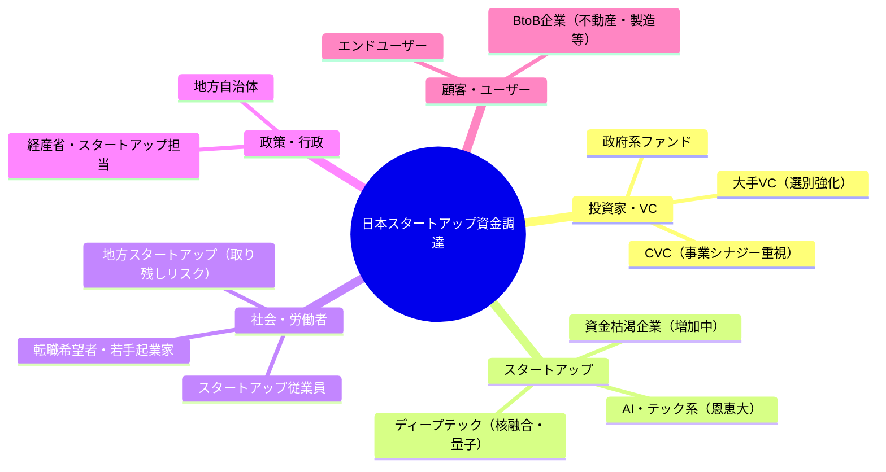
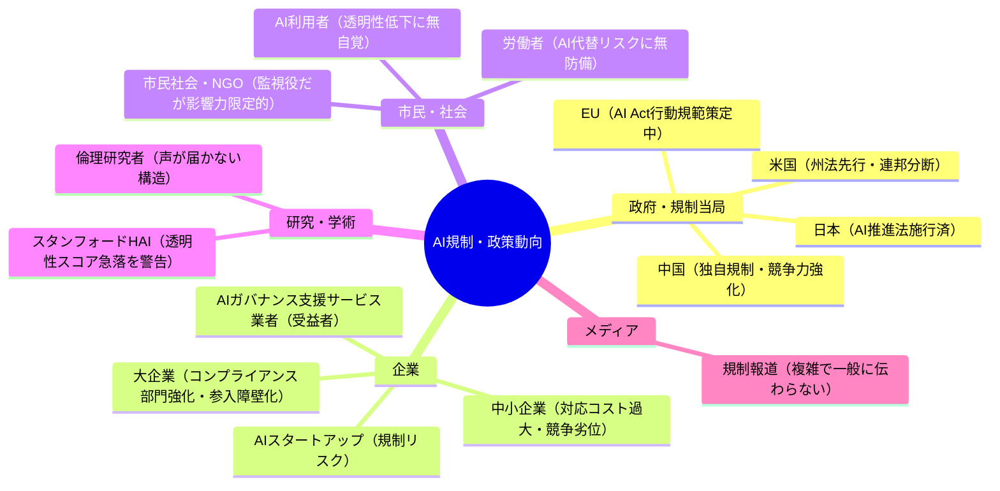
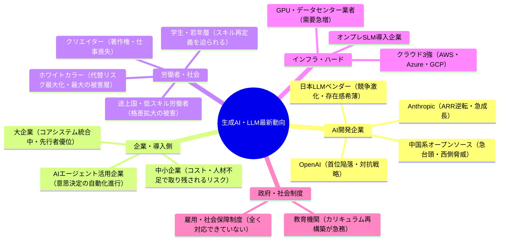

# 🌍 Human視点 分析
分析日時: 2026-05-03 21:35

## 📋 エグゼクティブ・サマリー

3トピック横断で見えてくるのは「数字の華やかさが現場の痛みを覆い隠している」という構造的問題だ。スタートアップ調達は「過去最高」を謳いながら二極化が深刻化し、AI規制は制度先行で実効性を欠き、生成AIは2.5兆ドル規模に達しながらも恩恵の分配は極めて不均等だ。<mark>業界の熱狂と一般市民・中小企業・地方の体感温度の乖離が拡大しており、この矛盾が放置されれば社会的摩擦と反動の火種となる。</mark>

---

## 🌍 日本のスタートアップ・資金調達

- **社会的インパクト**: 核融合・量子コンピュータ・不動産AIなど多領域への投資は表面上は多様に見えるが、実態は<mark>「勝者への集中」が加速し、資金枯渇企業の増加という静かな淘汰が社会全体のイノベーション多様性を損なうリスクがある</mark>。調達件数が減少しているという事実は、夢を語る起業家が次々と脱落していることを意味する。「過去最高の調達総額」という見出しは、成功できる者が急速に絞り込まれている現実を巧みに隠蔽している。
- **💰 ビジネスチャンス**: 過去最高のQ1調達総額を記録（AI企業への大型調達が牽引）。個別ではトグルHD不動産AI **33.4億円**、ヘリカルフュージョン核融合 **27億円**、Qubitcore量子コンピュータ **15.3億円**が目立つ。一方で、大型調達の恩恵を受けられない中小スタートアップ向けの**ブリッジファイナンス支援・生存延命サービス市場**に新たなビジネス機会が生まれている。
- **🔥 話題性・熱量**: 「過去最高」という見出しが一人歩きしがちだが、内実は **二極化の固定化**。VC業界全体が「選択と集中」モードに入っており、熱狂よりも冷静な選別ムードが支配的。核融合・量子という夢の技術への投資は話題性が高いが、事業化までの時間軸と現実の乖離に対して批判的な目が必要だ。さらに、地方・非IT系スタートアップへの資金は依然として届いておらず、東京一極集中が固定化している点は深刻に問われるべきだ。

### ステークホルダーマップ（必須）

### 影響度マトリクス（必須）

| ステークホルダー | 影響度 | 時間軸 | 主なインパクト |
|---|---|---|---|
| AI系スタートアップ（上位層） | ✅ 高 | 短期〜中期 | 大型調達による開発加速・採用拡大 |
| 資金枯渇スタートアップ | ❌ 深刻 | 短期 | 倒産・撤退リスク増大、雇用喪失、創業者の精神的疲弊 |
| 若手起業家・学生起業 | ❌ 中〜高 | 中期 | 高い参入障壁、夢を持ちにくい環境が次世代起業家の芽を摘む |
| 地方・非IT系スタートアップ | ❌ 高 | 中期 | 東京・AI集中により地方格差がさらに拡大 |
| 大手VC・機関投資家 | ✅ 中 | 短期 | 選別投資で収益安定化を図るが長期的なエコシステム多様性を破壊 |
| 一般労働者・転職市場 | 🔍 中 | 中期 | スタートアップ雇用の二極化が転職市場に波及 |
| 政府・経産省 | 🔍 中 | 中〜長期 | 件数減少は政策の再設計を迫る信号であるが対応が遅い |

---

## 🌍 規制・政策動向

- **社会的インパクト**: AIガバナンス責任者（AI Governance Officer）の企業導入が本格化する一方、<mark>「誰がAIを監視するのか」という根本問題は未解決のまま制度だけが先行しており、形式的なコンプライアンスが実質的な透明性を損なう逆説的リスクが高まっている</mark>。スタンフォードHAIがAI透明性スコアの急落を報告していることは、規制強化の裏で実態が悪化している証拠として極めて深刻に受け止めるべきだ。官民ともに「制度を作ったから安心」という錯覚に陥っている危険性がある。
- **💰 ビジネスチャンス**: EU AI Act行動規範の最終版が2026年5〜6月公表予定、米コロラド州包括AI法が2026年6月施行。**AIコンプライアンス支援・監査サービス・AGO（AIガバナンス責任者）育成研修**の需要が急拡大。日本AI推進法の全面施行（2025年9月）により国内企業の対応コストが増大し、支援サービス市場が急成長中。
- **🔥 話題性・熱量**: 規制の話題は政策立案者・法律家・大企業コンプライアンス部門では高温だが、一般市民や中小企業にはほぼ届いていない。**「AI規制＝大企業が有利になる参入障壁」**という批判的視点は、規制議論の場ではほとんど語られず、危険な盲点となっている。米中AIパフォーマンス差が2.7%まで縮小したという事実は、西側の安全保障上の前提を根底から覆す可能性があるが、この危機感が政策議論に反映されていない点は憂慮すべきだ。

### ステークホルダーマップ（必須）

### 影響度マトリクス（必須）

| ステークホルダー | 影響度 | 時間軸 | 主なインパクト |
|---|---|---|---|
| 大企業（グローバル展開） | ❌ 高 | 短期〜中期 | 多重規制対応コストが増大、ただし参入障壁として競合排除に悪用可 |
| 中小企業・スタートアップ | ❌ 深刻 | 短期 | 規制対応リソース不足で競争劣位に直結、最大の被害層 |
| 一般市民・AI利用者 | ⚠️ 高 | 中〜長期 | 透明性スコア急落にもかかわらず保護が全く追いついていない |
| AIガバナンス支援業者 | ✅ 高 | 短期 | 規制複雑化で市場急拡大、規制の失敗から利益を得る皮肉な構造 |
| 政策立案者・官僚 | 🔍 中 | 中期 | 米中パフォーマンス差縮小（2.7%）は安全保障上の深刻な警戒信号 |
| 労働者・組合 | ❌ 中 | 中〜長期 | 規制がAI代替問題に全く対処できておらず致命的な欠陥 |
| 学術・研究機関 | 🔍 中 | 長期 | 警告を発し続けるが政策への反映が常に遅れるジレンマ |

---

## 🌍 生成AI・LLM最新動向

- **社会的インパクト**: 世界AI投資2.5兆ドル（前年比+44%）、Anthropic年間ARR 300億ドルでOpenAIを逆転という数字は壮大だが、<mark>その恩恵が実際に人々の生活・労働・福祉を改善しているかという問いへの答えは、まだ誰も出せていない。「信頼の年」と呼ばれる2026年は、同時に「失望の年」になるリスクを内包している。</mark>エージェントAIの本番移行が進む中、意思決定の人間不在化が静かに、しかし急速に進行しており、その社会的コストは現時点では誰も試算していない。
- **💰 ビジネスチャンス**: クラウド巨大モデル＋オンプレ軽量モデル（SLM）の二層構造スタンダード化により、**企業向けプライベートAI導入支援・オンプレミスSLM最適化コンサルティング**の需要が急拡大。2026年AIコンピュートの2/3が推論用途へシフトするため、推論効率化・コスト削減サービスに大きな商機がある。日本市場は世界のAI投資規模に対し極めて小さく、**グローバルAI企業の日本参入支援・ローカライズ**にも機会が存在する。
- **🔥 話題性・熱量**: AnthropicのARR逆転劇・中国製オープンソースLLMの台頭・エージェントAIの実用化という3つの話題が重なり、業界の熱量は過去最高水準。しかし一般社会では**「AIは便利そうだが自分の仕事はどうなるのか」という漠然とした不安**が支配的であり、業界の熱狂と市民の体感温度の乖離が拡大し続けている。生成AI普及率53%という数字が示すのは、半数近くがまだ恩恵を受けていないという現実でもある。

### ステークホルダーマップ（必須）

### 影響度マトリクス（必須）

| ステークホルダー | 影響度 | 時間軸 | 主なインパクト |
|---|---|---|---|
| AI開発大手（Anthropic等） | ✅ 最高 | 短期 | ARR急成長・市場シェア争奪戦が激化、寡占化リスクを内包 |
| ホワイトカラー労働者 | ❌ 深刻 | 短期〜中期 | エージェントAI本番化で業務代替が現実化、最大の被害層であるが議論が表層的 |
| 中小企業の経営者 | ❌ 高 | 中期 | 大企業との格差が拡大、AI未導入企業は競争から脱落するリスクが現実化 |
| クリエイター・文化産業 | ❌ 高 | 短期〜中期 | 生成AI普及率53%は文化・著作物の商業価値を直撃し仕事を奪う |
| AI推論インフラ業者 | ✅ 高 | 短期 | コンピュートの2/3が推論用途へ転換し需要急増・短期的受益者 |
| 教育機関・学術 | 🔍 高 | 中〜長期 | LLMに依存した「思考しない世代」育成リスクを直視すべきであるが対策なし |
| 一般市民・社会全体 | ⚠️ 最高 | 中〜長期 | AI恩恵の分配不均衡が社会的不満・格差拡大に直結し、最終的に政治的反動を招く |

---

## 💡 総合所感・アクション提言

**今すぐ直視すべき構造的問題**:

1. ❌ **二極化の固定化**: スタートアップ調達の件数減少は「健全な選別」ではなく「夢の淘汰」であり、次世代イノベーションの種を摘んでいる可能性がある
2. ❌ **規制の逆機能**: 制度整備が大企業の参入障壁として機能し、中小・スタートアップを排除する構造になっていないか、批判的検証が必要
3. ❌ **恩恵の不均等分配**: AI投資2.5兆ドルの果実が一部プレイヤーに集中し、労働者・市民・途上国への再分配メカニズムが存在しない
4. 🔍 **透明性スコアの急落**: 規制が強化されているにもかかわらずAI透明性が悪化しているという逆説は、現行の規制アプローチが根本的に誤っている可能性を示す
5. ⚠️ **「信頼の年」への過信**: エージェントAIの本番化を「信頼フェーズ」と前向きに呼ぶことで、実際のリスクと意思決定の人間不在化が軽視されている
