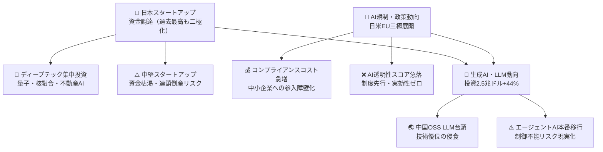
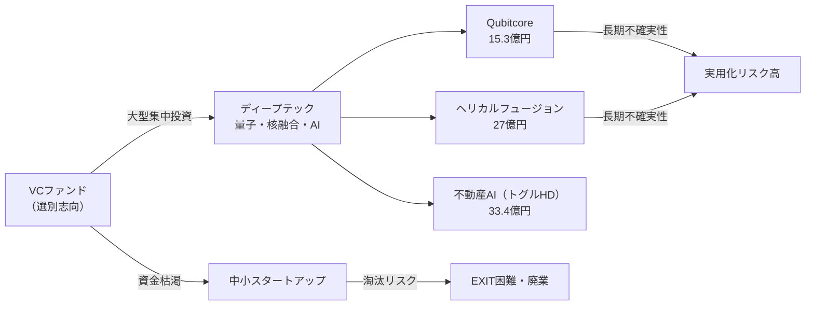
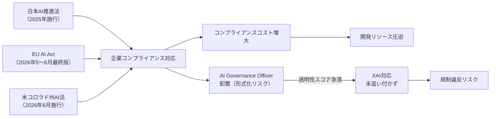
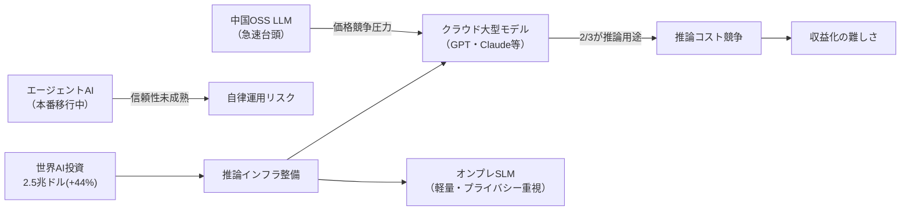
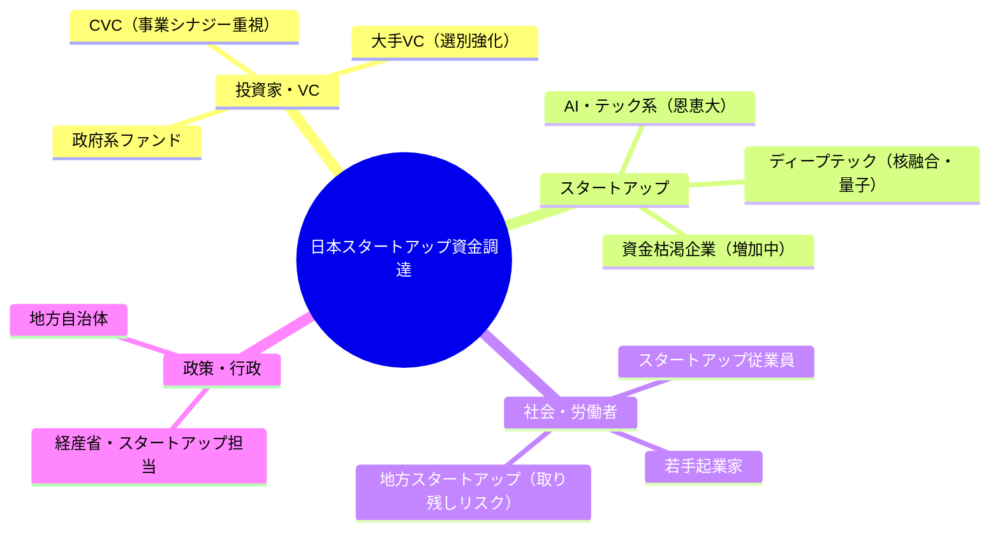
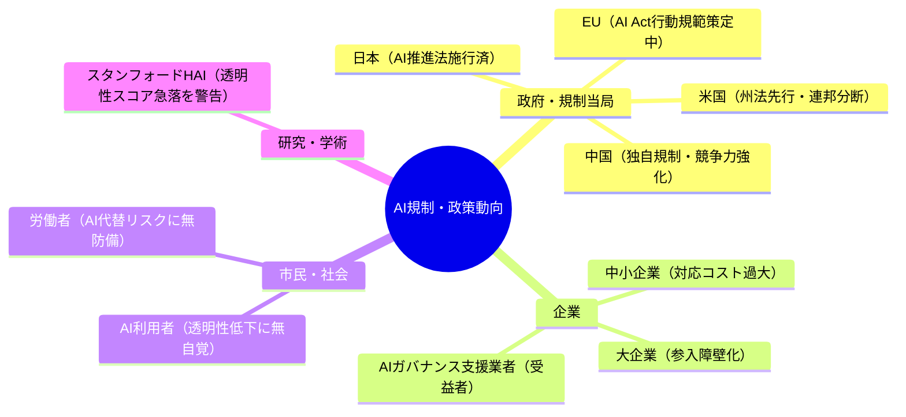
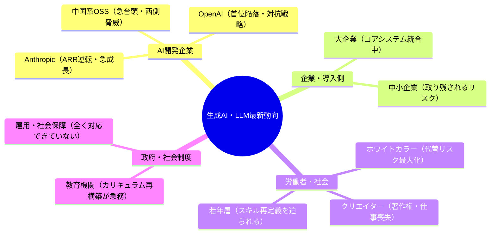
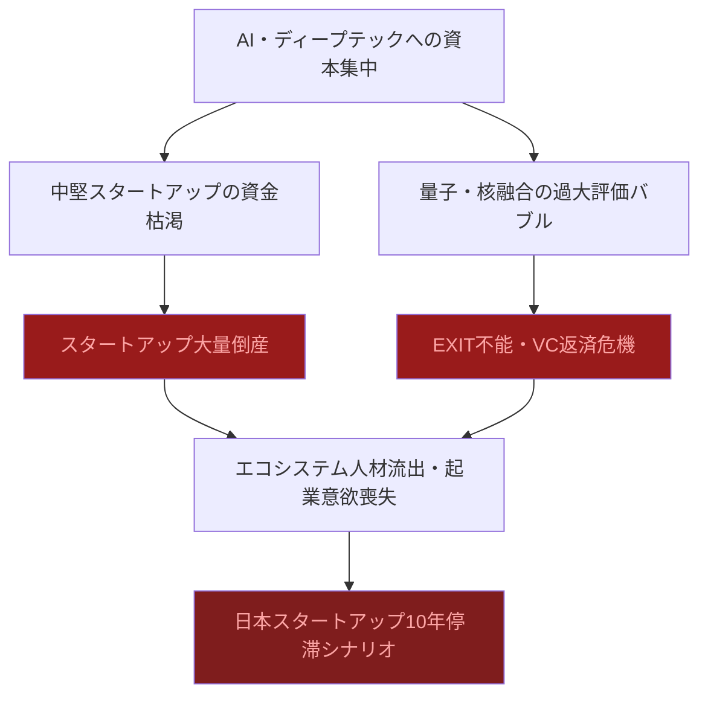
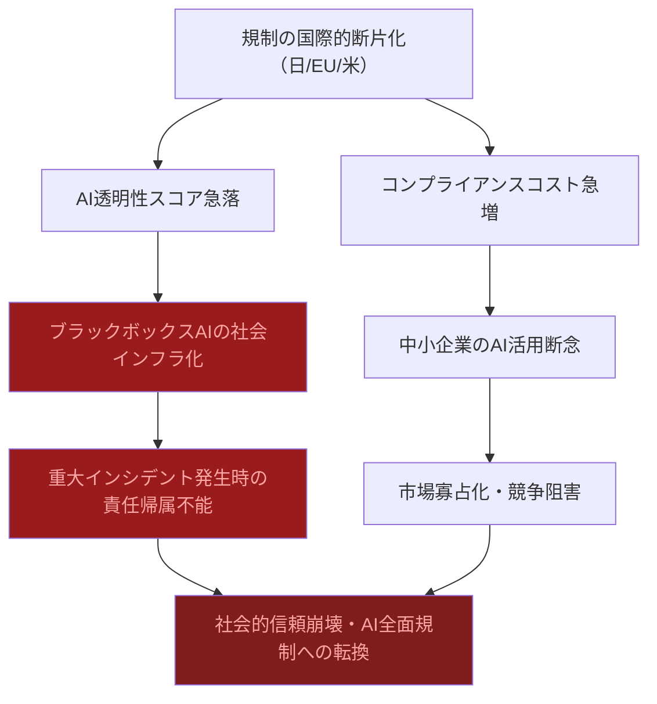
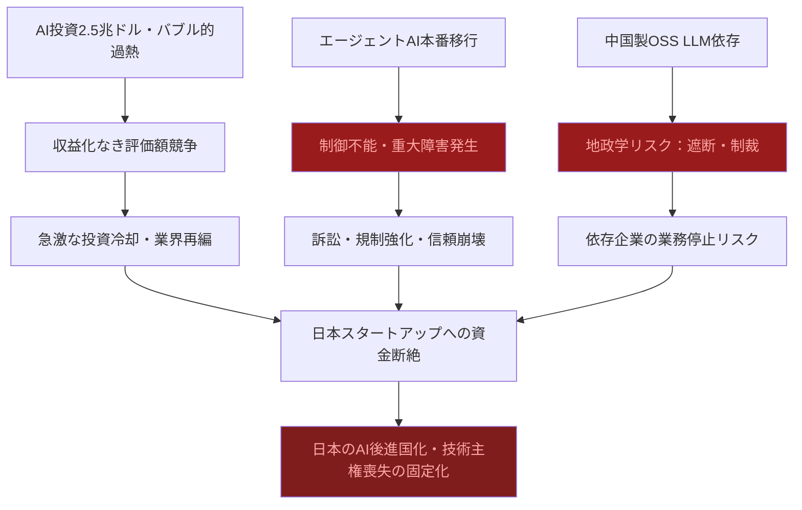

# 📊 トレンド日報 2026-05-03

## 📋 エグゼクティブ・サマリー

> **本日の重要トピック**: 日本のスタートアップ・資金調達、規制・政策動向、生成AI・LLM最新動向

> 2026年Q1の国内スタートアップ調達総額は過去最高を記録したが、その実態は少数AI・ディープテック企業への資本集中であり、調達件数は減少する二極化が進行している。AI規制は日米EU三極で制度整備が進むも、スタンフォードHAIが報告するAI透明性スコアの急落が示すとおり、制度先行・実効性後退という矛盾が深刻化している。生成AI市場では世界投資額が前年比+44%の**2.5兆ドル**に達し、Anthropicが年間ARR**300億ドル**でOpenAIを逆転したが、<mark>エージェントAIの本番移行が「信頼の年」ではなく「暴走元年」になるリスクを業界は直視できていない。日本は投資額・技術力ともに蚊帳の外に置かれつつあり、AI技術主権喪失の分岐点に差し掛かっている。</mark>

---

## 🗺️ トピック関係図

---

## 🔬 Tech視点

### 🚀 日本のスタートアップ・資金調達

- **技術的注目点**: 量子コンピュータ（Qubitcore: **15.3億円**）・核融合（ヘリカルフュージョン: **27億円**）・不動産AI（トグルHD: **33.4億円**）と、ディープテック領域への大型調達が複数発生。<mark>ただし調達件数全体は減少しており、「過去最高」の数字は一部大型案件が統計を押し上げているに過ぎない。</mark>
- **📊 データ・数字**: 2026年Q1資金調達総額は過去最高更新。全体件数は減少。PathAhead 1.36億円、Qubitcore 15.3億円、ヘリカルフュージョン 27億円、トグルHD 33.4億円。
- **技術的意義**: 量子・核融合への資金流入は注目に値するが、**実用化まで10〜20年以上かかる可能性**があり短期的な事業収益化の見通しは厳しい。
- **展望**: 技術的差別化が明確でないスタートアップは資金調達が困難化。ディープテック投資増加と資金枯渇企業増加の二極化が同時進行。

| 指標 | 現状値 | 備考 |
|------|--------|------|
| Q1調達総額 | 過去最高 | 上位集中による統計的歪み有り |
| 全体調達件数 | 減少 | 二極化の証拠 |
| ヘリカルフュージョン | 27億円 | 商用化は2030年代以降 |
| Qubitcore（量子） | 15.3億円 | 実用化まで5〜10年以上 |

### 🚀 規制・政策動向

- **技術的注目点**: AIガバナンス責任者（AI Governance Officer）の企業配置が本格化。<mark>しかし「配置が増えた」ことと「実効的なガバナンスが機能している」ことは別問題で、形式的な対応に留まるリスクが高い。</mark>スタンフォードHAIのAIインデックス2026では**AI透明性スコアが急落**しており、説明可能AI（XAI）への対処は世界的に遅れている。
- **📊 データ・数字**: 米中AIパフォーマンス差 **2.7%まで縮小**。生成AI普及率 **53%**。AI透明性スコア **急落**。日本AI推進法2025年9月全面施行済み。EU AI Act行動規範最終版2026年5〜6月公表予定。
- **技術的意義**: 規制の多様化・並列化が進み、グローバル展開企業は日・EU・米で異なる要件に対応が必要。**コンプライアンスコストが技術開発リソースを圧迫する構造的問題**が発生。
- **展望**: 透明性スコアの急落は深刻。企業・政府がAIを普及させながら説明可能性を後回しにした結果であり、規制強化と技術的未成熟の衝突局面が迫っている。

| 指標 | 現状値 | 評価 |
|------|--------|------|
| 米中AIパフォーマンス差 | **2.7%** | ⚠️ 急速縮小 |
| 生成AI普及率 | **53%** | 過半数超え |
| AI透明性スコア | **急落** | ❌ 深刻 |
| 日本AI推進法 | 2025年9月施行済み | 実効性未検証 |

### 🚀 生成AI・LLM最新動向

- **技術的注目点**: 推論用途へのコンピュートシフト（2026年は全AI計算の **2/3が推論**）は、トレーニングコスト競争から**推論効率競争**への構造転換を意味する。<mark>中国製オープンソースLLMの急速台頭は西側の技術的優位性が想定より速く失われつつあることを示している。</mark>
- **📊 データ・数字**: 世界AI投資 **2.5兆ドル**（前年比+44%）。Anthropic年間ARR **300億ドル**（OpenAIを逆転）。2026年AIコンピュートの **2/3が推論用途**。
- **技術的意義**: エージェントAIの本番環境移行は技術的には「動く」段階だが、**信頼性・セキュリティ・エラー回復機能の成熟度は本番要件未達**。投資額の拡大が直ちに技術的成熟を意味しない。
- **展望**: 年間ARR 300億ドルでもビジネスモデルとしての持続可能性・計算コストの収益化は未解決。中国オープンソースLLMの台頭によりプロプライエタリモデルの価格優位性は長期的に低下する。

| 指標 | 現状値 | 成長率 | 備考 |
|------|--------|--------|------|
| 世界AI投資総額 | **2.5兆ドル** | **+44%** | 過熱感あり |
| Anthropic年間ARR | **300億ドル** | — | OpenAIを逆転 |
| 推論用コンピュート比率 | **全体の2/3** | 増加中 | 構造転換 |
| 中国OSS LLMシェア | 急速台頭 | — | 技術優位侵食リスク |

---

## 🌍 Human視点

### 🌍 日本のスタートアップ・資金調達

- **社会的インパクト**: 調達件数の減少は夢を持つ起業家が次々と脱落していることを意味する。<mark>「過去最高の調達総額」という見出しは、成功できる者が急速に絞り込まれている現実を巧みに隠蔽している。</mark>地方・非IT系スタートアップへの資金は依然届かず、東京・AI集中による地方格差が固定化している。
- **💰 ビジネスチャンス**: 大型調達の恩恵を受けられない中小スタートアップ向けの**ブリッジファイナンス支援・生存延命サービス市場**に新たなビジネス機会が生まれている。
- **🔥 話題性・熱量**: VC業界全体が「選択と集中」モードに入っており、熱狂よりも冷静な選別ムードが支配的。核融合・量子という夢の技術への投資は話題性が高いが、事業化までの時間軸と現実の乖離は批判的に見る必要がある。

| ステークホルダー | 影響度 | 時間軸 | 主なインパクト |
|---|---|---|---|
| AI系スタートアップ（上位層） | ✅ 高 | 短期〜中期 | 大型調達による開発加速 |
| 資金枯渇スタートアップ | ❌ 深刻 | 短期 | 倒産・撤退リスク増大 |
| 若手起業家・学生起業 | ❌ 中〜高 | 中期 | 高い参入障壁で次世代起業家の芽を摘む |
| 地方・非IT系スタートアップ | ❌ 高 | 中期 | 東京・AI集中により地方格差拡大 |

### 🌍 規制・政策動向

- **社会的インパクト**: 「誰がAIを監視するのか」という根本問題は未解決のまま制度だけが先行。<mark>形式的なコンプライアンスが実質的な透明性を損なう逆説的リスクが高まっている。</mark>官民ともに「制度を作ったから安心」という錯覚に陥っている危険性がある。
- **💰 ビジネスチャンス**: AIコンプライアンス支援・監査サービス・**AGO（AIガバナンス責任者）育成研修**の需要が急拡大。日本AI推進法全面施行により国内企業の対応コストが増大し支援サービス市場が急成長。
- **🔥 話題性・熱量**: 規制の話題は政策立案者・大企業コンプライアンス部門では高温だが、一般市民や中小企業にはほぼ届いていない。**「AI規制＝大企業が有利になる参入障壁」**という批判的視点は危険な盲点となっている。

| ステークホルダー | 影響度 | 時間軸 | 主なインパクト |
|---|---|---|---|
| 大企業（グローバル展開） | ❌ 高 | 短〜中期 | 多重規制コスト増大、参入障壁として悪用可 |
| 中小企業・スタートアップ | ❌ 深刻 | 短期 | 規制対応リソース不足で競争劣位に直結 |
| 一般市民・AI利用者 | ⚠️ 高 | 中〜長期 | 透明性スコア急落にもかかわらず保護が追いついていない |
| AIガバナンス支援業者 | ✅ 高 | 短期 | 規制複雑化で市場急拡大 |

### 🌍 生成AI・LLM最新動向

- **社会的インパクト**: 世界AI投資2.5兆ドルという数字は壮大だが、<mark>その恩恵が実際に人々の生活・労働・福祉を改善しているかという問いへの答えは誰も出せていない。「信頼の年」は「失望の年」になるリスクを内包している。</mark>エージェントAIの本番移行が進む中、意思決定の人間不在化が急速に進行し、その社会的コストは誰も試算していない。
- **💰 ビジネスチャンス**: クラウド巨大モデル＋オンプレSLMの二層構造スタンダード化により、**企業向けプライベートAI導入支援・オンプレミスSLM最適化コンサルティング**の需要が急拡大。推論効率化・コスト削減サービスに大きな商機。
- **🔥 話題性・熱量**: 業界の熱量は過去最高水準。一方で一般社会では**「AIは便利そうだが自分の仕事はどうなるのか」という漠然とした不安**が支配的であり、業界の熱狂と市民の体感温度の乖離が拡大し続けている。

| ステークホルダー | 影響度 | 時間軸 | 主なインパクト |
|---|---|---|---|
| AI開発大手（Anthropic等） | ✅ 最高 | 短期 | ARR急成長・寡占化リスク内包 |
| ホワイトカラー労働者 | ❌ 深刻 | 短〜中期 | エージェントAI本番化で業務代替が現実化 |
| 中小企業の経営者 | ❌ 高 | 中期 | 大企業との格差が拡大 |
| 一般市民・社会全体 | ⚠️ 最高 | 中〜長期 | 恩恵の分配不均衡が社会的不満・格差拡大に直結 |

---

## ⚠️ Critic視点

### ⚠️ 日本のスタートアップ・資金調達

- **❌ 主なリスク**: 「調達総額が過去最高」という数字は完全なミスリードである。件数が減少しているにもかかわらず総額が増加しているという事実は、少数の勝ち組への資本集中であり、エコシステム全体の健全性とは無関係だ。<mark>資金枯渇企業の増加は、この見た目の好景気の裏に大量のゾンビ・スタートアップが生まれていることを示しており、近い将来の連鎖破綻リスクは極めて高い。</mark>
- **楽観論への反論**: 「多様な領域での調達」は実態を歪曲している。PathAheadの1.36億円と核融合の27億円では規模が20倍異なる。**実際には少数のAI・ディープテック企業がパイを独占し、大多数の中堅スタートアップは資金難で窒息している**。
- **🔍 注意すべきポイント**: AI企業への大型調達集中は**AIバブルの典型的な兆候**。2000年のドットコムバブルと構造が酷似しており、量子・核融合投資はファンド期間（通常10年）と整合せず、**EXIT不能案件が積み上がることでVC自身のLP（出資者）への返済危機**を引き起こす可能性がある。

| リスク項目 | 発生確率 | 影響度 | 総合評価 | 対策 |
|---|---|---|---|---|
| 資金枯渇スタートアップの連鎖倒産 | **高** | 大 | 🔴 最大級 | 早期の撤退判断・ブリッジ調達 |
| AIバブル崩壊による投資冷却 | **中〜高** | 甚大 | 🔴 最大級 | 収益化を伴うビジネスモデル検証を優先 |
| VCの選別強化による新興企業の調達断絶 | **高** | 大 | 🔴 最大級 | 公的資金・CVC活用へのシフト |

### ⚠️ 規制・政策動向

- **❌ 主なリスク**: 法律が成立した事実と、その法律が実効性を持つかは全く別の問題だ。日本の過去の規制立法が示す通り、施行後に骨抜きになるパターンは反復してきた。<mark>AI透明性スコアが急落しているという事実は、規制強化と実態の乖離が既に始まっていることの証左であり、企業のガバナンス整備は「形式的なポーズ」に終わるリスクが極めて高い。</mark>
- **楽観論への反論**: AIガバナンス責任者（AGO）の設置が「本格化」という報道は欺瞞的だ。**肩書きの設置は何も解決しない。** 実権なき名目上のポストが量産されるだけ。米中AIパフォーマンス差が2.7%まで縮小した事実は、米国主導の技術制限が機能していないことを露骨に示しており、**地政学的な規制競争は日本のAI産業を板挟み**にする。
- **🔍 注意すべきポイント**: 規制の断片化（日本法・EU AI Act・米州法）が進むことで、**コンプライアンスコストが中小企業にとって致命的な参入障壁**となる。AI透明性スコアの急落と普及率53%を重ねると、「誰も中身を把握していないAIが社会インフラ化している」という最悪のシナリオが既に進行中だ。

| リスク項目 | 発生確率 | 影響度 | 総合評価 | 対策 |
|---|---|---|---|---|
| 規制形骸化・AGOの名目化 | **高** | 大 | 🔴 最大級 | 実権付与と外部監査の義務化 |
| 国際規制の非整合によるコスト爆増 | **高** | 大 | 🔴 最大級 | 国際標準への積極参加 |
| AI透明性スコア低下と社会的信頼喪失 | **中〜高** | 甚大 | 🔴 最大級 | 説明可能AI（XAI）の実装義務化 |

### ⚠️ 生成AI・LLM最新動向

- **❌ 主なリスク**: 世界AI投資2.5兆ドル・前年比+44%は**バブルの絶頂期に常に見られる「投資加速の恍惚」**そのものだ。Anthropicの「ARR逆転」報道は、そもそもOpenAI自体が巨額赤字を垂れ流しながら存続している事実を隠蔽しており、業界全体が**収益より評価額の競争に終始**している。<mark>エージェントAIが「信頼の年」を迎えるという楽観的な予測は、実際には制御不能エージェントによる重大障害・詐欺被害・企業秘密漏洩リスクが本番環境に移行することを意味しており、「信頼」ではなく「暴走元年」になるリスクが高い。</mark>
- **楽観論への反論**: 「二層構造がスタンダード化」は技術的楽観論の極みだ。**この「スタンダード化」は企業の混乱と多額の追加投資コスト**を意味する。中国製オープンソースLLMに依存する企業は、米中対立激化シナリオでは**サプライチェーン遮断という壊滅的リスク**に晒される。
- **🔍 注意すべきポイント**: 世界AI投資2.5兆ドルの大半が米中に集中、**日本は投資でも技術でも完全に蚊帳の外**に置かれている。日本のAI投資約940億ドル（世界の3.76%）という数字は、日本が「AIを使わされる側」に転落しつつあることを示している。技術主権の喪失は経済的従属を生み出し、外国AI企業へのデータ依存・料金従属が10年後には取り返しのつかない構造問題になる。

| リスク項目 | 発生確率 | 影響度 | 総合評価 | 対策 |
|---|---|---|---|---|
| AI投資バブル崩壊・大規模資金引き上げ | **中〜高** | 甚大 | 🔴 最大級 | 収益化KPIの厳格化 |
| エージェントAI暴走による重大インシデント | **高** | 甚大 | 🔴 最大級 | ヒューマン・イン・ザ・ループの義務化 |
| 中国製LLM依存と地政学的遮断リスク | **中** | 甚大 | 🔴 最大級 | マルチベンダー戦略・国産LLM育成 |
| 日本の技術主権喪失・AI外資依存固定化 | **高** | 甚大 | 🔴 最大級 | 国家レベルのAI主権戦略立案と実行 |

---

## 💡 総合所感・アクション提言

**3トピック横断で見えるメガトレンド**: 数字は「過去最高」「前年比増」が並ぶが、件数の減少・透明性スコアの急落・中国台頭という逆風を同時に読む必要がある。**業界の熱狂と一般市民・中小企業・地方の体感温度の乖離が拡大**しており、この矛盾が放置されれば社会的摩擦と反動の火種となる。

**今すぐ取るべきアクション**:

1. 🔍 **AIバブルに備えるポートフォリオ見直し**: スタートアップ投資は収益化KPIを厳格化し、ディープテック（量子・核融合）への過剰露出を点検する
2. ⚠️ **AGO（AIガバナンス責任者）の実権確保**: 形式的な設置に終わらせず、実際の意思決定プロセスへの関与と外部監査の仕組みを同時に設計すること
3. 🌍 **中国製LLM依存リスクのヘッジ**: マルチベンダー戦略を今から設計し、地政学リスクによるサービス停止シナリオに備える
4. 🚀 **エージェントAIへの人間監視の義務化**: 本番移行するエージェントには必ずヒューマン・イン・ザ・ループを設け、完全自律運用は段階的に、かつ検証済み領域に限定する
5. 📊 **日本AI主権戦略への参加**: 世界AI投資の3.76%しか占めない日本として、国産LLM育成・データ主権の確保を政策議論の最優先に押し上げる

---

*レポート生成: 2026-05-03 | RUN_ID: 20260503-213548 | スカウト＆アナリスト方式*
