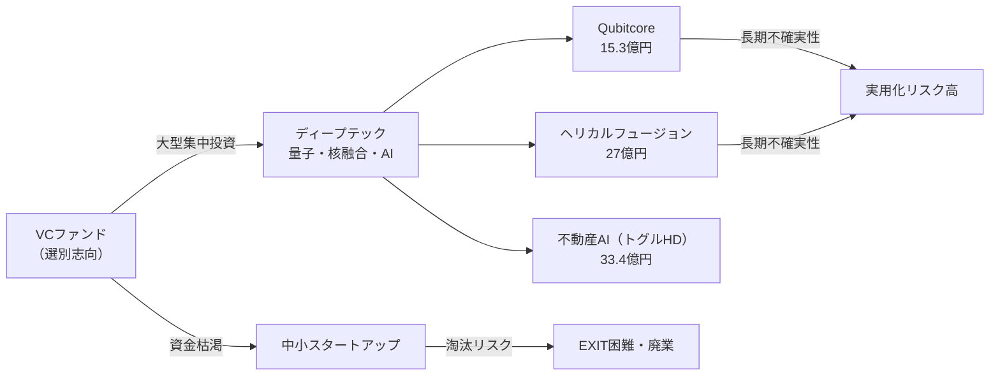
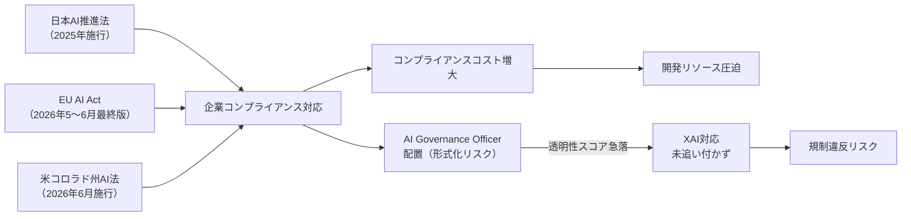
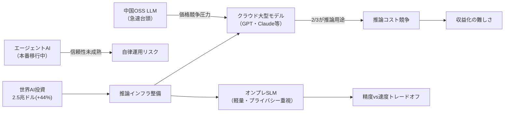

# 🔬 Tech視点 分析
分析日時: 2026-05-03 21:35

## 🚀 日本のスタートアップ・資金調達

- **技術的注目点**: 量子コンピュータ（Qubitcore: 15.3億円）・核融合（ヘリカルフュージョン: 27億円）・不動産AI（トグルHD: 33.4億円）と、ディープテック領域への大型調達が複数発生している。<mark>ただし調達件数全体は減少しており、「過去最高」の数字は一部大型案件が統計を押し上げているに過ぎない点に注意が必要。</mark>
- **📊 データ・数字**: 2026年Q1資金調達総額は過去最高を更新。一方で全体件数は減少。代表的案件：PathAhead 1.36億円、Qubitcore 15.3億円、ヘリカルフュージョン 27億円、トグルHD 33.4億円。
- **技術的意義**: 量子・核融合という極めて長期かつ不確実性の高い技術分野に国内VCが資金を投じている点は注目に値する。しかしこれらは実用化までの道のりが長く、**短期的な事業収益化の見通しは厳しい**。技術的なマイルストーン未達によるダウンラウンドリスクは常に存在する。
- **展望**: VCの選別志向強化により、技術的差別化が明確でないスタートアップは資金調達が困難になる。ディープテック投資は増えているが、資金枯渇企業の増加という二極化も同時進行しており、全体として楽観視できる状況ではない。

### 技術関係図（必須）

### 主要指標（必須）

| 指標 | 現状値 | 成長率 | 備考 |
|------|--------|--------|------|
| Q1調達総額 | 過去最高（具体額非公開） | 前年比増 | 上位集中による統計的歪み有り |
| 全体調達件数 | 減少 | マイナス | 二極化の証拠 |
| Qubitcore（量子） | 15.3億円 | — | 実用化まで5〜10年以上とみられる |
| ヘリカルフュージョン（核融合） | 27億円 | — | 商用化は2030年代以降が現実的 |
| トグルHD（不動産AI） | 33.4億円 | — | 比較的短期収益化の可能性あり |

---

## 🚀 規制・政策動向

- **技術的注目点**: AIガバナンス責任者（AI Governance Officer）の企業配置が本格化しているが、<mark>「配置が増えた」ことと「実効的なガバナンスが機能している」ことは別問題であり、形式的な対応に留まるリスクが高い。</mark>スタンフォードHAIのAIインデックス2026では**AI透明性スコアが急落**しており、技術的な説明可能性（XAI）への対処は世界的に遅れている。
- **📊 データ・数字**: 日本AI推進法 2025年成立・9月全面施行済み。EU AI Act行動規範最終版 2026年5〜6月公表予定。米コロラド州包括AI法 2026年6月施行。米中AIパフォーマンス差 **2.7%まで縮小**。生成AI普及率 **53%**。AI透明性スコア **急落**。
- **技術的意義**: 規制の多様化・並列化が進んでおり、グローバルに展開する企業はEU・米州・日本それぞれ異なる要件に対応しなければならない。**コンプライアンスコストが増大し、技術開発リソースを圧迫する構造的問題**が生じている。米中のパフォーマンス差縮小（2.7%）は、技術的優位性の喪失リスクを西側諸国に突きつけている。
- **展望**: 透明性スコアの急落は深刻。企業・政府ともにAIを普及させながら説明可能性を後回しにしてきた結果であり、規制強化と技術的未成熟が衝突する局面が近い。AI Governance Officer の増加が「形だけの対応」に終わるかどうかが今後の焦点。

### 技術関係図（必須）

### 主要指標（必須）

| 指標 | 現状値 | 評価 | 備考 |
|------|--------|------|------|
| 米中AIパフォーマンス差 | 2.7% | ⚠️ 要警戒 | 急速に縮小中 |
| 生成AI普及率 | 53% | — | 過半数超え、だが品質・安全性は別問題 |
| AI透明性スコア | 急落 | ❌ 深刻 | 普及拡大と逆行 |
| 日本AI推進法施行 | 2025年9月 | ✅ 施行済み | 実効性は未検証 |
| EU AI Act行動規範 | 2026年5〜6月公表予定 | 🔍 要注視 | 最終版により要件変動の可能性 |

---

## 🚀 生成AI・LLM最新動向

- **技術的注目点**: 推論用途へのコンピュートシフト（2026年は全AI計算の **2/3が推論**）は、トレーニングコスト競争から**推論効率競争**への構造転換を意味する。<mark>これはモデルサイズの巨大化競争に一定の終止符を打ちつつあるが、推論インフラの整備コストという新たな技術的課題を生む。</mark>中国製オープンソースLLMの急速台頭は、西側の技術的優位性が想定より速く失われつつあることを示している。
- **📊 データ・数字**: 世界AI投資 **2.5兆ドル**（前年比+44%）。Anthropic年間ARR **300億ドル**（OpenAIを逆転）。2026年AIコンピュートの **2/3が推論用途**。クラウド大型モデル＋オンプレSLMの二層構造が標準化。
- **技術的意義**: エージェントAIの本番環境移行は技術的には「動く」段階に達しているが、**信頼性・セキュリティ・エラー回復機能の成熟度が本番要件に達しているかは別問題**。「信頼の年」という楽観的表現とは裏腹に、エージェントAIはまだ人間監視なしの完全自律運用には程遠い。クラウド＋SLMの二層構造も、エッジデバイスでの推論精度と応答速度のトレードオフが技術的課題として残る。
- **展望**: 投資額の拡大が直ちに技術的成熟を意味しない。年間ARR 300億ドルでもビジネスモデルとしての持続可能性・計算コストの収益化は未解決のままである。中国オープンソースLLMの台頭により、プロプライエタリモデルの価格優位性は長期的に低下する可能性が高い。

### 技術関係図（必須）

### 主要指標（必須）

| 指標 | 現状値 | 成長率 | 備考 |
|------|--------|--------|------|
| 世界AI投資総額 | 2.5兆ドル | +44% | 過熱感あり、持続可能性不透明 |
| Anthropic年間ARR | 300億ドル | — | OpenAIを逆転、ただしコスト構造は非公開 |
| 推論用コンピュート比率 | 全体の2/3 | 増加中 | トレーニング偏重からの構造転換 |
| 中国OSS LLMシェア | 急速台頭（定量値不明） | — | 西側技術優位の侵食リスク |
| 生成AI企業統合率 | コアシステムへ統合中 | — | 統合の質・深度にばらつき大 |

---

## 💡 Tech総合所感

**3トピック横断で見えるメガトレンド**: 資金調達の二極化・AI規制の多重化・LLM市場の推論シフトはいずれも「成長の踊り場」を示している。数字は過去最高・前年比増が並ぶが、**件数の減少・透明性スコアの急落・中国台頭という逆風を同時に読む必要がある**。

技術者が今最も注視すべきは、**XAI（説明可能AI）の実装遅れ**と**推論コスト収益化の未解決問題**である。楽観的な投資数字の裏に潜む構造的課題を直視することが、技術的に正確な現状認識につながる。
