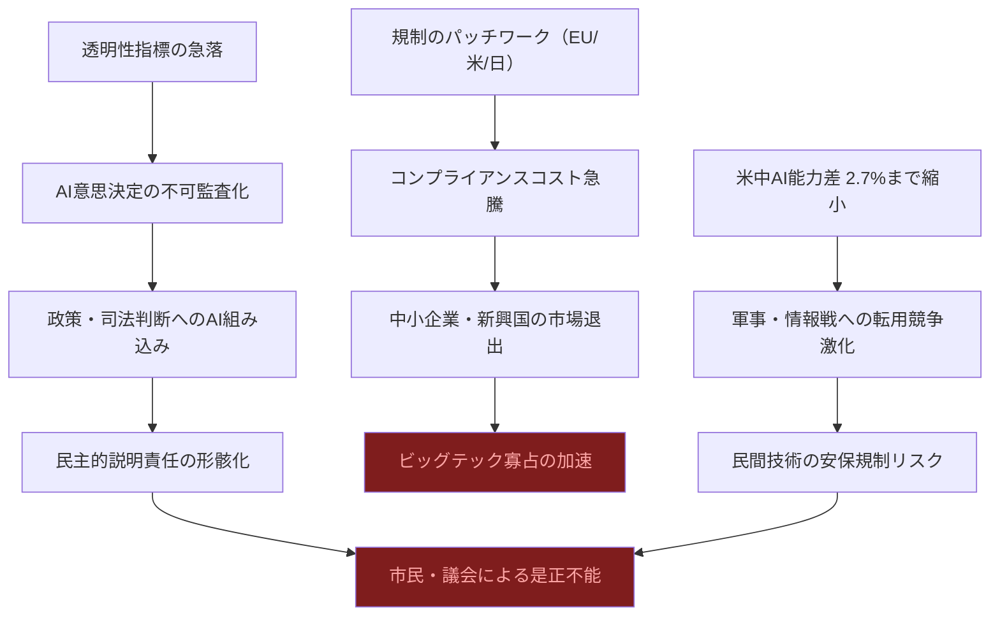
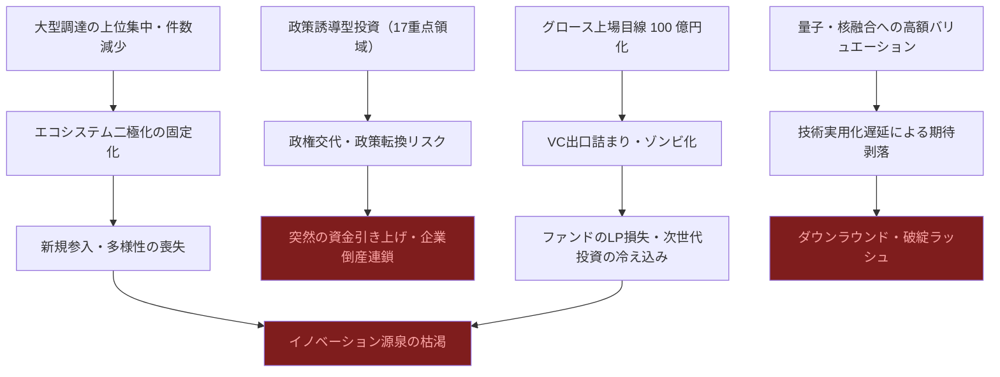
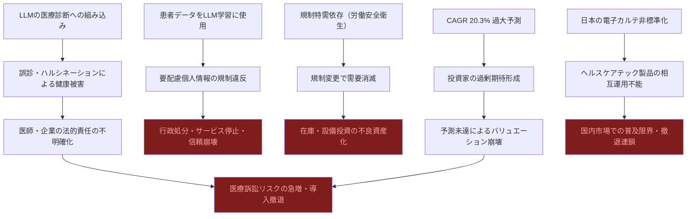

# ⚠️ Critic視点 分析
分析日時: 2026-05-04 21:33

---

## ⚠️ 規制・政策動向

- **❌ 主なリスク**: <mark>EU AI法の段階施行と米国の州規制乱立により、グローバル企業は「規制のパッチワーク」に直面し、コンプライアンスコストが急膨張する。日本の「イノベーション促進型」アプローチは聞こえが良いが、実態は規制空白であり、悪用・事故発生時の法的責任の所在が完全に曖昧だ。</mark>
- **楽観論への反論**: 「AIが政策策定の信頼性を高める」という主張は本末転倒に近い。生成AI普及率53%・透明性指標急落という数字が同時に示されているにもかかわらず、主要プレイヤーはその矛盾を直視していない。米中AI能力差が2.7%まで縮小したという事実は、安全保障上の脅威として認識されるべきであり、技術競争の健全化として楽観視できるものではない。スタンフォードHAIの報告書自体が「透明性の急落」を記録している以上、現状の国際AIガバナンスはほぼ機能不全と断言できる。トランプ政権が州規制を連邦で牽制する動きは、企業ロビイングに屈した規制後退そのものであり、消費者・市民保護の空洞化を招く。日本の「推進法」は規制ではなく補助金配布の法的根拠に過ぎず、被害救済スキームを欠いたまま社会実装を加速させるリスクがある。
- **🔍 注意すべきポイント**: 「透明性の急落」という指標が示す通り、AI開発者側の自主的なガバナンス改善は失敗に終わっている。規制が機能する前にAIが政策決定プロセスに組み込まれれば、民主的説明責任を事後的に回復することは不可能に近い。また、KPMG報告が示すとおり、日・米・EUの三極でアプローチが分岐した状態は長期的には米中並みの技術デカップリングをAIガバナンス領域でも引き起こす前触れである。

### リスク連鎖図（必須）

### リスクマトリクス（必須）

| リスク項目 | 発生確率 | 影響度 | 総合評価 | 対策 |
|---|---|---|---|---|
| 規制パッチワークによるコンプライアンス破綻 | 🔴 高 | 🔴 大 | **最重大** | 国際標準化交渉への早期参加 |
| 透明性急落による社会的信頼崩壊 | 🔴 高 | 🔴 大 | **最重大** | 第三者監査の義務化 |
| 日本の規制空白下での重大事故発生 | 🟠 中 | 🔴 大 | **重大** | 被害救済スキームの先行整備 |
| 米中AI軍拡競争の民間技術波及 | 🟠 中 | 🔴 大 | **重大** | デュアルユース規制の明文化 |
| EU AI法の域外適用による日本企業の対欧輸出障壁 | 🟠 中 | 🟠 中 | **要注意** | 早期適合性評価の実施 |

---

## ⚠️ 日本のスタートアップ・資金調達

- **❌ 主なリスク**: <mark>「過去最高の資金調達総額」は表面上の数字に過ぎない。件数が減少し上位勢に集中しているという事実は、エコシステムの二極化・固定化が進行しているサインであり、ヘルシーな競争環境の崩壊を意味する。グロース市場の上場目線が時価総額100億円規模に引き上がったことは、出口戦略の詰まりを加速させ、VC資金がスタートアップ内に滞留するゾンビ化リスクを高める。</mark>
- **楽観論への反論**: 量子コンピュータや核融合への大型調達は「先端技術への投資」として称賛されがちだが、いずれも実用化タイムラインが10年超の領域であり、現時点での高額バリュエーションはほぼ根拠のない期待値だ。核融合スタートアップへの27億円は、世界中で同様の調達が続く中でのバブル的様相を呈している。高市政権の17重点領域という政策誘導で資金が流れる構造は、市場原理ではなく政治判断に依存したエコシステムであり、政権交代・政策転換で一夜にして崩壊する脆弱性を抱えている。AI企業への集中投資は、LLM分野における米中ビッグテックとの技術格差を考えると、国内スタートアップが差別化できる余地がほとんどない領域への賭けであり、2000年代のドットコムバブルの再現に見える。
- **🔍 注意すべきポイント**: 「起業家・投資家双方に事業育成の難しさが増している」というVC自身の証言は、エコシステムの機能不全を認めたに等しい。にもかかわらず調達額の過去最高を「成長の証」として喧伝するのは、実態を直視しない自己欺瞞である。資金の集中は多様性の喪失であり、次の技術革新の芽が今この瞬間に摘まれている可能性がある。

### リスク連鎖図（必須）

### リスクマトリクス（必須）

| リスク項目 | 発生確率 | 影響度 | 総合評価 | 対策 |
|---|---|---|---|---|
| 政策依存型投資の政権交代による崩壊 | 🟠 中 | 🔴 大 | **重大** | 政策に依存しないユニットエコノミクスの構築 |
| 量子・核融合バリュエーション崩壊 | 🔴 高 | 🔴 大 | **最重大** | マイルストーン連動型資金供与への転換 |
| グロース上場詰まりによるゾンビ化 | 🔴 高 | 🟠 中 | **重大** | M&A出口の多様化・SPAC制度整備 |
| AI企業バブル崩壊（差別化不能） | 🔴 高 | 🔴 大 | **最重大** | 技術的護城河の厳格な投資デューデリジェンス |
| エコシステム二極化による若手起業家離脱 | 🟠 中 | 🟠 中 | **要注意** | シード支援の拡充・大学発スタートアップ育成 |

---

## ⚠️ ヘルスケアテック

- **❌ 主なリスク**: <mark>グローバル市場のCAGR 20.3%という成長予測は、過去のデジタルヘルス市場予測の慣例通り過大推計である可能性が極めて高い。デジタル治療（DTx）は規制承認のハードルが極めて高く、製品化件数のわずかな増加を「加速」と表現するのは明らかな誇張だ。医療分野でのLLM活用は誤診・情報漏洩・責任所在の不明確さという三重のリスクを内包しており、現時点では患者安全より企業の市場参入意欲が先行している。</mark>
- **楽観論への反論**: 労働安全衛生規則改正によるウェアラブル安全管理デバイスの「特需」は、規制による強制需要であって、真の市場価値を反映していない。規制が変われば市場が消滅する構造的脆弱性を抱えており、持続可能な成長基盤とは言えない。サワイグループの「HAUDY」（減酒治療補助アプリ）は注目を集めるが、薬機法改正の解釈次第では既存医薬品ビジネスとのカニバリゼーションリスクが生じる。アプリによる行動変容介入の長期有効性は臨床的に未確立の部分が多く、医療エビデンスとしての質が問われる。富士キメラ総研が分析した22品目のうち、実際に薬機法承認・保険適用を得た製品数は開示されておらず、「市場調査対象」と「実際の普及製品」の乖離が著しい可能性がある。「LLMソリューション開発に注力」という業界動向は、安全性確立より競争上のポジショニングを優先した危険な序列逆転である。
- **🔍 注意すべきポイント**: 日本の医療現場は電子カルテの標準化すら未達であり、ヘルスケアテックの技術的着地点が存在しない空中楼閣リスクがある。患者データをLLM学習に使用することは要配慮個人情報規定と正面から衝突し、GDPRに相当する制裁リスクも国際展開では現実的だ。ウェアラブルデバイスが収集する生体データが保険会社・雇用主に流出した場合の差別リスクは、現行の個人情報保護法では対処不能な次元の問題である。

### リスク連鎖図（必須）

### リスクマトリクス（必須）

| リスク項目 | 発生確率 | 影響度 | 総合評価 | 対策 |
|---|---|---|---|---|
| LLM医療活用による誤診・患者被害 | 🟠 中 | 🔴 大 | **最重大** | 承認前の厳格な臨床試験義務化 |
| 患者データのLLM学習によるプライバシー侵害 | 🔴 高 | 🔴 大 | **最重大** | 医療AI専用の個人情報取扱いガイドライン制定 |
| CAGR過大予測による投資バブル崩壊 | 🔴 高 | 🟠 中 | **重大** | 実績ベースの段階的評価指標への移行 |
| 規制特需消滅による事業モデル崩壊 | 🟠 中 | 🟠 中 | **要注意** | 複数収益源・保険適用経路の多様化 |
| 電子カルテ非標準化による国内普及限界 | 🔴 高 | 🟠 中 | **重大** | HL7 FHIR標準化の政策的強制推進 |
| DTx長期有効性未確立による薬機法再審査 | 🟠 中 | 🔴 大 | **重大** | 長期フォローアップデータの収集義務化 |

---

## 💡 総括：複合崩壊シナリオの現実的リスク

<mark>楽観的な成長予測はリスクを「テールリスク」として矮小化しているが、規制・投資・医療の三領域が同時に信頼崩壊に向かう相関崩壊の可能性を真剣に織り込んでいない点が最大の問題である。</mark>

2026年後半に向けて現実的に警戒すべき複合シナリオ：

1. **規制ガバナンス崩壊**: 透明性急落→AI政策決定への組み込み→民主的統制の形骸化→信頼危機と強権的反動規制の同時発生
2. **スタートアップバブル崩壊**: 政策依存型大型調達の期待剥落→ダウンラウンド連鎖→VC資金引き上げ→次世代イノベーション投資の10年単位の空白
3. **ヘルスケアテック患者被害顕在化**: 安全性未確立のLLM医療ツール普及→誤診事故→集団訴訟→規制の極端な揺り戻し→正当なDTx製品まで道連れに市場消滅
