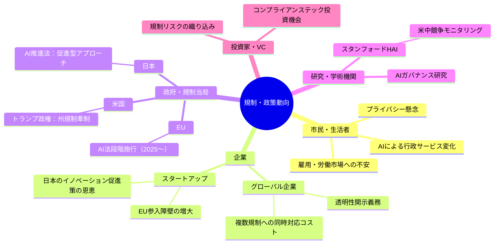
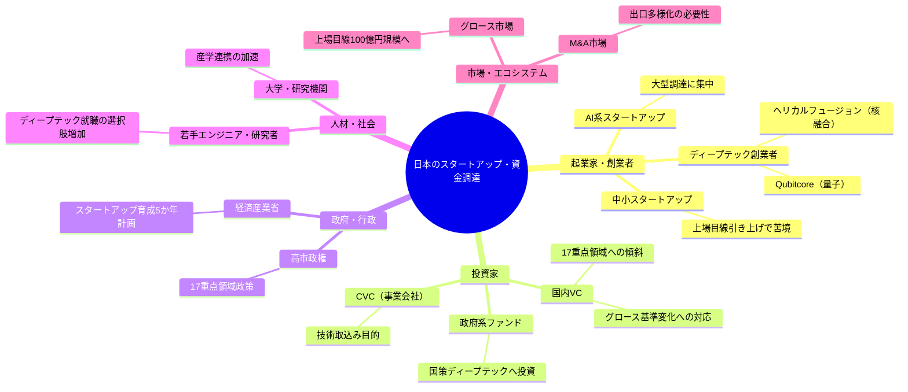
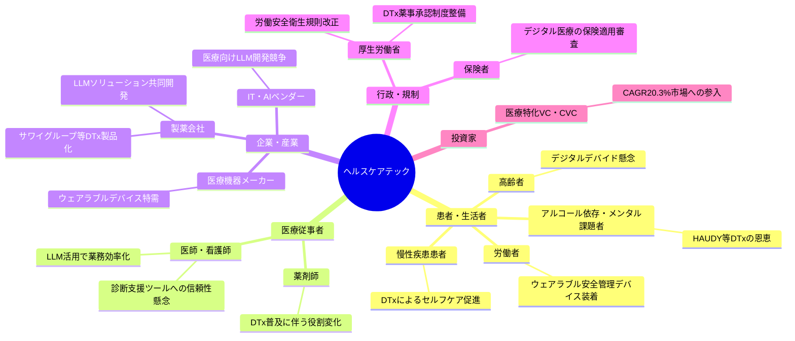

# 🌍 Human視点 分析
分析日時: 2026-05-04 21:33

## 🌍 規制・政策動向

- **社会的インパクト**: AIが政策策定に直接関与し始めたことで、民主主義の意思決定プロセス自体が変容しつつある。<mark>生成AI普及率53%という数字は、AIが「特定技術者のツール」から「社会インフラ」へ転換したことを意味し、規制の空白が市民生活に直結するリスクを孕む。</mark> EU・米国・日本の規制アプローチが三者三様に分岐しており、グローバル企業は複数の異なるコンプライアンス体制を同時維持する負担を強いられる。
- **💰 ビジネスチャンス**: 透明性指標の急落は「AIガバナンス・コンサルティング」市場の急拡大を示唆。EU AI法段階施行に対応するコンプライアンスSaaS、監査サービス、人材育成プログラムは数千億円規模の新市場となり得る。米中AI能力差が**2.7%まで縮小**したことで、日本の「第三極」としての規制調和ハブ戦略にビジネス機会がある。
- **🔥 話題性・熱量**: 「AIが政策を作る」という事実は市民感情を強く揺さぶるテーマ。SNSでの拡散力が高く、選挙・民主主義・雇用への不安と結びつき、社会的議論の中心に居続ける。日本のイノベーション促進型AI推進法は「緩すぎる」批判と「先進的」評価が真っ向から対立し、論争の熱量が高い。

### ステークホルダーマップ（必須）

### 影響度マトリクス（必須）

| ステークホルダー | 影響度 | 時間軸 | 主なインパクト |
|---|---|---|---|
| 一般市民 | ⭐⭐⭐⭐ 高 | 中期（2〜5年） | AI行政サービスの普及・雇用代替への不安増大 |
| グローバル企業 | ⭐⭐⭐⭐⭐ 最高 | 短期（〜1年） | EU AI法コンプライアンスコスト・透明性開示義務 |
| 日本スタートアップ | ⭐⭐⭐ 中 | 短期〜中期 | 促進型規制の追い風・海外展開時の規制格差リスク |
| 政策立案者 | ⭐⭐⭐⭐ 高 | 即時〜短期 | AIによる政策策定支援の信頼性・説明責任問題 |
| AIガバナンス事業者 | ⭐⭐⭐⭐⭐ 最高 | 短期〜中期 | 新規市場創出・コンサル・監査・SaaSの需要急増 |
| 研究機関 | ⭐⭐⭐ 中 | 長期（5年〜） | 米中AI競争下での研究倫理・安全基準策定主導権 |

---

## 🌍 日本のスタートアップ・資金調達

- **社会的インパクト**: <mark>資金調達総額が過去最高を記録しながら件数が減少するという「選別の時代」は、挑戦する起業家の裾野を狭め、若者の起業意欲に冷や水を浴びせるリスクがある。</mark> 量子コンピュータ・核融合という「人類の未来」に直結するディープテックへの投資は、長期的に日本の産業競争力と安全保障に関わる社会的意義を持つ。一方で、グロース市場の上場目線が時価総額100億円規模に引き上がったことは、中小スタートアップの出口戦略を根本から書き換える。
- **💰 ビジネスチャンス**: Qubitcore（**15.3億円**）・ヘリカルフュージョン（**27億円**）という大型調達が示すように、ディープテック領域は国策との親和性が高くなっており、政府系ファンドや事業会社との連携が資金調達の鍵。高市政権の**17重点領域**政策に沿った事業設計は、助成金・補助金・官民ファンド活用の観点から起業戦略の必須要素となっている。AI企業中心の大型調達集中は、AI以外の領域（特にディープテック、社会課題解決型）に相対的な「バリュエーション割安」機会を生んでいる。
- **🔥 話題性・熱量**: 核融合・量子という「SF世代が夢見た技術」が現実の資金調達ニュースとして登場することで、テック系メディアを超えて一般層への話題拡散力が高い。「スタートアップ冬の時代は終わった？」という論点がVC・起業家コミュニティで議論を呼んでいる。上場目線の高止まりに対する若手起業家の不満と、大型調達成功者への羨望が混在し、熱量と焦燥感が共存している。

### ステークホルダーマップ（必須）

### 影響度マトリクス（必須）

| ステークホルダー | 影響度 | 時間軸 | 主なインパクト |
|---|---|---|---|
| ディープテック起業家 | ⭐⭐⭐⭐⭐ 最高 | 短期〜中期 | 大型調達機会拡大・国策追い風・人材獲得競争激化 |
| 中小スタートアップ | ⭐⭐⭐⭐ 高 | 即時 | 上場目線引き上げで出口戦略の再設計を迫られる |
| 国内VC | ⭐⭐⭐⭐ 高 | 短期 | 17重点領域への資金集中・ポートフォリオの偏り拡大 |
| 若手起業家志望者 | ⭐⭐⭐ 中 | 中期 | 大型資金必要性が参入障壁を高め、起業意欲の選別が進む |
| 大学・研究機関 | ⭐⭐⭐ 中 | 中期〜長期 | 量子・核融合研究への産学資金流入増加 |
| 一般雇用市場 | ⭐⭐ 低〜中 | 長期 | ディープテック人材需要増加・高度専門職の待遇改善 |

---

## 🌍 ヘルスケアテック

- **社会的インパクト**: <mark>グローバル市場が2025年の5,879億ドルから2026年に7,072億ドルへ（CAGR 20.3%）という急成長は、ヘルスケアの「デジタル分断」リスクを内包している——テクノロジーにアクセスできる層と、そうでない高齢者・低所得層の健康格差が拡大する恐れがある。</mark> 一方で、サワイグループの「HAUDY」のようなデジタル治療（DTx）は、病院受診が困難な層に医療機会を届ける民主化効果も持つ。労働安全衛生規則改正に伴うウェアラブル安全管理デバイスの特需は、現場労働者の命に直結する社会的意義が高い。
- **💰 ビジネスチャンス**: ウェアラブル安全管理デバイスは法規制ドリブンの確実な需要であり、建設・製造・物流業界向けBtoBビジネスとして**短期的な売上確保が見込める**。DTx（デジタル治療）は薬事承認取得後に保険適用されれば安定収益源となり、製薬会社との共同開発モデルが有効。LLMソリューション活用による医療診断支援・カルテ自動化は、医師の働き方改革とコスト削減を同時実現でき、病院・クリニックへの導入機会が急拡大している。
- **🔥 話題性・熱量**: 「アプリで減酒治療」というHAUDYの具体性は、アルコール依存・メンタルヘルス問題が社会問題化する中で共感と話題性が高い。ウェアラブルデバイスの職場導入は「監視か安全か」という感情的議論を呼び、SNSでの炎上・拡散リスクとプロモーション機会が表裏一体。CAGR 20.3%という数字は投資家・経営者層の注目度が極めて高く、カンファレンス・メディアでの露出量が急増中。

### ステークホルダーマップ（必須）

### 影響度マトリクス（必須）

| ステークホルダー | 影響度 | 時間軸 | 主なインパクト |
|---|---|---|---|
| 慢性疾患・依存症患者 | ⭐⭐⭐⭐⭐ 最高 | 短期〜中期 | DTxによる治療アクセス改善・自己管理支援の実用化 |
| 現場労働者（製造・建設） | ⭐⭐⭐⭐ 高 | 即時〜短期 | ウェアラブル安全管理デバイスによる労働災害リスク低減 |
| 高齢者・デジタル弱者 | ⭐⭐⭐ 中 | 中期〜長期 | ヘルスケアデジタル分断リスク・格差拡大の懸念 |
| 医師・医療従事者 | ⭐⭐⭐⭐ 高 | 短期〜中期 | LLM活用による業務効率化・働き方改革の加速 |
| 製薬・医療機器企業 | ⭐⭐⭐⭐⭐ 最高 | 短期 | DTx製品化・ウェアラブル特需・市場CAGR20.3%の恩恵 |
| 保険者・行政 | ⭐⭐⭐ 中 | 中期 | DTx保険適用審査・費用対効果評価の制度整備負担 |
