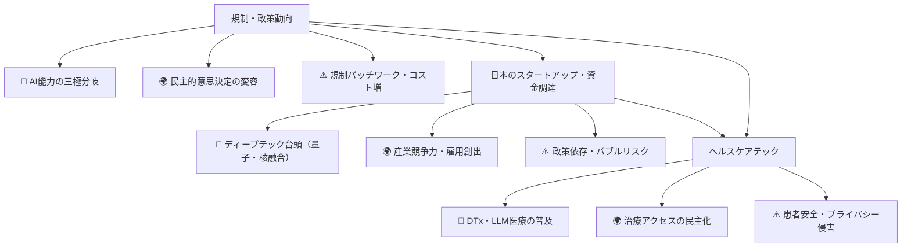
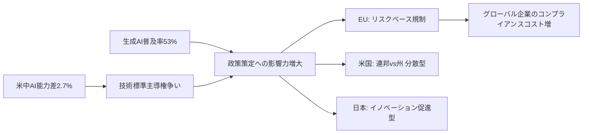
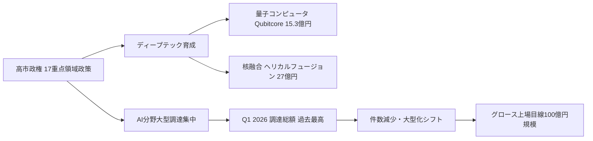
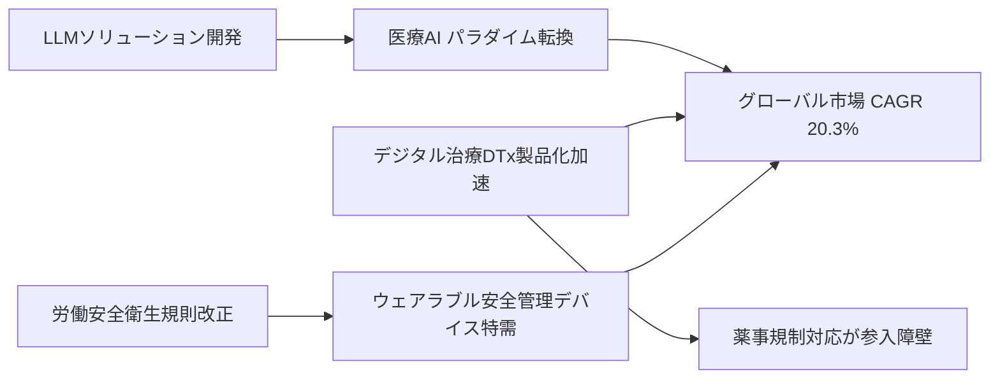
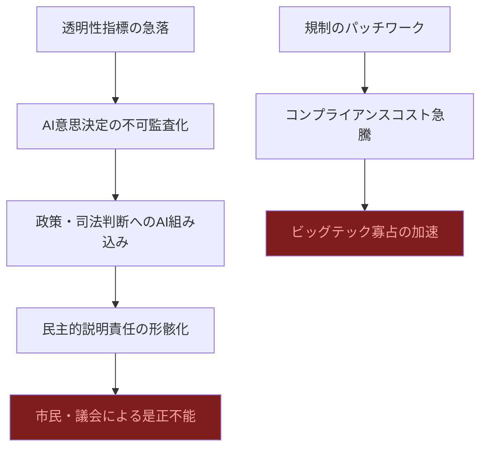
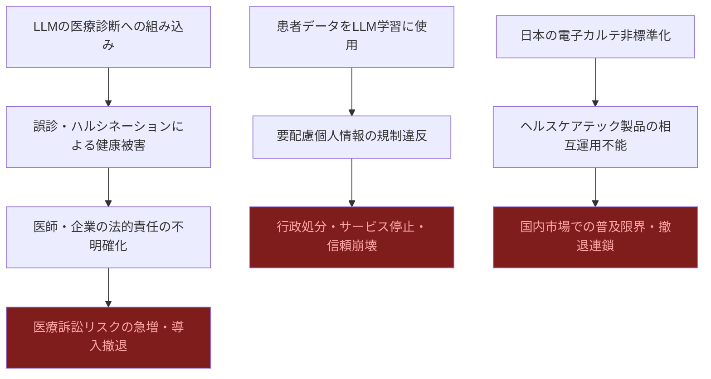

# 📊 トレンド日報 2026-05-04

## 📋 エグゼクティブ・サマリー

> **本日の重要トピック**: 規制・政策動向, 日本のスタートアップ・資金調達, ヘルスケアテック

<mark>AIガバナンスの三極分裂（EU規制型・米国分散型・日本促進型）が決定的になりつつあり、透明性指標の急落と米中AI能力差2.7%という数字が示す通り、2026年は規制空白と技術覇権争いが同時加速する正念場の年だ。</mark>

日本のスタートアップ市場ではQ1調達総額が過去最高を記録しながら件数は減少し、量子・核融合というディープテックへの大型投資が象徴的一方、**政策依存・バリュエーション過熱・上場出口詰まり**という三重の構造的リスクが積み上がっている。ヘルスケアテックはCAGR 20.3%の急成長の裏で、LLMの医療適用による誤診リスクと患者データプライバシー問題が未解決のまま市場参入が先行している危険な状況だ。

---

## 🗺️ トピック関係図

---

## 🔬 Tech視点

### 🚀 規制・政策動向

- **注目点**: <mark>米中AI能力差が2.7%まで縮小という数値は、技術覇権競争が臨界点に近づいていることを示す最重要シグナル</mark>。生成AI普及率 **53%** は「普及期」への移行を意味し、規制の設計思想が技術進化の方向を大きく左右する。
- **データ**: EU AI法 2025年から段階施行、透明性指標は急落、説明可能AI（XAI）需要が上昇中
- **技術的意義**: EU・米・日の三極で規制アプローチが分岐。グローバル企業のコンプライアンスコスト増大と「規制裁定」機会が同時発生。

| 指標 | 現状値 | 備考 |
|------|--------|------|
| 生成AI普及率 | **53%** | スタンフォードHAI 2026年版 |
| 米中AI能力差 | **2.7%** | 技術覇権競争の臨界点 |
| EU AI法施行 | 2025年〜段階的 | リスクベース規制 |
| 透明性指標 | **急落** | 説明可能AI需要増へ |

### 🚀 日本のスタートアップ・資金調達

- **注目点**: <mark>量子コンピュータ（Qubitcore 15.3億円）・核融合（ヘリカルフュージョン 27億円）という「ディープテック二本柱」への大型調達が同週並立は、日本の技術投資が質的転換を遂げている証左</mark>。
- **データ**: Q1 2026年調達総額 **過去最高**、件数は減少、グロース上場目線 **時価総額100億円規模** に引き上げ

| 指標 | 現状値 | 備考 |
|------|--------|------|
| Q1 2026 調達総額 | **過去最高** | ただし件数は減少傾向 |
| Qubitcore 調達額 | **15.3億円** | 量子コンピュータ開発 |
| ヘリカルフュージョン調達額 | **27億円** | 核融合スタートアップ |
| グロース上場時価総額目線 | **100億円規模** | 成熟期間延伸要因 |

### 🚀 ヘルスケアテック

- **注目点**: <mark>規制変化が技術需要を直接創出するモデルが顕在化。CAGR 20.3%の高成長率でグローバル拡大する中、DTx製品化加速と規制特需が同時進行</mark>。
- **データ**: グローバル市場 2026年 **7,072億ドル**（CAGR **20.3%**）、サワイグループ「HAUDY」2025年9月販売開始

| 指標 | 現状値 | 備考 |
|------|--------|------|
| グローバル市場（2025年） | 5,879億ドル | — |
| グローバル市場（2026年予測） | **7,072億ドル** | CAGR **20.3%** |
| DTx事例（HAUDY） | 2025年9月販売 | サワイグループ、減酒治療補助アプリ |

---

## 🌍 Human視点

### 🌍 規制・政策動向

- **社会的インパクト**: <mark>生成AI普及率53%はAIが「社会インフラ」へ転換したことを意味し、規制の空白が市民生活に直結するリスクを孕む</mark>。AIが政策策定に関与する事実は民主主義の意思決定プロセス自体の変容を招く。
- **💰 ビジネスチャンス**: AIガバナンス・コンサルティング市場が急拡大。EU AI法対応コンプライアンスSaaS・監査サービスは数千億円規模の新市場となり得る。日本の「第三極」としての規制調和ハブ戦略にも大きな機会。
- **🔥 話題性**: 「AIが政策を作る」という事実はSNSでの拡散力が高く、選挙・民主主義・雇用への不安と結びつき社会的議論の中心に居続ける。

### 🌍 日本のスタートアップ・資金調達

- **社会的インパクト**: <mark>資金調達総額が過去最高を記録しながら件数が減少する「選別の時代」は、挑戦する起業家の裾野を狭め、若者の起業意欲に冷や水を浴びせるリスクがある</mark>。量子・核融合は長期的に日本の産業競争力と安全保障に関わる社会的意義を持つ。
- **💰 ビジネスチャンス**: 高市政権の **17重点領域** に沿った事業設計が助成金・補助金・官民ファンド活用の観点から起業戦略の必須要素に。AI以外のディープテック領域に相対的な「バリュエーション割安」機会が生じている。
- **🔥 話題性**: 核融合・量子という「SF世代が夢見た技術」が現実の資金調達ニュースとして登場し、一般層への話題拡散力が高い。

### 🌍 ヘルスケアテック

- **社会的インパクト**: <mark>ヘルスケアの「デジタル分断」リスクを内包——テクノロジーにアクセスできる層と高齢者・低所得層の健康格差が拡大する恐れがある</mark>。一方でDTxは病院受診が困難な層への医療機会の民主化効果も持つ。
- **💰 ビジネスチャンス**: ウェアラブル安全管理デバイスは法規制ドリブンの確実な需要で建設・製造・物流業界向けBtoBビジネスとして短期売上確保が見込める。DTxは保険適用後に安定収益源となり、製薬会社との共同開発モデルが有効。
- **🔥 話題性**: 「アプリで減酒治療」の具体性はアルコール依存・メンタルヘルス問題と重なり共感と話題性が高い。CAGR 20.3%という数字は投資家・経営者層の注目度が極めて高い。

---

## ⚠️ Critic視点

### 🔍 規制・政策動向

- **❌ 主なリスク**: <mark>日本の「イノベーション促進型」アプローチは実態は規制空白であり、悪用・事故発生時の法的責任の所在が完全に曖昧だ</mark>。EU AI法・米国州規制乱立で「規制のパッチワーク」が加速し、コンプライアンスコストが急膨張する。
- **楽観論への反論**: 透明性急落・普及率53%が同時に示されているにもかかわらず主要プレイヤーはその矛盾を直視していない。米中AI能力差縮小は安全保障上の脅威として認識すべきであり、技術競争の健全化として楽観視できるものではない。トランプ政権の州規制牽制は企業ロビイングに屈した規制後退そのもの。
- **🔍 注意点**: 規制が機能する前にAIが政策決定プロセスに組み込まれれば、民主的説明責任を事後的に回復することは不可能に近い。

| リスク項目 | 発生確率 | 影響度 | 総合評価 |
|---|---|---|---|
| 規制パッチワークによるコンプライアンス破綻 | 🔴 高 | 🔴 大 | **最重大** |
| 透明性急落による社会的信頼崩壊 | 🔴 高 | 🔴 大 | **最重大** |
| 日本の規制空白下での重大事故発生 | 🟠 中 | 🔴 大 | **重大** |
| 米中AI軍拡競争の民間技術波及 | 🟠 中 | 🔴 大 | **重大** |

### 🔍 日本のスタートアップ・資金調達

- **❌ 主なリスク**: <mark>「過去最高の資金調達総額」は表面上の数字に過ぎない。件数が減少し上位勢に集中することはエコシステムの二極化・固定化であり、ヘルシーな競争環境の崩壊を意味する</mark>。グロース上場目線の引き上げはVC資金のゾンビ化リスクを高める。
- **楽観論への反論**: 量子・核融合への大型調達は実用化タイムラインが10年超の領域であり、現時点でのバリュエーションはほぼ根拠のない期待値だ。高市政権17重点領域という政策誘導は政権交代で一夜にして崩壊する脆弱性を抱えている。
- **🔍 注意点**: 「起業家・投資家双方に事業育成の難しさが増している」というVC自身の証言は、エコシステムの機能不全を認めたに等しい。

| リスク項目 | 発生確率 | 影響度 | 総合評価 |
|---|---|---|---|
| 量子・核融合バリュエーション崩壊 | 🔴 高 | 🔴 大 | **最重大** |
| AI企業バブル崩壊（差別化不能） | 🔴 高 | 🔴 大 | **最重大** |
| グロース上場詰まりによるゾンビ化 | 🔴 高 | 🟠 中 | **重大** |
| 政策依存型投資の政権交代による崩壊 | 🟠 中 | 🔴 大 | **重大** |

### 🔍 ヘルスケアテック

- **❌ 主なリスク**: <mark>グローバル市場のCAGR 20.3%という成長予測は過去のデジタルヘルス市場予測の慣例通り過大推計である可能性が極めて高い。医療分野でのLLM活用は誤診・情報漏洩・責任所在の不明確さという三重のリスクを内包しており、患者安全より企業の市場参入意欲が先行している。</mark>
- **楽観論への反論**: 労働安全衛生規則改正によるウェアラブル特需は規制による強制需要であり、規制が変われば市場が消滅する構造的脆弱性がある。DTxの長期有効性は臨床的に未確立の部分が多く、医療エビデンスとしての質が問われる。日本の電子カルテ非標準化という根本課題が解決されないままヘルスケアテックが拡大するのは空中楼閣だ。
- **🔍 注意点**: 患者データをLLM学習に使用することは要配慮個人情報規定と正面から衝突し、ウェアラブルデバイスが収集する生体データの保険会社・雇用主への流出リスクは現行法では対処不能だ。

| リスク項目 | 発生確率 | 影響度 | 総合評価 |
|---|---|---|---|
| LLM医療活用による誤診・患者被害 | 🟠 中 | 🔴 大 | **最重大** |
| 患者データのLLM学習によるプライバシー侵害 | 🔴 高 | 🔴 大 | **最重大** |
| CAGR過大予測による投資バブル崩壊 | 🔴 高 | 🟠 中 | **重大** |
| 電子カルテ非標準化による国内普及限界 | 🔴 高 | 🟠 中 | **重大** |

---

## 💡 総合所感・アクション提言

**3トピック横断のメガトレンド**: 規制・スタートアップ・ヘルスケアの三分野に共通するのは、**「政策・規制変化が技術需要を直接創出する構造」**の強まりである。しかしその裏側では、透明性の急落・エコシステムの二極化・医療安全性の未整備という構造的矛盾が積み上がっている。

**今週のアクション提言**:
1. 🔍 **AIガバナンス**: EU AI法のコンプライアンス適合性評価を早期着手。「日本は促進型だから大丈夫」という油断は事故時の法的無防備に直結する
2. 💰 **投資判断**: ディープテックへの投資はマイルストーン連動型資金供与を原則に。バリュエーションではなく実用化タイムラインで評価せよ
3. ⚕️ **ヘルスケアテック参入**: LLM医療ツールは患者安全・個人情報保護の第三者監査体制なしに事業化しない。電子カルテ標準化（HL7 FHIR）対応を競合差別化の起点に

<mark>2026年後半は「成長」と「崩壊」が同時進行するボラティリティの高い環境だ。楽観論と悲観論の両方を手元に置き、ポートフォリオとリスク管理を再点検するタイミングである。</mark>
