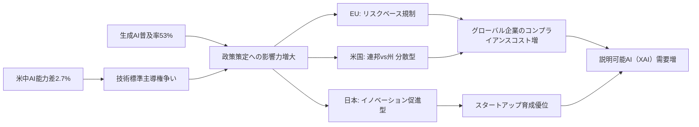
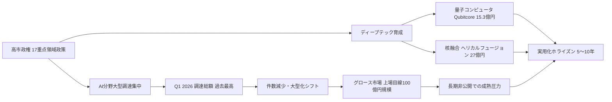
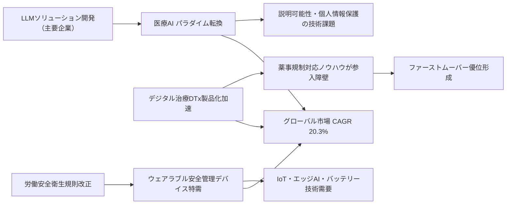

# 🔬 Tech視点 分析
分析日時: 2026-05-04 21:33

## 🚀 規制・政策動向
- **技術的注目点**: <mark>米中AI能力差が2.7%まで縮小という数値は、技術覇権競争が臨界点に近づいていることを示す最重要シグナル</mark>。生成AI普及率53%は「普及期」への移行を意味し、規制の設計思想が今後の技術進化の方向を大きく左右する。
- **📊 データ・数字**: 生成AI普及率 **53%**、米中AI能力差 **2.7%**、EU AI法 2025年から段階施行開始、日本はイノベーション促進型AI推進法を採用
- **技術的意義**: 三極（EU・米・日）で規制アプローチが分岐。EUはリスクベース規制、米国は州規制を連邦が牽制する分散型、日本はイノベーション優先型。この分岐はグローバル展開する技術企業のコンプライアンスコストを増大させると同時に「規制裁定」の機会も生む。透明性指標の急落は、AIシステムのブラックボックス化が進んでいることを示し、説明可能AI（XAI）技術の需要を押し上げる。
- **展望**: 米中能力差の縮小が続けば、技術標準・規制主導権をめぐる国際的な争いが激化。日本の促進型アプローチは短期的なスタートアップ育成に有利だが、国際標準への整合性確保が中長期課題となる。

### 技術関係図（必須）

### 主要指標（必須）
| 指標 | 現状値 | 成長率 | 備考 |
|------|--------|--------|------|
| 生成AI普及率 | 53% | - | スタンフォードHAI 2026年版 |
| 米中AI能力差 | 2.7% | 縮小傾向 | 技術覇権競争の臨界点 |
| EU AI法施行 | 2025年〜段階的 | - | リスクベース規制 |
| 透明性指標 | 急落 | マイナス | 説明可能AI需要を押し上げ |

---

## 🚀 日本のスタートアップ・資金調達
- **技術的注目点**: <mark>量子コンピュータ（Qubitcore 15.3億円）・核融合（ヘリカルフュージョン 27億円）という「ディープテック二本柱」への大型調達が同週に並立したことは、日本の技術投資が量的拡大から質的転換を遂げている証左</mark>。
- **📊 データ・数字**: Q1 2026年資金調達総額 **過去最高**、件数は減少傾向、Qubitcore **15.3億円**、ヘリカルフュージョン **27億円**、グロース市場上場目線 時価総額 **100億円規模**に引き上げ、高市政権 **17重点領域**政策
- **技術的意義**: 件数減少・総額増加という構造変化は「少数精鋭・大型勝負」へのシフトを意味する。AI企業中心の集中傾向に加え、量子・核融合という長期大型技術への投資が出現したことは、VCの投資ホライズンが延伸していることを示す。グロース市場の上場目線引き上げは技術スタートアップに「より長く非公開で成熟する」プレッシャーをかけ、資本効率の高いR&Dが求められる。
- **展望**: 高市政権17重点領域が投資地図を規定している構造上、政策変更リスクが投資判断に直結する。量子・核融合分野は実用化まで5〜10年規模の開発期間を要するため、持続的なエコシステム形成が鍵となる。

### 技術関係図（必須）

### 主要指標（必須）
| 指標 | 現状値 | 成長率 | 備考 |
|------|--------|--------|------|
| Q1 2026 調達総額 | 過去最高 | - | ただし件数は減少傾向 |
| Qubitcore 調達額 | 15.3億円 | - | 量子コンピュータ開発 |
| ヘリカルフュージョン 調達額 | 27億円 | - | 核融合スタートアップ |
| グロース市場上場時価総額目線 | 100億円規模 | 引き上げ | 技術企業の成熟期間延伸要因 |
| 政府重点領域数 | 17領域 | - | 高市政権による投資地図 |

---

## 🚀 ヘルスケアテック
- **技術的注目点**: <mark>グローバル市場がCAGR 20.3%という高成長率で拡大する中、日本国内ではデジタル治療（DTx）の製品化加速と労働安全衛生規制改正に伴う特需が同時進行しており、規制変化が技術需要を直接創出するモデルが顕在化している</mark>。
- **📊 データ・数字**: グローバルヘルスケアテック市場 2025年 **5,879億ドル** → 2026年 **7,072億ドル**（**CAGR 20.3%**）、サワイグループ「HAUDY」減酒治療補助アプリ **2025年9月**販売開始、ウェアラブル分析対象：安全管理17品目・医療機器22品目
- **技術的意義**: 主要企業がLLMソリューション開発に注力していることは、医療AIの中心がルールベースから大規模言語モデルへ移行していることを示す。DTxの製品化（HAUDYなど）は「ソフトウェアが医療機器になる」パラダイムの日本国内定着を意味し、薬事規制対応の技術的ノウハウが競合参入障壁となる。ウェアラブル安全管理デバイスの特需は、IoTセンサー・バッテリー技術・エッジAI推論の複合的な技術需要を生む。
- **展望**: LLM×医療の融合が進む中、医療特化LLMの精度・説明責任・個人情報保護の三要件を同時に満たす技術開発が競争軸となる。DTx分野では薬事承認プロセスのデジタル化対応が参入スピードを左右し、ファーストムーバー優位が形成されつつある。

### 技術関係図（必須）

### 主要指標（必須）
| 指標 | 現状値 | 成長率 | 備考 |
|------|--------|--------|------|
| グローバルヘルスケアテック市場（2025年） | 5,879億ドル | - | 市場調査各社 |
| グローバルヘルスケアテック市場（2026年予測） | 7,072億ドル | CAGR 20.3% | LLMソリューション牽引 |
| DTx製品化事例（HAUDY） | 2025年9月販売開始 | - | サワイグループ、減酒治療補助アプリ |
| ウェアラブル分析品目数 | 安全管理17品目・医療機器22品目 | - | 富士キメラ総研調査対象 |

---

## 💡 Tech総合所感

**3トピック横断で見えるメガトレンド**: 規制・スタートアップ・ヘルスケアの三分野に共通するのは、**「政策・規制変化が技術需要を直接創出する構造」**の強まりである。EU AI法の段階施行、日本の労働安全衛生規則改正、高市政権17重点領域——いずれも民間技術投資の方向を政策側が決定している。

技術者が今最も注視すべきは、**LLMのドメイン特化・説明可能性の向上**と、**ディープテック（量子・核融合・DTx）における長期育成エコシステムの構築**である。米中AI能力差2.7%という数値は、今後の国際技術標準設定における日本のポジション取りに重大な示唆を与えている。
