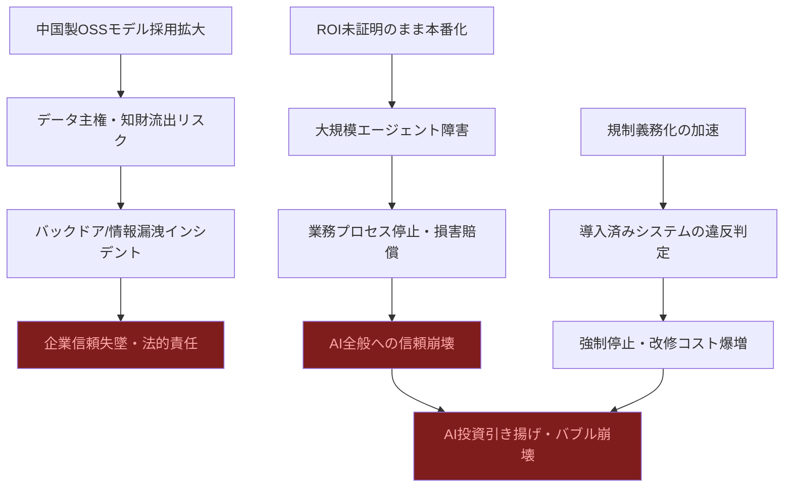
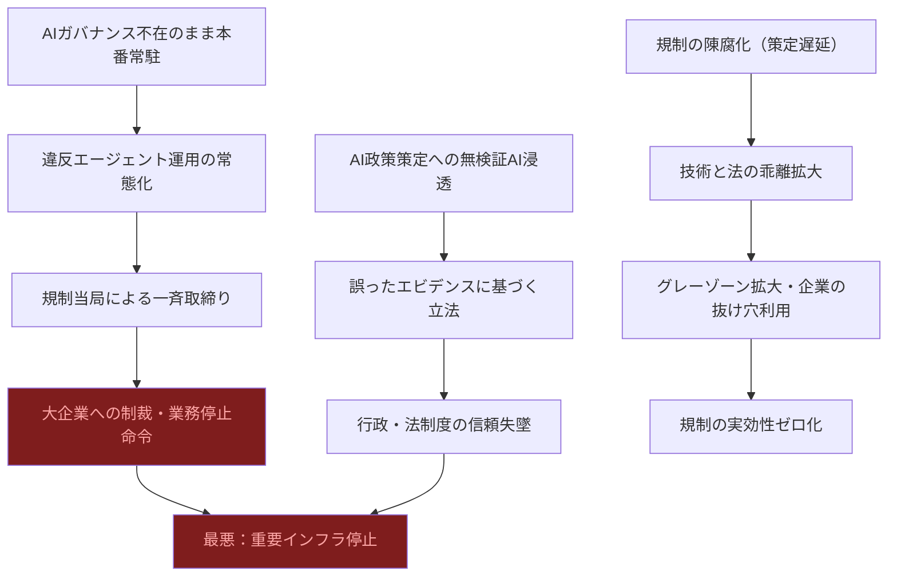
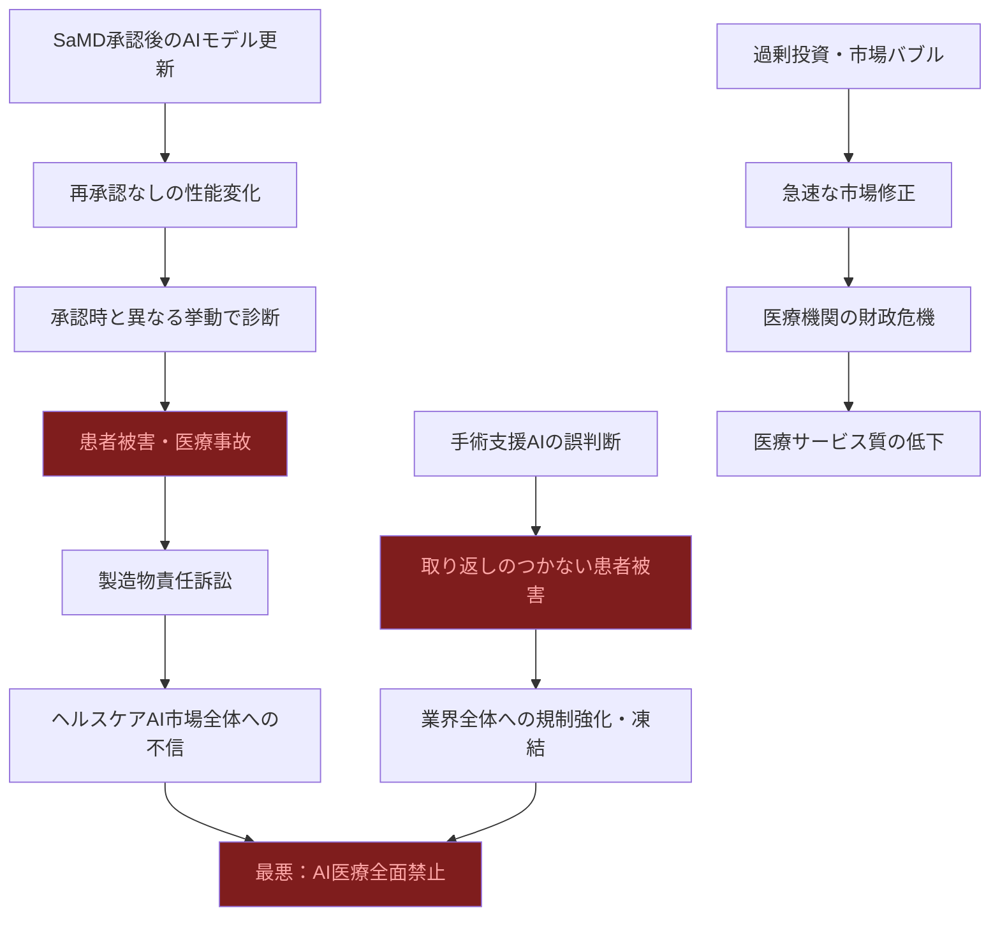

# ⚠️ Critic視点 分析
分析日時: 2026-05-05 21:38

---

## ⚠️ 生成AI・LLM最新動向

- **❌ 主なリスク**: <mark>「2025年は構築する年、2026年は信頼する年」というキャッチフレーズ自体が業界の自己申告にすぎない。ROI実証が「求められる段階」と認めている時点で、大多数の企業がいまだにROIを証明できていない事実を暗黙に認白している。信頼は宣言するものではなく実績で積み上げるものであり、この言葉は「まだ信頼できる段階ではない」という裏返しである。</mark>

- **楽観論への反論**:
  - Qwen3.6など中国製OSSモデルの「急台頭」は、地政学リスクと切り離して語れない。中国政府のコントロール下にあるモデルを「社内インフラ」として採用した場合、データ主権・知財流出・バックドア埋め込みのリスクを企業が十分に評価していない可能性が高い。ローカルで動作するからといって「安全」ではない。
  - 「推論用途が全コンピュートの2/3」という数字は、AIインフラへの依存度が既に臨界点を超えつつあることを示す。クラウド巨大モデルとオンプレSLMの「二層構造が標準化」は聞こえが良いが、実態は**コスト圧力に追い詰められた苦肉の策**であり、両者の品質格差・運用複雑性というコストを誰も計上していない。
  - RAGが「基本アーキテクチャとして定着」という表現は過大評価である。RAGの根本問題（チャンク分割の不整合・検索精度の不安定・ハルシネーションの残存）は未解決のまま本番投入が進んでいる。「定着」≠「解決済み」であるという事実を技術者以外に伝えないベンダーの責任は重い。
  - ワールドモデルを「LLMの次世代技術として注目」と紹介しているが、現状のLLMすら制御できていない段階で次世代技術を喧伝するのは典型的な注意散らしである。現在の問題（幻覚・整合性・安全性）が解決されないまま次の夢物語に乗り換えるパターンを業界は繰り返している。

- **🔍 注意すべきポイント**:
  - 「法的拘束力のある義務への転換」は、現在進行中のAI導入・本番化と真っ向から衝突する。コンプライアンスコストが実態として見積もられていない企業が大多数であり、義務化が本格化した瞬間に「導入済みだが規制違反」という状態が続出する。

### ⚠️ リスク連鎖図

### 📊 リスクマトリクス
| リスク項目 | 発生確率 | 影響度 | 総合評価 | 対策の難易度 |
|---|---|---|---|---|
| 中国製モデル経由のデータ漏洩 | 中 | 極大 | ❌ 最高危険 | 高（モデル入替コスト大） |
| ROI未証明エージェントの本番障害 | **高** | 大 | ❌ 危険 | 中（設計見直し） |
| 規制義務化による既存システムの違反 | **高** | 大 | ❌ 危険 | 高（法的対応コスト） |
| RAG品質不足による誤意思決定 | **高** | 中 | ⚠️ 注意 | 中（評価体制整備） |
| ワールドモデル過信による投資無駄遣い | 中 | 中 | ⚠️ 注意 | 低（優先度制御） |

---

## ⚠️ 規制・政策動向

- **❌ 主なリスク**: <mark>「誰がどんなエージェントを使っているか見えない」問題が「急増」しているという表現は極めて深刻である。これは企業内でAIガバナンスが実質的に機能していないことの公式な認白であり、リスク管理の観点からは制御不能状態に陥りつつあることを意味する。ガバナンス不在のまま規制の義務化が進めば、企業は「違反を知らずに違反している」状態で取締まりを受けることになる。</mark>

- **楽観論への反論**:
  - 日本AI法（2025年9月全面施行）が「ガイドラインから法的義務へ」と喧伝されているが、日本の規制当局の執行能力・罰則の実効性は疑問符がつく。EU AI法と異なり、日本の罰則水準・執行体制の詳細が不透明であり、「法的拘束力」が形式上のものにとどまるリスクがある。
  - AIの「政策策定プロセスへの浸透」を課題と認識しながら「信頼性担保・ファクトチェックが喫緊の課題」と述べている点は矛盾している。課題が未解決のまま浸透だけが先行するという最悪の順序をたどっている。ファクトチェック不能なAI政策提言が法律・予算に反映された場合の社会的損害は計り知れない。
  - EU AI法行動規範の「2026年5〜6月最終版予定」は、AIの進化速度に規制策定が全く追いついていないことを示す。2024年に草案を書き、2026年に最終版が出る頃には、対象となるAIシステム自体が2世代以上進化している。「最終版が出る頃には時代遅れ」という規制の宿命的陳腐化は誰も正面から論じていない。
  - 防衛・半導体・量子を重点6分野として「支援強化」という政策は、聞こえは良いが「支援対象に選ばれたい企業のロビー活動」の産物である可能性が高い。政府が特定技術に集中的に資源配分することは、予測外の技術シフトが起きた際に国家レベルの投資ロスを生み出す。

- **🔍 注意すべきポイント**:
  - 「エージェントが業務プロセスに常駐する段階」という描写は、AIが組織の意思決定に不可逆的に組み込まれることを意味する。一度依存が形成されたシステムは、たとえ問題が発覚しても停止・撤去が極めて困難になる。撤退コストの見積もりをしている組織はほぼ存在しない。

### ⚠️ リスク連鎖図

### 📊 リスクマトリクス
| リスク項目 | 発生確率 | 影響度 | 総合評価 | 対策の難易度 |
|---|---|---|---|---|
| ガバナンス不在のまま規制違反状態 | **極高** | 大 | ❌ 最高危険 | 高（組織変革必要） |
| AI政策提言のファクトチェック欠如 | **高** | 極大 | ❌ 最高危険 | 高（制度設計必要） |
| 規制の陳腐化・実効性喪失 | **高** | 大 | ❌ 危険 | 極高（国際協調必要） |
| 特定技術への集中投資の賭け外れ | 中 | 大 | ⚠️ 注意 | 中（分散投資） |
| AIへの不可逆依存と撤退困難 | **高** | 中 | ⚠️ 注意 | 極高（設計段階で対処必要） |

---

## ⚠️ ヘルスケアテック

- **❌ 主なリスク**: <mark>日本の医療機関AI導入率28%、地域診療所の94.3%が未導入という数字は「格差」ではなく「市場予測の完全な失敗」を示す。市場予測業者が毎年「急拡大」と叫び続けながら、現場の94%超が導入していない現実は、AIヘルスケア市場が投資家向けのフィクションである可能性を強く示唆する。世界市場+42%成長という数字は、実際の臨床使用ではなくB2B契約・PoC費用・ライセンス料の計上である可能性が高く、患者への実質的恩恵とは乖離している。</mark>

- **楽観論への反論**:
  - PMDA審査体制の「2チームへの拡充」を成果として提示しているが、世界の医療AIスタートアップ数・SaMD申請件数の増加ペースと比較すれば焼け石に水である。承認スピード向上と審査品質低下はトレードオフであり、スループット向上のみを指標にするのは危険な近視眼である。
  - 「生成AI・マルチモーダルAI・SaMDの三本柱」という整理は業界のバズワード並列であり、それぞれが抱える本質的問題（ハルシネーション、センサーモダリティの品質不均一、承認後の性能劣化）を隠蔽している。特にSaMDは承認後にAIモデルが更新されると再承認が必要になる問題が完全に未解決のまま本番化が進んでいる。
  - 「費用対効果が見えない」として導入停滞している中小医療機関の判断は**正しい**。費用対効果が明確でない製品を94%が採用しないのはリスク管理として合理的であり、これを「デジタルデバイド」と非難するのはベンダーの論理の押しつけである。医療は流行に乗る場所ではない。
  - 政府「統合イノベーション戦略2025」での重点指定は、政策支援≠臨床有効性の証明であることを混同させる効果を持つ。政府が後押しする技術が臨床的に無効であった事例（特定保健用食品制度の一部など）は歴史的に存在し、政策のお墨付きが安全性・有効性の保証にならないことは自明である。

- **🔍 注意すべきポイント**:
  - 医療AIの「問診・手術支援・SaMD実用化が本格化」という表現の中で最も危険なのは手術支援AIである。手術中のリアルタイム判断支援でAIが誤った判断を下した場合、患者への取り返しのつかない被害が即座に発生する。エラーの訂正機会がない環境でのAI活用は、他分野とは桁違いのリスクカテゴリーに属する。
  - 560億ドル市場規模の予測が「前年比+42%」という異常な成長率を維持し続けることはあり得ない。この数字が持続不可能であることは数学的に明白であり、いつかの時点で急速な市場修正（バブル崩壊）が訪れる。その時期に医療機関が過剰投資していた場合の財政的打撃は深刻である。

### ⚠️ リスク連鎖図

### 📊 リスクマトリクス
| リスク項目 | 発生確率 | 影響度 | 総合評価 | 対策の難易度 |
|---|---|---|---|---|
| 手術支援AI誤判断による患者死亡 | 低〜中 | **壊滅的** | ❌ 最高危険 | 極高（技術・制度両面） |
| 承認後AIモデル更新による性能変化 | **高** | 大 | ❌ 危険 | 高（制度改革必要） |
| 医療AIバブル崩壊による医療機関財政危機 | 中 | 大 | ❌ 危険 | 中（投資管理） |
| 94%未導入機関の完全デジタル排除 | **高** | 中 | ⚠️ 注意 | 高（インフラ整備） |
| PMDA審査品質低下（スループット優先） | 中 | 大 | ⚠️ 注意 | 中（評価指標改善） |

---

## 💡 総括：最悪ケースシナリオと構造的批判

2026年に横断的に観察される最大の問題は、**「期待の先行と現実の乖離」が3分野すべてで同時進行している**点である。

1. **AI全般**: ROI未証明・ガバナンス不在・規制違反リスクを抱えたまま「信頼フェーズ」という言葉だけが一人歩きしている。実態は「責任の所在が不明なまま自動化された判断が社会に浸透している」段階である。

2. **規制・政策**: 規制当局はAIの進化速度を追いかけることを諦めつつあり、「ガイドライン→法的義務」という転換は执行能力のないまま宣言される可能性が高い。形式上の規制が企業に過重な遵守コストを課しながら、実際のリスクは何も軽減しないという「最悪の規制」パターンに陥るリスクが高い。

3. **ヘルスケアテック**: 市場規模予測と現場導入率の乖離は「市場予測業界の構造的詐欺」に近い。投資家向けには+42%成長を喧伝しながら、実際の病院の94%が導入していない現実は、この市場が実需ではなくB2B期待値で動いていることを示す。

<mark>最悪シナリオ：手術支援AIの重大事故・AIガバナンス違反による大企業制裁・医療AIバブル崩壊が2026〜2027年に複合して顕在化した場合、「AI規制の極端な揺り戻し」として実用的なAI活用すら全面禁止に追い込まれるシナリオは、現在の楽観論が織り込んでいる以上に現実的な脅威である。</mark>
