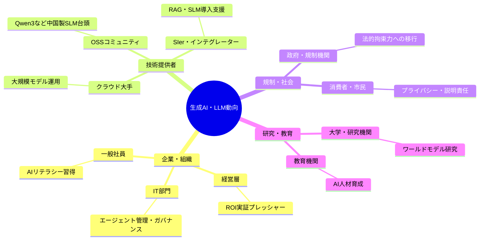
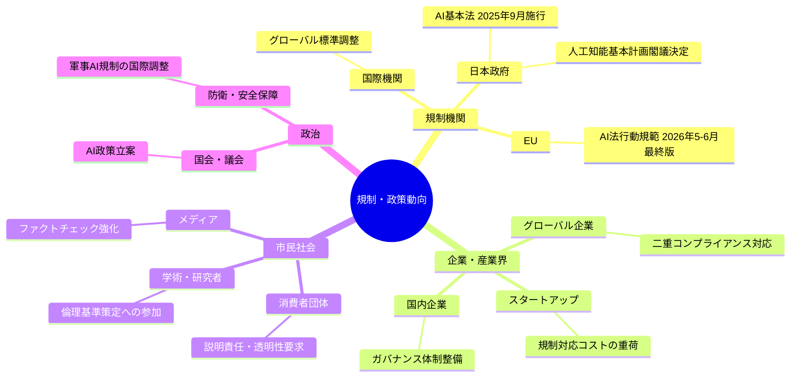
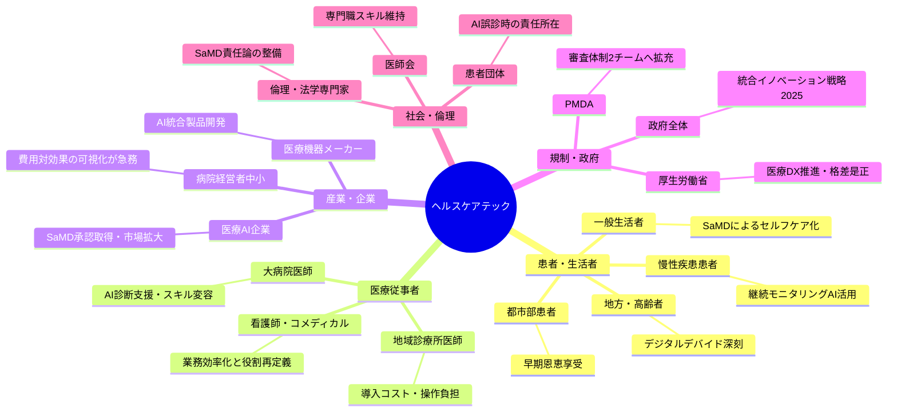

# 🌍 Human視点 分析
分析日時: 2026-05-05 21:38

---

## 📋 エグゼクティブ・サマリー

3トピック横断で見えてくるのは、AIが「試す段階」から「信頼し依存する段階」へ社会全体が移行しつつあるという大転換だ。エージェントAIの本番稼働・法的規制の本格化・医療AIの格差深刻化という三軸が同時進行している。<mark>2026年は技術の進歩速度と社会の受容・制度整備速度の乖離が最も大きくなる「摩擦の年」であり、その摩擦をいかに小さくするかが個人・企業・行政それぞれに問われている。</mark> 特にヘルスケア領域では、デジタルデバイドによる医療格差の固定化が不可逆的なレベルに達するリスクがあり、今すぐ政策介入が必要な段階だ。

---

## 🌍 生成AI・LLM最新動向

- **社会的インパクト**: エージェントAIが「実験段階」から「本番稼働段階」へ移行し、企業の意思決定・業務遂行に深く組み込まれ始めている。<mark>「2026年は信頼する年」というフレームが示すように、AIとの共存リテラシーが一般社員レベルで求められる転換点に達した。</mark> 特に中国製OSSモデル（Qwen3など）の普及は、コスト障壁を下げ中小企業のAI参入を加速させる一方、情報セキュリティ意識の分断を生む懸念がある。
- **💰 ビジネスチャンス**: 推論用途がコンピュート全体の **2/3** を占める構造変化は、クラウド大手だけでなくオンプレ軽量モデル（SLM）を扱うSIer・インテグレーター市場を創出する。RAGを軸にした社内知識管理ソリューション需要が急拡大しており、**BtoB向け業務AI導入支援市場は2026年に高成長**が見込まれる。
- **🔥 話題性・熱量**: 「エージェントが見えない」問題はIT部門だけでなくHR・法務・経営企画での緊急議題化が進んでおり、AIガバナンス研修・社内ポリシー整備の需要が急騰している。

### ステークホルダーマップ（必須）

### 影響度マトリクス（必須）

| ステークホルダー | 影響度 | 時間軸 | 主なインパクト |
|---|---|---|---|
| 一般社員・ホワイトカラー | ⭐⭐⭐⭐⭐ | 即時〜1年 | 業務プロセスへのエージェント常駐による役割再定義 |
| 中小企業経営者 | ⭐⭐⭐⭐ | 6ヶ月〜2年 | OSSモデル活用によるコスト削減・競争力平準化 |
| IT部門・情報システム担当 | ⭐⭐⭐⭐⭐ | 即時 | シャドーAI問題・エージェント可視化の緊急対応 |
| 人材・HRマネージャー | ⭐⭐⭐ | 1〜3年 | AIリテラシー研修・職務要件の再設計 |
| クラウドベンダー | ⭐⭐⭐⭐ | 即時〜1年 | 推論需要急増によるインフラ収益拡大 |
| SIer・コンサルティング企業 | ⭐⭐⭐⭐⭐ | 即時〜2年 | RAG・SLM導入支援の爆発的需要増 |
| 一般消費者 | ⭐⭐ | 1〜3年 | 製品・サービスの品質向上と説明責任の不透明化 |

---

## ⚖️ 規制・政策動向

- **社会的インパクト**: 2026年はAI規制が「努力義務・ガイドライン」から「法的拘束力のある義務」へ移行する歴史的転換点。<mark>日本のAI基本法（2025年9月全面施行）とEU AI法行動規範（2026年5〜6月最終版）が重なることで、グローバル展開する日本企業は二重コンプライアンス対応を迫られる。</mark> 企業内の「誰がどんなエージェントを使っているか見えない」問題が法的リスクに直結し始めた。
- **💰 ビジネスチャンス**: AIガバナンス・コンプライアンス支援市場が急成長。法務・リスク管理・監査対応向けのAIガバナンスツール、説明可能AI（XAI）ソリューション、ファクトチェックサービスへの需要が急拡大。防衛・半導体・量子の **重点6分野**に絞られた政府補助金を活用した官民連携ビジネスも注目される。
- **🔥 話題性・熱量**: 政策策定へのAI浸透は「民主主義のアルゴリズム化」を巡る社会議論を激化させる。信頼性担保・ファクトチェックは政府・メディア・市民社会それぞれで異なる温度感があり、国際的調整の難航が続く見通し。

### ステークホルダーマップ（必須）

### 影響度マトリクス（必須）

| ステークホルダー | 影響度 | 時間軸 | 主なインパクト |
|---|---|---|---|
| グローバル展開企業の法務部門 | ⭐⭐⭐⭐⭐ | 即時〜1年 | 日本・EU二重規制への同時対応コスト増大 |
| 国内中小企業 | ⭐⭐⭐ | 1〜3年 | ガバナンス対応の人的・財政的負担 |
| AIスタートアップ | ⭐⭐⭐⭐ | 即時〜1年 | 規制適合コストが競争力・調達に直接影響 |
| 政策立案者・官僚 | ⭐⭐⭐⭐ | 即時 | AIを使った政策立案の信頼性担保が急務 |
| 一般市民・有権者 | ⭐⭐⭐ | 1〜5年 | AI生成コンテンツへの信頼低下・情報リテラシー格差拡大 |
| 防衛・安全保障産業 | ⭐⭐⭐⭐⭐ | 即時〜3年 | 政府重点6分野支援による官民投資集中 |
| メディア・ジャーナリスト | ⭐⭐⭐ | 即時〜2年 | AI生成コンテンツ透明性義務化による報道慣行の再設計 |

---

## 🏥 ヘルスケアテック

- **社会的インパクト**: 世界医療AI市場が **560億ドル（前年比+42%）** に達する一方、日本国内では医療機関AI導入率わずか28%、地域診療所の **94.3%が未導入** という深刻なデジタルデバイドが顕在化している。<mark>AIによる恩恵が都市部・大病院に集中し、地方・中小医療機関に届かない「医療格差の再生産」が2026年最大の社会課題として浮上している。</mark> 生成AI・マルチモーダルAI・SaMDの三本柱が本格普及すれば、患者体験・診断精度・医師の労働負担という三層すべてに変革が波及する。
- **💰 ビジネスチャンス**: SaMD（プログラム医療機器）はPMDA審査体制拡充により承認スピードが向上し、市場参入機会が拡大する。「費用対効果が見えない」中小医療機関向けに **ROIを可視化するAI導入支援SaaS** が最大のビジネス空白地帯。政府「統合イノベーション戦略2025」でAI×医療が重点分野に指定されており、補助金活用型の地域医療DXモデルが急務となっている。
- **🔥 話題性・熱量**: 問診AI・手術支援AIが実用化フェーズに入ったことで、「AIが誤診したとき誰が責任を取るか」という法的・倫理的議論が患者団体・医師会・厚生労働省の三者で本格化。医師・看護師のAIアシスタントへの依存度が高まるにつれ、専門職の「スキル劣化」懸念も社会的議論に浮上している。

### 🌍 社会的・生活影響の詳細分析

#### 患者・生活者への影響
AIによる問診自動化・画像診断支援は、**待ち時間短縮・診断精度向上・医師の負担軽減**という三重の恩恵をもたらす。しかし現状では都市部大病院のみの話であり、地方在住の患者・高齢者・低所得者層には届いていない。「AIの恩恵を受ける権利の格差」が新たな社会不平等として定着するリスクがある。ゲノム診断AI（導入率9.7%）の普及が進めば個別化医療が現実となるが、それも先行するのは大病院のみだ。

#### 医療従事者への影響
画像診断AI導入率13.3%にとどまる現状は、**先進病院と地域病院の診断能力格差**を拡大させる。AIアシスタントを使いこなせる医師とそうでない医師の間でキャリア・収入格差が生じる「医師のAIリテラシー格差」問題が今後5年の重要課題となる。一方で慢性的な医師不足・長時間労働の課題に対し、AIが有効な緩和手段になりうるという側面も見逃せない。

#### 地域医療・公衆衛生への影響
地域診療所の94.3%が未導入という現実は、地方の一次医療機能の弱体化につながる。高齢化が最も深刻な地方で最もAI活用が遅れるという逆説が生じており、**地域医療崩壊のリスクをAIが加速させる可能性**がある。「費用対効果が見えない」という経営者の声は、補助金・ロールモデル提示・ROI可視化ツールの整備なしには解決されない構造的課題だ。

#### 生活インフラとしての医療AIの未来
SaMD（プログラム医療機器）の普及は、医療機関外でのセルフケアAI（スマートフォン問診・ウェアラブル連携）として一般生活に浸透する未来を予告している。これが実現すれば「病院に行かずに診断される日常」が到来するが、同時に過剰診断・医療不安の増大というリスクも生じる。

### ステークホルダーマップ（必須）

### 影響度マトリクス（必須）

| ステークホルダー | 影響度 | 時間軸 | 主なインパクト |
|---|---|---|---|
| 地方・高齢患者 | ⭐⭐⭐⭐⭐ | 3〜10年 | **デジタルデバイドによる医療格差深刻化**（最重要社会課題） |
| 都市部・大病院患者 | ⭐⭐⭐⭐ | 即時〜2年 | 診断精度向上・待ち時間短縮の先行享受 |
| 地域診療所医師 | ⭐⭐⭐⭐⭐ | 1〜5年 | 費用対効果不透明・導入停滞・競争力低下 |
| 大病院・専門医 | ⭐⭐⭐⭐ | 即時〜3年 | AI活用による診断・手術精度向上、役割再定義 |
| 医療AI・SaMDスタートアップ | ⭐⭐⭐⭐⭐ | 即時〜3年 | PMDA審査迅速化による市場参入機会拡大 |
| 病院経営者（中小） | ⭐⭐⭐⭐ | 1〜3年 | ROI不透明感から導入停滞、競争劣位化リスク |
| 厚生労働省・PMDA | ⭐⭐⭐⭐ | 即時〜2年 | 審査体制整備・地域格差是正政策の立案急務 |
| 保険会社・医療保険制度 | ⭐⭐⭐ | 3〜10年 | SaMD普及による診療報酬・保険適用制度の抜本見直し |

---

## 💡 総合所感（アクション提言）

1. ✅ **企業向け**: エージェントAIの「シャドー化」を防ぐAIガバナンス体制（棚卸し・可視化ツール導入）を **2026年内に整備**することが法的リスク回避の最優先事項。
2. ✅ **政策・行政向け**: 地域診療所94.3%未導入という数字を放置すれば医療格差の固定化が不可逆となる。**補助金＋ROI可視化支援のパッケージ型地域医療DX政策**が急務。
3. 💰 **ビジネス機会**: 「費用対効果が見えない」中小医療機関と「RAGの社内定着が進む」一般企業の双方で、**成果可視化・KPI設計支援**が最大の付加価値提供領域となる。
4. 🔍 **要注目**: AI生成コンテンツ規制（EU・日本）の整備と並行して、一般市民・患者・有権者レベルのAIリテラシー教育投資が急がれる。技術の進歩と社会の受容速度の乖離が最大のリスク要因だ。
5. ⚠️ **リスク管理**: 医療AIの誤診責任・SaMDの保険適用・介護人材との役割分担は、技術の普及前に法制度・社会合意を整備しなければ普及が阻害される。
