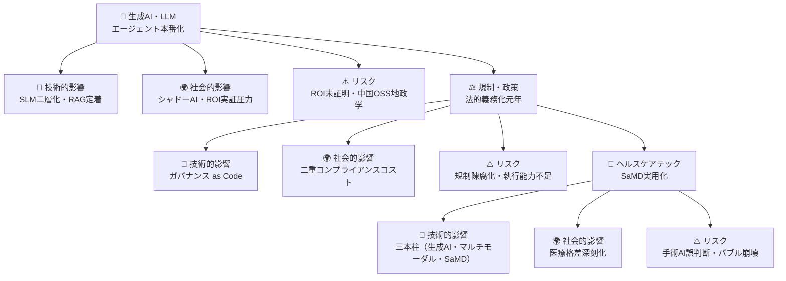
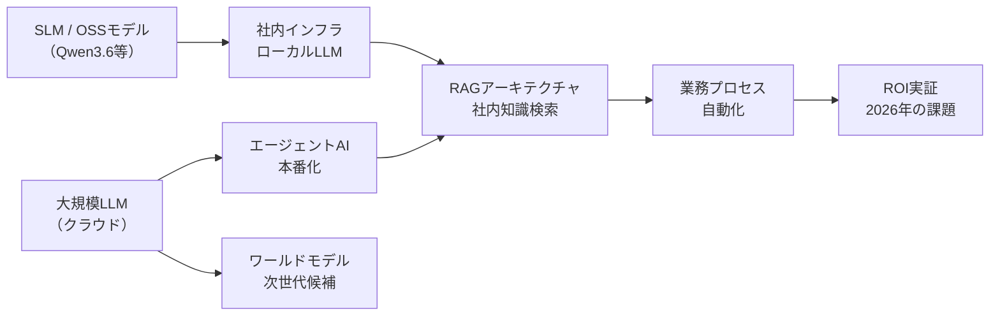
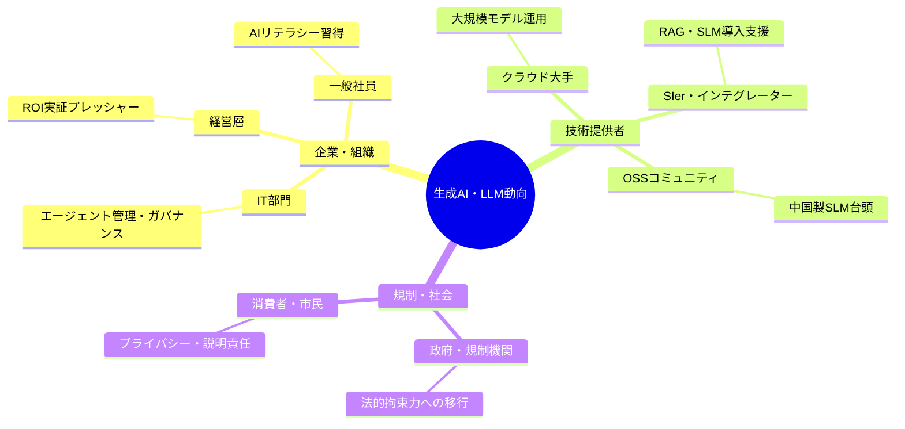
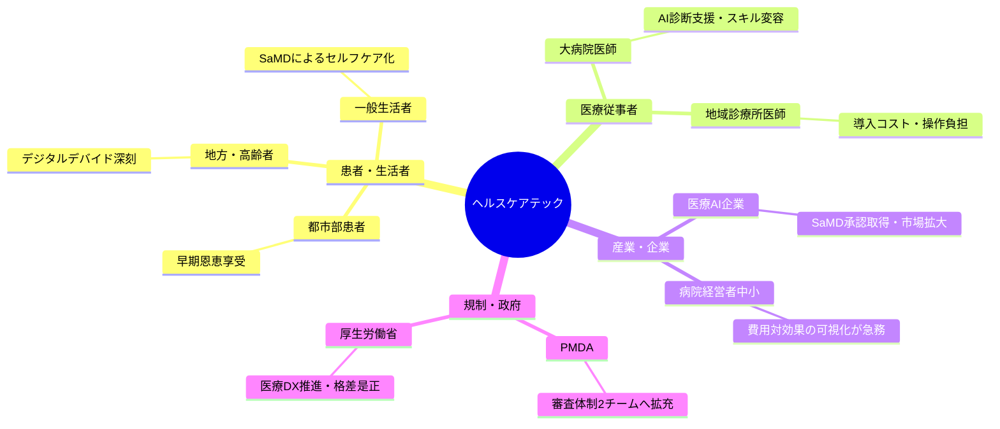
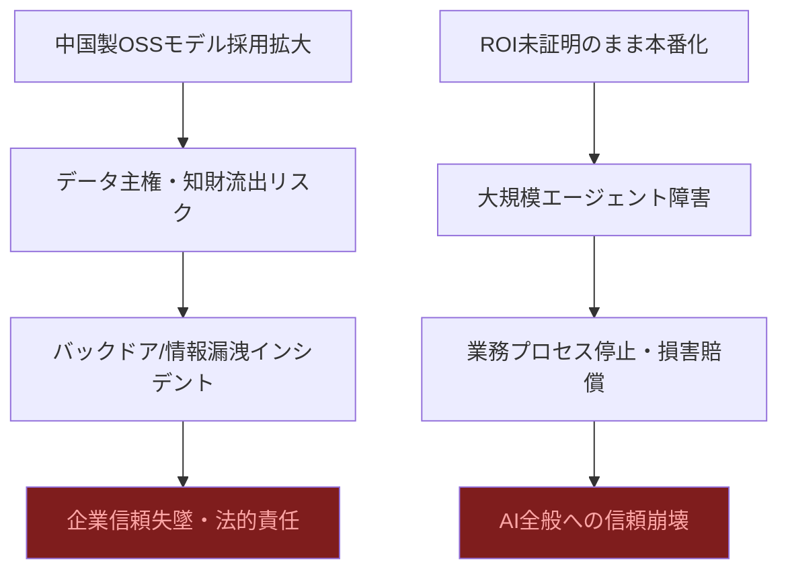
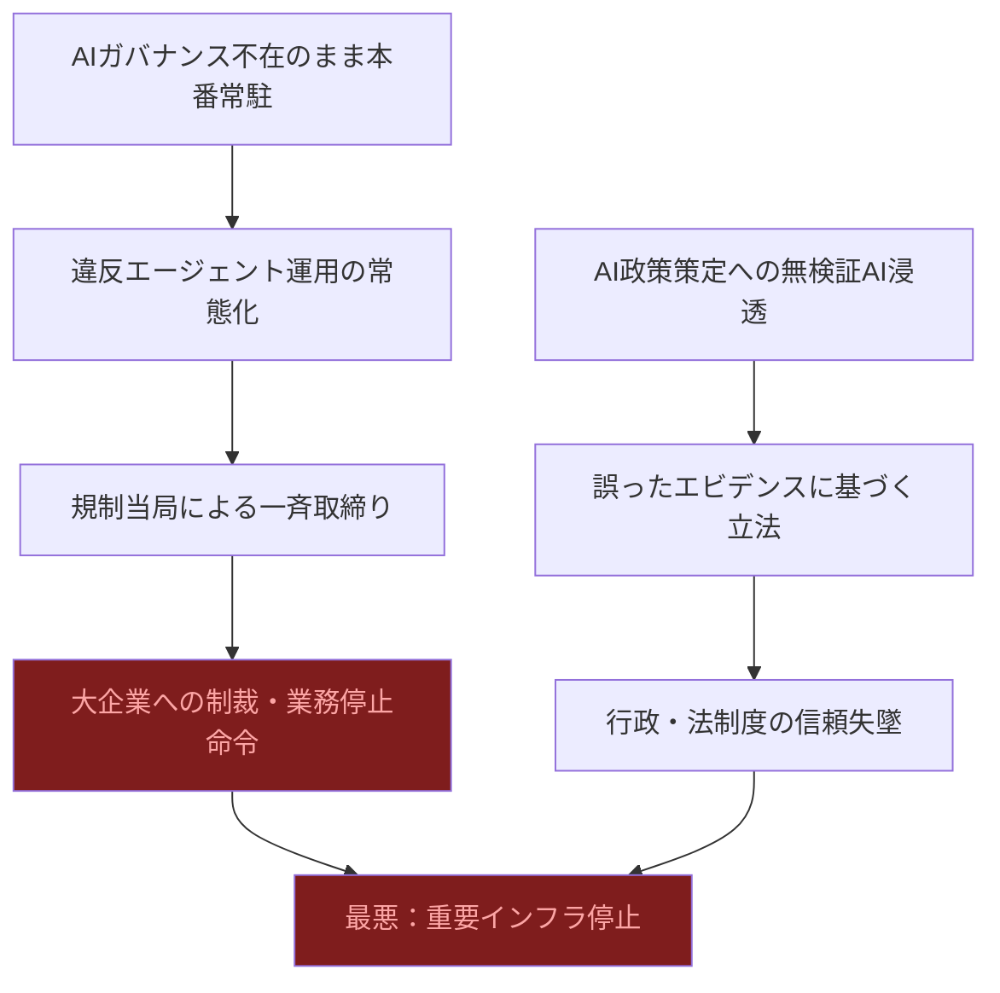
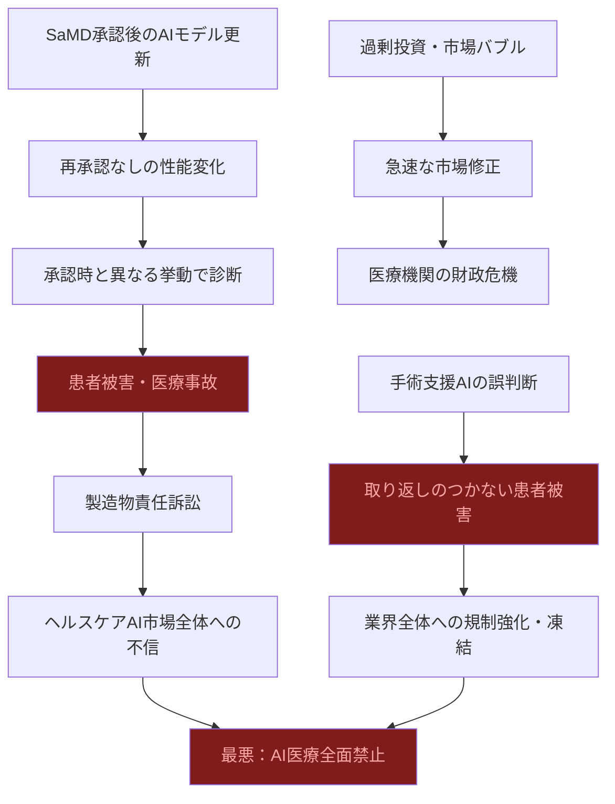

# 📊 トレンド日報 2026-05-05

## 📋 エグゼクティブ・サマリー

> **本日の重要トピック**: 生成AI・LLM最新動向, 規制・政策動向, ヘルスケアテック

2026年5月時点で、AIは「研究・構築フェーズ」を終え、**「信頼・実装・規制」フェーズ**に本格突入した。エージェントAIは本番環境へ、法規制は法的義務へ、医療AIは実用化フェーズへとそれぞれ転換した一方、3分野すべてで「期待の先行と現実の乖離」が深刻化している。

<mark>最も注視すべきは、企業内AIガバナンスの空白と医療AIの地域格差という2つの時限爆弾だ。前者はEU・日本の規制強化との衝突で「知らずに違反」状態を招き、後者は地域診療所の94.3%未導入という数字が示す医療格差の不可逆固定化リスクを孕んでいる。</mark>

楽観的な市場成長数字の裏で、ROI未証明のままのエージェント本番化・承認後AIモデル更新問題・規制陳腐化というトリプルリスクが同時進行している。今こそ「技術の進歩速度」と「社会の受容・制度整備速度」の乖離を直視し、行動すべきタイミングである。

---

## 🗺️ トピック関係図

---

## 🔬 Tech視点

### 🚀 生成AI・LLM最新動向

- **技術的注目点**: <mark>推論コンピュートが全体の2/3を占め、SLM（小型言語モデル）のオンプレ展開とクラウド巨大モデルの二層アーキテクチャが業界標準として確立した。</mark>
- **📊 データ・数字**: **推論用途が全コンピュートの2/3** / Qwen3.6が**2026年4月**にOSS公開 / エージェントAIは「**2025年構築・2026年信頼**」フェーズへ
- **技術的意義**: RAGが社内AIの基本アーキテクチャとして定着。中国製OSSモデル（Qwen3.6等）の台頭により、高品質ローカルLLMの選択肢が多様化し企業の自社インフラ化が加速
- **展望**: エージェントAIの本番運用拡大に伴い、**信頼性エンジニアリング（可観測性・監査ログ・ロールバック）** の需要が急増

| 指標 | 現状値 | 成長率 | 備考 |
|------|--------|--------|------|
| 推論コンピュート比率 | **全体の2/3** | 急拡大中 | 学習→推論フェーズへのシフト |
| 中国製OSSモデル | Qwen3.6（2026/04公開） | 四半期ごとに更新 | ローカル展開の選択肢拡大 |
| RAG採用状況 | 社内AI基本アーキテクチャとして定着 | — | ベクトルDB市場と連動 |
| エージェントAI段階 | 本番化フェーズ突入 | — | 2025年構築→2026年信頼 |

### 📊 規制・政策動向

- **技術的注目点**: <mark>2026年は「ガイドライン」から「法的拘束力のある義務」へ転換する歴史的転換点であり、企業のAIシステム設計そのものに法令準拠アーキテクチャが求められ始めた。</mark>
- **📊 データ・数字**: **日本AI法 2025年9月全面施行** / EU AI法行動規範**2026年5〜6月最終版**公表予定 / 日本「AI基本計画」重点6分野（防衛・半導体・量子）
- **技術的意義**: エージェント識別ID・操作ログ・IAM連携の整備が不可欠に。**AI Governance as Code**の概念が普及し、CI/CDパイプラインへのコンプライアンスチェック組み込みが加速
- **展望**: LLMの出力監査ツール市場が急拡大。政府の重点6分野投資は国産半導体・量子コンピューティングのエコシステム形成を後押し

| 指標 | 現状値 | 予定・期限 | 備考 |
|------|--------|------------|------|
| 日本AI法 | 全面施行済（2025/09） | — | 企業対応が本格化 |
| EU AI法行動規範 | 策定中 | **2026年5〜6月最終版** | 透明性要件を含む |
| 日本「AI基本計画」 | 閣議決定済 | 重点6分野を支援強化 | 防衛・半導体・量子 |
| エージェント可視化問題 | 急増中 | 技術標準策定が急務 | IAM・監査ログ整備が必要 |

### 🏥 ヘルスケアテック

- **技術的注目点**: <mark>世界医療AI市場が2026年に約560億ドル・前年比+42%成長を見込む一方、日本国内では地域診療所の94.3%が未導入というデジタルデバイドが深刻化しており、技術普及の「ラストマイル問題」が最大の課題となっている。</mark>
- **📊 データ・数字**: 世界医療AI市場 **約560億ドル（前年比+42%）** / 日本医療機関AI導入率 **28%** / 地域診療所未導入率 **94.3%**
- **技術的意義**: 生成AI・マルチモーダルAI・SaMDの三本柱が技術スタックを形成。PMDAの審査体制拡充（2チーム化）でSaMD商用展開サイクルが短縮
- **展望**: 費用対効果可視化ツール（ROI計算機能付き導入支援SaaS）と軽量SaMDの普及が中小医療機関のデバイド解消に鍵を握る

| 指標 | 現状値 | 成長率 | 備考 |
|------|--------|--------|------|
| 世界医療AI市場規模 | **約560億ドル（2026年）** | **+42%（前年比）** | 問診・手術支援・SaMDが牽引 |
| 日本医療機関AI導入率 | **28%** | — | 大規模機関に偏在 |
| 画像診断AI導入率 | **13.3%** | — | 最も普及した分野 |
| 地域診療所未導入率 | **94.3%** | — | デジタルデバイドが深刻 |

---

## 🌍 Human視点

### 生成AI・LLM最新動向

- **社会的インパクト**: エージェントAIが「実験段階」から「本番稼働段階」へ移行し、企業の意思決定・業務遂行に深く組み込まれ始めている。<mark>「2026年は信頼する年」というフレームが示すように、AIとの共存リテラシーが一般社員レベルで求められる転換点に達した。</mark>
- **💰 ビジネスチャンス**: オンプレ軽量モデル（SLM）を扱うSIer・インテグレーター市場を創出。**BtoB向け業務AI導入支援市場は2026年に高成長**が見込まれる
- **🔥 話題性・熱量**: 「エージェントが見えない」問題がIT部門だけでなくHR・法務・経営企画での緊急議題化。AIガバナンス研修・社内ポリシー整備の需要が急騰

| ステークホルダー | 影響度 | 時間軸 | 主なインパクト |
|---|---|---|---|
| 一般社員・ホワイトカラー | ⭐⭐⭐⭐⭐ | 即時〜1年 | 業務プロセスへのエージェント常駐による役割再定義 |
| IT部門・情報システム担当 | ⭐⭐⭐⭐⭐ | 即時 | シャドーAI問題・エージェント可視化の緊急対応 |
| SIer・コンサルティング企業 | ⭐⭐⭐⭐⭐ | 即時〜2年 | RAG・SLM導入支援の爆発的需要増 |
| 中小企業経営者 | ⭐⭐⭐⭐ | 6ヶ月〜2年 | OSSモデル活用によるコスト削減・競争力平準化 |

### 規制・政策動向

- **社会的インパクト**: <mark>日本のAI基本法（2025年9月全面施行）とEU AI法行動規範（2026年5〜6月最終版）が重なることで、グローバル展開する日本企業は二重コンプライアンス対応を迫られる。</mark>
- **💰 ビジネスチャンス**: AIガバナンス・コンプライアンス支援市場が急成長。説明可能AI（XAI）・ファクトチェックサービス・ガバナンスツールへの需要が急拡大
- **🔥 話題性・熱量**: 政策策定へのAI浸透は「民主主義のアルゴリズム化」を巡る社会議論を激化させる

| ステークホルダー | 影響度 | 時間軸 | 主なインパクト |
|---|---|---|---|
| グローバル展開企業の法務部門 | ⭐⭐⭐⭐⭐ | 即時〜1年 | 日本・EU二重規制への同時対応コスト増大 |
| 防衛・安全保障産業 | ⭐⭐⭐⭐⭐ | 即時〜3年 | 政府重点6分野支援による官民投資集中 |
| AIスタートアップ | ⭐⭐⭐⭐ | 即時〜1年 | 規制適合コストが競争力・調達に直接影響 |

### 🏥 ヘルスケアテック（詳細分析）

- **社会的インパクト**: <mark>AIによる恩恵が都市部・大病院に集中し、地方・中小医療機関に届かない「医療格差の再生産」が2026年最大の社会課題として浮上している。</mark> 生成AI・マルチモーダルAI・SaMDの三本柱が本格普及すれば、患者体験・診断精度・医師の労働負担という三層すべてに変革が波及する
- **💰 ビジネスチャンス**: 「費用対効果が見えない」中小医療機関向けに **ROIを可視化するAI導入支援SaaS** が最大のビジネス空白地帯。政府補助金活用型の地域医療DXモデルが急務
- **🔥 話題性・熱量**: 「AIが誤診したとき誰が責任を取るか」という法的・倫理的議論が患者団体・医師会・厚生労働省の三者で本格化。医師・看護師の「スキル劣化」懸念も浮上

#### 患者・生活者への影響
AIによる問診自動化・画像診断支援は**待ち時間短縮・診断精度向上・医師の負担軽減**という三重の恩恵をもたらす。しかし現状では都市部大病院のみの話であり、地方在住の患者・高齢者・低所得者層には届いていない。「AIの恩恵を受ける権利の格差」が新たな社会不平等として定着するリスクがある。

#### 地域医療・公衆衛生への影響
地域診療所の94.3%が未導入という現実は、地方の一次医療機能の弱体化につながる。高齢化が最も深刻な地方で最もAI活用が遅れるという逆説が生じており、**地域医療崩壊のリスクをAIが加速させる可能性**がある。

| ステークホルダー | 影響度 | 時間軸 | 主なインパクト |
|---|---|---|---|
| 地方・高齢患者 | ⭐⭐⭐⭐⭐ | 3〜10年 | **デジタルデバイドによる医療格差深刻化**（最重要社会課題） |
| 医療AI・SaMDスタートアップ | ⭐⭐⭐⭐⭐ | 即時〜3年 | PMDA審査迅速化による市場参入機会拡大 |
| 地域診療所医師 | ⭐⭐⭐⭐⭐ | 1〜5年 | 費用対効果不透明・導入停滞・競争力低下 |
| 保険会社・医療保険制度 | ⭐⭐⭐ | 3〜10年 | SaMD普及による診療報酬・保険適用制度の抜本見直し |

---

## ⚠️ Critic視点

### 生成AI・LLM最新動向

- **❌ 主なリスク**: <mark>「2026年は信頼する年」というキャッチフレーズ自体が業界の自己申告にすぎない。ROI実証が「求められる段階」と認めている時点で、大多数の企業がいまだにROIを証明できていない事実を暗黙に認白している。信頼は宣言するものではなく実績で積み上げるものであり、この言葉は「まだ信頼できる段階ではない」という裏返しである。</mark>
- **楽観論への反論**:
  - Qwen3.6など中国製OSSモデルをローカルで動作させるだけで「安全」という思い込みは危険。**データ主権・知財流出・バックドア埋め込みのリスク**を企業が十分に評価していない
  - RAGの「基本アーキテクチャとして定着」は過大評価。チャンク分割の不整合・検索精度の不安定・ハルシネーションの残存は**未解決のまま本番投入**が進んでいる
  - 義務化が本格化した瞬間に「導入済みだが規制違反」という状態が続出するリスクを誰も計上していない

| リスク項目 | 発生確率 | 影響度 | 総合評価 |
|---|---|---|---|
| 中国製モデル経由のデータ漏洩 | 中 | 極大 | ❌ 最高危険 |
| ROI未証明エージェントの本番障害 | **高** | 大 | ❌ 危険 |
| 規制義務化による既存システムの違反 | **高** | 大 | ❌ 危険 |
| RAG品質不足による誤意思決定 | **高** | 中 | ⚠️ 注意 |

### 規制・政策動向

- **❌ 主なリスク**: <mark>「誰がどんなエージェントを使っているか見えない」問題が「急増」しているという表現は、企業内でAIガバナンスが実質的に機能していないことの公式な認白であり、制御不能状態に陥りつつあることを意味する。ガバナンス不在のまま規制の義務化が進めば、企業は「違反を知らずに違反している」状態で取締まりを受けることになる。</mark>
- **楽観論への反論**:
  - EU AI法行動規範の「2026年5〜6月最終版予定」は、AIの進化速度に規制策定が全く追いついていないことを示す。**「最終版が出る頃には時代遅れ」という規制の宿命的陳腐化**は誰も正面から論じていない
  - 課題が未解決のまま政策策定へのAI浸透だけが先行するという最悪の順序をたどっている。ファクトチェック不能なAI政策提言が法律・予算に反映された場合の社会的損害は計り知れない

| リスク項目 | 発生確率 | 影響度 | 総合評価 |
|---|---|---|---|
| ガバナンス不在のまま規制違反状態 | **極高** | 大 | ❌ 最高危険 |
| AI政策提言のファクトチェック欠如 | **高** | 極大 | ❌ 最高危険 |
| 規制の陳腐化・実効性喪失 | **高** | 大 | ❌ 危険 |
| AIへの不可逆依存と撤退困難 | **高** | 中 | ⚠️ 注意 |

### 🏥 ヘルスケアテック

- **❌ 主なリスク**: <mark>日本の医療機関AI導入率28%、地域診療所の94.3%が未導入という数字は「格差」ではなく「市場予測の完全な失敗」を示す。世界市場+42%成長という数字は、実際の臨床使用ではなくB2B契約・PoC費用・ライセンス料の計上である可能性が高く、患者への実質的恩恵とは乖離している。</mark>
- **楽観論への反論**:
  - PMDA審査体制の「2チームへの拡充」は焼け石に水。**承認スピード向上と審査品質低下はトレードオフ**であり、スループット向上のみを指標にするのは危険な近視眼
  - 「費用対効果が見えない」として導入停滞している中小医療機関の判断は**正しい**。費用対効果が明確でない製品を94%が採用しないのはリスク管理として合理的であり、これを「デジタルデバイド」と非難するのはベンダーの論理の押しつけである
  - 最も危険なのは**手術支援AI**。手術中のリアルタイム判断でAIが誤った場合、患者への取り返しのつかない被害が即座に発生する

| リスク項目 | 発生確率 | 影響度 | 総合評価 |
|---|---|---|---|
| 手術支援AI誤判断による患者死亡 | 低〜中 | **壊滅的** | ❌ 最高危険 |
| 承認後AIモデル更新による性能変化 | **高** | 大 | ❌ 危険 |
| 医療AIバブル崩壊による医療機関財政危機 | 中 | 大 | ❌ 危険 |
| PMDA審査品質低下（スループット優先） | 中 | 大 | ⚠️ 注意 |

---

## 💡 総合所感・アクション提言

2026年5月、AIは「夢の技術」から「説明責任を問われる社会インフラ」へと転換した。3分野横断で見えるメガトレンドは、**技術の進歩速度と社会の受容・制度整備速度の乖離**が臨界点に近づいているという事実だ。

**即時対応が必要なアクション：**

1. ✅ **企業のIT部門・経営層**: エージェントAIの「シャドー化」防止のため、**2026年内にAI棚卸し・可視化ツール導入とガバナンスポリシー整備**を最優先事項とする。EU・日本の規制強化との衝突が現実となる前に手を打つこと

2. ✅ **政策立案者・厚生労働省**: 地域診療所94.3%未導入を放置すれば医療格差の固定化が不可逆となる。**補助金＋ROI可視化支援のパッケージ型地域医療DX政策**を2026年度補正予算で手当てすること

3. 💰 **ビジネスチャンス最大化**: 「費用対効果が見えない」という中小医療機関・中堅企業の声に応える**成果可視化SaaS・KPI設計コンサル**が2026〜2027年の最重要ビジネス機会。ROI計算機能付きAI導入支援が市場の空白地帯

4. 🔍 **投資判断の注意点**: 医療AI市場+42%成長という数字を鵜呑みにしてはならない。**B2B契約計上と実臨床使用は別物**であり、過剰投資は2027〜2028年の市場修正時に財政危機を招く。検証された臨床有効性データを持つプレイヤーを選別すること

5. ⚠️ **最大のリスク管理**: <mark>手術支援AIの重大事故・AIガバナンス違反による大企業制裁・医療AIバブル崩壊が2026〜2027年に複合して顕在化した場合、「AI規制の極端な揺り戻し」として実用的なAI活用すら全面禁止に追い込まれるシナリオは現実的な脅威である。</mark> 今こそ業界全体での自律的な安全基準策定と透明性確保が急務だ
