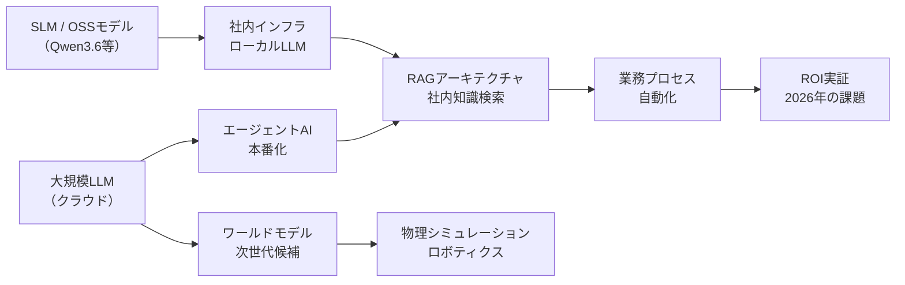
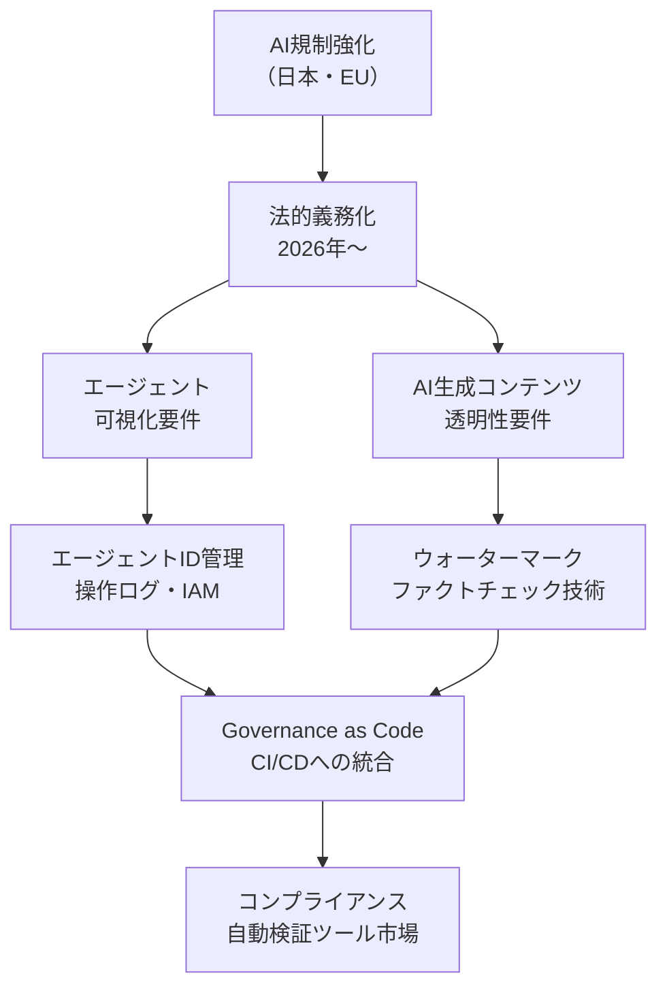
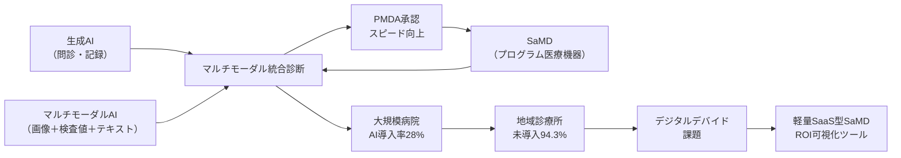

# 🔬 Tech視点 分析
分析日時: 2026-05-05 21:38

## 🚀 生成AI・LLM最新動向

- **技術的注目点**: <mark>推論コンピュートが全体の2/3を占め、SLM（小型言語モデル）のオンプレ展開とクラウド巨大モデルの二層アーキテクチャが業界標準として確立した。</mark> これはモデル学習フェーズから推論・活用フェーズへの明確なシフトを示す。
- **📊 データ・数字**: **推論用途が全コンピュートの2/3**を消費 / Qwen3.6が**2026年4月**にOSS公開 / エージェントAIは「**2025年構築・2026年信頼**」のフェーズ移行を宣言
- **技術的意義**: RAGが社内AIの基本アーキテクチャとして定着し、ワールドモデルがLLMの次世代候補として浮上。中国製OSSモデル（Qwen3.6等）の台頭により、高品質ローカルLLMの選択肢が多様化し、企業の自社インフラ化が加速している。
- **展望**: エージェントAIの本番運用が広がる中、可観測性・監査ログ・ロールバック機能など**信頼性エンジニアリング（Reliability Engineering）**の需要が急増する。ワールドモデルは物理シミュレーション・ロボティクス・自動運転と親和性が高く、2027〜2028年に向けた次の投資波を形成する可能性が高い。

### 技術関係図（必須）

### 主要指標（必須）
| 指標 | 現状値 | 成長率 | 備考 |
|------|--------|--------|------|
| 推論コンピュート比率 | **全体の2/3** | 急拡大中 | 学習→推論フェーズへのシフト |
| 中国製OSSモデル | Qwen3.6（2026/04公開） | 四半期ごとに更新 | ローカル展開の選択肢拡大 |
| RAG採用状況 | 社内AI基本アーキテクチャとして定着 | — | ベクトルDB市場と連動 |
| エージェントAI段階 | 本番化フェーズ突入 | — | 2025年構築→2026年信頼 |
| ワールドモデル成熟度 | 研究→実用化 移行期 | — | LLMの次世代技術として注目 |

---

## 📊 規制・政策動向

- **技術的注目点**: <mark>2026年は「ガイドライン」から「法的拘束力のある義務」へ転換する歴史的転換点であり、企業のAIシステム設計そのものに法令準拠アーキテクチャが求められ始めた。</mark>
- **📊 データ・数字**: **日本AI法 2025年9月全面施行** / EU AI法行動規範**2026年5〜6月最終版**公表予定 / 日本「人工知能基本計画」重点6分野（防衛・半導体・量子など）
- **技術的意義**: エージェントが業務プロセスに常駐する段階に達し「誰がどのエージェントを使っているか可視化できない」問題が急増。これは技術的にはエージェント識別ID・操作ログ・アクセス制御（IAM連携）の整備を不可欠にする。EU AI Act対応ではリスク分類（Prohibited/High-Risk/Limited-Risk）に基づくシステム設計が必要となる。
- **展望**: AI Governance as Code（コードでガバナンスを実装）の概念が普及し、CI/CDパイプラインへのコンプライアンスチェック組み込み、LLMの出力監査ツール市場が急拡大する見込み。政府の重点6分野投資は国産半導体・量子コンピューティングのエコシステム形成を後押しする。

### 技術関係図（必須）

### 主要指標（必須）
| 指標 | 現状値 | 予定・期限 | 備考 |
|------|--------|------------|------|
| 日本AI法 | 全面施行済（2025/09） | — | 企業対応が本格化 |
| EU AI法行動規範 | 策定中 | **2026年5〜6月最終版** | 透明性要件を含む |
| 日本「AI基本計画」 | 閣議決定済 | 重点6分野を支援強化 | 防衛・半導体・量子 |
| エージェント可視化問題 | 急増中 | 技術標準策定が急務 | IAM・監査ログ整備が必要 |
| AI政策策定への浸透 | 進行中 | ファクトチェック体制が課題 | 国際的な協調枠組みが模索中 |

---

## 🏥 ヘルスケアテック

- **技術的注目点**: <mark>世界医療AI市場が2026年に約560億ドル・前年比+42%成長を見込む一方、日本国内では地域診療所の94.3%が未導入というデジタルデバイドが深刻化しており、技術普及の「ラストマイル問題」が最大の課題となっている。</mark>
- **📊 データ・数字**: 世界医療AI市場 **約560億ドル（前年比+42%）** / 日本医療機関AI導入率 **28%** / 画像診断AI **13.3%** / ゲノムAI **9.7%** / 地域診療所未導入率 **94.3%**
- **技術的意義**: 生成AI・マルチモーダルAI・SaMD（プログラム医療機器）の三本柱が技術スタックを形成。特にマルチモーダルAI（画像＋テキスト＋検査値の統合診断）は従来の単一モダリティAIを超えた精度向上をもたらす。PMDAの審査体制拡充（2チーム化）により承認スピードが向上し、SaMDの商用展開サイクルが短縮される。
- **展望**: 費用対効果の可視化ツール（ROI計算機能付き導入支援SaaS）と軽量SaMDの普及が中小医療機関のデバイド解消に鍵を握る。政府「統合イノベーション戦略2025」によるAI×医療の重点化で、医療データ連携基盤（PHR・EHR統合）への投資が加速する。

### 技術関係図（必須）

### 主要指標（必須）
| 指標 | 現状値 | 成長率 | 備考 |
|------|--------|--------|------|
| 世界医療AI市場規模 | **約560億ドル（2026年）** | **+42%（前年比）** | 問診・手術支援・SaMDが牽引 |
| 日本医療機関AI導入率 | **28%** | — | 大規模機関に偏在 |
| 画像診断AI導入率 | **13.3%** | — | 最も普及した分野 |
| ゲノムAI導入率 | **9.7%** | — | 専門機関中心 |
| 地域診療所未導入率 | **94.3%** | — | デジタルデバイドが深刻 |
| PMDA審査体制 | 2チームに拡充 | — | 承認スピード向上を期待 |

---

## 💡 Tech総合所感

**3トピック横断で見えるメガトレンド**: AIは「研究→構築フェーズ」を終え、**2026年は「信頼・実装・規制」フェーズ**に入った年として記録されるだろう。推論コンピュートの2/3シェア・エージェントAIの本番化・法的義務化・医療AI市場+42%成長はいずれもこの転換を示す。

技術者が今最も注視すべきは、**AIエージェントの可観測性とガバナンスの実装**（操作ログ・IAM連携・コンプライアンス自動検証）と**ヘルスケアのラストマイル問題解消**（SaMDの軽量化・費用対効果可視化）である。Qwen3.6など中国製OSSモデルの急台頭は、エンタープライズのクラウド依存脱却を現実のものとし、今後2〜3年でアーキテクチャ選択の多様化が加速する。
