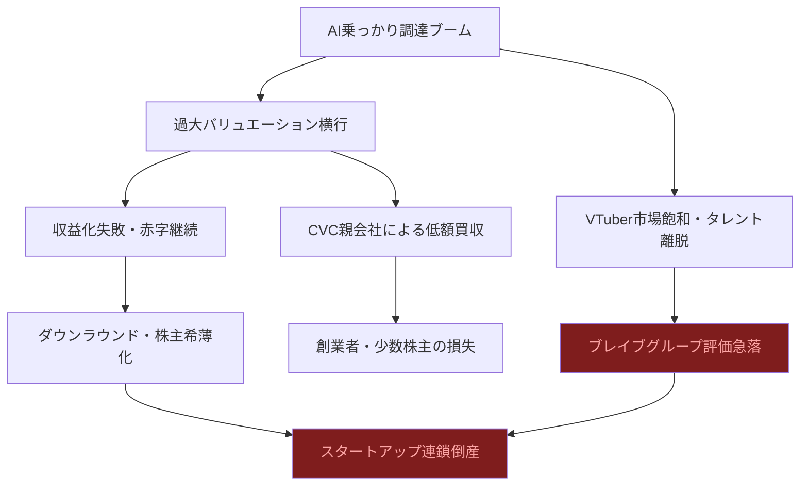
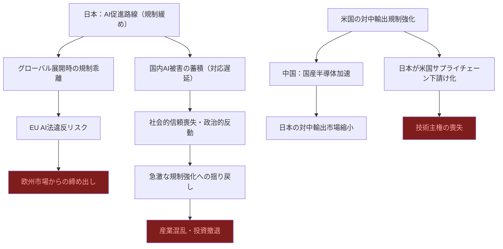
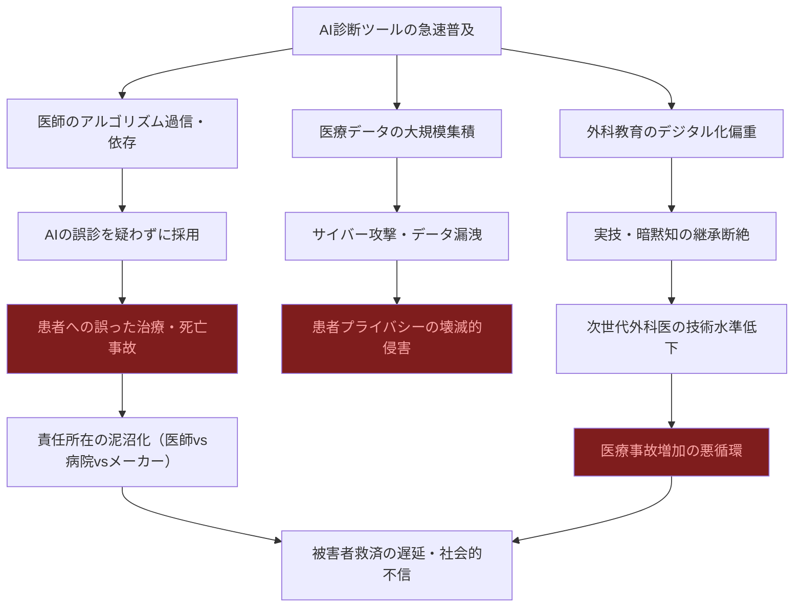

# ⚠️ Critic視点 分析
分析日時: 2026-04-28 21:35

## ⚠️ 日本のスタートアップ・資金調達

- **❌ 主なリスク**: VTuber・建設テック・リユースという異質な三分野が「AI」というラベルで一括りに語られているが、実態は単なる流行語便乗に過ぎない可能性が高い。<mark>特にブレイブグループの80億円調達は、VTuber市場の成長鈍化・タレント離脱リスク・プラットフォーム依存（YouTube/Twitch）という三重苦を抱えており、バブル崩壊の前兆と見るべきだ。</mark> 第三者割当増資が主流という点も、既存株主の希薄化リスクを軽視した楽観的な資金調達姿勢を示している。
- **楽観論への反論**: 「AI機能強化」を理由にした調達（ミツモア30億円など）は、AI投資ブームに乗じた過大評価を招きやすい。AIを冠すれば高バリュエーションがつく現状は2000年のドットコムバブルと構造的に同じだ。建設テックへの資金流入も「顕著」とされているが、建設業界のデジタル化は過去20年間繰り返し「次の大波」と言われ続け、その都度失速してきた歴史がある。BALLAS24億円・ONESTRUCTION9.1億円の両社が黒字化できる保証はどこにもない。メガ企業（メルカリ等）からのCVC投資は戦略的利益相反を生む。資金提供者が競合になり得るか、あるいは買収候補として低バリュエーションで取り込む布石である可能性を投資家は見落としている。
- **🔍 注意すべきポイント**: 「建設テックへの資金流入が顕著」という表現は、実態の吟味なき流行乗りを正当化する典型的な空語だ。顕著な資金流入は、顕著なバブル崩壊リスクと表裏一体である。

### リスク連鎖図（必須）

### リスクマトリクス（必須）
| リスク項目 | 発生確率 | 影響度 | 総合評価 | 対策 |
|---|---|---|---|---|
| VTuber市場の成長鈍化・バブル崩壊 | 高 | 大 | ❌ 致命的 | 収益多角化の即時着手 |
| AI便乗バリュエーション過大評価 | 非常に高 | 大 | ❌ 致命的 | 実績ベース評価の厳格化 |
| 建設テックの収益化失敗（過去の繰り返し） | 高 | 中 | ⚠️ 重大 | PoC段階の厳密な検証 |
| 第三者割当増資による既存株主希薄化 | 高 | 中 | ⚠️ 重大 | 株主間契約の精査 |
| CVC親会社による利益相反・低額M&A | 中 | 大 | ⚠️ 重大 | 独立取締役・ガバナンス強化 |
| 金利上昇によるリスクマネーの収縮 | 中 | 非常に大 | ❌ 致命的 | 早期キャッシュフロー黒字化 |

---

## ⚠️ 規制・政策動向

- **❌ 主なリスク**: 日本の「AI推進法（促進路線）」は、欧米の規制強化の流れと真逆の賭けだ。<mark>EU AI法のハイリスクAI規制が2026年8月に追加適用される中、日本企業がグローバル展開を目指す際に「日本基準ではOKだが欧州では違法」という二重規制地獄に陥るリスクは極めて高い。日本のAI促進路線は短期的な産業振興を優先するあまり、中長期的な国際競争力と被害者保護を犠牲にする構造的欠陥を内包している。</mark>
- **楽観論への反論**: 経産省の民事責任ガイドラインも「解釈の明確化」と称しているが、実態はグレーゾーンを温存した官僚的玉虫色文書に過ぎず、訴訟リスクを軽減する実効性に疑問が残る。米下院の対中AI半導体輸出規制強化は日本に「漁夫の利」と見る楽観論があるが、まったく危うい。日本の半導体産業はTSMC・サムスンとの技術格差が依然として大きく、米国の規制は日本をサプライチェーンの都合のいい下請けとして組み込む構造を強化するだけだ。さらに対中規制は中国の国産代替加速を促し、中長期的に日本の輸出市場を消滅させる。
- **🔍 注意すべきポイント**: 規制の「後追い」構造が最大の問題だ。AIが社会実装された後に責任ガイドラインを出すというアプローチは、すでに被害が発生してから対応する消防的行政の典型であり、被害者保護の観点からは落第点だ。規制の「促進路線」は、将来の急激な揺り戻し規制の引き金を自ら引いている。

### リスク連鎖図（必須）

### リスクマトリクス（必須）
| リスク項目 | 発生確率 | 影響度 | 総合評価 | 対策 |
|---|---|---|---|---|
| EU AI法との乖離による欧州市場閉鎖 | 高 | 非常に大 | ❌ 致命的 | 欧州基準への事前対応 |
| 経産省ガイドラインの実効性不足→訴訟リスク | 高 | 大 | ❌ 致命的 | 企業独自のリスク評価体制構築 |
| 対中規制→中国国産化→日本輸出市場消滅 | 中 | 非常に大 | ❌ 致命的 | 輸出先の多角化 |
| AI規制の急激な揺り戻し（社会的反動） | 中 | 大 | ⚠️ 重大 | ステークホルダー対話の継続 |
| 日本のAI技術主権喪失（米国依存深化） | 高 | 非常に大 | ❌ 致命的 | 国産基盤モデルへの投資 |
| AI民事責任の法的グレーゾーン悪用 | 中 | 中 | ⚠️ 重大 | 契約・免責条項の徹底整備 |

---

## ⚠️ ヘルスケアテック

- **❌ 主なリスク**: ヘルスケアテック市場の「2025年→2026年で20.3%成長」という数字は、調査会社が売り込みたいストーリーに過ぎず、出典・算出根拠が不透明だ。<mark>最も深刻なのは、フィリップスのAI搭載CTを含むLLM診断支援ツールの誤診リスクだ。AIが「30秒以内に自動表示」するという利便性は、医師がAI出力を無批判に受け入れる「アルゴリズム依存・過信」を構造的に生み出す。AIの誤診が患者の死亡につながった場合、責任の所在は医師・病院・メーカーの間で泥沼化し、被害者救済が遅延する。患者データの大規模集積はサイバー攻撃の格好の標的であり、医療情報漏洩は金融情報漏洩より遥かに深刻な人権侵害となる。</mark>
- **楽観論への反論**: 「AI×医療の融合が加速」という言説は、医療現場の実態を無視した技術至上主義だ。現場の医師・看護師の多くはAIツールの導入研修を受ける時間もなく、過労状態で使わされる。コヴィディエンの「Touch Surgery ecosystem」は外科教育を効率化するとされるが、デジタルシミュレーションと実際の手術技術習得の乖離を埋められるのかという根本的疑問に答えていない。外科教育のデジタル化は指導医・メンター文化の解体を招き、暗黙知の継承を断絶させるリスクがある。さらに「市場急拡大」の前提となる保険償還制度がAI医療機器に対応していないという根本的障壁を、楽観論は意図的に無視している。
- **🔍 注意すべきポイント**: 患者の医療画像・診断データ・手術記録をAIが処理することは、史上最もセンシティブな個人情報の大規模集積を意味する。日本の医療機関のサイバーセキュリティ体制は脆弱であり、大規模インシデントはいつ起きてもおかしくない。AI診断ツールの普及は、地方・中小病院と大病院の間にAI格差を生み、医療の地域間不平等を深刻化させる副作用も見落とされている。

### リスク連鎖図（必須）

### リスクマトリクス（必須）
| リスク項目 | 発生確率 | 影響度 | 総合評価 | 対策 |
|---|---|---|---|---|
| AI誤診→医師の過信→患者死亡事故 | 中〜高 | 非常に大 | ❌ 致命的 | AI出力の必須ダブルチェック義務化 |
| 医療データへのサイバー攻撃・漏洩 | 高 | 非常に大 | ❌ 致命的 | ゼロトラストセキュリティ・暗号化徹底 |
| AI責任所在の法的未整備→訴訟泥沼化 | 高 | 大 | ❌ 致命的 | 医療AI専門の立法・ガイドライン早期整備 |
| 市場成長予測（20.3%）の過大評価 | 高 | 中 | ⚠️ 重大 | 複数データソースでの検証 |
| 外科教育デジタル化による暗黙知断絶 | 中 | 大 | ⚠️ 重大 | シミュレーションと実地訓練の並列維持 |
| 医療機関AI導入コスト増→地方病院の格差拡大 | 高 | 大 | ⚠️ 重大 | 補助金制度・導入支援の公平設計 |
| 規制未整備のまま普及→事後規制の混乱 | 非常に高 | 大 | ❌ 致命的 | プレ市場審査の義務化 |

---

## 💡 総括：最悪ケースシナリオ

2026年後半〜2027年にかけて、以下の複合崩壊シナリオが現実的に存在する：

1. **日本スタートアップバブル崩壊**: AI便乗調達の実態露呈→ダウンラウンド連鎖→VCリスクオフ→スタートアップエコシステムの急速な収縮
2. **規制の致命的後追い**: EU AI法対応不備→日本企業の欧州市場締め出し→促進路線の政策失敗として政治問題化
3. **医療AI事故の顕在化**: AI診断過信による死亡事例の集積→規制の極端な揺り戻し→ヘルスケアテック市場の信頼崩壊

<mark>楽観的な成長予測は、これらのリスクを「テールリスク」として矮小化しているが、複数のリスクが同時に顕在化する相関崩壊の可能性を真剣に織り込んでいない点が最大の問題である。特にヘルスケアテックと規制の遅滞が重なった場合、患者被害という取り返しのつかない結果を招く。</mark>
