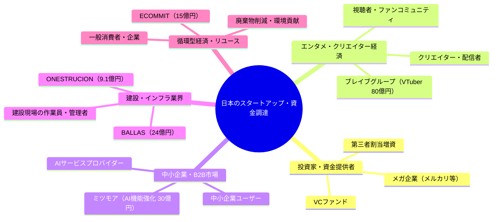
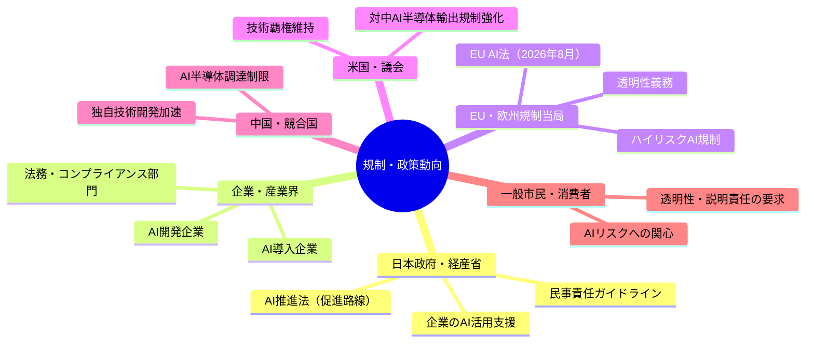
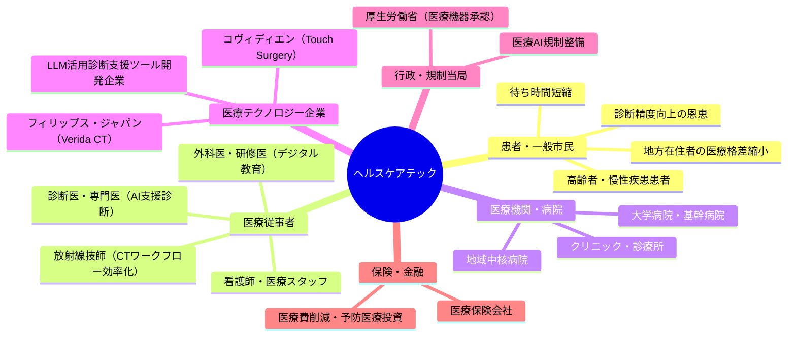

# 🌍 Human視点 分析
分析日時: 2026-04-28 21:35

## 🌍 日本のスタートアップ・資金調達

- **社会的インパクト**: <mark>VTuber・AIマッチング・リユースという「エンタメ×生活課題×循環型経済」の三分野が同時期に大型調達を達成したことは、日本のスタートアップ生態系が多様化・成熟化しつつある証左であり、デジタル産業が地域雇用や消費者生活に直接影響を与え始めている。</mark> 建設テック（ONESTRUCION・BALLAS）への資金流入は、慢性的な人手不足と高齢化が進む建設業界の構造変革を後押しし、働き方改革とも連動する。
- **💰 ビジネスチャンス**: ミツモアのAI機能強化（約30億円）は中小企業向けBtoB SaaSの成長余地を示す。ECOMMITへのメルカリ等からの約15億円調達はリユース・循環型経済市場の拡大を示唆しており、廃棄物削減×ビジネスの組み合わせで社会課題解決型スタートアップへの投資が加速している。建設テック2社合計33億円超の調達は、国内建設市場（約60兆円規模）のDX化需要の大きさを裏付ける。
- **🔥 話題性・熱量**: VTuber企業への80億円という大型調達はエンタメ×テクノロジーの融合を象徴し、Z世代・α世代のデジタルカルチャーが投資対象として確立されたことを示す。SNS・メディアでの注目度は高く、スタートアップ志望の若年層へのインスピレーションになりうる。

### ステークホルダーマップ（必須）

### 影響度マトリクス（必須）

| ステークホルダー | 影響度 | 時間軸 | 主なインパクト |
|---|---|---|---|
| 建設現場の作業員 | ⭐⭐⭐⭐⭐ | 1〜3年 | AI・DXによる業務効率化、人手不足緩和 |
| VTuber・クリエイター | ⭐⭐⭐⭐ | 即時〜1年 | 収益基盤強化、コンテンツ投資拡大 |
| 中小企業経営者 | ⭐⭐⭐⭐ | 1〜2年 | AIマッチングサービス活用で業務コスト削減 |
| 一般消費者（リユース） | ⭐⭐⭐ | 1〜3年 | 循環型経済の恩恵、廃棄物削減意識の醸成 |
| スタートアップ志望者 | ⭐⭐⭐ | 即時 | 大型調達事例がロールモデルとなり起業意欲向上 |
| 地方自治体・行政 | ⭐⭐ | 3〜5年 | 建設DX・リユース普及による地域課題解決 |

---

## 🌍 規制・政策動向

- **社会的インパクト**: <mark>経産省のAI民事責任ガイドライン発表は、企業のAI活用を「法的不確実性」から解放し、日本のAI産業が実用化フェーズへ本格移行するための重要な制度的基盤となる。</mark> EU AI法の2026年8月適用拡大と、日本のAI推進法（促進路線）の対比は、国際社会における規制哲学の分断を浮き彫りにし、グローバルに事業展開する企業の戦略に直接影響する。
- **💰 ビジネスチャンス**: 経産省ガイドライン整備により、AI法務コンプライアンス・リスクコンサルティング市場が新たに勃興。EU AI法対応のための第三者認証・監査サービス、AI透明性レポート作成支援など、企業向けコンプライアンスサービスの需要が急増すると予測される。米中AI半導体覇権争いの激化は、日本の半導体・製造業にとって供給網再編の商機にもなりうる。
- **🔥 話題性・熱量**: 「AIの失敗は誰の責任か」という問いは一般市民にも関心が高く、経産省ガイドラインは専門家だけでなくメディア・一般層にも広く注目される。米中技術覇権争いはナショナリズムとテクノロジーの交差点として政治的関心も高い。

### ステークホルダーマップ（必須）

### 影響度マトリクス（必須）

| ステークホルダー | 影響度 | 時間軸 | 主なインパクト |
|---|---|---|---|
| AI開発・導入企業 | ⭐⭐⭐⭐⭐ | 即時〜2年 | 法的リスク明確化でAI投資判断が加速 |
| 法務・コンプライアンス専門家 | ⭐⭐⭐⭐ | 即時〜1年 | AI法務市場が新たな専門領域として成長 |
| グローバル展開企業 | ⭐⭐⭐⭐ | 1〜2年 | 日米EU三極の規制差異への対応コスト増 |
| 半導体・製造業 | ⭐⭐⭐ | 1〜3年 | 米中対立による供給網再編の機会とリスク |
| 一般市民 | ⭐⭐⭐ | 2〜5年 | AIサービスの安全性・透明性向上の恩恵 |
| スタートアップ | ⭐⭐⭐ | 1〜2年 | ガイドライン整備でAI事業化のハードル低下 |

---

## 🌍 ヘルスケアテック

- **社会的インパクト**: <mark>フィリップスのAI搭載スペクトラルCT「Verida」の国内発売は、検査後30秒以内という圧倒的な速度で診断精度を高め、医療現場の深刻な人手不足と診断待ち時間問題を同時に解決する可能性を秘めており、患者の命に直結するゲームチェンジャーとなりうる。</mark> 外科デジタル教育プラットフォーム「Touch Surgery ecosystem」の日本展開は、医師・外科医の研修機会格差（都市vs地方）を縮小し、地域医療の質的底上げに貢献する。
- **💰 ビジネスチャンス**: ヘルスケアテック市場は2025年の**5,879億ドルから2026年に7,072億ドル**へとわずか1年でCAGR 20.3%の急拡大が見込まれる。LLM活用の診断支援・業務効率化ツールは、医師不足に悩む日本の医療機関にとって導入必然性が高く、ベンダー・SIer・医療機器メーカーすべてに大きなビジネス機会がある。2030年に向けたAI×医療融合の加速は、予防医療・パーソナライズドメディシン分野での新サービス創出も促す。
- **🔥 話題性・熱量**: 「AIが30秒で診断画像を処理」というインパクトは一般メディアでも高い注目を集める。高齢化社会の日本において医療テクノロジーへの国民的関心は極めて高く、特に家族の介護・医療に携わる世代（40〜60代）への訴求力が強い。外科教育のデジタル化は医学部生・研修医の関心も高い。

### 患者・医療従事者・社会への影響（詳細）

**患者への影響**:
- 診断待ち時間の劇的短縮（撮影後30秒以内に結果）により、特に緊急疾患での早期治療が可能になる
- 地方在住の患者も高精度なスペクトラルCT診断を受けられるようになり、**医療アクセス格差の縮小**が期待される
- がん・心疾患などの重篤疾患の早期発見率向上により、治療成功率・生存率の改善につながる

**医療従事者への影響**:
- 放射線技師・診断医の認知的負荷が大幅に軽減され、より複雑な判断業務に集中できる環境が生まれる
- 外科研修医はTouch Surgery等のデジタルプラットフォームで安全に手技を学べ、実地訓練リスクが低下する
- LLM活用による診療録・レポート作成の自動化で、**医師の残業時間削減**が現実的になる

**社会全体への影響**:
- 高齢化社会における医療費の適正化（早期発見・予防医療の普及）
- 医療人材の再配置・効率化により、過疎地域への医師赴任インセンティブが生まれる可能性
- <mark>AI×医療の融合により、日本が「課題先進国」として世界の高齢化社会モデルを先導できる機会が生まれる</mark>

### ステークホルダーマップ（必須）

### 影響度マトリクス（必須）

| ステークホルダー | 影響度 | 時間軸 | 主なインパクト |
|---|---|---|---|
| 患者（特に高齢者・慢性疾患） | ⭐⭐⭐⭐⭐ | 即時〜3年 | 診断精度向上・待ち時間短縮・地域医療格差縮小 |
| 放射線技師・診断医 | ⭐⭐⭐⭐⭐ | 即時〜2年 | AI支援による業務効率化、診断負担軽減 |
| 外科医・研修医 | ⭐⭐⭐⭐ | 1〜3年 | デジタル教育プラットフォームで地方・地域研修の質向上 |
| 地方・過疎地域住民 | ⭐⭐⭐⭐ | 2〜5年 | AI医療の普及で都市と地方の医療水準格差が縮小 |
| 医療機器メーカー・ベンダー | ⭐⭐⭐⭐ | 即時〜2年 | 巨大成長市場（CAGR 20.3%）での競争激化と商機 |
| 医療保険・財政当局 | ⭐⭐⭐ | 3〜10年 | 早期診断・予防医療普及で医療費適正化に貢献 |
| 医学部・医療教育機関 | ⭐⭐⭐ | 2〜5年 | デジタル教育ツール導入でカリキュラム変革が加速 |

### 📊 ヘルスケアテック市場成長データ

| 年 | 市場規模 | 前年比成長 | 主要ドライバー |
|---|---|---|---|
| 2025年 | **5,879億ドル** | — | AI診断支援・遠隔医療普及 |
| 2026年（予測） | **7,072億ドル** | **+20.3%** | LLM活用・医療機器AI化 |
| 2030年（方向性） | さらなる拡大 | AI×医療融合加速 | パーソナライズドメディシン |

---

## 💡 総合所感・アクション提言

1. **建設テックへの注目継続**: 人手不足・高齢化という構造問題を抱える建設業界へのAI・DX投資は社会的必然性が高く、政策・投資両面での後押しが期待される。関連スタートアップへのキャリア・投資機会を積極的に探ること。
2. **AI規制リテラシーの向上**: 経産省ガイドラインやEU AI法を「企業の義務」としてのみ捉えず、市民が「AIに何を求めるか」を問う機会として活用すべき。一般向けのAIリテラシー教育が急務。
3. **ヘルスケアテックへの社会的投資**: <mark>AIが30秒で診断処理できる時代に、医療アクセス格差の解消が政策課題として最優先事項になりつつある。医療DXへの公的支援拡充と、患者データ活用のための社会的合意形成を急ぐべきだ。</mark>
