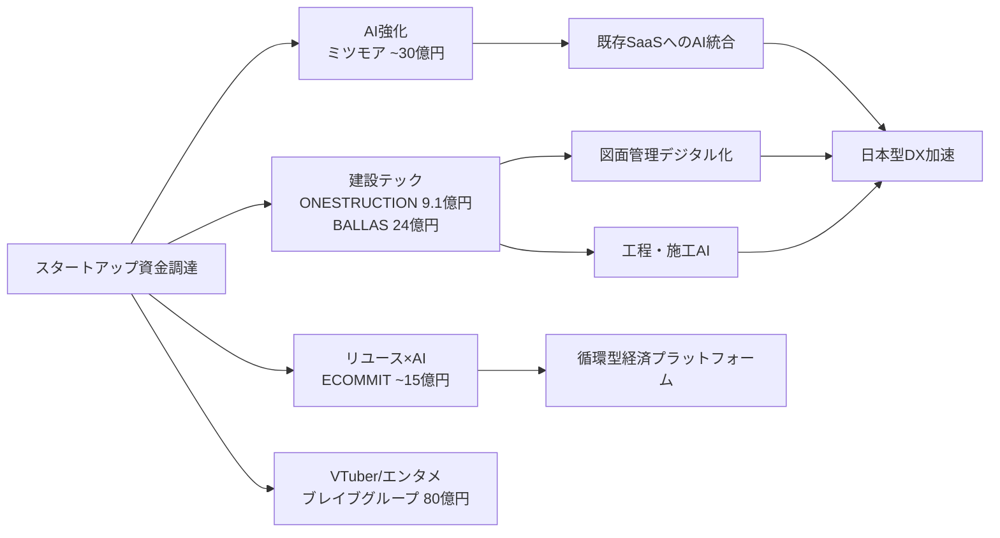
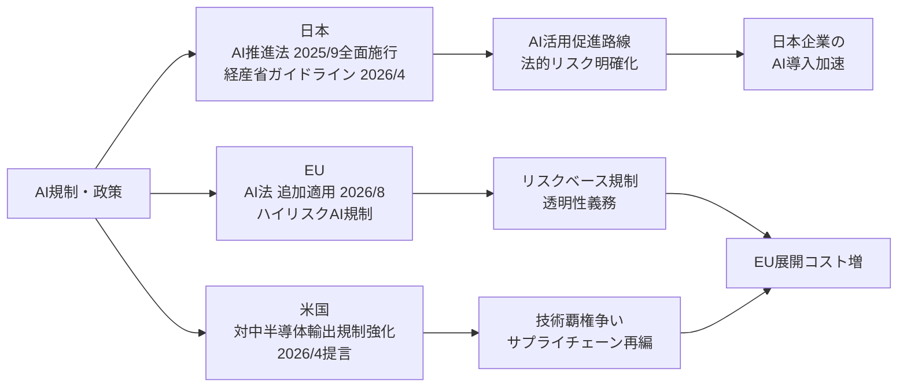
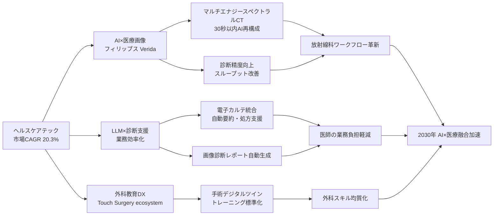

# 🔬 Tech視点 分析
分析日時: 2026-04-28 21:35

## 🚀 日本のスタートアップ・資金調達

- **技術的注目点**: <mark>建設テックへの資金集中が顕著。ONESTRUCTIONが9.1億円、BALLASが24億円を調達し、デジタル化が遅れていた建設業界のAI・図面管理領域に本格的な投資フェーズが到来している。</mark>
- **📊 データ・数字**: ブレイブグループ（VTuber）**80億円**、BALLAS（図面管理）**24億円**、ミツモア（AI機能強化）**約30億円**、ECOMMIT（リユース）**約15億円**、ONESTRUCTION（建設AI）**9.1億円**
- **技術的意義**: AI・建設テック・リユースの3セクターが主要調達先として台頭。特にミツモアのAI機能強化投資は、既存マーケットプレイスへのAI組み込みという日本型DX戦略を象徴する。VCとメガ企業の第三者割当増資が主流であり、戦略的な技術提携を伴う資金調達モデルが定着しつつある。
- **展望**: 建設テック（図面管理・工程AI）は2026年以降の本格展開フェーズへ移行すると予測される。リユース×AIも「循環型経済」政策と連動した成長が期待される。

### 技術関係図（必須）

### 主要指標（必須）

| 企業 | 調達額 | セクター | 技術領域 | 資金調達形態 |
|------|--------|----------|----------|-------------|
| ブレイブグループ | **80億円** | VTuber／エンタメ | 配信・AI × バーチャルタレント | 第三者割当増資 |
| ミツモア | **約30億円** | SaaS／AI | AI機能強化・マッチング高度化 | 第三者割当増資 |
| BALLAS | **24億円** | 建設テック | 図面管理・BIMデータ活用 | VC・メガ企業 |
| ECOMMIT | **約15億円** | リユース | AI査定・リユース物流最適化 | メルカリ等 |
| ONESTRUCTION | **9.1億円** | 建設AI | 施工管理AI・現場デジタル化 | VC |

---

## 📊 規制・政策動向

- **技術的注目点**: <mark>経産省が2026年4月にAI民事責任の解釈ガイドラインを発表。企業がAIシステムを実装する際の法的リスクが初めて公式に明確化され、AI開発・導入の加速を後押しする制度基盤が整備された。</mark>
- **📊 データ・数字**: EU AI法追加適用期限 **2026年8月**、日本AI推進法 **2025年9月全面施行**、米下院対中AI半導体輸出規制強化提言 **2026年4月16日**
- **技術的意義**: 日本・EU・米国が異なる規制アプローチを採用。日本は「AI推進法」で促進路線、EUは「リスクベース規制」、米国は「輸出規制」で覇権確保という三極分化が鮮明。エンジニアはAIシステムの設計段階から法的リスク・地政学的リスクの双方を考慮する必要が生じている。
- **展望**: EU AI法の2026年8月適用により、日本企業の欧州展開時にはハイリスクAIシステムの適合コストが増加。国内では経産省ガイドラインを活用したコンプライアンス対応が競争優位の要素となる。

### 技術関係図（必須）

### 主要指標（必須）

| 地域 | 規制・政策 | 適用時期 | 主要義務・内容 | 企業への技術的影響 |
|------|-----------|----------|--------------|------------------|
| 日本 | AI推進法全面施行 | 2025年9月 | AI活用促進・ガイドライン整備 | 開発・導入の法的後押し |
| 日本 | 経産省民事責任ガイドライン | 2026年4月 | AI事故時の責任解釈明確化 | 製品設計・契約への反映必須 |
| EU | EU AI法（追加適用） | 2026年8月 | ハイリスクAI・透明性義務 | 欧州向け製品の適合コスト増 |
| 米国 | 対中半導体輸出規制強化 | 提言段階（2026/4） | 先端AI半導体の対中輸出制限 | 調達先・設計の見直し圧力 |

---

## 🏥 ヘルスケアテック

- **技術的注目点**: <mark>フィリップス・ジャパンが世界初のAI搭載マルチエナジースペクトラルCT「Verida」を国内発売（2026年4月22日）。撮影から再構成まで全プロセスにAIが介在し、検査後**30秒以内**に通常画像とスペクトラル情報を同時自動表示するという、従来のCT診断ワークフローを根本的に変革する製品が市場投入された。</mark>
- **📊 データ・数字**: ヘルスケアテック市場規模 **2025年：5,879億ドル → 2026年：7,072億ドル**（CAGR **20.3%**）、再構成時間 **30秒以内**、コヴィディエン外科デジタル教育プラットフォーム日本展開 **2026年4月23日**
- **技術的意義**:
  - **AI×医療画像**: Veridaはマルチエナジー（スペクトラル）CT技術とAI再構成を統合。従来は専門技師が時間をかけて行っていた画像後処理をリアルタイムAIが代替し、診断精度向上と検査スループット改善を同時に実現する。
  - **LLM活用**: 診断支援・業務効率化への大規模言語モデル活用が主要成長ドライバーとして明確化。電子カルテ・画像診断・手術教育のデジタル化が3本柱。
  - **外科教育DX**: コヴィディエンの「Touch Surgery ecosystem」は外科手術のデジタルツイン教育プラットフォームであり、手術手技の標準化・トレーニング効率化をAIが支援するモデル。
- **展望**: CAGR 20.3%の成長が示す通り、ヘルスケアテックは2030年まで高速成長が続く見込み。AI×医療機器（Class III相当）の薬機法対応・FDAクリアランスのスピードが各社の競争優位を左右する。日本市場は規制当局との連携が整備されつつあり、グローバル製品の早期投入先として戦略的重要性が増している。

### 技術関係図（必須）

### 主要指標（必須）

| 指標 | 現状値（2025） | 予測値（2026） | 成長率（CAGR） | 備考 |
|------|--------------|--------------|--------------|------|
| ヘルスケアテック市場規模 | **5,879億ドル** | **7,072億ドル** | **20.3%** | グローバル |
| AI×医療画像処理（CT再構成） | 数分〜数十分 | **30秒以内** | — | Verida（フィリップス）実績値 |
| 外科DX教育プラットフォーム | 限定展開 | 日本本格展開 | — | Touch Surgery ecosystem |
| LLM活用診断支援 | 実証段階 | 実用化加速 | — | 主要成長ドライバー |

### 製品・技術比較

| 製品／技術 | 企業 | 発表日 | 技術的特徴 | 技術成熟度 |
|-----------|------|--------|-----------|-----------|
| Verida（AI搭載スペクトラルCT） | フィリップス・ジャパン | 2026/4/22 | 世界初マルチエナジー×AI統合、30秒再構成 | ✅ 市場投入済 |
| Touch Surgery ecosystem | コヴィディエン | 2026/4/23 | 外科デジタルツイン教育・AI手術ガイダンス | ✅ 日本展開開始 |
| LLM診断支援（各社） | 複数社 | — | 電子カルテ・画像レポート自動生成 | 🔍 実用化加速中 |

---

## 💡 Tech総合所感

**3トピック横断で見えるメガトレンド**: 日本のスタートアップ資金調達は「AI組み込み」と「デジタル化遅延産業（建設）」への集中が顕著であり、**2026年は"AI実装普及期"の元年**と位置づけられる。規制は日米欧で三極分化し、グローバル展開するエンジニアはコンプライアンスコストの多様化を前提に設計する必要がある。ヘルスケアテックでは**CAGR 20.3%**という高成長と「世界初」製品の日本上市が重なり、AI×医療が技術的フロンティアとして最も投資対効果が高い領域として浮上している。
